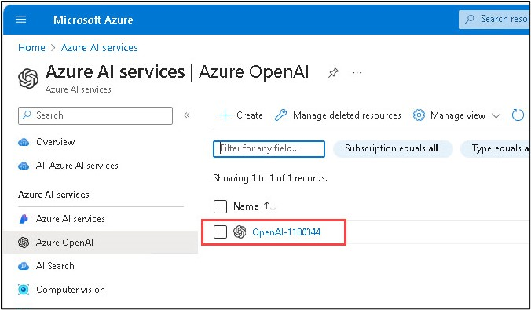
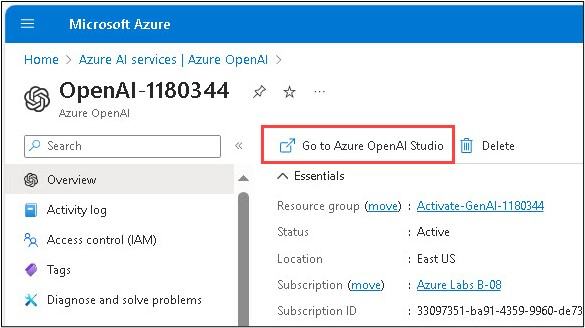
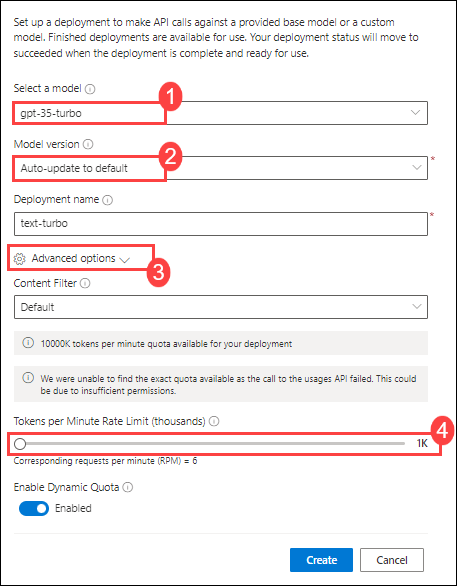

# Challenge 01: Deploy Azure OpenAI Service and LLM Models
### Estimated Time: 30 minutes
## Introduction

Welcome to the Deploy Azure OpenAI Service Challenge! This challenge is designed to test your skills in deploying the Azure OpenAI Service and its Large Language Models (LLM). The goal is to set up the OpenAI Service and deploy LLM models.

**Azure OpenAI Service** provides REST API access to OpenAI's powerful language models, including the GPT-4, GPT-4 Turbo with Vision, `gpt-35-turbo`, and Embeddings model series. In addition, the new `GPT-4` and `gpt-35-turbo` model series have now reached general availability.

A **Large Language Model (LLM)** is a deep learning algorithm that can perform a variety of natural language processing (NLP) tasks. Large language models use transformer models and are trained using massive datasets—hence, large. This enables them to recognize, translate, predict, or generate text or other content.

**Contoso Ltd.**, a leading technological firm, is seeking to enhance its product support operations. They receive a vast number of queries daily, which results in longer waiting times and decreased customer satisfaction. To address this, Contoso is planning to implement an AI-powered solution that can handle customer inquiries effectively and efficiently.

They have chosen to deploy Azure OpenAI Service along with its Large Language Models (LLM), like `gpt-35-turbo` and `text-embedding-ada-002`. These models are known for their capability of processing and generating human-like text, making them ideal for this application.

As a part of this challenge, your task is to create an Azure OpenAI service and deploy Large Language Models (LLM). The Large Language Models include **gpt-35-turbo** and **text-embedding-ada-002**.

## Description

Your task is to deploy the Azure OpenAI Service and deploy Large Language Models (LLM).

### Accessing the Azure portal

1. To access the Azure portal, open a private/incognito window in your browser and navigate to the Azure Portal.

1. On the **Sign into Microsoft Azure tab**, you will see a login screen. Enter the following email/username, and then click on **Next**.

   - **Email/Username:** <inject key="AzureAdUserEmail"></inject>

1. Now enter the following password and click on **Sign in**.

   - **Password:** <inject key="AzureAdUserPassword"></inject>

1. If you see the pop-up **Stay Signed in?**, click **No**.

1. If you see the pop-up **You have free Azure Advisor recommendations!**, close the window to continue the lab.

1. If a **Welcome to Microsoft Azure** pop-up window appears, click **Maybe Later** to skip the tour.

## Prerequisites

- [Azure Subscription](https://azure.microsoft.com/en-us/free/)
- [Azure OpenAI](https://aka.ms/oai/access) access is available with the following models:

  - gpt-35-turbo

  - text-embedding-ada-002

## Solution Guide

### Task 1: Deploy an Azure Open AI Service

1. In the Azure Portal, search for **Azure OpenAI** and select it.

   

2. On **Azure AI Services | Azure OpenAI** blade, click on **+ Create**. Enter the details required and deploy the Azure Open AI service.

   

### Task 2: Deploy a model

1. In the Azure Portal, search for **Azure OpenAI** and select it.

    

2. On **Azure AI Services | Azure OpenAI** blade, select **OpenAI-<inject key="Deployment-id" enableCopy="false"></inject>**.

    

3. In the Azure OpenAI resource pane, click on **Go to Azure OpenAI Studio**. It will navigate to **Azure AI Studio**.

   

4. On the **Welcome to Azure OpenAI Service** page, click on **Create new deployment**.

   

5. On the **Deployments** page, click on **+ Create new deployment**.

6. Within the **Deploy model** pop-up interface, enter the following details and then click on **Advanced options (3)**, followed by scaling down the **Tokens per Minute Rate Limit (thousands) (4)**:
    - **Select a model**: gpt-35-turbo (1)
    - **Model version**: *Use the default version* (2)
    - **Deployment name**: text-turbo
    - **Tokens per Minute Rate Limit (thousands)**: 40K
  
         

7. Click on the **Create** button to deploy a model that you will be playing around with as you proceed.

8. In the **Deployments** page again, click on **+ Create new deployment**.

9. Within the **Deploy model** pop-up interface, enter the following details and then click on **Advanced options (3)**, followed by scaling down the **Tokens per Minute Rate Limit (thousands) (4)**:
    - **Select a model**: text-embedding-ada-002 (1)
    - **Model version**: *Use the default version* (2)
    - **Deployment name**: text-embedding-ada-002
    - **Tokens per Minute Rate Limit (thousands)**: 40K
  
         

10. Click on the **Create** button to deploy a model that you will be playing around with as you proceed.

## Success Criteria:

- Successful deployment of the Azure OpenAI Service.

- Deploying Large Language Models (LLM) with the OpenAI Service.

## Additional Resources:

- Refer to the [Azure OpenAI Service documentation](https://learn.microsoft.com/en-us/azure/ai-services/openai/) for guidance on deploying the service.

