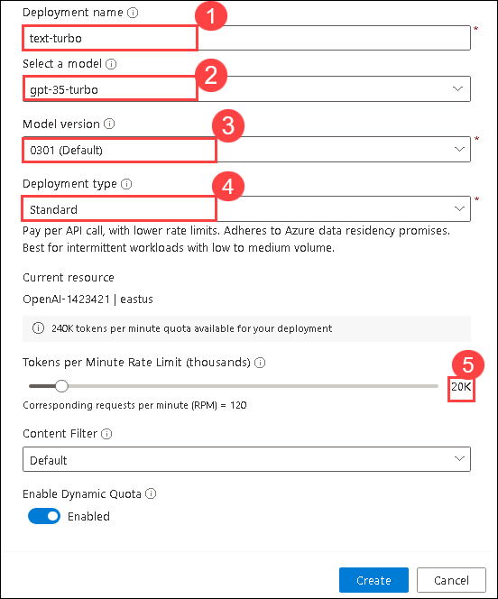
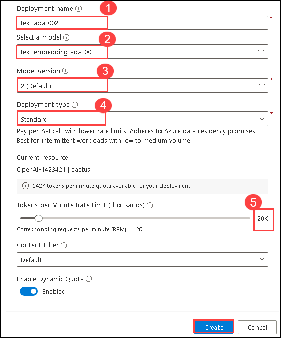

# Desafio 01: Implementar Azure OpenAI e Modelos LLM
### Tempo Estimado: 30 minutos
## Introdução

Bem-vindo ao Desafio sobre provisionar o Serviço Azure OpenAI! Este desafio foi projetado para testar suas capacidades na implementação do Serviço Azure OpenAI e os seus Modelos de Linguagem de Grande Escala (LLM). O objetivo é configurar o Serviço OpenAI e implementar modelos LLM.

O serviço **Azure OpenAI** fornece acesso à API REST aos poderosos modelos de linguagem da OpenAI, incluindo o GPT-4, GPT-4 Turbo com Visão, `gpt-35-turbo` e a série de modelos de Embeddings. Além disso, as novas séries de modelos `GPT-4` e `gpt-35-turbo` agora alcançaram disponibilidade geral.

Um **Modelo de Linguagem de Grande Escala (LLM)** é um algoritmo deep learning capaz de executar uma variedade de tarefas de processamento de linguagem natural (NLP). Modelos de linguagem de grande escala usam modelos transformadores e são treinados com grandes conjuntos de dados — daí o termo "grande". Isso permite que eles reconheçam, traduzam, prevejam ou gerem texto ou outro conteúdo.

A **Contoso Ltd.**, uma empresa tecnológica líder, busca melhorar suas operações de suporte a produtos. Eles recebem um grande número de consultas diariamente, o que resulta em tempos de espera mais longos e na redução da satisfação do cliente. Para resolver isso, a Contoso está planejando implementar uma solução impulsionada por IA que possa lidar com as consultas de clientes de forma eficaz e eficiente.

Eles optaram por implementar o serviço Azure OpenAI juntamente com seus Modelos de Linguagem de Grande Escala (LLM), como `gpt-35-turbo` e `text-embedding-ada-002`. Estes modelos são conhecidos pela sua capacidade de processar e gerar texto semelhante ao humano, tornando-os ideais para essa aplicação.

Como parte deste desafio, a sua tarefa é criar um serviço Azure OpenAI e implementar Modelos de Linguagem de Grande Escala (LLM). Os Modelos de Linguagem de Grande Escala incluem **gpt-35-turbo** e **text-embedding-ada-002**.

## Descrição

A sua tarefa é provisionar o Serviço Azure OpenAI e implementar Modelos de Linguagem de Grande Escala (LLM).

### Aceder ao Portal do Azure

>**Importante**: Você pode encontrar o Nome de Usuário e a Senha no ambiente navegando até a tab **Environment** **(1)** no painel esquerdo, depois copie o **Azure Username** **(2)** e a **Azure Password** **(3)**, que serão necessários para fazer login no portal de Azure nas etapas posteriores. Você também pode registrar o **Deployment Id** **(4)**, que pode ser usado para fornecer um nome exclusivo aos recursos durante a implementação.

>**Nota**: Os valores dos números e IDs podem variar. Por favor, ignore os valores nas capturas de tela e copie os valores da tab **Environment**.

 
 .png)

1. Para aceder ao portal de Azure, na labvm abra o **Microsoft Edge** e navegue até o [Portal do Azure](https://portal.azure.com/).

1. Na tab **Sign into Microsoft Azure tab**, você verá uma tela de login. Digite o seguinte e-mail/nome de usuário e clique em **Next**.
   
   - **e-mail/nome de usuário:** <inject key="AzureAdUserEmail"></inject>

     

1. Agora insira a seguinte senha e clique em **Sign in**.

   - **Senha/Password:** <inject key="AzureAdUserPassword"></inject>

      

1. Se aparecer a janela pop-up **Action Required**, clique em **Ask Later**.

    
   
1. Se aparecer a janela pop-up **Stay Signed in?**, clique **No**.

    

1. Se uma janela pop-up **Welcome to Microsoft Azure** aparecer, clique em **Cancel** para pular o tour.

    

## Pré-requisitos

- [Assinatura de Azure](https://azure.microsoft.com/en-us/free/)
- [Azure OpenAI](https://aka.ms/oai/access) access is available with the following models:
  - gpt-35-turbo
  - text-embedding-ada-002

## Guia da Solução

### Tarefa 1: Deploy an Azure Open AI Service

Nesta tarefa, você irá proceder a configuração e implementação do serviço Azure OpenAI no portal de Azure.

1. Na página do Portal de Azure, em **Search resources, services and docs (G+/)**, introduza **Azure OpenAI (1)**, e selecione **Azure OpenAI (2)** em serviços.

    

1. Na página **Azure AI Services | Azure OpenAI**, clique em **+ Create**.

   

1. Especifique os seguintes detalhes para implementar o serviço Azure OpenAI e clique em **Next** duas vezes.

   | **Opção**         | **Valor**                                              |
   | ------------------ | -----------------------------------------------------  |
   | Subscription       | Escolha a assinatura disponível                        |
   | Resource Group     | **ODL-GenAI-CL-xxxxxx-Activate-GenAI**                 |
   | Region             | Use a mesma localização que o grupo de recursos        |
   | Name               | *Insira um nome único* ou use o formato **OpenAI-xxxxxx** (substitua **xxxxxx** pelo **Deployment ID** |
   | Pricing tier       | **Standard S0**                                        | 

   >**Nota**: xxxxxx refere-se ao **deployment ID** que registrou na última tarefa.

    

1. Uma vez que a validação for bem-sucedida na tab **Review + submit**, clique em **Create** e aguarde a conclusão da criação do recurso.

     

### Tarefa 2: Implementar um modelo

O Azure OpenAI oferece um portal baseado na web chamado Azure OpenAI Studio, que você pode usar para criar, gerir e explorar modelos. Você começará a sua exploração do Azure OpenAI usando o Azure OpenAI Studio para criar um modelo.

1. Na página do Portal de Azure, na caixa **Search resources, services and docs (G+/)** na parte superior do portal, digite **Azure OpenAI (1)** e, em seguida, selecione **Azure OpenAI (2)**.

1. Na janela **Azure AI Services | Azure OpenAI**, selecione **OpenAI-<inject key="Deployment-id" enableCopy="false"></inject>**.

    

1. INa página de recursos do Azure OpenAI, clique em **Go to Azure OpenAI Studio**. Isso o levará para o **Azure AI Studio**.

   

1. Na página **Welcome to Azure OpenAI Service**, clique em **Create new deployment**.

   

1. Na página **Deployments**, clique em **+ Create new deployment**.

     
   
1. Na interface pop-up **Deploy model**, insira os seguintes detalhes:
   
    - **Deployment name**: **text-turbo** **(1)**
    - **Select a model**: **gpt-35-turbo** **(2)**
    - **Model version**: **Usar a versão padrão** **(3)**
    - **Deployment Type**: **Standard (4)**
    - Ajustar **Tokens per Minute Rate Limit (thousands)**: **20K (5)**
  
         
      
1. Clique no botão **Create** para criar o modelo.

1. De volta à página **Deployments** clique novamente em **+ Create new deployment**.

     
   
1. Na interface pop-up **Deploy model**,  insira os seguintes detalhes e clique em **Advanced options (3)**, seguido de reduzir o **Tokens per Minute Rate Limit (thousands) (5)**:
   
    - **Deployment name**: **text-ada-002** **(1)**
    - **Select a model**: **text-embedding-ada-002** **(2)**
    - **Model version**: **Usar a versão padrão** **(3)**
    - **Deployment Type**: **Standard (4)**
    - Ajustar **Tokens per Minute Rate Limit (thousands)**: **20K** **(5)**
  
         

1. Clique no botão **Create** para criar o modelo.

1. De volta à página de Deployments, você deve ver os modelos **text-turbo** e **text-ada-002** criados.

     

## Critério de Sucesso:

- Provisionamente do serviço Azure OpenAI.

- Implementação de Modelos LLM no serviço Azure OpenAI.

## Recursos Adicionais:

- Consulte a [Documentação do serviço Azure OpenAI](https://learn.microsoft.com/en-us/azure/ai-services/openai/) para orientações sobre como implementar o serviço.

## Prossiga para o próximo Desafio clicando em **Next**>>.
