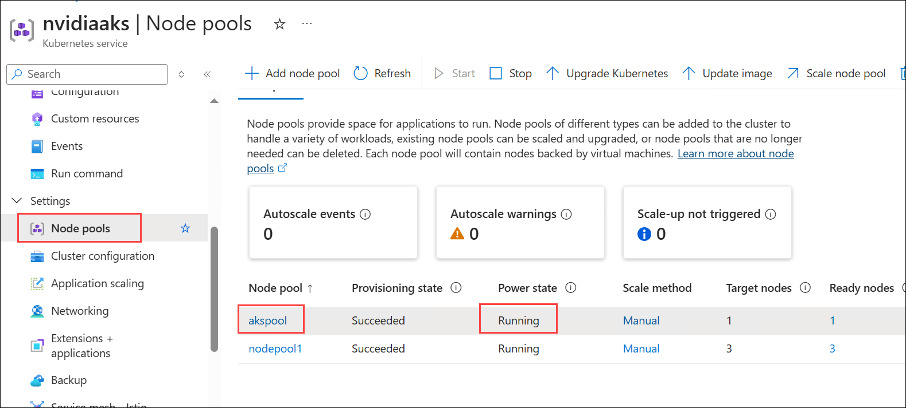

# Challenge 01: Deploy NVIDIA NIM to Azure

## Solution Guide

### Install AKS Preview extension

1. In the **LabVM**, in the Windows Search bar type **Powershell** and select **PowerShell 7-preview (x64)** then **Run as Administrator**.

   
 

1. To install the Azure Kubernetes Service (AKS) extensions, run the following commands these will add and update the **aks-preview extension**, which provides access to the latest features of AKS.

   ```
   az extension add --name aks-preview
   az extension update --name aks-preview
   ```

### Installing Helm

1. First, need to download the latest version of the Helm binary from the official releases.

    ```
    $version = (Invoke-RestMethod -Uri https://api.github.com/repos/helm/helm/releases/latest).tag_name
    Invoke-WebRequest -Uri "https://get.helm.sh/helm-$version-windows-amd64.zip" -OutFile "helm.zip"
    ```

1. After downloading, extract the Helm binary from the downloaded zip file.

    ```
    Expand-Archive -Path "helm.zip" -DestinationPath "helm"
    ```

1. Next, create a directory for Helm inside the Program Files folder.

    ```
    New-Item -ItemType Directory -Path "C:\Program Files\helm"
    ```

1. Move the Helm executable into the newly created directory.

    ```
    Move-Item -Path "helm\windows-amd64\helm.exe" -Destination "C:\Program Files\helm\helm.exe"
    ```

1. Finally, update your system’s PATH variable to include the Helm directory.

    ```
    [System.Environment]::SetEnvironmentVariable("Path", $env:Path + ";C:\Program Files\helm", [System.EnvironmentVariableTarget]::Machine)
    ```

1. After updating the PATH variable, close the current PowerShell window and open a new one. This will allow the system to recognize the updated PATH.

1. Once session restarted, verify that Helm has been installed correctly by running the following command. This command return the installed Helm version, confirming a successful installation.

    ```
    helm version
    ```

### Setup Azure Kubernetes Service (AKS)

1. The key to creating Azure Kubernetes Service (AKS) for NIM is to ensure that a proper GPU node pool is set up.

#### Connect to Azure

1. **Login to Azure:** Use the command to sign into your Azure account via device code authentication.

    ```
    az login --use-device-code
    ```

1. After running the command, Azure will display a code and a URL. Copy the URL, paste it into your web browser, and then provide the code. Click **Next** to proceed.

   

1. Once the browser opens the Azure login page, choose your Azure account and click **Continue**.

   

     

1. After successfully logging in, you'll be authenticated. Now, switch back to PowerShell to continue setting up AKS.

1. Update your subscription ID with **Subscription Id:** - <inject key="SubscriptionID"></inject>

    ```
    az account set --subscription <subscription name>
    ```

#### Create AKS

1. To deploy AKS, run the following command. Replace the placeholders:

 - **`<resource group name>`** with your resource group name.
 - **`<aks name>`** with **nvaks**.
 - **`<location has desired GPU>`** with your target location.

    ```
    az aks create -g <resource group name> -n <aks name> --location <location has desired GPU> --generate-ssh-keys
    ```

1. After running the command, navigate to the Azure portal. Under your resource group, verify that the AKS instance has been created.

   

#### Create GPU nodepool

1. Run the following command to deploy a node pool. Replace the following placeholders:

 - **`<resource group name>`**: Your resource group name.
 - **`<aks name>`**: The name of your AKS cluster.
 - **`<nodepool name>`**: Set this as **akspool**.

    ```
    az aks nodepool add --resource-group <resource group name> --cluster-name <aks name> --name <nodepool name> --node-count 1 --skip-gpu-driver-install --node-vm-size standard_nc24ads_a100_v4 --node-osdisk-size 2048 --max-pods 110
    ```

1. Go to the Azure portal. In your AKS resource, under Settings, select **Node Pools**. Confirm that your AKS node pool is created and running.

   

#### Connect to AKS

1. Run this command to connect to your AKS cluster. Replace the placeholders with your resource group and AKS cluster name.

    ```
    az aks get-credentials --resource-group <resource group name> --name <aks name>
    ```

#### Install GPU Operator

1. To install the GPU Operator, run the following commands:

    ```
    helm repo add nvidia https://helm.ngc.nvidia.com/nvidia --pass-credentials
    helm repo update
    helm install --create-namespace --namespace gpu-operator nvidia/gpu-operator --wait --generate-name
    ```

1. Verify that the GPU Operator has been successfully installed and that the CUDA validation container has run to completion:

    ```
    kubectl get pods -n gpu-operator -l app=nvidia-cuda-validator
    ```

   
