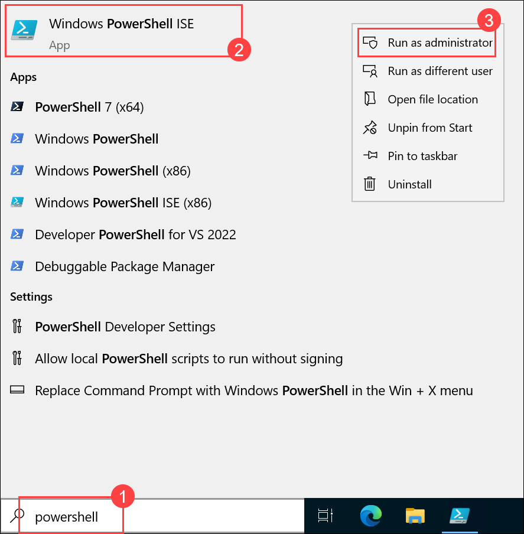
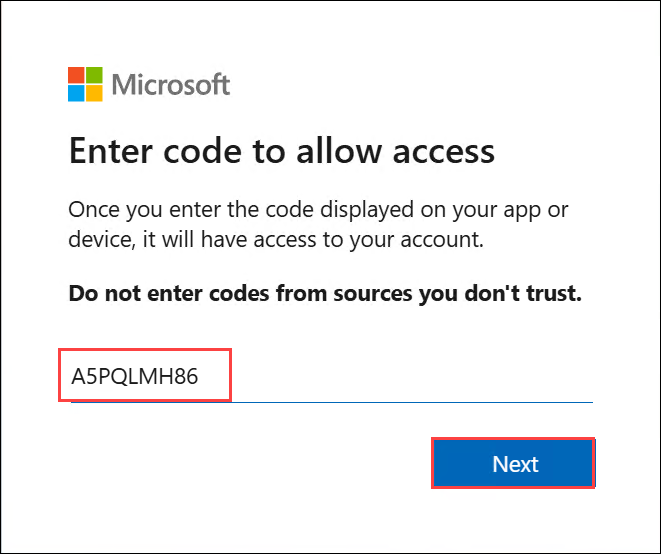
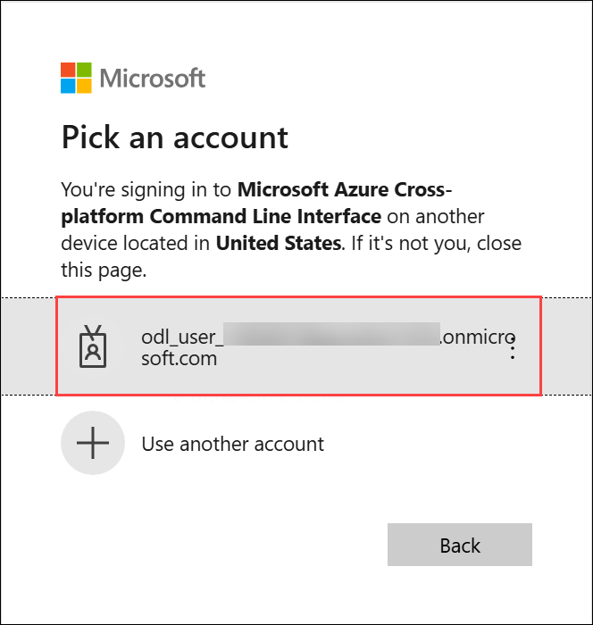
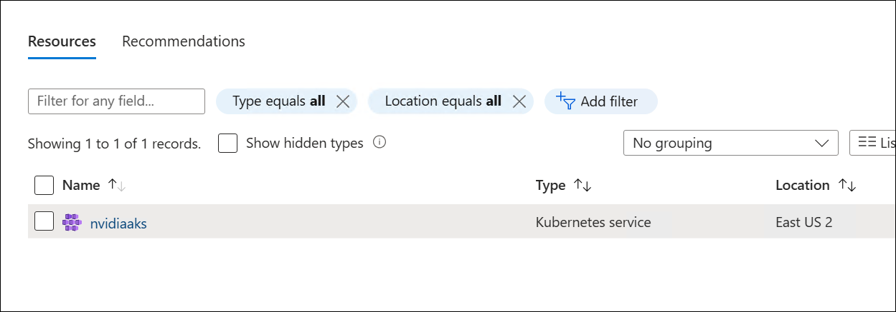

# Challenge 01: Deploy NVIDIA NIM to Azure

## Solution Guide

### Install AKS Preview extension

1. In the **LabVM**, in the Windows Search bar type **Powershell** and select **PowerShell 7-preview (x64)** then **Run as Administrator**.

   
 
1. Run the following command to Install the ask extensions

   ```
   az extension add --name aks-preview
   az extension update --name aks-preview
   ```

### Install helm

1. Download the Helm binary:

    ```
    $version = (Invoke-RestMethod -Uri https://api.github.com/repos/helm/helm/releases/latest).tag_name
    Invoke-WebRequest -Uri "https://get.helm.sh/helm-$version-windows-amd64.zip" -OutFile "helm.zip"
    ```

1. Extract the Helm binary:

    ```
    Expand-Archive -Path "helm.zip" -DestinationPath "helm"
    ```

1. Create the directory:

    ```
    New-Item -ItemType Directory -Path "C:\Program Files\helm"
    ```

1. Move the Helm binary:

    ```
    Move-Item -Path "helm\windows-amd64\helm.exe" -Destination "C:\Program Files\helm\helm.exe"
    ```

1. Add the directory to your PATH:

    ```
    [System.Environment]::SetEnvironmentVariable("Path", $env:Path + ";C:\Program Files\helm", [System.EnvironmentVariableTarget]::Machine)
    ```

1. **Restart your PowerShell session**: Close the current PowerShell window and open a new one. This ensures the updated PATH is recognized.

1. Verify the installation:

    ```
    helm version
    ```

### Setup Azure Kubernetes Service (AKS)

1. The key to creating Azure Kubernetes Service (AKS) for NIM is to create proper GPU nodepool.

#### Connect to Azure

1. Run the following command to login into azure with device code 

    ```
    az login --use-device-code
    ```

1. Copy the code and URL, paste the URL in your web browser, and provide the code and click on **Next**

   

1. Select your account and click on **Continue**.

   

     

1. Now you are singed in into azure, navigate back to the powershell now 

1. Update your subscription ID with **Subscription Id:** - <inject key="SubscriptionID"></inject>

    ```
    az account set --subscription <subscription name>
    ```

#### Create AKS

1. Run the following command to deploy aks, replace the **`<resource group name>`**, **`<aks name>`** as **nvaks**, and provide the **`<location has desired GPU>`** with the same to yours resource group

    ```
    az aks create -g <resource group name> -n <aks name> --location <location has desired GPU> --generate-ssh-keys
    ```

1. Now, navigate to the azure portal and under resource goup varify yours aks is created 

   

#### Create GPU nodepool

1. Run the command to deploy a noodepool,
provide the **`<resoucre group name>`** name , **`<aks name>`** and **`<nodepool name>`** as **akspool**.

    ```
    az aks nodepool add --resource-group <resource group name> --cluster-name <aks name> --name <nodepool name> --node-count 1 --skip-gpu-driver-install --node-vm-size standard_nc24ads_a100_v4 --node-osdisk-size 2048 --max-pods 110
    ```

1. Navigate to the azure portal, and select you aks and from the left under setting option select **Node Pools** and here you will your aks pool is created and running.

   

#### Connect to AKS

1. Run the following command to connect to AKS, replace your resource goup name and aks name


    ```
    az aks get-credentials --resource-group <resource group name> --name <aks name>
    ```

#### Install GPU Operator

1. Install the GPU Operator

    ```
    helm repo add nvidia https://helm.ngc.nvidia.com/nvidia --pass-credentials
    helm repo update
    helm install --create-namespace --namespace gpu-operator nvidia/gpu-operator --wait --generate-name
    ```

1. Confirm that the Operator is installed and ran the CUDA validation container to completion:

    ```
    kubectl get pods -n gpu-operator -l app=nvidia-cuda-validator
    ```

   
