# Desafio 02: Implementar Document Search usando o Azure AI Search

### Tempo Estimado: 120 minutos

## Introdução:

Todas as organizações dependem de informações para tomar decisões, responder perguntas e funcionar de forma eficiente. O problema para a maioria das organizações não é a falta de informações, mas o desafio de encontrar e extrair as informações do enorme conjunto de documentos, bancos de dados e outras fontes nas quais as informações são armazenadas.

Por exemplo, suponha que *Margie's Travel* seja uma agência de viagens especializada em organizar viagens para cidades ao redor do mundo. Ao longo do tempo, a empresa acumulou uma enorme quantidade de informações em documentos como brochuras, bem como avaliações de hotéis enviadas por clientes. Esses dados são uma fonte valiosa de insights para agentes de viagens e clientes à medida que planejam viagens, mas o grande volume de dados pode dificultar a localização de informações relevantes para responder a uma pergunta específica do cliente.

Para lidar com esse desafio, a Margie's Travel pode usar o Azure AI Search para implementar uma solução na qual os documentos são indexados e enriquecidos usando habilidades de IA para torná-los mais fáceis de pesquisar.

## Guia da Solução

### Tarefa 1: Clonar o repositório para este curso

Se você ainda não clonou o repositório de código **AI-102-AIEngineer** para o ambiente em que está trabalhando neste laboratório, siga estas etapas para fazer isso. Caso contrário, abra a pasta clonada no Visual Studio Code.

1. Abra o **Visual Studio Code** na área de trabalho da VM do laboratório clicando duas vezes nele.

1. No **Visual Studio Code**, no menu superior esquerdo, selecione as reticências **(...) (1)** > **Terminal (2)** e escolha **New Terminal (3)**.

    

1. Execute o seguinte comando no terminal para clonar o repositório para uma pasta local: (não importa qual pasta).

    ```
    git clone https://github.com/MicrosoftLearning/AI-102-AIEngineer
    ```

    

1. Quando o repositório tiver sido clonado, abra a pasta no Visual Studio Code seguindo estas etapas:

    - No menu do canto superior esquerdo, selecione **File (1)** > **Open Folder... (2)**.

        

    - No explorador de arquivos em **Acesso rápido**, selecione **AI-102-AIEngineer (1)** e clique em **Selecionar pasta (2)**.

        .png)

    - Se **Do you trust the authors of the files in this folder?** for solicitado, clique em **Yes, I trust the authors**.

         

        > **Observação**: se você for solicitado a adicionar os ativos necessários para compilar e depurar, consulte **Not now**.

### Tarefa 2: Create Azure resources

To create the solution for Margie's Travel, you will need the following resources in your Azure subscription:

- Um recurso do **Azure AI Search** que gerenciará a indexação e a consulta.
- Um recurso do **Azure AI Services** que fornece serviços de IA para habilidades que sua solução de pesquisa pode usar para enriquecer os dados na fonte de dados com insights gerados por IA.
- Uma **Conta de armazenamento** com um contêiner de blob no qual os documentos a serem pesquisados ​​são armazenados.

  > **Importante**: seus recursos do Azure AI Search e do Azure AI Services devem estar no mesmo local.

### Tarefa 2.1: Criar um recurso do Azure AI Search

Nesta tarefa, você aprenderá a criar um recurso do **Azure AI Search** no portal do Azure.

1. Em um navegador da Web, entre no portal do Azure usando `https://portal.azure.com`.

1. Retorne à página inicial do portal do Azure e clique no botão **&#65291;Criar um recurso**.

    .png)

1. Pesquise e selecione **Azure AI Search** na lista na página Criar um recurso.

    .png)

1. Na página **Mercado**, selecione **Azure AI Search**.

    .png)

1. Na página **Azure AI Search**, clique em **Criar**.

    .png)

1. Especifique os seguintes detalhes para criar um serviço **Pesquisa de IA do Azure** e clique na aba **Revisar + Criar (6)**.

    | **Opção** | **Valor** |
    | ------------------ | ----------------------------------------------------- |
    | Assinatura | Deixar padrão **(1)** |
    | Grupo de Recursos | **Activate-GenAI** **(2)** |
    | Nome | *Digite um nome exclusivo* para seu serviço de pesquisa ou use o formato **searchservice-xxxxxx** (substitua **xxxxxx** pelo **Deployment ID** registrado no **Challenge 01**) **(3)** |
    | Local | Use o mesmo local que o grupo de recursos **(4)** |
    | Camada de preços | Básico **(5)** |

    >**Observação**: aqui, xxxxxx se refere ao ID de implantação.
    
    >**Observação**: se você encontrar o erro **Não é possível obter custos para assinatura**, ignore-o e prossiga para a próxima etapa.

    .png)

1. Assim que a validação for bem-sucedida na guia **Revisar + criar**, clique em **Criar** e aguarde a conclusão da implantação, depois clique em **Ir para o recurso**.

    .png)

    .png)

1. Revise a página **Visão geral** na lâmina para seu recurso do Azure AI Search no portal do Azure. Aqui, você pode usar uma interface visual para criar, testar, gerenciar e monitorar os vários componentes de uma solução de pesquisa, incluindo fontes de dados, índices, indexadores e conjuntos de habilidades.

### Tarefa 2.2: Criar uma conta de armazenamento

Nesta tarefa, você aprenderá a criar um recurso de **Conta de armazenamento** no portal do Azure e, nas próximas etapas, criará um contêiner de blobs onde os documentos a serem pesquisados ​​serão armazenados.

1. Na página do Portal do Azure, na caixa Pesquisar recursos, serviços e documentos (G+/) na parte superior do portal, insira **Conta de armazenamento** **(1)** e selecione **Conta de armazenamento** **(2)** em serviços.

    .png)

1. Clique em **+ Criar**.

    .png)

1. Especifique os seguintes detalhes para criar uma conta de armazenamento do Azure e clique na guia Avançar **Próximo (7)**.

    | **Opção** | **Valor** |
    | ------------------ | ----------------------------------------------------- |
    | Assinatura | Deixe o padrão **(1)** |
    | Grupo de recursos | **Activate-GenAI** **(2)** |
    | Nome da conta de armazenamento | *Digite um nome exclusivo* para seus Serviços de IA do Azure ou use o formato **storagexxxxxx** (substitua **xxxxxx** pelo **ID de implantação** registrado no **Desafio 01**) **(3)** |
    | Região | Use o mesmo local do grupo de recursos **(4)** |
    | Desempenho | Standard **(5)** |
    | Redundância | **LRS (armazenamento com redundância local)** **(6)**|

    >**Observação**: aqui, xxxxxx se refere ao ID de implantação

    .png)

1. Na aba **Avançado**, marque a caixa ao lado de **Permitir acesso anônimo em contêineres individuais (1)** e clique em **Revisar + criar (2)**

    .png)

1. Assim que a validação for bem-sucedida em **Revisar + criar**, clique em **Criar** e aguarde a conclusão da implantação, clique em **Ir para o recurso**.

    .png)

    .png)

1. Na página **Visão geral**, observe o **ID da Assinatura**; ele identifica a assinatura para a qual a conta de armazenamento é provisionada.

    .png)

    > **Dica**: mantenha a lâmina **Conta de armazenamento** aberta; você precisará do ID da assinatura e de uma das chaves no próximo procedimento.

### Tarefa 3 e Tarefa 4: Carregar documentos no Armazenamento do Azure e executar o script carregado

Nesta tarefa, você navegará entre o Visual Studio Code e o portal do Azure para recuperar as credenciais necessárias, atualizar um arquivo em lote e usar o CLI do Azure para carregar documentos em um contêiner de blob na sua conta de armazenamento.

>**Importante**: Agora que você tem os recursos necessários, pode carregar alguns documentos na sua conta do Armazenamento do Azure.

1. Navegue de volta para o Visual Studio Code, no painel **Explorer**, expanda a pasta **22-create-a-search-solution (1)** e selecione **UploadDocs.cmd (2)**.

    

1. Navegue de volta para a aba do navegador exibindo **portal do Azure**, recupere o **ID da assinatura (1)**, **nome da conta de armazenamento do Azure (2)** e **chave da conta de armazenamento do Azure** clicando na opção **Mostrar** > **Área de transferência (3)** da conta de armazenamento criada recentemente e registre os valores no bloco de notas.

    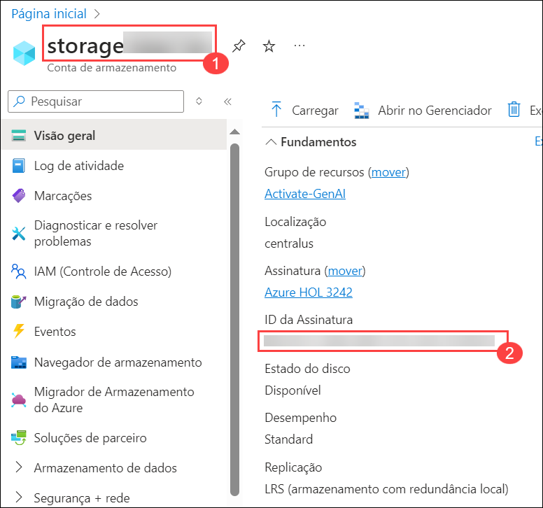

    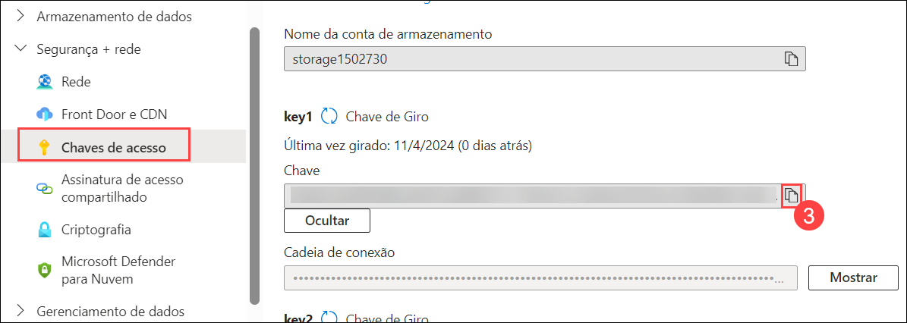

1. Retorne ao código do VS e edite o arquivo em lote para substituir os espaços reservados **YOUR_SUBSCRIPTION_ID**, **YOUR_AZURE_STORAGE_ACCOUNT_NAME** e **YOUR_AZURE_STORAGE_KEY** pelos valores correspondentes que você registrou na etapa anterior.

    

1. Salve suas alterações e clique com o botão direito do mouse na pasta **22-create-a-search-solution (1)** > **abra um terminal integrado (2)**.

    

1. Insira o seguinte comando para entrar na sua assinatura do Azure usando o Azure CLI:

    > **Observação**: certifique-se de ter instalado o Azure CLI e a extensão Azure CLI Tools no Visual Studio Code.

    >**Observação**: certifique-se de substituir <seu-nome-de-usuário> <sua-senha> por **nome-de-usuário-do-Azure** e **senha** que você está usando no desafio-1.

    ```
    az login --username <seu-nome-de-usuário> --password <sua-senha>
    ```

    

    > **Observação**: se uma guia do navegador da Web abrir e solicitar que você faça login no Azure, faça login, feche a guia do navegador e retorne ao Visual Studio Code.

1. Insira o seguinte comando para executar o arquivo em lote. Isso criará um contêiner de blob na sua conta de armazenamento e carregará os documentos na pasta **data** para ele.

    ```
    .\UploadDocs
    ```

    

### Tarefa 5: Importação e indexação de dados:
#### Tarefa 5.1: Indexar os documentos

Nesta tarefa, você aprenderá a criar uma solução de pesquisa indexando documentos que já estão em vigor. Navegando até seu recurso do Azure AI Search no portal do Azure, configure a fonte de dados para utilizar o Azure Blob Storage, integre habilidades cognitivas para enriquecimento, personalize o índice de destino e configure um indexador para processar e indexar os documentos de forma eficaz.

>**Observação**: agora que você tem os documentos em vigor, pode criar uma solução de pesquisa indexando-os.

1. No portal do Azure, navegue até seu recurso **Azure AI Search**. Em seguida, na página **Visão geral**, selecione **Importar dados**.

    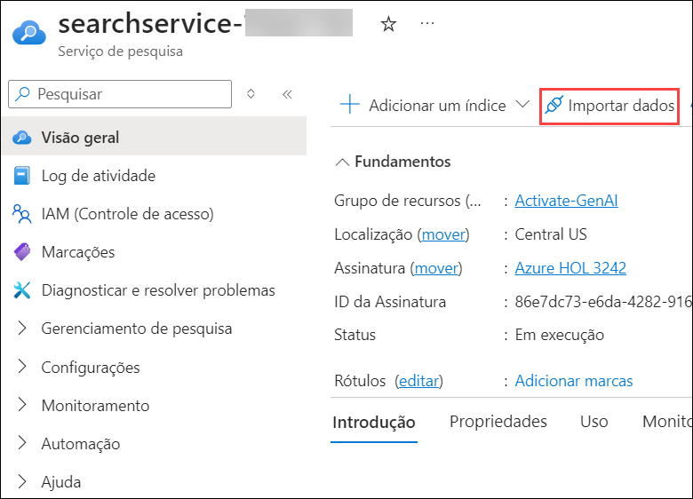

1. Na página **Conectar aos seus dados**, na lista **Fonte de dados**, selecione **Azure Blob Storage**. Em seguida, preencha os detalhes do armazenamento de dados com os seguintes valores:

    - **Fonte de dados**: Armazenamento de Blobs do Azure(1)
    - **Nome da fonte de dados**: margies-data (2)
    - **Dados para extrair**: Conteúdo e metadados (3)
    - **Modo de análise**: Padrão (4)
    - **Assinatura**: Deixe o padrão (5)
    - **Cadeia de conexão**: Selecione **Escolha uma conexão existente (6)**. Em seguida, selecione sua conta de armazenamento (7) e, finalmente, selecione o contêiner **margies (8)** que foi criado pelo script UploadDocs.cmd. Em seguida, clique em **Selecionar (9)**.

      
        
      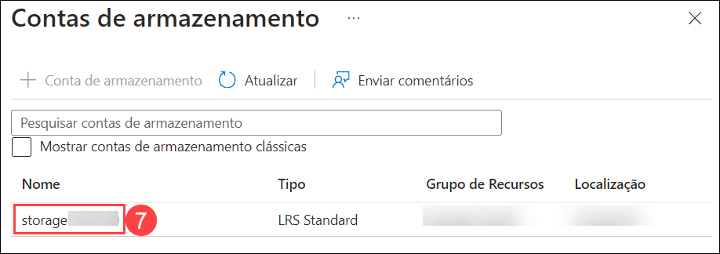
        
      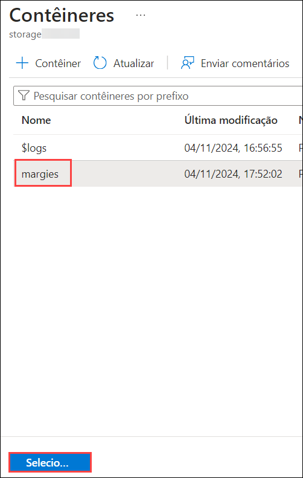

    - **Autenticação de identidade gerenciada**: Nenhuma (10)
    - **Nome do contêiner**: margies (11)
    - **Pasta de blobs**: *Deixe em branco.* (12)
    - **Descrição**: Brochuras e avaliações no site da Margie's Travel. (13)
    - Clique em **Adicionar habilidades cognitivas (opcional) (14)**

      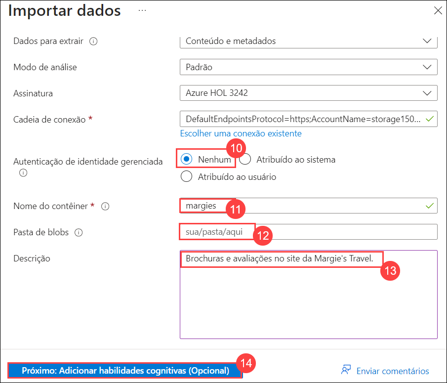

1. Na aba **Adicionar habilidades cognitivas (Opcional)** expanda **Anexar Serviços de IA(1)**, dentro da seção clique em **Criar novo serviço de IA do Azure** para criar o recurso de serviço de IA do Azure.

    **Observação:** esta ação abrirá uma nova aba para criar o recurso de serviços de IA do Azure. Depois que o recurso for criado, volte para a aba anterior e clique em **Atualizar** para exibir o nome do recurso recém-criado.

1. Especifique os seguintes detalhes para criar um **Serviço de IA do Azure** e clique na aba **Revisar + Criar (7)**.

    | **Opção** | **Valor** |
    | ------------------ | ----------------------------------------------------- |
    | Assinatura | Deixar padrão **(1)** |
    | Grupo de recursos | **Ativar-GenAI** **(2)** |
    | Nome | *Digite um nome exclusivo* para seus Serviços de IA do Azure ou use o formato **challengeservice-xxxxxx** (substitua **xxxxxx** pelo **ID de implantação** registrado no **Desafio 01**) **(3)** |
    | Localização | Use o mesmo local que o grupo de recursos **(4)** |
    | Nível de preço | Padrão S0 **(5)** |
    | Ao marcar esta caixa, reconheço que li e entendi todos os termos abaixo | Selecione a **Caixa de seleção** **(6)**|
    
    >**Observação**: aqui, xxxxxx se refere ao ID de implantação
    
    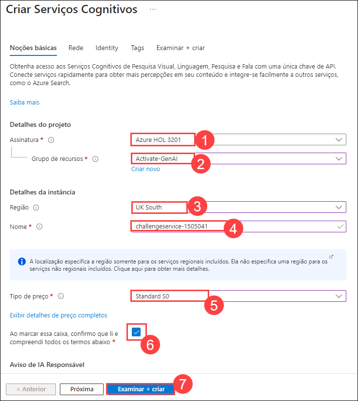

1. Assim que a validação for bem-sucedida na guia **Revisar + criar**, clique em **Criar** e aguarde a conclusão da implantação.

1. Na guia **Adicionar habilidades cognitivas (opcional)**, expanda **Anexar serviços de IA(1)**, dentro da seção selecione seu recurso **Serviços de IA do Azure (2)**.

   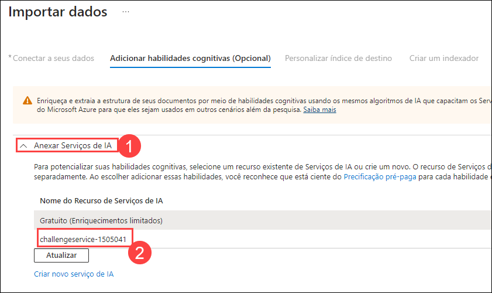

1. Role para baixo e expanda a seção **Adicionar enriquecimentos (1)** e especifique o seguinte:

    - Altere o **Nome do conjunto de habilidades** para **margies-skillset (2)**.
    - Marque a caixa de seleção para **Ativar OCR e mesclar todo o texto no campo merged_content (3)**.
    - Certifique-se de que o **Campo de dados de origem** esteja definido como **merged_content (4)**.
    - Deixe o **Nível de granularidade de enriquecimento** como o **Campo de origem (5)**, que define todo o conteúdo do documento que está sendo indexado, mas observe que você pode alterar isso para extrair informações em níveis mais granulares, como páginas ou frases.
    
        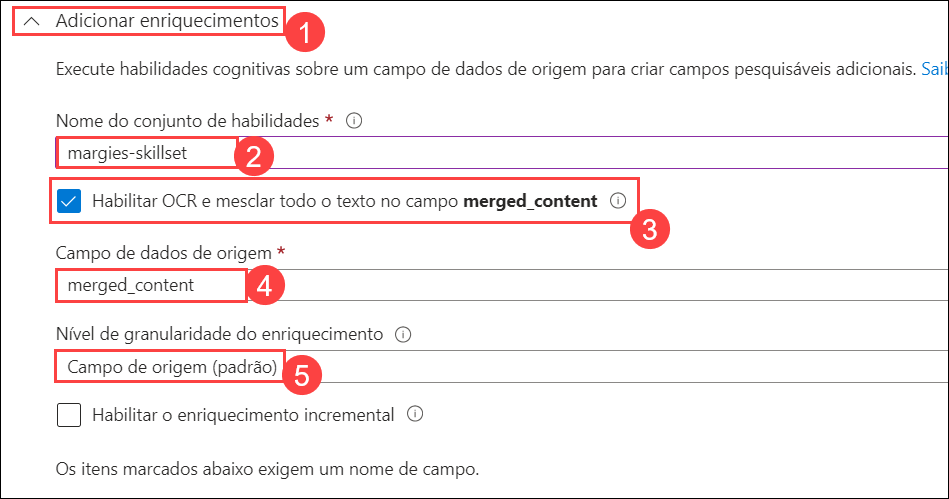

    - Selecione os seguintes campos enriquecidos:
    
        | Habilidade cognitiva | Parâmetro | Nome do campo |
        | --------------- | ---------- | ---------- |
        | Extrair nomes de localização | | locations |
        | Extrair frases-chave | | keyphrases |
        | Detectar idioma | | language |
        | Gerar tags de imagens | | imageTags |
        | Gerar legendas de imagens | | imageCaption |
        
        

1. Verifique novamente suas seleções (pode ser difícil alterá-las mais tarde). Em seguida, prossiga para a próxima etapa (*Personalizar índice de destino*).

    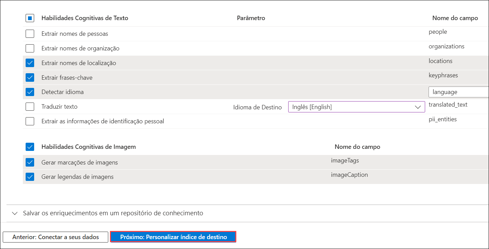

1. Na guia **Personalizar índice de destino**, altere o **Nome do índice** para **margies-index (1)**.

1. Certifique-se de que a **Chave** esteja definida como **metadata_storage_path (2)** e deixe o **Nome do sugeridor** em branco e o **Modo de pesquisa (3)** em seu valor padrão.

    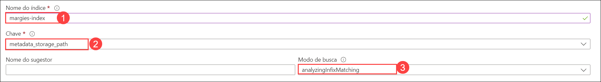
   
1. Faça as seguintes alterações nos campos de índice, deixando todos os outros campos com suas configurações padrão (**IMPORTANTE**: pode ser necessário rolar para a direita para ver a tabela inteira):

    | Nome do campo | Recuperável | Filtrável | Classificável | Com faceta | Pesquisável |
    | ------------- | ----------- | --------- | ------------- | ---------- | ----------- |
    | metadata_storage_size | &nbsp;&nbsp;&nbsp;&nbsp;&nbsp;&nbsp;&#10004; | &nbsp;&nbsp;&nbsp;&nbsp;&nbsp;&nbsp;&#10004; | &nbsp;&nbsp;&nbsp;&nbsp;&nbsp;&nbsp;&#10004; | | |
    | metadata_storage_last_modified | &nbsp;&nbsp;&nbsp;&nbsp;&nbsp;&nbsp;&#10004; | &nbsp;&nbsp;&nbsp;&nbsp;&nbsp;&nbsp;&#10004; | &nbsp;&nbsp;&nbsp;&nbsp;&nbsp;&nbsp;&#10004; | | |
    | metadata_storage_name | &nbsp;&nbsp;&nbsp;&nbsp;&nbsp;&nbsp;&#10004; | &nbsp;&nbsp;&nbsp;&nbsp;&nbsp;&nbsp;&#10004; | &nbsp;&nbsp;&nbsp;&nbsp;&nbsp;&nbsp;&#10004; | | &nbsp;&nbsp;&nbsp;&nbsp;&nbsp;&nbsp;&#10004; |
    | metadata_author | &nbsp;&nbsp;&nbsp;&nbsp;&nbsp;&nbsp;&#10004; | &nbsp;&nbsp;&nbsp;&nbsp;&nbsp;&nbsp;&#10004; | &nbsp;&nbsp;&nbsp;&nbsp;&nbsp;&nbsp;&#10004; | &nbsp;&nbsp;&nbsp;&nbsp;&nbsp;&nbsp;&#10004; | &nbsp;&nbsp;&nbsp;&nbsp;&nbsp;&nbsp;&#10004; |
    | locations | &nbsp;&nbsp;&nbsp;&nbsp;&nbsp;&nbsp;&#10004; | &nbsp;&nbsp;&nbsp;&nbsp;&nbsp;&nbsp;&#10004; | | | &nbsp;&nbsp;&nbsp;&nbsp;&nbsp;&nbsp;&#10004; |
    | keyphrases | &nbsp;&nbsp;&nbsp;&nbsp;&nbsp;&nbsp;&#10004; | &nbsp;&nbsp;&nbsp;&nbsp;&nbsp;&nbsp;&#10004; | | | &nbsp;&nbsp;&nbsp;&nbsp;&nbsp;&nbsp;&#10004; |
    | language | &nbsp;&nbsp;&nbsp;&nbsp;&nbsp;&nbsp;&#10004; | &nbsp;&nbsp;&nbsp;&nbsp;&nbsp;&nbsp;&#10004; | | | |
    
    Use a imagem abaixo para verificar a opção.
    
    

1. Verifique novamente suas seleções, prestando atenção especial para garantir que as opções corretas **Recuperável**, **Filtrável**, **Classificável**, **Facetable** e **Pesquisável** estejam selecionadas para cada campo (pode ser difícil alterá-las mais tarde). Em seguida, prossiga para a próxima etapa clicando em **Próximo: Criar um indexador**.

1. Na guia **Criar um indexador**, especifique o seguinte
    - Altere o **Nome do indexador** para **margies-indexer (1)**.
    - Deixe o **Agendamento** definido como **Uma vez (2)**.
    - Expanda as **Opções avançadas (3)** e certifique-se de que a opção **Chaves de codificação Base-64 (4)** esteja selecionada (geralmente, as chaves de codificação tornam o índice mais eficiente).

    - Selecione **Enviar (5)** para criar a fonte de dados, o conjunto de habilidades, o índice e o indexador. O indexador é executado automaticamente e executa o pipeline de indexação, que:

        1. Extrai os campos de metadados do documento e o conteúdo da fonte de dados.
        2. Executa o conjunto de habilidades cognitivas para gerar campos enriquecidos adicionais.
        3. Mapeia os campos extraídos para o índice.

           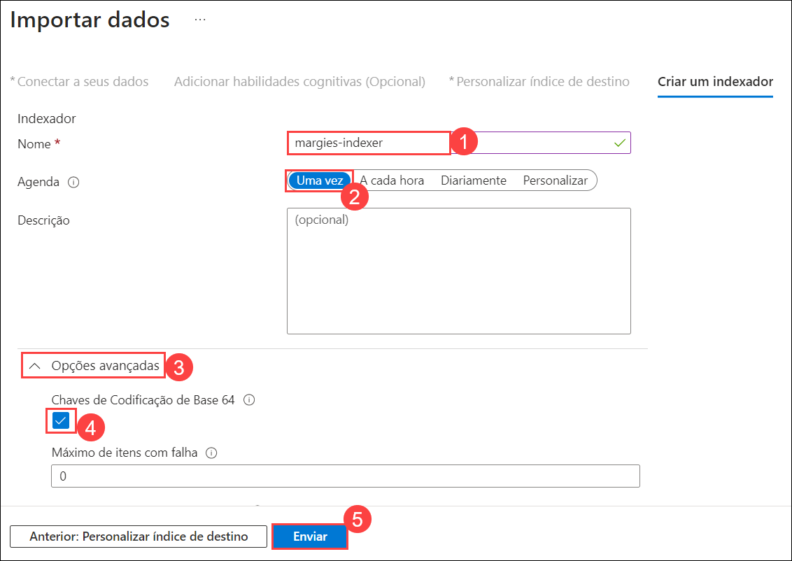

1. Na página de recursos do **Azure AI Search**, expanda **Gerenciamento de pesquisa (1)** selecione **Indexadores (2)** que deve mostrar o **margies-indexer (3)** recém-criado.

    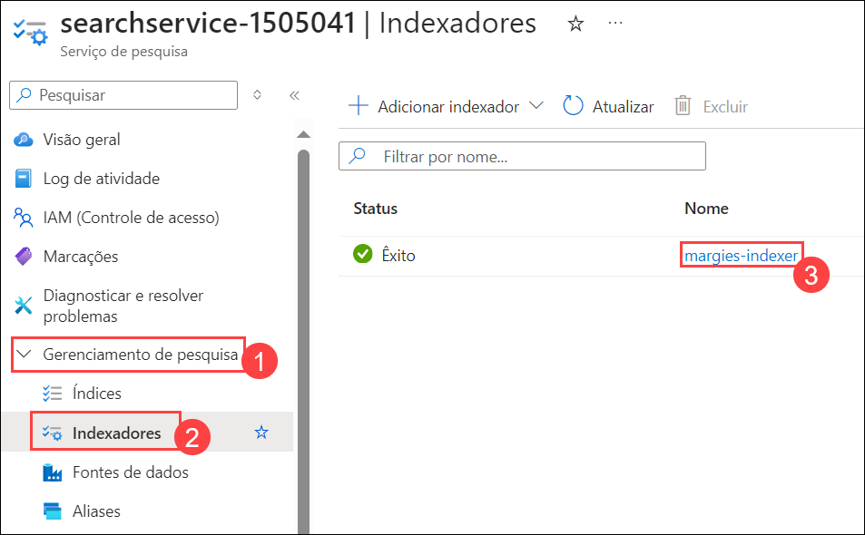

1. Selecione **margies-indexer** . Aguarde alguns minutos e clique em **&orarr; Atualizar** até que o **Status** indique Exito.

    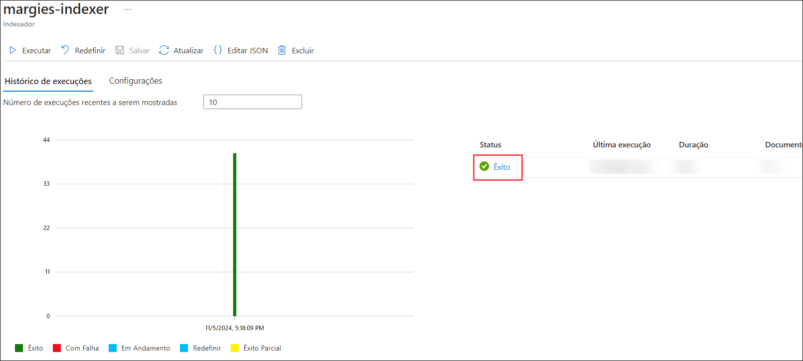
   
### Tarefa 5.2: Pesquisar o índice

Nesta tarefa, você aprenderá a pesquisar e consultar o índice criado anteriormente:

1. Na parte superior da página **Visão geral** do seu recurso de pesquisa do Azure AI, selecione **Explorador de pesquisa**.

    

1. No Explorador de pesquisa, na caixa **Sequência de caracteres de consulta**, insira `*` (um único asterisco) e selecione **Pesquisar**.

    
    
    >**Observação**: esta consulta recupera todos os documentos no índice no formato JSON. Examine os resultados e observe os campos de cada documento, que contêm conteúdo do documento, metadados e dados enriquecidos extraídos pelas habilidades cognitivas selecionadas.

1. No menu **Exibir**, selecione **Exibição JSON**.

    

1. Observe que a solicitação JSON para a pesquisa é mostrada, assim:

    ```json
    {
    "search": "*"
    }
    ```
    

1. Modifique a solicitação JSON para incluir o parâmetro **count**, conforme mostrado aqui:

    ```json
    {
    "search": "*",
    "count": true
    }
    ```

1. Envie a pesquisa modificada. Desta vez, os resultados incluem um campo **@odata.count** no topo dos resultados que indica o número de documentos retornados pela pesquisa.

1. Tente a seguinte consulta:
    
    ```json
    {
    "search": "*",
    "count": true,
    "select": "metadata_storage_name,metadata_author,locations"
    }
    ```

    >**Observação**: desta vez, os resultados incluem apenas o nome do arquivo, autor e quaisquer locais mencionados no conteúdo do documento. O nome do arquivo e o autor estão nos campos **metadata_storage_name** e **metadata_author**, que foram extraídos do documento de origem. O campo **locations** foi gerado por uma habilidade cognitiva.

1. Agora tente a seguinte sequência de consulta:

    ```json
    {
    "search": "New York",
    "count": true,
    "select": "metadata_storage_name,keyphrases"
    }
    ```
    
    >**Observação**: esta pesquisa encontra documentos que mencionam "New York" em qualquer um dos campos pesquisáveis ​​e retorna o nome do arquivo e as frases-chave no documento.

1. Vamos tentar mais uma consulta:

    ```json
    {
    "search": "New York",
    "count": true,
    "select": "metadata_storage_name",
    "filter": "metadata_author eq 'Reviewer'"
    }
    ```

    >**Observação**: Esta consulta retorna o nome do arquivo de qualquer documento criado por *Reviewer* que mencione "New York".
    
    
  
### Tarefa 6: Explorar e modificar as definições dos componentes de pesquisa

Os componentes da solução de pesquisa são baseados em definições JSON, que você pode visualizar e editar no portal do Azure.

Embora você possa usar o portal para criar e modificar soluções de pesquisa, geralmente é desejável definir os objetos de pesquisa em JSON e usar a interface REST do Azure AI Service para criá-los e modificá-los.

#### Tarefa 6.1: Obter o ponto de extremidade e a chave para seu recurso do Azure AI Search

Nesta tarefa, você está se preparando para executar comandos CURL no Visual Studio Code para interagir com a interface REST do Azure AI Service:

1. No portal do Azure, retorne à página **Visão geral** do seu recurso **Azure AI Search** e, na seção superior da página, encontre o **Url** do seu recurso (que se parece com **https://resource_name.search.windows.net**) e copie-o para a área de transferência.

    

1. No Visual Studio Code, no painel Explorer, expanda a pasta **22-create-a-search-solution (1)** e sua subpasta **modify-search (2)** e selecione **modify-search.cmd (3)** para abri-la. Você usará este arquivo de script para executar comandos *CURL* que enviam JSON para a interface REST do Azure AI Service.

    

1. Em **modify-search.cmd**, substitua o espaço reservado **YOUR_SEARCH_URL** pela URL que você copiou para a área de transferência.

    

1. No portal do Azure, volte para a página **Visão geral** do seu recurso **Azure AI Search**, expanda **Configurações** e selecione **Chaves** e copie a **Chave de administrador principal** para a área de transferência.

    

1. Volte para o **Visual Studio Code**, substitua o espaço reservado **YOUR_ADMIN_KEY** pela chave que você copiou para a área de transferência.

    

1. Salve as alterações em **modify-search.cmd** (mas não o execute ainda!)

    
    
### Tarefa 6.2: Revisar e modificar o conjunto de habilidades

Nesta tarefa, você configurará um conjunto de habilidades (skillset.json) no Visual Studio Code para integrar o Azure AI Services com o Azure AI Search:

1. No Visual Studio Code, na pasta **modify-search**, abra **skillset.json**. Isso mostra uma definição JSON para **margies-skillset**.

    

1. Na parte superior da definição do conjunto de habilidades, observe o objeto **cognitiveServices**, que é usado para conectar seu recurso do Azure AI Services ao conjunto de habilidades.

1. No portal do Azure, abra seu recurso do Azure AI Services (<u>não</u> seu recurso do Azure AI Search!)

1. Na página de visão geral do **Azure AI Services**, no painel de navegação esquerdo, expanda **Resource Management** e selecione **Keys and Endpoints**. Em seguida, copie **Key 1** para a área de transferência.

    

1. No Visual Studio Code, em **skillset.json**, substitua o espaço reservado **YOUR_COGNITIVE_SERVICES_KEY** pela chave do Azure AI Services que você copiou para a área de transferência.

    

1. Role pelo arquivo JSON, observando que ele inclui definições para as habilidades que você criou usando a interface do usuário do Azure AI Search no portal do Azure. No final da lista de habilidades, uma habilidade adicional foi adicionada com a seguinte definição:

    ```
    {
    "@odata.type": "#Microsoft.Skills.Text.V3.SentimentSkill",
    "defaultLanguageCode": "en",
    "name": "get-sentiment",
    "description": "Nova habilidade para avaliar o sentimento",
    "context": "/document",
    "inputs": [
    {
    "name": "text",
    "source": "/document/merged_content"
    },
    {
    "name": "languageCode",
    "source": "/document/language"
    }
    ],
    "outputs": [
    {
    "name": "sentiment",
    "targetName": "sentimentLabel"
    }
    ]
    }
    ```

    >**Observação**: A nova habilidade é chamada **get-sentiment** e para cada **document** nível em um documento, ele avaliará o texto encontrado no campo **merged_content** do documento que está sendo indexado (que inclui o conteúdo de origem, bem como qualquer texto extraído de imagens no conteúdo). Ele usa o **idioma** extraído do documento (com um padrão de inglês) e avalia um rótulo para o sentimento do conteúdo. Os valores para o rótulo de sentimento podem ser "positivo", "negativo", "neutro" ou "misto". Este rótulo é então emitido como um novo campo chamado **sentimentLabel**.

1. Salve as alterações que você fez em **skillset.json**.

### Tarefa 6.3: Revise e modifique o índice

Nesta tarefa, você revisará o arquivo index.json no Visual Studio Code que mostra uma definição JSON para **margies-index**

1. No Visual Studio Code, na pasta **modify-search**, abra **index.json**. Isso mostra uma definição JSON para **margies-index**.

    

1. Role pelo índice e visualize as definições de campo. Alguns campos são baseados em metadados e conteúdo no documento de origem, e outros são resultados de habilidades no conjunto de habilidades.
1. No final da lista de campos que você definiu no portal do Azure, observe que dois campos adicionais foram adicionados:

    ```
    {
    "name": "sentiment",
    "type": "Edm.String",
    "facetable": false,
    "filterable": true,
    "retrievable": true,
    "sortable": true
    },
    {
    "name": "url",
    "type": "Edm.String",
    "facetable": false,
    "filterable": true,
    "retrievable": true,
    "searchable": false,
    "sortable": false
    }
    ```

1. O campo **sentiment** será usado para adicionar a saída da habilidade **get-sentiment** que foi adicionada ao conjunto de habilidades. O campo **url** será usado para adicionar a URL de cada documento indexado ao índice, com base no valor **metadata_storage_path** extraído da fonte de dados. Observe que o índice já inclui o campo **metadata_storage_path**, mas ele é usado como a chave de índice e codificado em Base-64, tornando-o eficiente como uma chave, mas exigindo que os aplicativos clientes o decodifiquem se quiserem usar o valor real da URL como um campo. Adicionar um segundo campo para o valor não codificado resolve esse problema.
   
### Tarefa 6.4: Revisar e modificar o indexador

Nesta tarefa, você revisará o arquivo **indexer.json** no Visual Studio Code, que mostra uma definição JSON para **margies-index**

1. No Visual Studio Code, na pasta **modify-search**, abra **indexer.json**. Isso mostra uma definição JSON para **margies-indexer**, que mapeia campos extraídos do conteúdo do documento e metadados (na seção **fieldMappings**) e valores extraídos por habilidades no skillset (na seção **outputFieldMappings**) para campos no índice.

    

1. Na lista **fieldMappings**, observe o mapeamento do valor **metadata_storage_path** para o campo de chave codificado em base 64. Isso foi criado quando você atribuiu **metadata_storage_path** como a chave e selecionou a opção para codificar a chave no portal do Azure. Além disso, um novo mapeamento mapeia explicitamente o mesmo valor para o campo **url**, mas sem a codificação Base-64:

    ```
    {
    "sourceFieldName" : "metadata_storage_path",
    "targetFieldName" : "url"
    }
    
    ```

> **Observação**: todos os outros metadados e campos de conteúdo no documento de origem são mapeados implicitamente para campos do mesmo nome no índice.

1. Revise a seção **ouputFieldMappings**, que mapeia saídas das habilidades no skillset para campos de índice. A maioria delas reflete as escolhas que você fez na interface do usuário, mas o mapeamento a seguir foi adicionado para mapear o valor **sentimentLabel** extraído pela sua habilidade de sentimento para o campo **sentiment** que você adicionou ao índice:

    ```
    {
    "sourceFieldName": "/document/sentimentLabel",
    "targetFieldName": "sentiment"
    }
    ```

### Tarefa 6.5: Use a API REST para atualizar a solução de pesquisa

Nesta tarefa, você atualizará as definições JSON no Visual Studio Code para Azure AI Search para incluir novos campos, como resultados de análise de sentimento e URLs de documentos. Execute modify-search.cmd para aplicar as alterações e iniciar a indexação. Monitore o progresso na seção Indexadores do portal do Azure para avisos de conclusão e tamanho do documento durante a análise de sentimento.

1. Clique com o botão direito do mouse na pasta **modify-search** e selecione **abrir um terminal integrado**.

    

1. No painel do terminal para a pasta **modify-search**, insira o seguinte comando para executar o script **modify-search.cmd**, que envia as definições JSON para a interface REST e inicia a indexação.

    ```
    .\modify-search
    ```

1. Quando o script terminar, retorne à página **Visão geral** do seu **Azure AI Search** no painel de navegação esquerdo, expanda **Gerenciamento de pesquisa** e selecione **Indexadores**. Em seguida, selecione periodicamente **Atualizar** para rastrear o progresso da operação de indexação. Pode levar cerca de um minuto para ser concluído.

    

    >**Observação**: pode haver alguns avisos para alguns documentos que são muito grandes para avaliar o sentimento. Frequentemente, a análise de sentimento é realizada no nível da página ou da frase, em vez do documento completo, mas neste cenário, a maioria dos documentos, principalmente as avaliações de hotéis, são curtas o suficiente para que pontuações de sentimento úteis no nível do documento sejam avaliadas.

### Tarefa 6.6: Consultar o índice modificado
Nesta tarefa, você executará uma consulta no Azure AI Search para recuperar URLs, sentimentos e frases-chave para documentos que mencionam "Londres" com sentimentos positivos, de autoria de "Revisor".

1. Na parte superior da lâmina do seu recurso do Azure AI Search, selecione **Search explorer**.
1. No Search explorer, na caixa **Query string**, envie a seguinte consulta JSON:

    ```json
    {
    "search": "London",
    "select": "url,sentiment,keyphrases",
    "filter": "metadata_author eq 'Reviewer' and sentiment eq 'positive'"
    }
    ```

    Esta consulta recupera a **url**, **sentiment** e **keyphrases** para todos os documentos que mencionam *London* de autoria de *Reviewer* que têm um rótulo de **sentiment** positivo (em outras palavras, avaliações positivas que mencionam London).

1. Feche a página **Search explorer** para retornar à página **Overview**.

### Tarefa 7: Criar um aplicativo cliente de pesquisa

Agora que você tem um índice útil, pode usá-lo em um aplicativo cliente. Você pode fazer isso consumindo a interface REST, enviando solicitações e recebendo respostas no formato JSON por HTTP, ou pode usar o kit de desenvolvimento de software (SDK) para sua linguagem de programação preferida. Neste exercício, usaremos o SDK.

> **Observação**: Você pode escolher usar o SDK para **C#** ou **Python**. Nas etapas abaixo, execute as ações apropriadas para sua linguagem preferida.

### Tarefa 7.1: Obter o ponto de extremidade e as chaves para seu recurso de pesquisa

Nesta tarefa, você recuperará a URL e as chaves do ponto de extremidade para seu recurso de Pesquisa de IA do Azure do portal do Azure, essencial para gerenciar e consultar seus recursos de pesquisa em tarefas futuras.

1. No portal do Azure, navegue de volta para **Pesquisa de IA do Azure**. Na página Visão geral do recurso **Azure AI Search**, observe o valor da URL, que deve ser semelhante a **https://nome_do_seu_recurso.search.windows.net**. Registre esse valor no Bloco de notas, pois ele será necessário em tarefas futuras.

    

1. Na navegação à esquerda, expanda **Configurações**, selecione **Chaves**, observe que há duas chaves **admin** e uma única chave **Gerenciar chaves de consulta**.

    >**Observação**: uma chave *admin* é usada para criar e gerenciar recursos de pesquisa
    >**Observação**: uma chave *Gerenciar chaves de consulta* é usada por aplicativos clientes que precisam apenas executar consultas de pesquisa.
    
    

1. Copie as **Gerenciar chaves de consulta** para a área de transferência e registre-as no Bloco de notas, pois elas serão necessárias para tarefas futuras.

    

### Tarefa 7.2: Prepare-se para usar o Azure AI Search SDK

Nesta tarefa, você preparará seu ambiente de desenvolvimento no Visual Studio Code para integrar-se ao Azure AI Search SDK instalando os pacotes necessários (Azure.Search.Documents para C# ou azure-search-documents para Python) e configurando a URL do ponto de extremidade e a chave de consulta nos respectivos arquivos de configuração.

1. No Visual Studio Code, no painel **Explorer**, navegue até a pasta **22-create-a-search-solution** e expanda a pasta **C-Sharp** ou **Python** dependendo da sua preferência de idioma.
1. Clique com o botão direito do mouse na pasta **margies-travel** e abra um terminal integrado. Em seguida, instale o pacote Azure AI Search SDK executando o comando apropriado para sua preferência de idioma:
    > **Observação**: certifique-se de que as extensões necessárias já estejam instaladas no VS Code.

    **C#**

    ```
    dotnet add package Azure.Search.Documents --version 11.1.1
    ```
    **Python**

    ```
    pip install azure-search-documents==11.0.0
    ```

1. Veja o conteúdo da pasta **margies-travel** e observe que ela contém um arquivo para definições de configuração:
    - **C#**: appsettings.json
    - **Python**: .env

1. Abra o arquivo de configuração e atualize o **YOUR_SEARCH_ENDPOINT** com o link **Azure AI Search** *Endpoint URL* e os valores **YOUR_SEARCH_QUERY_KEY** com **Manage query keys** que você registrou em tarefas anteriores e salve as alterações.

    - **C#**: appsettings.json
    
        
    
    - **Python**: .env
    
        

### Tarefa 7.3: Explorar código para pesquisar um índice

Nesta tarefa, você explorará o código para um aplicativo da Web (C# ASP.NET Razor ou Python Flask) dentro da pasta margies-travel. Você revisará como ele interage com o Azure AI Search SDK para executar consultas de pesquisa, configurar clientes de pesquisa e gerenciar resultados de pesquisa, incluindo filtragem, classificação e destaque de campos de conteúdo.

A pasta **margies-travel** contém arquivos de código para um aplicativo da Web (um aplicativo da Web Microsoft C# *ASP.NET Razor* ou um aplicativo Python *Flask*), que inclui funcionalidade de pesquisa.

1. Abra o seguinte arquivo de código no aplicativo da Web, dependendo da sua escolha de linguagem de programação:
    - **C#**:Pages/Index.cshtml.cs
    - **Python**: app.py

1. Próximo ao topo do arquivo de código, encontre o comentário **Import search namespaces** e observe os namespaces que foram importados para funcionar com o Azure AI Search SDK:

1. Na função **search_query**, encontre o comentário **Create a search client** e observe que o código cria um objeto **SearchClient** usando o ponto de extremidade e a chave de consulta para seu recurso do Azure AI Search:

1. Na função **search_query**, encontre o comentário **Submit search query** e revise o código para enviar uma pesquisa para o texto especificado com as seguintes opções:
    - Um *modo de pesquisa* que requer que **todas** as palavras individuais no texto de pesquisa sejam encontradas.
    - O número total de documentos encontrados pela pesquisa é incluído nos resultados.
    - Os resultados são filtrados para incluir apenas documentos que correspondem à expressão de filtro fornecida.
    - Os resultados são classificados na ordem de classificação especificada.
    - Cada valor discreto do campo **metadata_author** é retornado como uma *faceta* que pode ser usada para exibir valores predefinidos para filtragem.
    - Até três extratos dos campos **merged_content** e **imageCaption** com os termos de pesquisa destacados são incluídos nos resultados.
    - Os resultados incluem apenas os campos especificados.

### Tarefa 7.4: Explorar código para renderizar resultados de pesquisa

Nesta tarefa, você se aprofundará no código do aplicativo da web (C# ASP.NET Razor ou Python Flask) para entender como ele apresenta os resultados da pesquisa:

O aplicativo da web já inclui código para processar e renderizar os resultados da pesquisa.

1. Abra o seguinte arquivo de código no aplicativo da web, dependendo da sua escolha de linguagem de programação:
    - **C#**:Pages/Index.cshtml
    - **Python**: templates/search.html
1. Examine o código, que renderiza a página na qual os resultados da pesquisa são exibidos. Observe que:
    - A página começa com um formulário de pesquisa que o usuário pode usar para enviar uma nova pesquisa (na versão Python do aplicativo, esse formulário é definido no modelo **base.html**), que é referenciado no início da página.
    - Um segundo formulário é então renderizado, permitindo que o usuário refine os resultados da pesquisa. O código para este formulário:
        - Recupera e exibe a contagem de documentos dos resultados da pesquisa.
        - Recupera os valores de faceta para o campo **metadata_author** e os exibe como uma lista de opções para filtragem.
        - Cria uma lista suspensa de opções de classificação para os resultados.
        - O código então itera pelos resultados da pesquisa, renderizando cada resultado da seguinte forma:
        - Exibe o campo **metadata_storage_name** (nome do arquivo) como um link para o endereço no campo **url**.
        - Exibe *destaques* para termos de pesquisa encontrados nos campos **merged_content** e **imageCaption** para ajudar a mostrar os termos de pesquisa em contexto.
        - Exibe os campos **metadata_author**, **metadata_storage_size**, **metadata_storage_last_modified** e **language**.
        - Exibe o rótulo **sentiment** para o documento. Pode ser positivo, negativo, neutro ou misto.
        - Exibe as cinco primeiras **keyphrases** (se houver).
        - Exibe os cinco primeiros **locations** (se houver).
        - Exibe as cinco primeiras **imageTags** (se houver).
          
### Tarefa 7.5: Executar o aplicativo da web

Nesta tarefa, você executará o aplicativo da web Margie's Travel localmente, pesquisando termos específicos como "hotel em Londres" e "hotel tranquilo em Nova York", refinando os resultados da pesquisa usando filtros e opções de classificação com base no sentimento, observando a identificação de palavras-chave e localização em documentos.

1. Retorne ao terminal integrado para a pasta **margies-travel** e insira o seguinte comando para executar o programa:

    **C#**

    ```
    dotnet run
    ```
    > **Observação:** Se o comando falhar, clique no link fornecido na mensagem de erro para baixar a versão mais recente do Microsoft ASP.NET Core Shared Framework. Depois disso, baixe e instale o .NET Core e execute o comando novamente.

   **Python**

    ```
    flask run
    ```
    > **Observação:** Se o comando falhar, **execute o comando pip Install python-dotenv** e execute-o novamente.

1. Abra outra aba no Edge Browse seguindo o link (*http://localhost:5000/* ou *http://127.0.0.1:5000/*) para abrir o site **Margie's Travel** em um navegador da web.

    

1. No site **Margie's Travel**, digite **London hotel (1)** na caixa de pesquisa e clique em **Search (2)**.

    

1. Revise os resultados da pesquisa. Eles incluem o nome do arquivo (com um hiperlink para a URL do arquivo), um extrato do conteúdo do arquivo com os termos de pesquisa (*London* e *hotel*) enfatizados e outros atributos do arquivo dos campos de índice.

    
    
1. Observe que a página de resultados inclui alguns elementos da interface do usuário que permitem refinar os resultados. Eles incluem:
    
    - Um *Filtro por autor* com base em um valor de faceta para o campo **metadata_author**. Isso demonstra como você pode usar campos *facetable* para retornar uma lista de *facetas* - campos com um pequeno conjunto de valores discretos que podem ser exibidos como valores de filtro potenciais na interface do usuário.
    
    - Uma capacidade de **Classificar por** para *ordenar* os resultados com base em um campo especificado e na direção da classificação (crescente ou decrescente). A ordem padrão é baseada na *relevância*, que é calculada como um valor **search.score()** com base em um *perfil de pontuação* que avalia a frequência e a importância dos termos de pesquisa nos campos de índice.

1. Selecione o filtro **Revisor** e a opção de classificação **Positivo para negativo** e, em seguida, selecione **Refinar resultados**.

    

1. Observe que os resultados são filtrados para incluir apenas avaliações e classificados com base no rótulo de sentimento.
    

1. No site **Margie's Travel**, digite **quiet hotel in New York (1)** na caixa de pesquisa e clique em **Search (2)**.

    

1. Tente os seguintes termos de pesquisa:
    - **Torre de Londres** (observe que este termo é identificado como uma *frase-chave* em alguns documentos).
    - **arranha-céu** (observe que esta palavra não aparece no conteúdo real de nenhum documento, mas é encontrada nas *legendas de imagem* e *etiquetas de imagem* que foram geradas para imagens em alguns documentos).
    - **deserto de Mojave** (observe que este termo é identificado como um *local* em alguns documentos).

1. Feche a aba do navegador que contém o site Margie's Travel e retorne ao Visual Studio Code. Então, no terminal Python para a pasta **margies-travel** (onde o aplicativo dotnet ou flask está sendo executado), digite Ctrl+C para parar o aplicativo.
   
## Critério de Sucesso:

Para concluir este desafio com sucesso, você deve:

- Implantar o Serviço de Pesquisa do Azure e a Conta de Armazenamento do Azure.
- Adicionar dados à conta de armazenamento.
- Indexar os documentos no Azure AI Search usando o portal do Azure.
- Personalizar o índice e configurar o indexador no Azure AI Search.
- Modificar e explorar componentes de pesquisa usando definições JSON.
- Utilizar o Azure AI Search SDK para criar um aplicativo cliente para pesquisa.
- Executar o aplicativo da Web localmente, realizar pesquisas e refinar os resultados da pesquisa de forma eficaz.

## Recursos Adicionais:

- Consulte [O que é o Azure AI Search](https://learn.microsoft.com/en-us/azure/search/search-what-is-azure-search) para referência.
- [O que são índices no Azure AI Search?](https://learn.microsoft.com/en-us/azure/search/search-what-is-an-index)
- [Pesquisando texto de documento em escala usando o Azure Cognitive Search](https://benalexkeen.com/searching-document-text-at-scale-using-azure-cognitive-search/)

Para saber mais sobre o Azure AI Search, consulte a [documentação do Azure AI Search](https://docs.microsoft.com/azure/search/search-what-is-azure-search).

## Prossiga para o próximo Desafio clicando em **Next**>>.
