# Desafío 02: Implementar la Búsqueda de Documentos con Azure AI Search

### Tiempo Estimado: 120 minutos

## Introducción:

Todas las organizaciones dependen de la información para tomar decisiones, responder preguntas y funcionar de manera eficiente. El problema para la mayoría de las organizaciones no es la falta de información, el reto de encontrarla y extraerla del enorme conjunto de documentos, bases de datos y otras fuentes en las que está almacenada.

Por ejemplo, supongamos que *Margie's Travel* es una agencia de viajes especializada en organizar viajes a ciudades de todo el mundo. Con el tiempo, la empresa ha acumulado una enorme cantidad de información en documentos como folletos y reseñas de hoteles enviadas por los clientes. Estos datos son una valiosa fuente de información para las agencias de viajes y los clientes a la hora de planificar sus viajes, pero el enorme volumen de datos puede dificultar la búsqueda de información relevante para responder a una pregunta concreta de un cliente.

Para abordar este desafío, Margie's Travel puede usar Azure AI Search para implementar una solución en la que los documentos se indexan y enriquecen mediante el uso de aptitudes de IA para facilitar su búsqueda.

## Guía de Solucines

### Tarea 1: Clonar el repositorio para este curso

Si aún no ha clonado el repositorio de código **AI-102-AIEngineer** en el entorno en el que está trabajando en este laboratorio, siga estos pasos para hacerlo. De lo contrario, abra la carpeta clonada en Visual Studio Code.

1. Abra **Visual Studio Code** desde el escritorio de Lab VM haciendo doble clic en él.

1. En **Visual Studio Code**, en el menú superior izquierdo, seleccione los puntos suspensivos **(...) (1)** > **Terminal (2)** y, a continuación, elija **Nueva Terminal (3)**.

   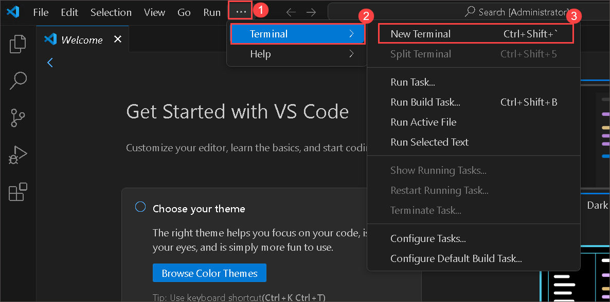

1. Ejecute el siguiente comando en la terminal para clonar el repositorio en una carpeta local: (no importa cuál sea la carpeta).

   `git clone https://github.com/MicrosoftLearning/AI-102-AIEngineer`

    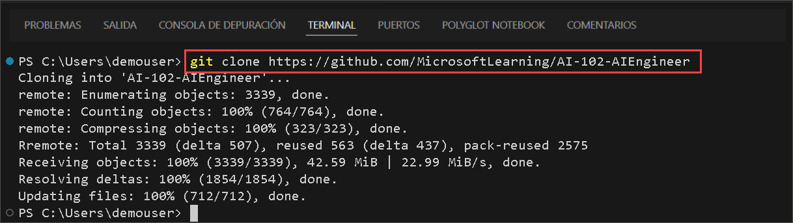

1. Cuando se haya clonado el repositorio, abra la carpeta en Visual Studio Code siguiendo estos pasos:

    - En el menú de la esquina superior izquierda, seleccione **Archivo (1)** > **Abrir carpeta (2)**.

       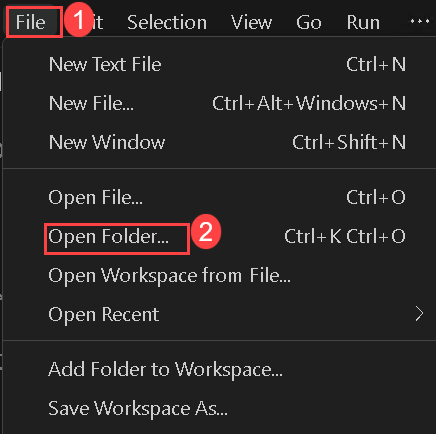
      
    - En el explorador de archivos, en **Quick access**, seleccione **AI-102-AIEngineer (1)** y luego haga clic en **Seleccionar carpeta (2)**.

       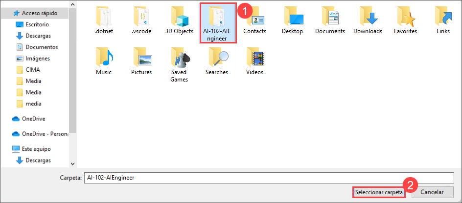
      
    - Si aparece el mensaje **¿Confía en los autores de los archivos de esta carpeta?**, haga clic en **Sí, confío en los autores**.

         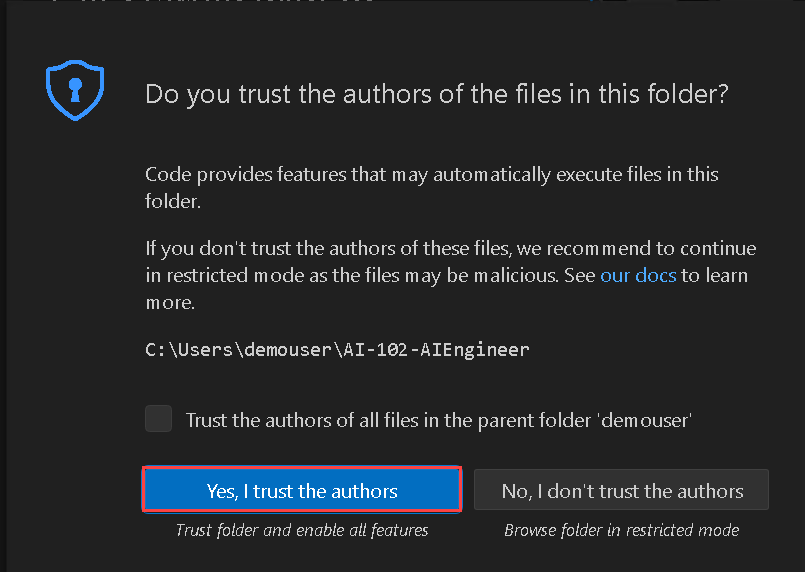

       > **Nota**: Si se le solicita que agregue los recursos necesarios para compilar y depurar, seleccione **Ahora no**.

### Tarea 2: Crear recursos de Azure

Para crear la solución para Margie's Travel, necesitará los siguientes recursos en su suscripción de Azure:

- Un recurso de **Azure AI Search** que administrará la indexación y las consultas.
- Un recurso de **Azure AI Services** que proporciona servicios de IA para las aptitudes que su solución de búsqueda puede usar para enriquecer los datos en los orígenes de datos con información generada por IA.
- Una **Cuenta de almacenamiento** con un contenedor de blobs en el que se almacenan los documentos que se buscarán.
  > **Importante**: Los recursos de Azure AI Search y Azure AI Services deben estar en la misma ubicación.

#### Tarea 2.1: Crear un recurso de Azure AI Search

En esta tarea, aprenderá a crear un recurso de **Azure AI Search** en el portal de Azure.

1. En un navegador web, inicie sesión en el portal de Azure visitando `https://portal.azure.com`.

1. Regrese a la página de inicio del portal de Azure y haga clic en el botón **&#65291;Crear un recurso**.

    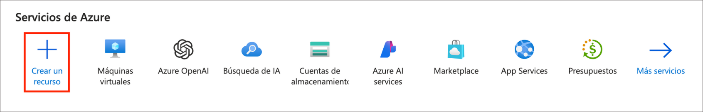
     
1. Busque y seleccione **Azure AI Search** en la lista de la página Crear un recurso.

   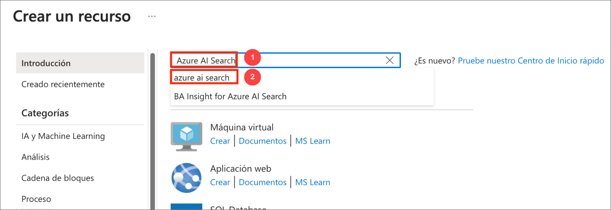

1. En la página **Marketplace**, seleccione **Azure AI Search**.

   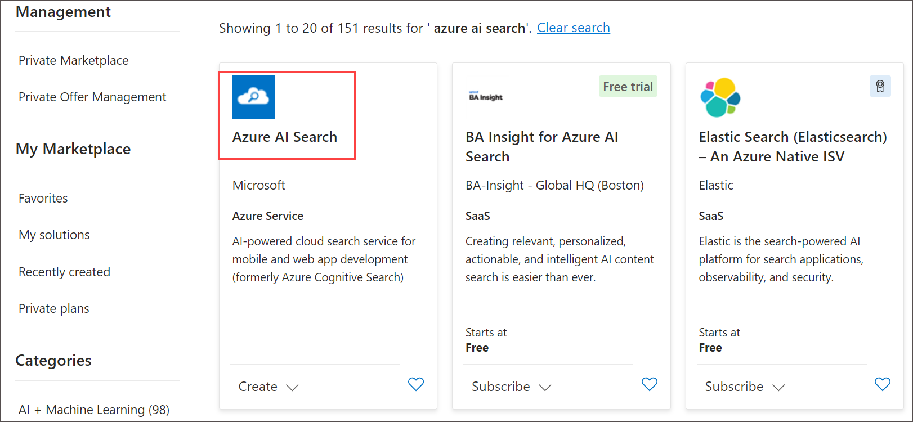
    
1. En la página **Azure AI Search**, haga clic en **Crear**.

   
   
1. Especifique los siguientes detalles para crear un servicio **Azure AI Search** y luego haga clic en la pestaña **Revisar y crear (6)**.
   
   | **Opción**         | **Valor**                                              |
   | ------------------ | -----------------------------------------------------  |
   | Suscripción       | Deje el valor predeterminado  **(1)**                                 |
   | Grupo de recursos     | **ODL-GenAI-CL-xxxxxx-Activate-GenAI** **(2)**                |
   | Nombre               | *Ingrese un nombre único* para su servicio de búsqueda o utilice el formato **searchservice-xxxxxx** (reemplace **xxxxxx** con el valor **Deployment ID** registrado en el **Desafío 01**) **(3)** |
   | Ubicación           | Use la misma ubicación que el grupo de recursos **(4)**           |
   | Plan de tarifa       | Básico   **(5)**                                               | 

    >**Nota**: Aquí, xxxxxx hace referencia al valor DeploymentID
    >**Nota**: Si encuentra el error **No se pueden obtener los costos de la suscripción**, ignórelo y continúe con el siguiente paso.
    
    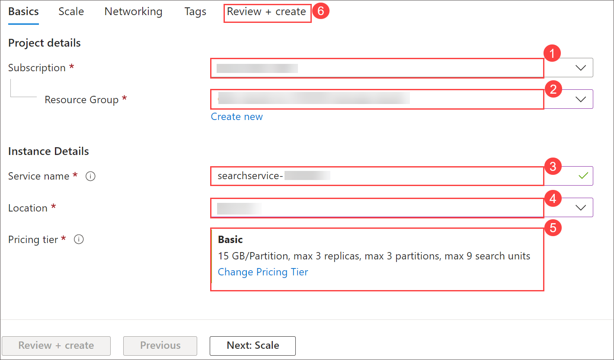
   
1. Una vez que la validación sea exitosa en la pestaña **Revisar y crear**, haga clic en **Crear** y espere a que se complete la implementación, luego, haga clic en **Ir al recurso**.

   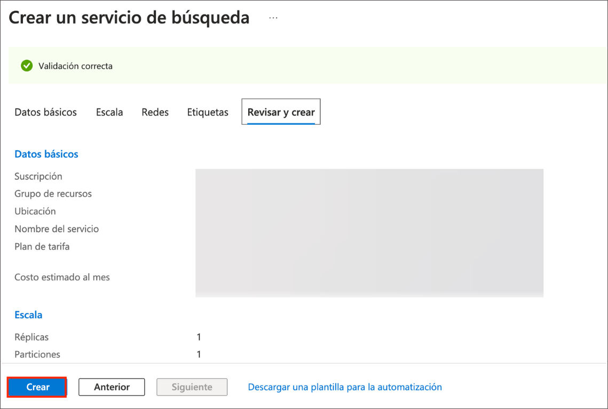

   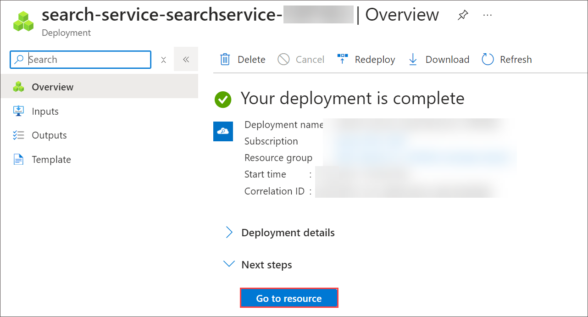

1. Revise la página **Información general** en la hoja correspondiente a su recurso de Azure AI Search en el portal de Azure. Aquí, puede usar una interfaz visual para crear, probar, administrar y supervisar los distintos componentes de una solución de búsqueda, incluidos los orígenes de datos, los índices, los indizadores y los conjuntos de aptitudes.

#### Tarea 2.2: Crear un recurso de Azure AI Services

En esta tarea, aprenderá a crear un recurso de Azure AI Search en el portal de Azure. Su solución de búsqueda usará este recurso para enriquecer los datos del almacén de datos con información generada por IA.

1. Regrese a la página de inicio del portal de Azure y haga clic en el botón **&#65291;Crear un recurso**.

    
     
1. Busque y seleccione **Azure AI Services (1) (2)** en la lista y, luego, en la página **Marketplace**, seleccione **Azure AI Services (3)**.

   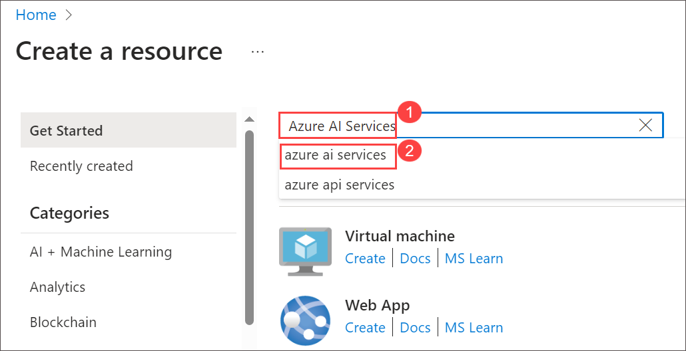

   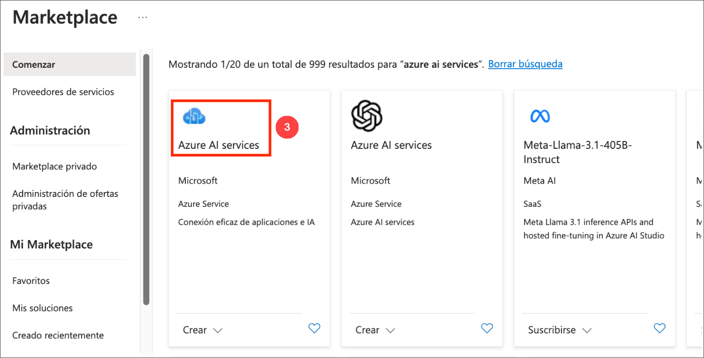
    
1. En la página **Azure AI Services**, haga clic en **Crear**. 

   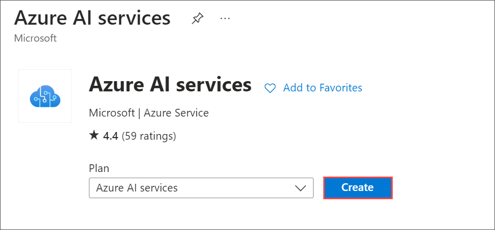
   
1. Especifique los siguientes detalles para crear un recurso de **Azure AI Service**, luego haga clic en la pestaña **Revisar y crear (7)**.
   
   | **Opción**         | **Valor**                                              |
   | ------------------ | -----------------------------------------------------  |
   | Suscripción       | Deje el valor predeterminado  **(1)**                                 |
   | Grupo de recursos     | **ODL-GenAI-CL-xxxxxx-Activate-GenAI**  **(2)**        |
   | Name               | *Ingrese un nombre único* para su recurso Azure AI Services o utilice el formato **challengeservice-xxxxxx** (reemplace **xxxxxx** con el valor **Deployment ID** registrado en el **Desafío 01**) **(3)** |
   | Region           | Use la misma ubicación que el grupo de recursos  **(4)**          |
   | Pricing tier       | Standard S0     **(5)**                                        |
   | By checking this box I acknowledge that I have read and understood all the terms below | Seleccione la **Casilla de verificación** **(6)**| 

    >**Nota**: Aquí, xxxxxx hace referencia al valor DeploymentID
    
    .png)
   
1. Una vez que la validación sea exitosa en la pestaña **Revisar y crear**, haga clic en **Crear** y espere a que se complete la implementación; luego, haga clic en **Ir al recurso**.

#### Tarea 2.3: Crear una cuenta de almacenamiento

En esta tarea, aprenderá a crear un recurso de **Cuenta de almacenamiento** en el portal de Azure y, en los siguientes pasos, creará un contenedor de blobs donde se almacenarán los documentos a buscar.

1. En la página del Portal de Azure, en el cuadro Buscar recursos, servicios y documentos (G+/) en la parte superior del portal, ingrese **Storage account** **(1)** y luego seleccione **Cuentas de almacenamiento** **(2)** en Servicios.

    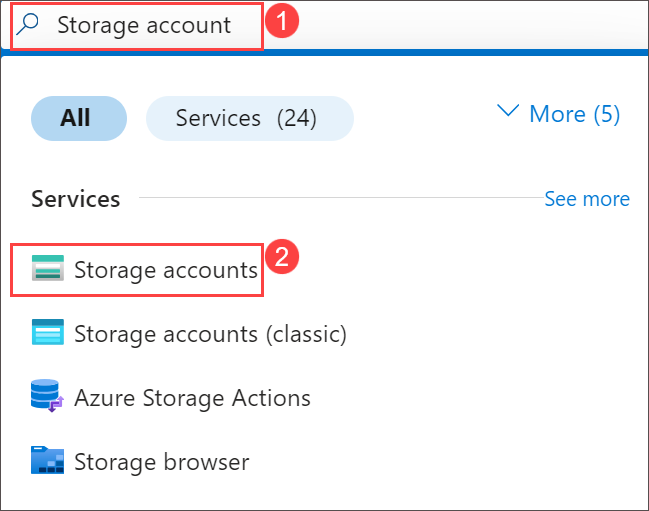

1. Haga clic en **Crear**.

    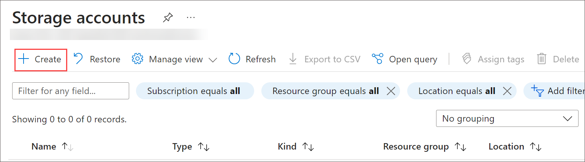
   
1. Especifique los siguientes detalles para crear una **Cuenta de almacenamiento** de Azure y luego haga clic en la pestaña **Siguiente** **(7)**.
   
   | **Opción**            | **Valor**                                              |
   | ------------------    | -----------------------------------------------------  |
   | Suscripción          | Deje el valor predeterminado **(1)**                                  |
   | Grupo de recursos        | **ODL-GenAI-CL-xxxxxx-Activate-GenAI** **(2)**         |
   | Nombre de la cuenta de almacenamiento  | *Ingrese un nombre único* para su Cuenta de almacenamiento o utilice el formato **storagexxxxxx** (reemplace **xxxxxx** con el valor **Deployment ID** registrado en el **Desafío 01**) **(3)** |
   | Región                | Use la misma ubicación que el grupo de recursos **(4)**    |
   | Rendimiento           | Estándar **(5)**                                       |
   | Redundancia           | Almacenamiento con redundancia local (LRS) **(6)**                | 

   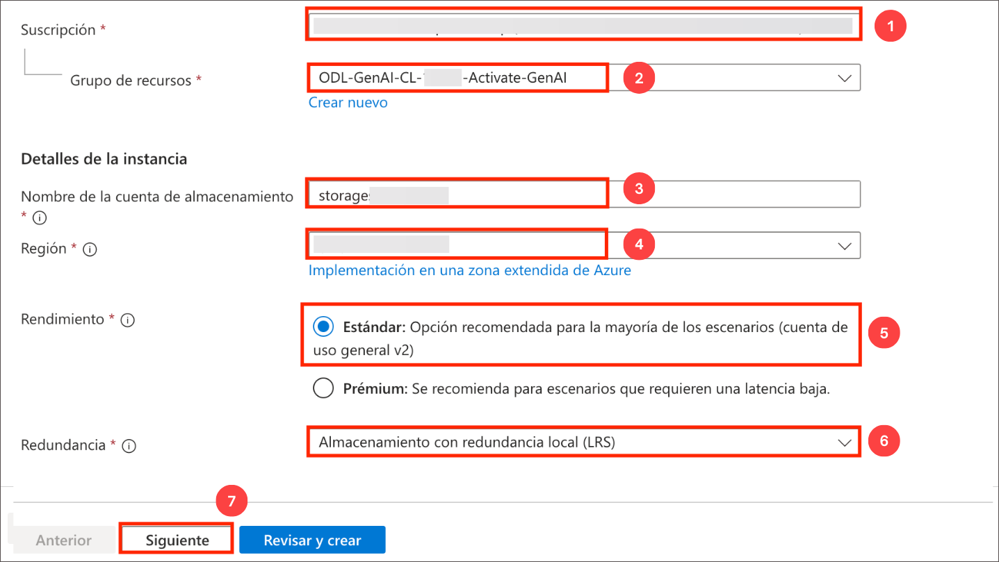

1. En la pestaña **Avanzado**, marque la casilla junto a **Permitir el acceso anónimo en contenedores individuales** y haga clic en **Revisar y crear**.

   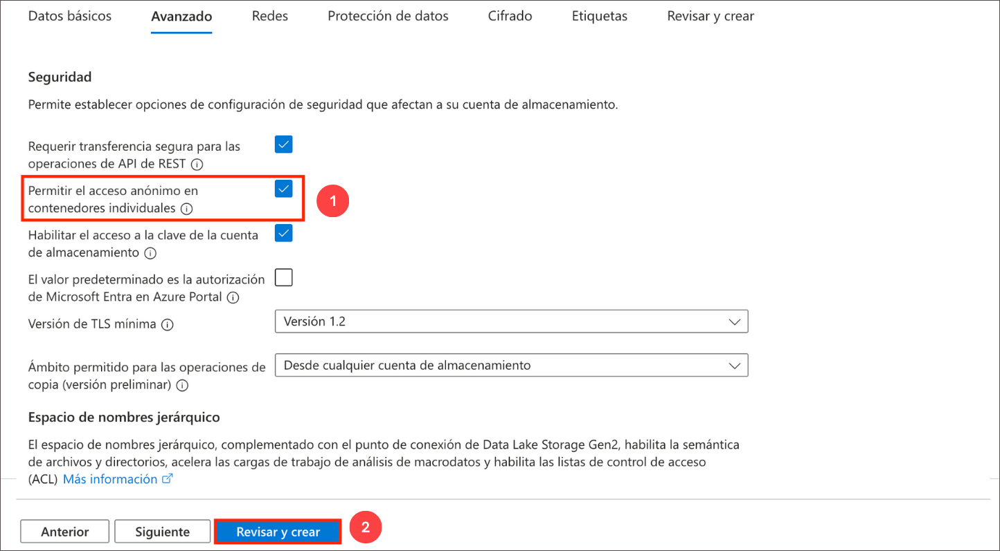

1. Una vez que la validación sea exitosa en **Revisar y crear**, haga clic en **Crear** y espere a que se complete la implementación. Haga clic en **Ir al recurso**.
      
   
      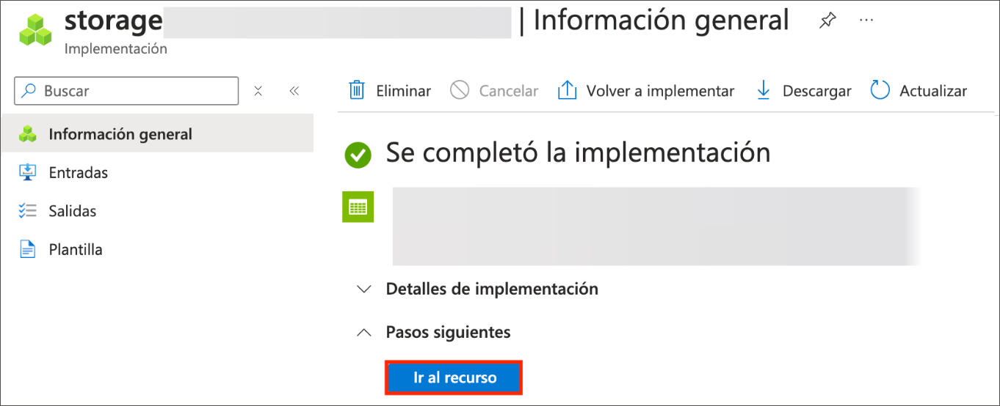
   
1. En la página **Información general**, anote el **ID de suscripción**; éste identifica la suscripción para la que se aprovisiona la cuenta de almacenamiento. 

   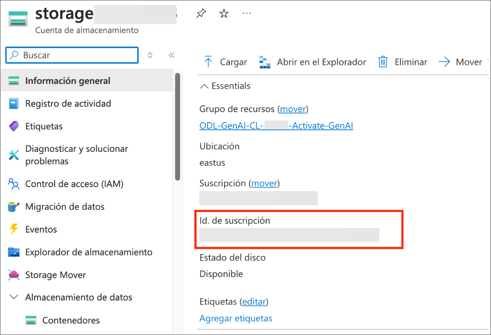

    > **Sugerencia**: Mantenga abierta la hoja **Cuenta de almacenamiento**; necesitará el ID de suscripción y una de las claves en el siguiente procedimiento.

### Tarea 3 y Tarea 4: Cargar documentos en Azure Storage y Ejecutar el script cargado

En esta tarea, navegará entre Visual Studio Code y el portal de Azure para recuperar las credenciales necesarias, actualizar un archivo por lotes y usar la CLI de Azure para cargar documentos en un contenedor de blobs en su cuenta de almacenamiento.

>**Importante**: Ahora que tiene los recursos necesarios, puede cargar algunos documentos en su Cuenta de almacenamiento de Azure.

1. Vuelva a Visual Studio Code, en el panel **Explorador**, expanda la carpeta **22-create-a-search-solution (1)** y seleccione **UploadDocs.cmd (2)**.

    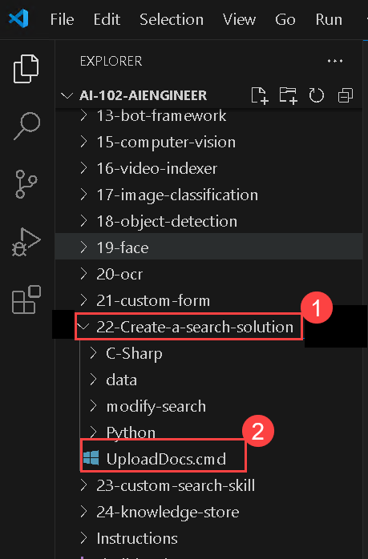
   
1. Vuelva a la pestaña del navegador que muestra **Portal de Azure**, recupere el **ID de suscripción (1)**, el **nombre de la Cuenta de almacenamiento de Azure (2)** y la **Clave de la cuenta de almacenamiento de Azure** haciendo clic en la opción **Mostrar** > **Portapapeles (3)** de la cuenta de almacenamiento creada recientemente, registre los valores en el bloc de notas.

      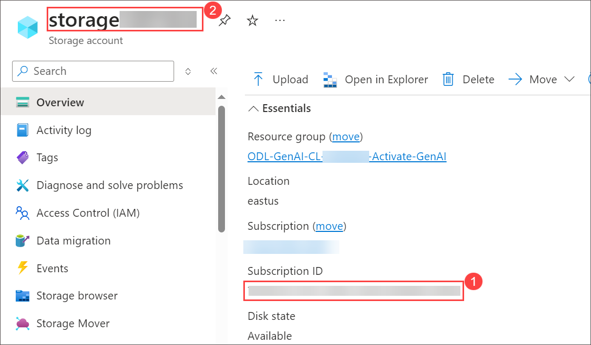
   
      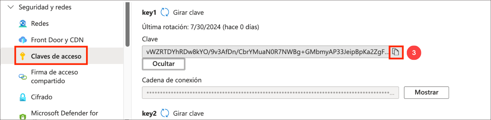
   
1. Regrese a VS Code y edite el archivo por lotes para reemplazar los marcadores de posición **YOUR_SUBSCRIPTION_ID**, **YOUR_AZURE_STORAGE_ACCOUNT_NAME** y **YOUR_AZURE_STORAGE_KEY** con los valores correspondientes que registró en el paso anterior.

    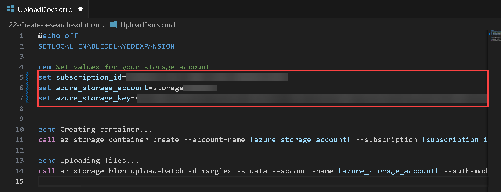
   
1. Guarde los cambios y, a continuación, haga clic con el botón derecho en la carpeta **22-create-a-search-solution (1)** > **Abrir en terminal integrado (2)**.

    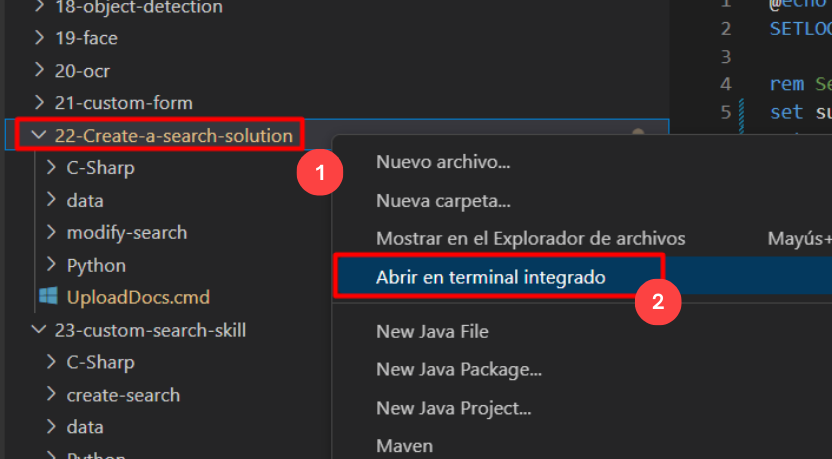

1. Ingrese el siguiente comando para iniciar sesión en su suscripción de Azure mediante la CLI de Azure:

   > **Nota**: Asegúrese de que hayamos instalado la CLI de Azure y la extensión Azure CLI Tools en Visual Studio Code.

   >**Nota**: Asegúrese de reemplazar <your-username> <your-password> con **Nombre de usuario de Azure** y **contraseña** que usó en el Desafío-1.
   
    ```
    az login --username <your-username> --password <your-password>
    ```

    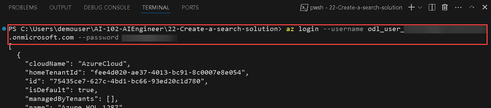
      
   > **Nota**: Se abrirá una pestaña del navegador web y le solicitará que inicie sesión en Azure. Hágalo y, a continuación, cierre la pestaña del navegador y regrese a Visual Studio Code.

1. Ingrese el siguiente comando para ejecutar el archivo por lotes. Esto creará un contenedor de blobs en su cuenta de almacenamiento y cargará los documentos en la carpeta **data**.

    ```
    .\UploadDocs
    ```

   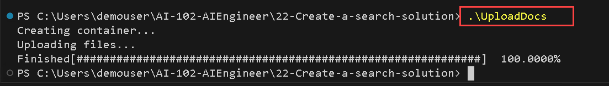

### Tarea 5: Importar e Indexar Datos:
#### Tarea 5.1: Indexar los documentos

En esta tarea, aprenderá a crear una solución de búsqueda indexando documentos ya existentes. Navegue hasta su recurso de Azure AI Search en el portal de Azure, configure el origen de datos para utilizar Azure Blob Storage, integre aptitudes cognitivas para el enriquecimiento, personalice el índice de destino y configure un indizador para procesar e indexar los documentos de manera efectiva.

>**Nota**: Ahora que ya cuenta con los documentos almacenados, puede crear una solución de búsqueda indexándolos.

1. En el portal de Azure, navegue hasta el recurso **Azure AI Search**. Luego, en la página **Información general**, seleccione **Importación de datos**.

   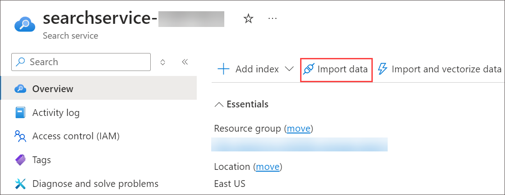

1. En la página **Conectarse a sus datos**, en la lista **Origen de datos**, seleccione **Almacenamiento de blobs de Azure**. A continuación, complete los detalles del almacén de datos con los siguientes valores:
    
    - **Origen de datos**: Almacenamiento de blobs de Azure (1)
    - **Nombre del origen de datos**: margies-data  (2)
    - **Datos que se extraerán**: Contenido y metadatos (3)
    - **Modo de análisis**: Predeterminado (4)
    - **Suscripción**: Deje el valor predeterminado (5)  
    - **Cadena de conexión**: Seleccione **Elegir una conexión existente (6)**. Luego seleccione su cuenta de almacenamiento (7), y finalmente elija el contenedor **margies (8)** que fue creado por el script UploadDocs.cmd. Finalmente, haga clic en **Seleccionar (9)**.

        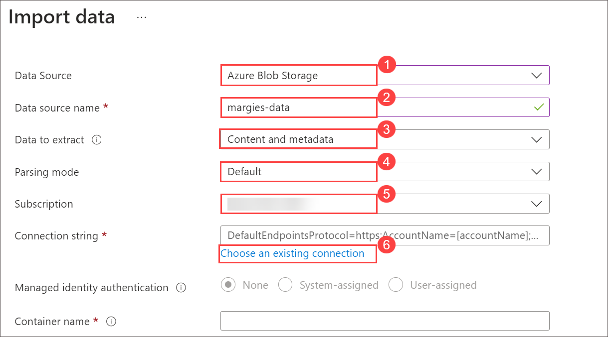

        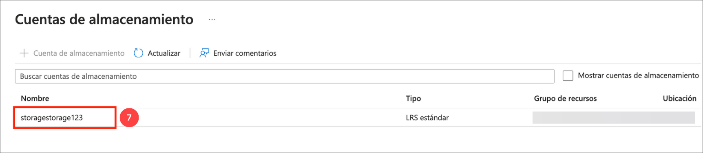

        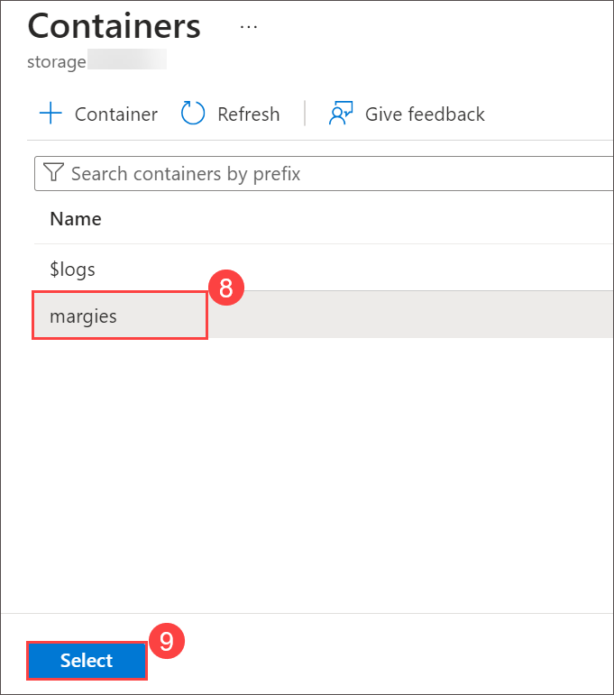
      
    - **Autenticación de identidad administrada**: Ninguna (10)
    - **Nombre del contenedor**: margies (11)
    - **Carpeta de blobs**: *Deje este campo en blanco.* (12)
    - **Descripción**: Brochures and reviews in Margie's Travel web site. (13)
    - Haga clic en **Agregar aptitudes cognitivas (opcional) (14)**

       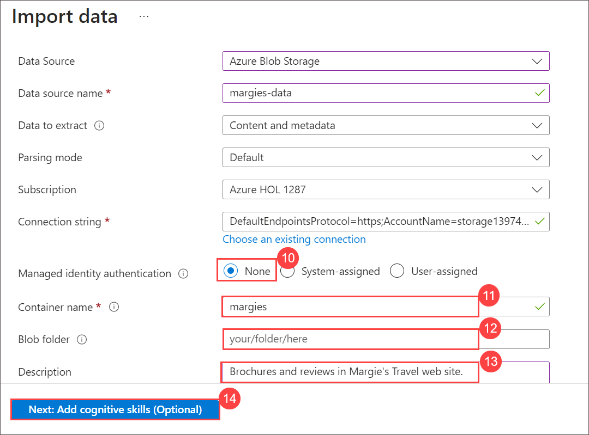

1. En la pestaña **Agregar aptitudes cognitivas (opcional)**, expanda **Asociación de servicios de IA (1)**, y, dentro de la sección, seleccione su recurso **Azure AI Services (2)**.

     
   
1. Desplácese hacia abajo y expanda la sección **Agregar enriquecimientos (1)** y especifique lo siguiente:
    
    - Cambie el **Nombre del conjunto de aptitudes** a **margies-skillset (2)**.
    - Seleccione la casilla de verificación **Habilitar OCR y combinar todo el texto en el campo merged_content (3)**.
    - Asegúrese de que el **Campo de datos de origen** esté configurado en **merged_content (4)**.
    - Deje el **Nivel de granularidad de enriquecimiento** como **Campo de origen (5)**, que establece todo el contenido del documento que se está indexando, pero tenga en cuenta que puede cambiarlo para extraer información en niveles más granulares, como páginas u oraciones.
  
      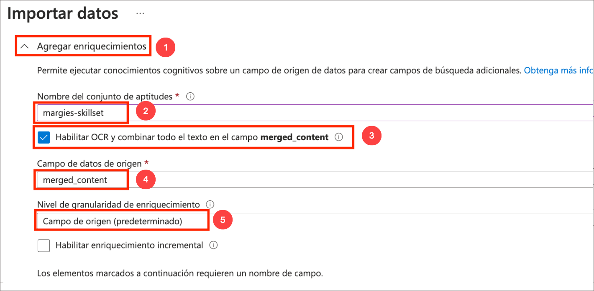

    - Seleccione los siguientes campos enriquecidos:

        | Aptitud Cognitiva | Parámetro | Nombre del Campo |
        | --------------- | ---------- | ---------- |
        | Extraer nombres de ubicaciones | | locations |
        | Extraer frases clave | | keyphrases |
        | Detectar idioma | | language |
        | Generar etiquetas a partir de imágenes | | imageTags |
        | Generar leyendas a partir de imágenes | | imageCaption |

        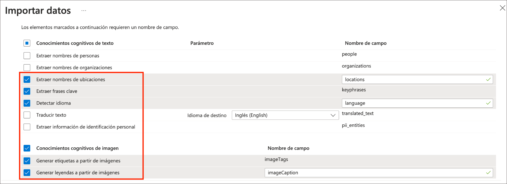
      
1. Vuelva a verificar sus selecciones (puede ser difícil cambiarlas más tarde). Luego, proceda al siguiente paso (*Personalizar índice de destino*). 

   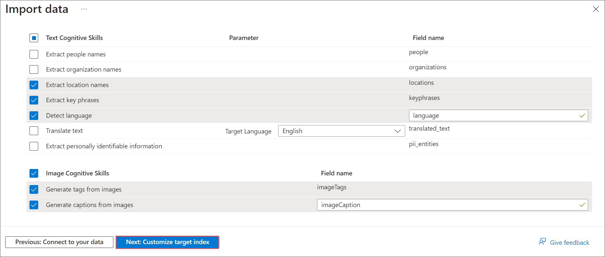
  
1. En la pestaña **Personalizar índice de destino**, cambie el **Nombre del índice** a **margies-index (1)**.
   
1. Asegúrese de que la **Clave** esté configurada en **metadata_storage_path (2)** y deje el **Nombre del proveedor de sugerencias** en blanco y el **Modo de búsqueda (3)** en su valor predeterminado.

    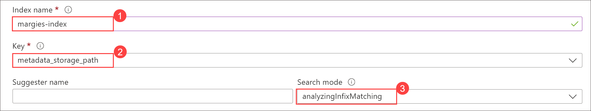
   
1. Realice los siguientes cambios en los campos de índice, dejando todos los demás campos con sus configuraciones predeterminadas (**IMPORTANTE**: es posible que deba desplazarse hacia la derecha para ver la tabla completa):

    | Nombre de campo | Recuperable | Filtrable | Ordenable | Clasificable | Buscable |
    | ---------- | ----------- | ---------- | -------- | --------- | ---------- |
    | metadata_storage_size | &nbsp;&nbsp;&nbsp;&nbsp;&nbsp;&nbsp;&#10004; | &nbsp;&nbsp;&nbsp;&nbsp;&nbsp;&nbsp;&#10004; | &nbsp;&nbsp;&nbsp;&nbsp;&nbsp;&nbsp;&#10004; | | |
    | metadata_storage_last_modified | &nbsp;&nbsp;&nbsp;&nbsp;&nbsp;&nbsp;&#10004; | &nbsp;&nbsp;&nbsp;&nbsp;&nbsp;&nbsp;&#10004; | &nbsp;&nbsp;&nbsp;&nbsp;&nbsp;&nbsp;&#10004; | | |
    | metadata_storage_name | &nbsp;&nbsp;&nbsp;&nbsp;&nbsp;&nbsp;&#10004; | &nbsp;&nbsp;&nbsp;&nbsp;&nbsp;&nbsp;&#10004; | &nbsp;&nbsp;&nbsp;&nbsp;&nbsp;&nbsp;&#10004; | | &nbsp;&nbsp;&nbsp;&nbsp;&nbsp;&nbsp;&#10004; |
    | metadata_author | &nbsp;&nbsp;&nbsp;&nbsp;&nbsp;&nbsp;&#10004; | &nbsp;&nbsp;&nbsp;&nbsp;&nbsp;&nbsp;&#10004; | &nbsp;&nbsp;&nbsp;&nbsp;&nbsp;&nbsp;&#10004; | &nbsp;&nbsp;&nbsp;&nbsp;&nbsp;&nbsp;&#10004; | &nbsp;&nbsp;&nbsp;&nbsp;&nbsp;&nbsp;&#10004; |
    | locations | &nbsp;&nbsp;&nbsp;&nbsp;&nbsp;&nbsp;&#10004; | &nbsp;&nbsp;&nbsp;&nbsp;&nbsp;&nbsp;&#10004; | | | &nbsp;&nbsp;&nbsp;&nbsp;&nbsp;&nbsp;&#10004; |
    | keyphrases | &nbsp;&nbsp;&nbsp;&nbsp;&nbsp;&nbsp;&#10004; | &nbsp;&nbsp;&nbsp;&nbsp;&nbsp;&nbsp;&#10004; | | | &nbsp;&nbsp;&nbsp;&nbsp;&nbsp;&nbsp;&#10004; |
    | language | &nbsp;&nbsp;&nbsp;&nbsp;&nbsp;&nbsp;&#10004; | &nbsp;&nbsp;&nbsp;&nbsp;&nbsp;&nbsp;&#10004; | | | |

    Utilice la siguiente imagen para verificar la opción.

     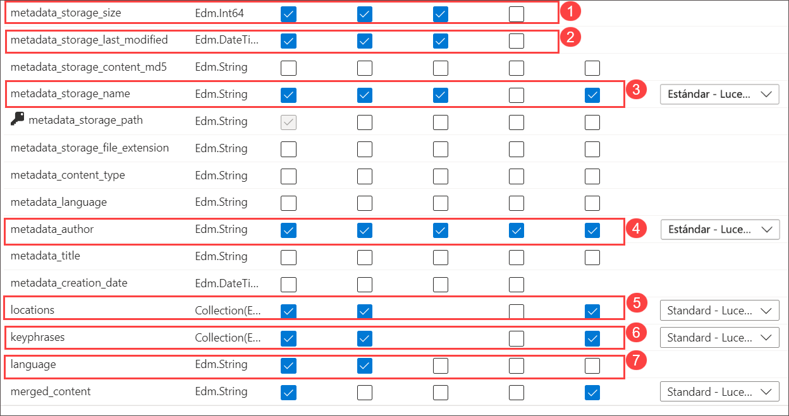
   
1. Vuelva a verificar sus selecciones, prestando especial atención para asegurarse de que las opciones **Recuperable**, **Filtrable**, **Ordenable**, **Clasificable** y **Buscable** estén seleccionadas para cada campo (puede ser difícil cambiarlas más adelante). Luego, continúe con el siguiente paso haciendo clic en **Siguiente: Crear indizador**.

1. En la pestaña **Crear indizador** especifique lo siguiente:
      - Cambie el **Nombre del indizador** a **margies-indexer (1)**.
      - Deje la **Programación** establecida en **Una vez (2)**.
      - Expanda las **Opciones avanzadas (3)** y asegúrese de que la opción **Claves de codificación Base 64 (4)** esté seleccionada (por lo general, las claves de codificación hacen que el índice sea más eficiente).
      
      - Seleccione **Enviar (5)** para crear el origen de datos, el conjunto de aptitudes, el índice y el indizador. El indizador se ejecuta automáticamente y ejecuta el pipeline de indexación, el cual:
          
          1. Extrae los campos de metadatos del documento y el contenido del origen de datos.
          2. Ejecuta el conjunto de aptitudes cognitivas para generar campos enriquecidos adicionales.
          3. Asigna los campos extraídos al índice.
      
          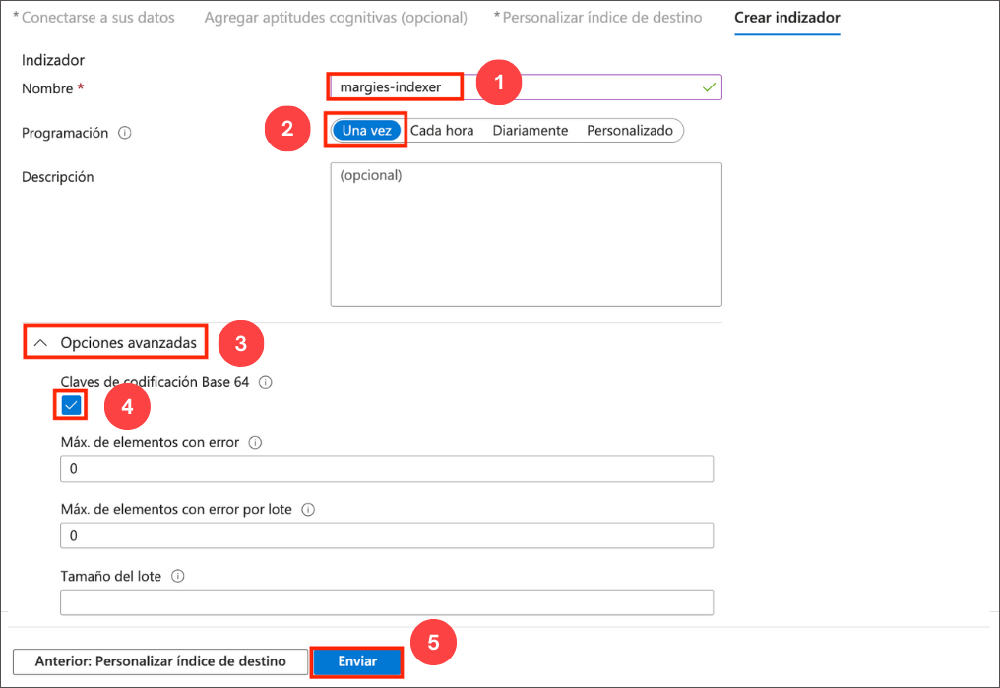  

1. En la página de recursos de **Azure AI Search**, expanda **Administración de búsquedas (1)** y seleccione **Indizadores (2)**, el cual debería mostrar el indizador **margies-indexer (3)** recién creado.

   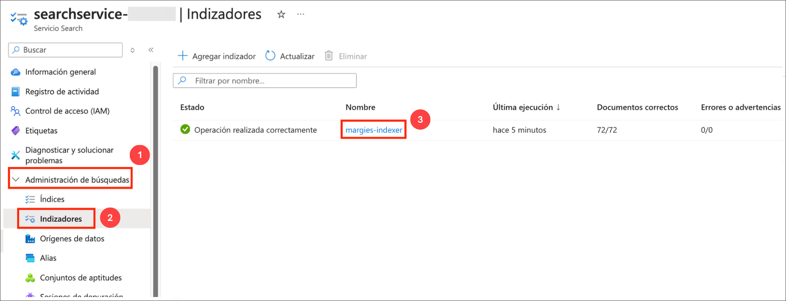  

1. Seleccione **margies-indexer** . Espere unos minutos y haga clic en **&orarr; Actualizar** hasta que el **Estado** indique que la operación se realizó correctamente.

    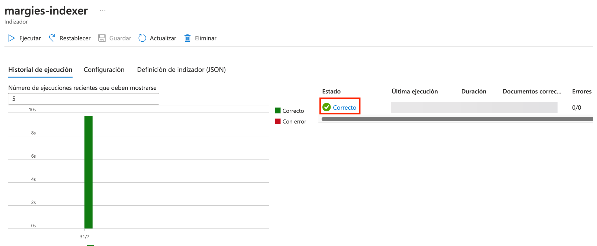 

#### Tarea 5.2: Buscar en el índice

En esta tarea, aprenderá a buscar y consultar el índice creado anteriormente:

1. En la parte superior de la página **Información general** de su recurso de Azure AI Search, seleccione **Explorador de búsqueda**

    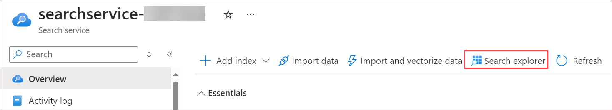
   
1. En el Explorador de búsqueda, en el cuadro **Cadena de consulta**, ingrese `*` (un solo asterisco) y luego haga clic en **Buscar**.

    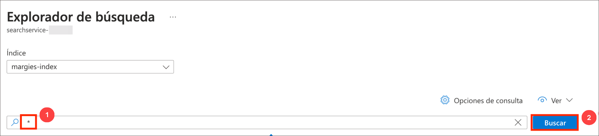

   >**Nota**: Esta consulta recupera todos los documentos del índice en formato JSON. Examine los resultados y observe los campos de cada documento, que contienen el contenido del documento, metadatos y datos enriquecidos extraídos por las aptitudes cognitivas que haya seleccionado.

1. En el menú **Ver**, seleccione **Vista JSON**.

   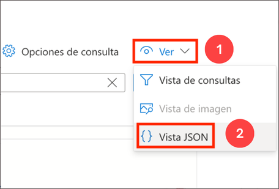

1. Observe que la solicitud JSON para la búsqueda se muestra de la siguiente manera:

    ```json
    {
      "search": "*"
    }
    ```
   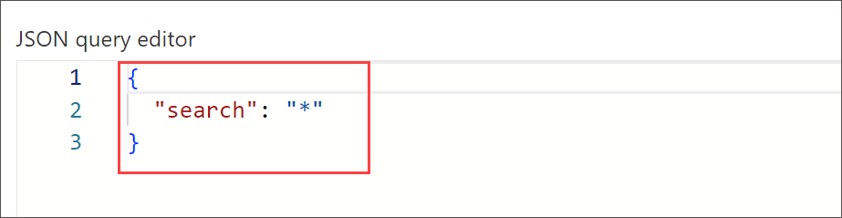
   
1. Modifique la solicitud JSON para incluir el parámetro **count**, tal como se muestra aquí:

    ```json
    {
      "search": "*",
      "count": true
    }
    ```

1. Envíe la búsqueda modificada. Esta vez, los resultados incluyen un campo **@odata.count** en la parte superior de los resultados que indica el número de documentos devueltos por la búsqueda.

1. Pruebe la siguiente consulta:

    ```json
    {
      "search": "*",
      "count": true,
      "select": "metadata_storage_name,metadata_author,locations"
    }
    ```

    >**Nota**: En esta ocasión, los resultados incluyen solo el nombre del archivo, el autor y las ubicaciones mencionadas en el contenido del documento. El nombre del archivo y el autor se encuentran en los campos **metadata_storage_name** y **metadata_author**, los cuales se extrajeron del documento fuente. El campo **locations** se generó mediante una aptitud cognitiva.

1. Ahora, pruebe la siguiente cadena de consulta:

    ```json
    {
      "search": "New York",
      "count": true,
      "select": "metadata_storage_name,keyphrases"
    }
    ```

    >**Nota**: Esta búsqueda encuentra documentos que mencionan "New York" en cualquiera de los campos buscables y devuelve el nombre del archivo y las frases clave del documento.

1. Probemos una consulta más:

    ```json
    {
      "search": "New York",
      "count": true,
      "select": "metadata_storage_name",
      "filter": "metadata_author eq 'Reviewer'"
    }
    ```

    >**Nota**: Esta consulta devuelve el nombre de archivo de cualquier documento creado por *Reviewer* que mencione "New York".

       
  
### Tarea 6: Explorar y modificar las definiciones de los componentes de búsqueda

Los componentes de la solución de búsqueda se basan en definiciones JSON, que usted puede ver y editar en el portal de Azure.

Si bien puede usar el portal para crear y modificar soluciones de búsqueda, a menudo es conveniente definir los objetos de búsqueda en JSON y usar la interfaz REST de Azure AI Service para crearlos y modificarlos.

#### Tarea 6.1: Obtener el punto de conexión y la clave para su recurso de Azure AI Search

En esta tarea, se está preparando para ejecutar comandos CURL en Visual Studio Code a fin de interactuar con la interfaz REST de Azure AI Service:

1. En el Portal de Azure, regrese a la página **Información general** de su recurso **Azure AI Search** y, en la sección superior de la página, busque la **URL** de su recurso (que tiene un aspecto similar a a **https://resource_name.search.windows.net**) y cópiela al portapapeles.

    
   
1. En Visual Studio Code, en el panel Explorador, expanda la carpeta **22-create-a-search-solution (1)** y su subcarpeta **modify-search (2)**, y seleccione **modify-search.cmd (3)** para abrirla. Usará este archivo de script para ejecutar comandos *CURL* que envían JSON a la interfaz REST de Azure AI Service.

     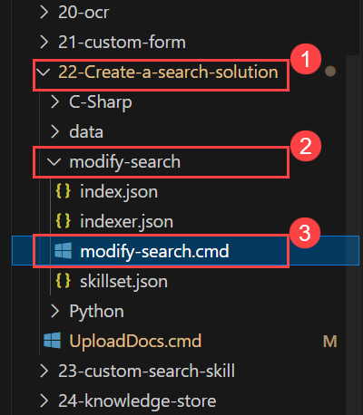
   
1. En **modify-search.cmd**, reemplace el marcador de posición **YOUR_SEARCH_URL** con la URL que copió al portapapeles.

     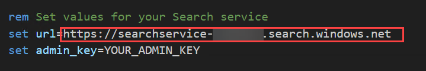
     
1. En el portal de Azure, vuelva a la página **Información general** de su recurso **Azure AI Search**, expanda **Configuración**, seleccione **Claves** y copie la **Clave de administrador principal** al portapapeles.

    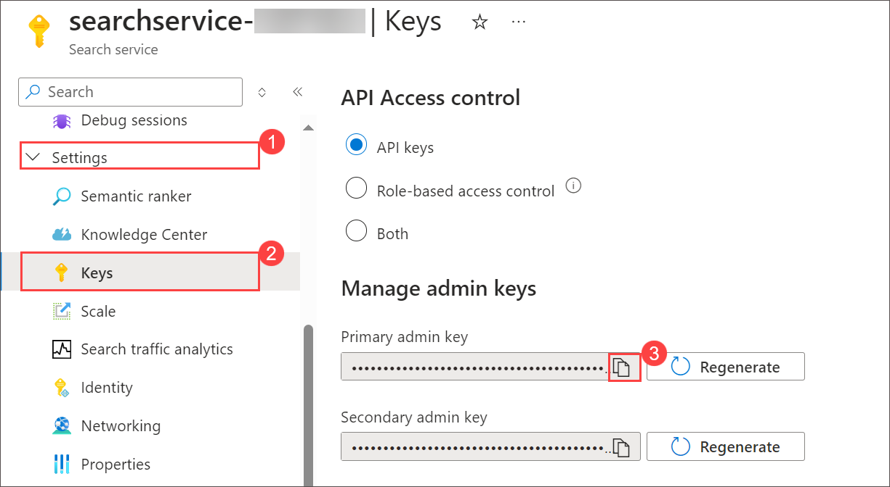
   
1. Vuelva a **Visual Studio Code**, reemplace el marcador de posición **YOUR_ADMIN_KEY** con la clave que copió al portapapeles.

      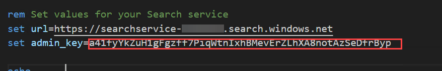
   
1. Guarde los cambios en **modify-search.cmd** (¡pero no lo ejecute todavía!)

     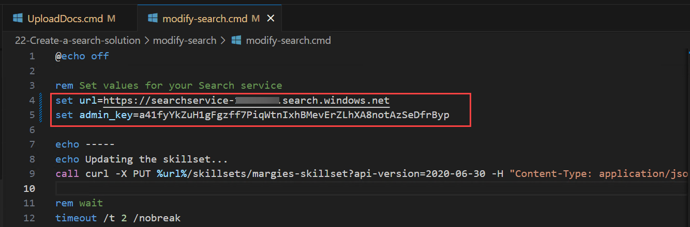
   
#### Tarea 6.2: Revisar y modificar el conjunto de aptitudes

En esta tarea, configurará un conjunto de aptitudes (skillset.json) en Visual Studio Code para integrar Azure AI Services con Azure AI Search:

1. En Visual Studio Code, en la carpeta **modify-search**, abra **skillset.json**. Esto muestra una definición JSON para **margies-skillset**.

      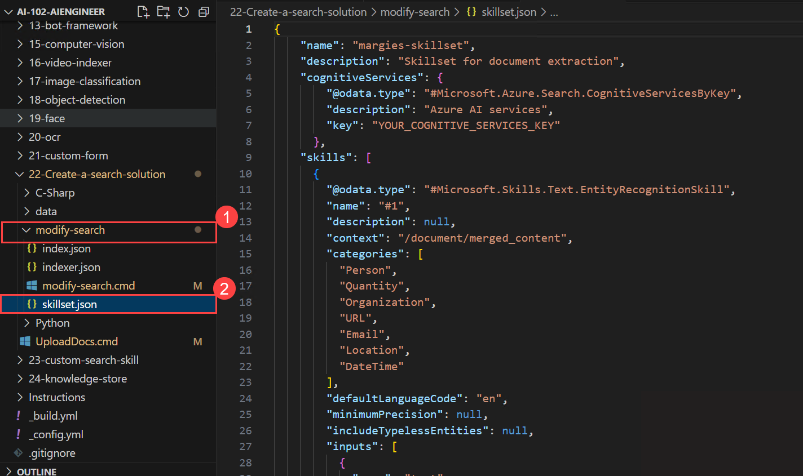
   
1. En la parte superior de la definición del conjunto de aptitudes, observe el objeto **cognitiveServices**, el cual se usa para conectar su recurso de Azure AI Services con el conjunto de aptitudes.

1. En el portal de Azure, abra su recurso de Azure AI Services (¡<u>no</u> su recurso de Azure AI Search!).

1. En la página de Información general de **Azure AI Services**, en el panel de navegación izquierdo, expanda **Administración de recursos** y seleccione **Claves y puntos de conexión**. Luego, copie **Clave 1** al portapapeles.

    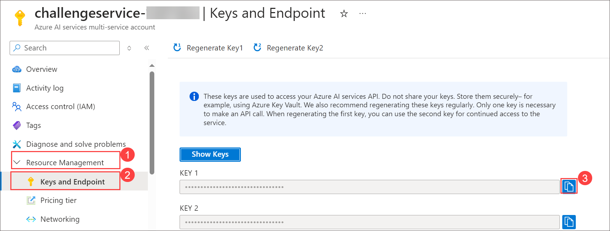
   
1. En Visual Studio Code, en **skillset.json**, reemplace el marcador de posición **YOUR_COGNITIVE_SERVICES_KEY** con la clave de Azure AI Services que copió al portapapeles.

   
   
1. Desplácese por el archivo JSON y observe que incluye definiciones de las aptitudes que creó con la interfaz de usuario de Azure AI Search en el portal de Azure. En la parte inferior de la lista de aptitudes, se ha agregado una aptitud adicional con la siguiente definición:

    ```
    {
        "@odata.type": "#Microsoft.Skills.Text.V3.SentimentSkill",
        "defaultLanguageCode": "en",
        "name": "get-sentiment",
        "description": "New skill to evaluate sentiment",
        "context": "/document",
        "inputs": [
            {
                "name": "text",
                "source": "/document/merged_content"
            },
            {
                "name": "languageCode",
                "source": "/document/language"
            }
        ],
        "outputs": [
            {
                "name": "sentiment",
                "targetName": "sentimentLabel"
            }
        ]
    }
    ```

   >**Nota**: La nueva aptitud se llama **get-sentiment**, y para cada nivel **document** en un documento, evaluará el texto encontrado en el campo **merged_content** del documento que se está indexando (el cual incluye la fuente de contenido, así como cualquier texto extraído de las imágenes en el contenido). Utiliza el **idioma** extraído del documento (con un valor predeterminado de Inglés) y evalúa una etiqueta para el sentimiento del contenido. Los valores para la etiqueta de sentimiento pueden ser "positivo", "negativo", "neutral" o "mixto". Esta etiqueta se genera como un nuevo campo llamado **sentimentLabel**.

1. Guarde los cambios que ha realizado en **skillset.json**.

#### Tarea 6.3: Revisar y modificar el índice

En esta tarea, revisará el archivo index.json en Visual Studio Code que muestra una definición JSON para **margies-index**

1. En Visual Studio Code, en la carpeta **modify-search**, abra **index.json**. Esto muestra una definición JSON para **margies-index**.

     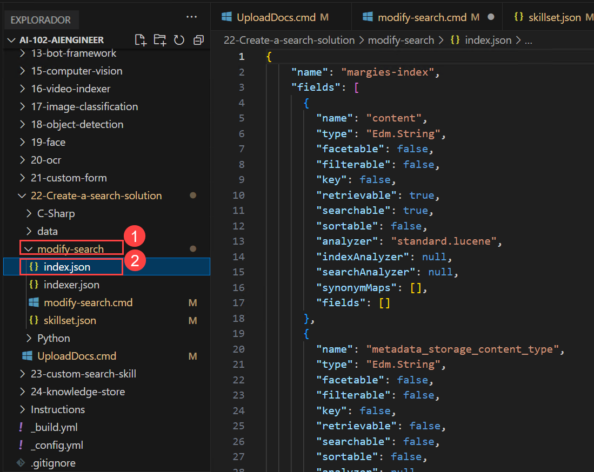
   
1. Desplácese por el índice y vea las definiciones de los campos. Algunos campos se basan en metadatos y contenido del documento fuente, y otros son el resultado de las aptitudes del conjunto de aptitudes.
1. Al final de la lista de campos que definió en el portal de Azure, observe que se han agregado dos campos adicionales:

    ```
    {
        "name": "sentiment",
        "type": "Edm.String",
        "facetable": false,
        "filterable": true,
        "retrievable": true,
        "sortable": true
    },
    {
        "name": "url",
        "type": "Edm.String",
        "facetable": false,
        "filterable": true,
        "retrievable": true,
        "searchable": false,
        "sortable": false
    }
    ```

1. El campo **sentiment** se utilizará para agregar la salida de la habilidad **get-sentiment** que se agregó al conjunto de aptitudes. El campo **url** se utilizará para agregar al índice la URL de cada documento indexado, basándose en el valor **metadata_storage_path** extraído de la fuente de datos. Tenga en cuenta que el índice ya incluye el campo **metadata_storage_path**, pero éste se utiliza como clave de índice y está codificado en Base-64, lo que lo hace eficiente como clave pero requiere que las aplicaciones cliente lo decodifiquen si desean usar el valor de URL real como campo. Agregar un segundo campo para el valor sin codificar resuelve este problema.

#### Tarea 6.4: Revisar y modificar el indizador

En esta tarea, revisará el archivo **indexer.json** en Visual Studio Code que muestra una definición JSON para **margies-index**

1. En Visual Studio Code, en la carpeta **modify-search**, abra **indexer.json**. Esto muestra una definición JSON para **margies-indexer**, que asigna los campos extraídos del contenido y los metadatos del documento (en la sección **fieldMappings**) y los valores extraídos por las aptitudes en el conjunto de aptitudes (en la sección **outputFieldMappings**) a los campos del índice.

     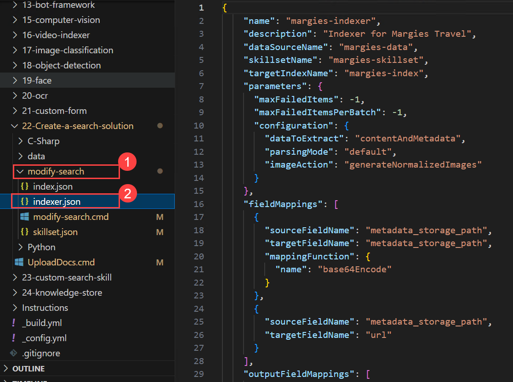
    
1. En la lista **fieldMappings**, observe la asignación del valor **metadata_storage_path** al campo de clave codificado en base 64. Esto se creó cuando se asignó **metadata_storage_path** como clave y seleccionó la opción para codificar la clave en el Portal de Azure. Además, una nueva asignación asigna explícitamente el mismo valor al campo **url**, pero sin la codificación en base 64:

    ```
    {
        "sourceFieldName" : "metadata_storage_path",
        "targetFieldName" : "url"
    }
    
    ```

    > **Nota**: Todos los demás campos de metadatos y contenido en documento fuente se asignan implícitamente a campos del mismo nombre en el índice.

1. Revise la sección **ouputFieldMappings**, la cual asigna los resultados de las aptitudes en el conjunto de aptitudes a los campos de índice. La mayoría de estos reflejan las opciones que realizó en la interfaz de usuario, pero se ha añadido la siguiente asignación para asignar el valor **sentimentLabel** extraído por su aptitud de sentimiento al campo **sentiment** que ha añadido al índice:

    ```
    {
        "sourceFieldName": "/document/sentimentLabel",
        "targetFieldName": "sentiment"
    }
    ```

#### Tarea 6.5: Usar la API REST para actualizar la solución de búsqueda

En esta tarea, actualizará las definiciones JSON en Visual Studio Code para Azure AI Search a fin de incluir nuevos campos como resultados de análisis de opiniones y URL de documentos. Ejecute modify-search.cmd para aplicar los cambios y comenzar a indexar. Supervise el progreso en la sección Indizadores del Portal de Azure para ver las advertencias de finalización y tamaño de documento durante el análisis de sentimientos.

1. Haga clic con el botón derecho en la carpeta **modify-search** y seleccione **Abrir en terminal integrado**.

     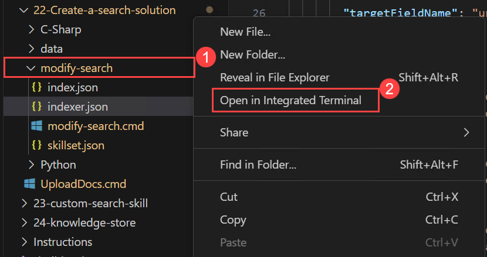
   
1. En el panel de terminal de la carpeta **modify-search**, ingrese el siguiente comando para ejecutar el script **modify-search.cmd**, el cual envía las definiciones JSON a la interfaz REST e inicia la indexación.

    ```
    .\modify-search
    ```

1. Cuando el script haya terminado, regrese a la página **Información general** de su recurso **Azure AI Search**. Desde el panel de navegación izquierdo, expanda **Administración de búsquedas** y seleccione **Indizadores**. Luego, haga clic periódicamente en **Actualizar** para realizar un seguimiento del progreso de la operación de indexación. Puede tardar aproximadamente un minuto en completarse.

   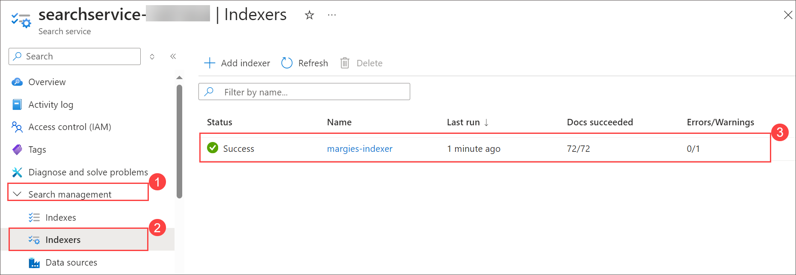

    >**Nota**: Puede haber algunas advertencias para algunos documentos que son demasiado grandes para evaluar el sentimiento. A menudo, el análisis de sentimientos se realiza a nivel de página u oración en lugar de a nivel de documento completo, pero en este escenario, la mayoría de los documentos, en particular las reseñas de hoteles, son lo suficientemente breves como para que se puedan evaluar los puntajes de sentimiento a nivel de documento.

#### Tarea 6.6: Consultar el índice modificado
En esta tarea, realizará una consulta en Azure AI Search para recuperar las URL, el sentimiento y las frases clave de los documentos que mencionan "London" con un sentimiento positivo, creados por "Reviewer".

1. En la parte superior de la hoja de su recurso de Azure AI Search, seleccione **Explorador de búsqueda**.
1. En el Explorador de búsqueda, en el cuadro **Cadena de consulta**, envíe la siguiente consulta JSON:

    ```json
    {
      "search": "London",
      "select": "url,sentiment,keyphrases",
      "filter": "metadata_author eq 'Reviewer' and sentiment eq 'positive'"
    }
    ```

    Esta consulta recupera los campos **url**, el **sentiment** y **keyphrases** de todos los documentos que mencionan *London* creados por *Reviewer* que tienen una etiqueta **sentiment** positiva (en otras palabras, reseñas positivas que mencionan a la ciudad de Londres).

1. Cierre la página **Explorador de búsqueda** para volver a la página **Información general**.

### Tarea 7: Crear una aplicación cliente de búsqueda

Ahora que tiene un índice útil, puede utilizarlo desde una aplicación cliente. Puede hacerlo consumiendo la interfaz REST, enviando peticiones y recibiendo respuestas en formato JSON a través de HTTP, o puede usar el kit de desarrollo de software (SDK) para su lenguaje de programación preferido. En este ejercicio, utilizaremos el SDK.

> **Nota**: Puede elegir usar el SDK para **C#** o **Python**. En los pasos a continuación, realice las acciones correspondientes a su lenguaje preferido.

#### Tarea 7.1: Obtener el punto de conexión y las claves para su recurso de búsqueda

En esta tarea, recuperará la URL del punto de conexión y las claves para su recurso de Azure AI Search desde el portal de Azure, algo esencial para administrar y consultar sus recursos de búsqueda en las próximas tareas.

1. En el portal de Azure, vuelva a **Azure AI Search**. En la página Información general del recurso **Azure AI Search**, observe el valor de la URL, el cual debe tener un aspecto similar a **https://your_resource_name.search.windows.net**. Por favor registre este valor en el Bloc de notas, ya que será necesario en las próximas tareas.

    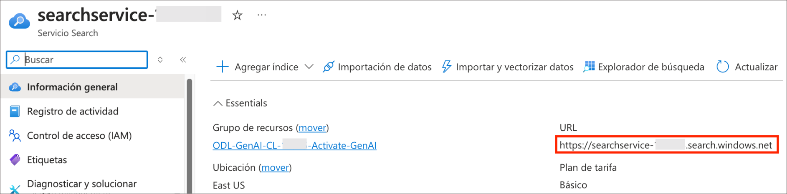
   
1. En la navegación izquierda, expanda **Configuración** y seleccione **Claves**. Observe que hay dos claves **admin** y una sola clave **Administrar claves de consulta**.

   >**Nota**: Se utiliza una clave *admin* para crear y administrar recursos de búsqueda
   >**Nota**: Una clave *Administrar claves de consulta* es utilizada por aplicaciones cliente que sólo necesitan realizar consultas de búsqueda.

    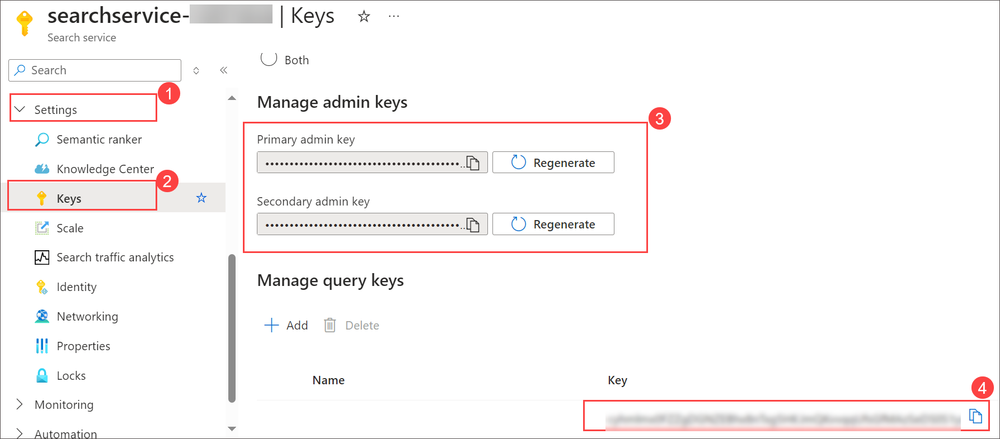

1.  Por favor copie la clave **Administrar claves de consulta** en el portapapeles y regístrela en el Bloc de notas, ya que será necesaria para las próximas tareas.

     
    
#### Tarea 7.2: Preparar el uso del SDK de Azure AI Search

En esta tarea, preparará su entorno de desarrollo en Visual Studio Code para integrarlo con Azure AI Search SDK instalando los paquetes necesarios (Azure.Search.Documents para C# o azure-search-documents para Python) y configurando la URL del punto de conexión y la clave de consulta en los archivos de configuración respectivos.

1. En Visual Studio Code, en el panel **Explorador**, navegue hasta la carpeta **22-create-a-search-solution** y expanda la carpeta **C-Sharp** o **Python** según el lenguaje que prefiera.
1. Haga clic con el botón derecho en la carpeta **margies-travel** y abra una terminal integrada. Luego, instale el paquete Azure AI Search SDK ejecutando el comando apropiado para su lenguaje de preferencia.
   > **Nota**: Asegúrese de que las extensiones necesarias ya estén instaladas en VS Code.

    **C#**
    
    ```
    dotnet add package Azure.Search.Documents --version 11.1.1
    ```
    **Python**
    
    ```
    pip install azure-search-documents==11.0.0
    ```
    
1. Vea el contenido de la carpeta **margies-travel** y observe que contiene un archivo para los ajustes de configuración:
    - **C#**: appsettings.json
    - **Python**: .env

1. Abra el archivo de configuración y actualice **YOUR_SEARCH_ENDPOINT** con la *URL del Punto de conexión* de **Azure AI Search** y los valores **YOUR_SEARCH_QUERY_KEY** con **Manage query keys** que registró en tareas anteriores, y guarde los cambios.

    - **C#**: appsettings.json

       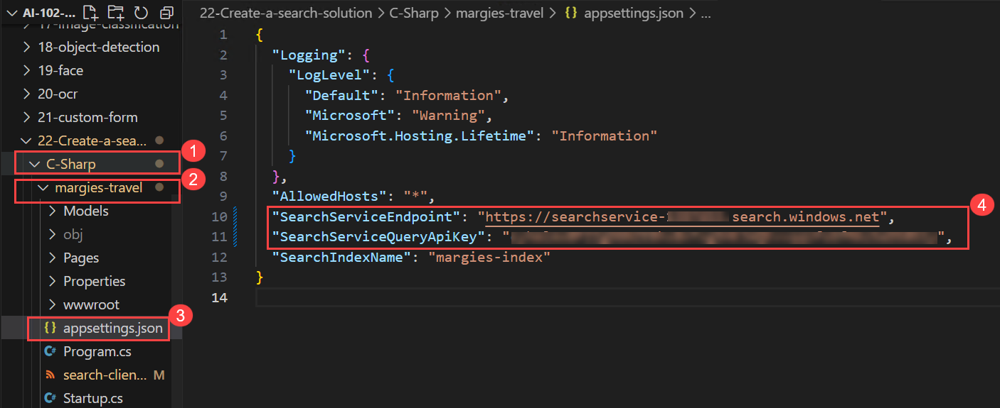

    - **Python**: .env
  
      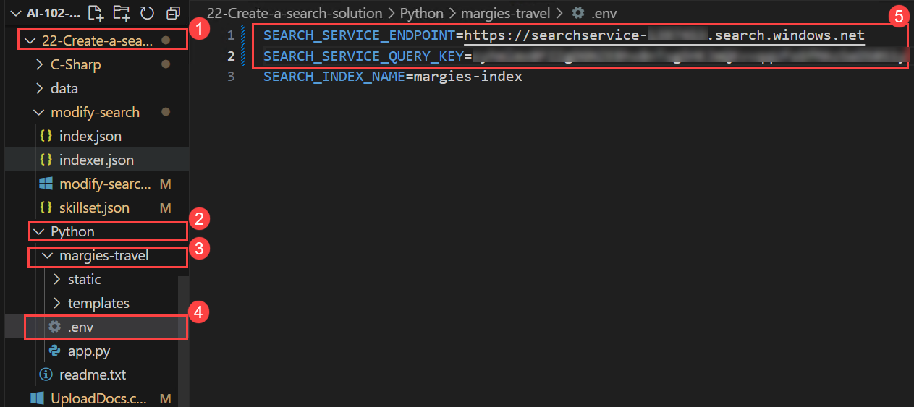

#### Tarea 7.3: Explorar el código para buscar en un índice

En esta tarea, explorará el código de una aplicación web (C# ASP.NET Razor o Python Flask) dentro de la carpeta margies-travel. Revisará cómo interactúa con el SKD de Azure AI Search para realizar consultas de búsqueda, configurar clientes de búsqueda y administrar resultados de búsqueda, incluido el filtrado, el ordenamiento y el resaltado de campos de contenido.

La carpeta **margies-travel** contiene archivos de código para una aplicación web (una aplicación web Microsoft C# *ASP.NET Razor* o una aplicación Python *Flask*), que incluye la funcionalidad de búsqueda.

1. Abra el siguiente archivo de código en la aplicación web, según el lenguaje de programación que haya elegido:
    - **C#**:Pages/Index.cshtml.cs
    - **Python**: app.py

1. Cerca de la parte superior del archivo de código, busque el comentario **Import search namespaces** y observe los espacios de nombres que se importaron para trabajar con el SDK de Azure AI Search:

1. En la función **search_query**, busque el comentario **Create a search client** y observe que el código crea un objeto **SearchClient** utilizando el punto de conexión y la clave de consulta para su recurso de Azure AI Search:
   
1. En la función **search_query**, busque el comentario **Submit search query** y revise el código para enviar una búsqueda del texto especificado con las siguientes opciones:
    - Un *modo de búsqueda* que requiere que se encuentren **todas** las palabras individuales en el texto de búsqueda.
    - El número total de documentos encontrados por la búsqueda se incluye en los resultados.
    - Los resultados se filtran para incluir solo los documentos que coinciden con la expresión de filtro proporcionada.
    - Los resultados se ordenan según el orden de clasificación especificado.
    - Cada valor discreto del campo **metadata_author** se devuelve como una *faceta* que se puede usar para mostrar valores predefinidos para el filtrado.
    - Se incluyen en los resultados hasta tres extractos de los campos **merged_content** e **imageCaption** con los términos de búsqueda resaltados.
    - Los resultados incluyen solo los campos especificados.

#### Tarea 7.4: Explorar el código para representar los resultados de la búsqueda

En esta tarea, profundizará en el código de la aplicación web (ya sea C# ASP.NET Razor o Python Flask) para comprender cómo presenta los resultados de búsqueda:

La aplicación web ya incluye código para procesar y representar los resultados de búsqueda.

1. Abra el siguiente archivo de código en la aplicación web, según el lenguaje de programación que haya elegido:
    - **C#**:Pages/Index.cshtml
    - **Python**: templates/search.html
1. Examine el código que muestra la página en la que se despliegan los resultados de la búsqueda. Observe que:
    - La página comienza con un formulario de búsqueda que el usuario puede utilizar para enviar una nueva búsqueda (en la versión Python de la aplicación, este formulario se define en la plantilla **base.html**), a la cual se hace referencia al principio de la página.
    - A continuación, se muestra un segundo formulario que permite al usuario refinar los resultados de la búsqueda. El código para este formulario:
        - Recupera y muestra el recuento de documentos de los resultados de la búsqueda.
        - Recupera los valores de faceta para el campo **metadata_author** y los muestra como una lista de opciones para filtrar.
        - Crea una lista desplegable de opciones de ordenación para los resultados.
    - A continuación, el código itera a través de los resultados de la búsqueda y muestra cada resultado de la siguiente manera:
        - Muestra el campo **metadata_storage_name** (nombre del archivo) como un enlace a la dirección en el campo **url**.
        - Muestra *lo más destacado* de los términos de búsqueda encontrados en los campos **merged_content** e **imageCaption** para ayudar a mostrar los términos de búsqueda en contexto.
        - Muestra los campos **metadata_author**, **metadata_storage_size**, **metadata_storage_last_modified** y **language**.
        - Muestra la etiqueta **sentiment** para el documento. Puede ser positiva, negativa, neutra o mixta.
        - Muestra las primeras cinco **frases clave** (si las hay).
        - Muestra las primeras cinco **ubicaciones** (si las hay).
        - Muestra las primeras cinco **etiquetas de imagen** (si las hay).


#### Tarea 7.5: Ejecutar la aplicación web

En esta tarea, ejecutará la aplicación web Margie's Travel de forma local, buscando términos específicos como "London hotel" y "quiet hotel in New York", refinando los resultados de búsqueda utilizando filtros y opciones de clasificación según el sentimiento, observando la identificación de palabras clave y ubicación en los documentos.


 1. Regrese a la terminal integrada de la carpeta **margies-travel** e ingrese el siguiente comando para ejecutar el programa:
    
    **C#**
    
    ```
    dotnet run
    ```
    > **Nota:** Si el comando falla, haga clic en el enlace provisto en el mensaje de error para descargar la última versión de Microsoft ASP.NET Core Shared Framework. Luego, descargue e instale .NET Core y entonces ejecute el comando nuevamente.
        
    **Python**
     
    ```
    flask run
    ```
    > **Nota:** Si el comando falla, **ejecute el comando pip install python-dotenv** y luego vuelva a ejecutar el comando.

1. Abra otra pestaña en el navegador Edge siguiendo el enlace (*http://localhost:5000/* o *http://127.0.0.1:5000/*) para abrir el sitio **Margie's Travel** en un navegador web.

    
   
1. En el sitio web **Margie's Travel**, ingrese **London hotel (1)** en el cuadro de búsqueda y haga clic en **Search (2)**.

    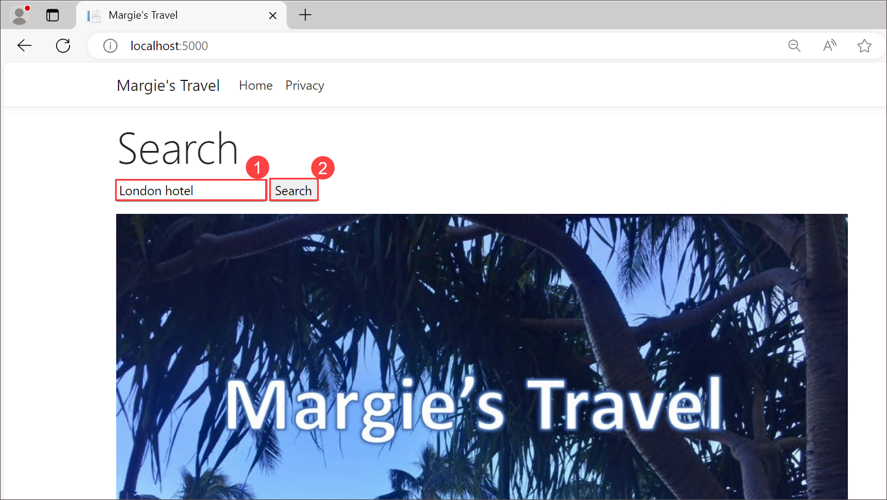
   
1. Revise los resultados de la búsqueda. Incluyen el nombre del archivo (con un hipervínculo a la URL del archivo), un extracto del contenido del archivo con los términos de búsqueda (*London* y *hotel*) resaltados y otros atributos del archivo procedentes de los campos de índice.

    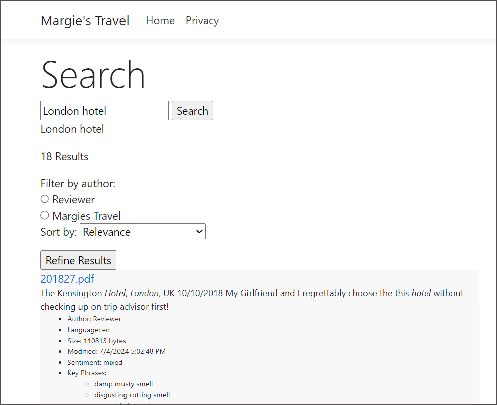
   
1. Observe que la página de resultados incluye algunos elementos de la interfaz de usuario que le permiten refinar los resultados. Estos incluyen:
    
    - Un *Filtro por autor (Filter by author)* basado en un valor de faceta para el campo **metadata_author**. Esto demuestra cómo puede usar campos *clasificables* para devolver una lista de *facetas* - campos con un pequeño conjunto de valores discretos que se pueden mostrar como posibles valores de filtro en la interfaz de usuario.
    
    - Una capacidad **Ordenar por (Sort by)** para *ordenar* los resultados de acuerdo a un campo específico y una dirección de ordenamiento (ascendente o descendente). El orden predeterminado se basa en la *relevancia*, la cual se calcula como un valor **search.score()** basado en un *perfil de puntuación* que evalúa la frecuencia e importancia de los términos de búsqueda en los campos de índice.

1. Seleccione el filtro **Reviewer** y la opción de ordenación **Positive to negative** y, a continuación, seleccione **Refine Results**.

     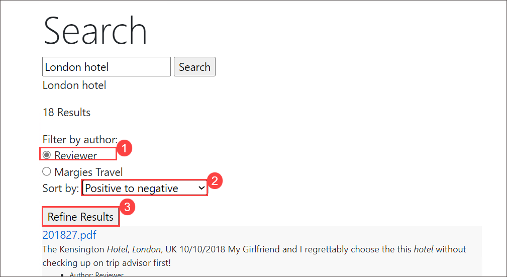
   
1. Observe que los resultados están filtrados para incluir solo reseñas y están ordenados según la etiqueta de sentimiento.
   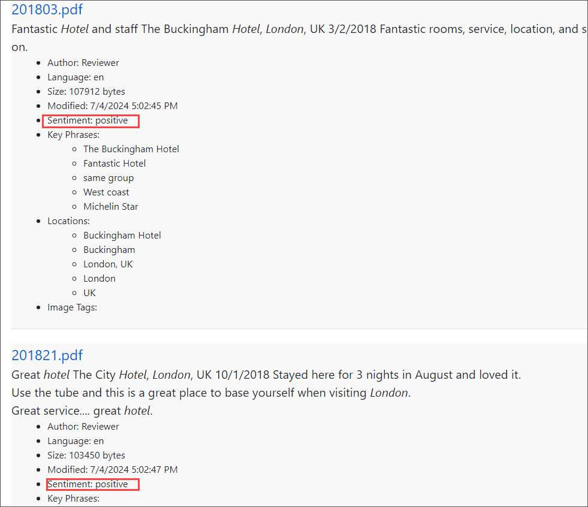
   
1. En el sitio web **Margie's Travel**, ingrese **quiet hotel in New York (1)** en el cuadro de búsqueda y haga clic en **Search (2)**.

    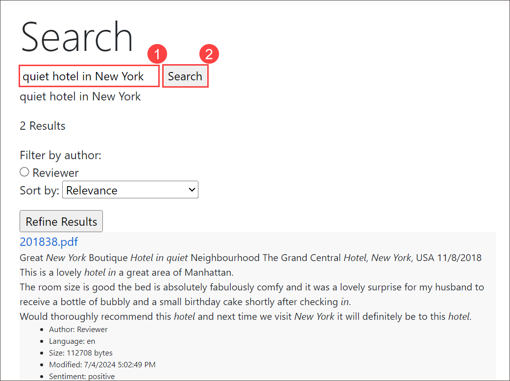
   
1. Pruebe los siguientes términos de búsqueda:
    - **Tower of London** (observe que este término se identifica como una *frase clave* en algunos documentos).
    - **skyscraper** (observe que esta palabra no aparece en el contenido real de ningún documento, pero se encuentra en los *títulos de las imágenes* y las *etiquetas de las imágenes* que se generaron para las imágenes en algunos documentos).
    - **Mojave desert** (observe que este término se identifica como una *ubicación* en algunos documentos).

1. Cierre la pestaña del navegador que contiene el sitio web Margie's Travel y regrese a Visual Studio Code. Luego, en la terminal de Python para la carpeta **margies-travel** (donde se ejecuta la aplicación dotnet o flask), ingrese Ctrl+C para detener la aplicación.


## Criterios de éxito:


Para completar este desafío con éxito, debe:

   - Implementar el Servicio Azure AI Search y Azure Storage Account.
   - Agregar datos a la cuenta de almacenamiento.
   - Indexar los documentos en Azure AI Search mediante el portal de Azure.
   - Personalizar el índice y configurar el indexador en Azure AI Search.
   - Modificar y explorar los componentes de búsqueda mediante definiciones JSON.
   - Utilizar el SDK de Azure AI Search para crear una aplicación cliente para búsquedas.
   - Ejecutar la aplicación web localmente, realizar búsquedas y refinar los resultados de búsqueda de forma eficaz.


## Recursos Adicionales:

- Consulte [¿Qué es Azure AI Search?](https://learn.microsoft.com/en-us/azure/search/search-what-is-azure-search) como referencia.
- [¿Qué son los Índices en Azure AI Search?](https://learn.microsoft.com/en-us/azure/search/search-what-is-an-index)
- [Búsqueda de texto de documentos a escala mediante Azure Cognitive Search](https://benalexkeen.com/searching-document-text-at-scale-using-azure-cognitive-search/)

Para aprender más acerca de Azure AI Search, vea la [documentación de Azure AI Search](https://docs.microsoft.com/azure/search/search-what-is-azure-search).

## Continúe con el próximo Desafío haciendo clic en **Siguiente**>>.
