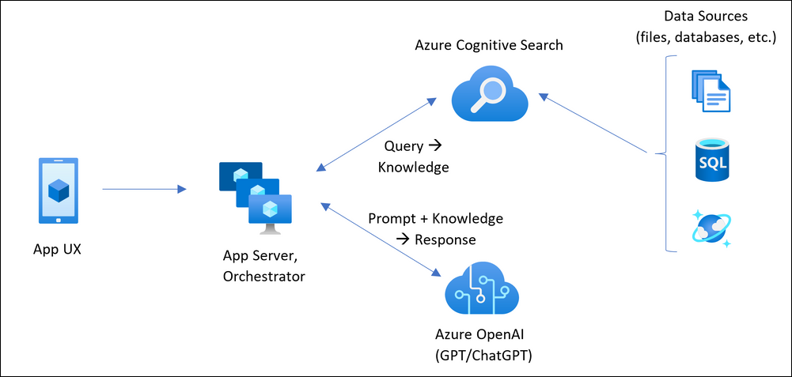

# Challenge 03:  Deploy an AI-Powered Chat App 

### Estimated Time: 150 minutes

## Introduction:

In this challenge, you'll deploy an AI-powered chat application specifically designed for Contoso Electronics. This app, built with React for the frontend and Python for the backend, showcases advanced features like chat and Q&A interfaces, all augmented by AI capabilities. It's an excellent opportunity for you to explore the integration of Azure OpenAI Service with the GPT-3.5 Turbo model and Azure Cognitive Search for efficient data indexing and retrieval.

This sample app is more than just a chat interface; it demonstrates the Retrieval-Augmented Generation pattern, offering a rich, ChatGPT-like experience over Contoso's own data. The app's features include trustworthiness evaluation of responses with citations, tracking of source content, data preparation, prompt construction, and orchestrating interaction between the ChatGPT model and Cognitive Search. You'll also find adjustable settings in the UX for experimentation and optional performance tracing and monitoring with Application Insights.

In this challenge, your task is to deploy this comprehensive chat solution for Contoso, allowing them to evaluate its capabilities and integrate it into their environment. The repository comes with sample data, representing a ready-to-use, end-to-end solution. This app is a valuable tool for Contoso's employees to inquire about company benefits, internal policies, job descriptions, and roles.

You will be using Terraform to deploy the chat app. 

The chat application integrates seamlessly with different Azure services to provide an intelligent user experience. Here's a simple overview of each service used by the app:

- **App Service:** This hosts the chat app, ensuring it can respond to the prompts sent by users from the uploaded relatable data.
- **Application Insights:** It proactively monitors the app's performance, taking care of issues before they become significant.
- **Document Intelligence:** Using AI, it understands the content in uploaded documents, making user information more insightful.
- **Azure OpenAI:** Enhances the app's capabilities with natural language understanding and responses.
- **Shared Dashboard:** Acts as a central hub for team collaboration and data sharing.
- **Smart Detector Alert Rule:** Monitors the app's health and notifies the team if any issues arise.
- **Search Service:** Empowers users with dynamic and efficient search functionality within the app.
- **Log Analytics Workspace:** Tracks and analyzes app activity, offering valuable insights and logs.
- **App Service Plan:** Optimizes resource allocation for optimal app performance.
- **Storage Account:** Securely stores the data that will be used by the Azure AI Search service to provide the inputs to the chat app.

Together, these services create a responsive chat application that combines AI features, monitoring capabilities, and efficient data management, providing Contoso with an exceptional user experience.


## Architecture diagram:



## Solution Guide:

## Task 1: Clone the repository for this Challenge

If you have not already cloned the **Activate GenAI** code repository to the environment where you're working on this lab, follow these steps to do so. Otherwise, open the cloned folder in Visual Studio Code.

1. Start Visual Studio Code.
2. Open the palette (SHIFT+CTRL+P) and run a **Git: Clone** command to clone the `https://github.com/CloudLabs-MOC/activate-genai` repository to a local folder.
3. When the repository has been cloned, open the folder in Visual Studio Code.

## Task 2: Deploy the  AI-Powered Chat App.

**Deploying the infrastructure**

1. Verify Terraform is installed on your machine by running the following command: `terraform --version`

2. Login to Azure:

```bash
az login 
```

  >**Note**: Use the command `az login --username <your-username> --password <your-password>` if above command is not work.

3. Run the following commands to deploy the infrastructure:

```bash
cd infra
terraform init
terraform apply
```

## Task 3: Azure Search Index Deployment and Uploading the Sample Data

1. Run the following commands in the same terminal to deploy the Azure Search Index and upload the sample documents:

```bash
$env:AZURE_RESOURCE_GROUP="" 
$env:AZURE_SUBSCRIPTION_ID="<subscription id>"
$env:AZURE_TENANT_ID="<azure tenant id>"
$env:AZURE_STORAGE_ACCOUNT="<storage account name>"
$env:AZURE_STORAGE_CONTAINER="content"
$env:AZURE_SEARCH_SERVICE="<search service name>"
$env:OPENAI_HOST="azure"
$env:AZURE_FORMRECOGNIZER_SERVICE="<your form recognizer name>"
$env:AZURE_OPENAI_SERVICE="<openai service name>"
$env:OPENAI_API_KEY=""
$env:AZURE_OPENAI_EMB_DEPLOYMENT="text-embedding-ada-002"
$env:AZURE_OPENAI_EMB_MODEL_NAME="text-embedding-ada-002"
$env:AZURE_SEARCH_INDEX="gptkbindex"
```

```pwsh

[System.Environment]::SetEnvironmentVariable("AZURE_RESOURCE_GROUP", "<resource group>", "Machine")
[System.Environment]::SetEnvironmentVariable("AZURE_SUBSCRIPTION_ID", "<subscription id>", "Machine")
[System.Environment]::SetEnvironmentVariable("AZURE_TENANT_ID", "<azure tenant id>", "Machine")
[System.Environment]::SetEnvironmentVariable("AZURE_STORAGE_ACCOUNT", "<storage account name>", "Machine")
[System.Environment]::SetEnvironmentVariable("AZURE_STORAGE_CONTAINER", "content", "Machine")
[System.Environment]::SetEnvironmentVariable("AZURE_SEARCH_SERVICE", "<search service name>", "Machine")
[System.Environment]::SetEnvironmentVariable("OPENAI_HOST", "azure", "Machine")
[System.Environment]::SetEnvironmentVariable("AZURE_FORMRECOGNIZER_SERVICE", "<your form recognizer name>", "Machine")
[System.Environment]::SetEnvironmentVariable("AZURE_OPENAI_SERVICE", "<openai service name>", "Machine")
[System.Environment]::SetEnvironmentVariable("OPENAI_API_KEY", "514951b5e91a4bca85c1f1240ace5cb4", "Machine")
[System.Environment]::SetEnvironmentVariable("AZURE_OPENAI_EMB_DEPLOYMENT", "text-embedding-ada-002", "Machine")
[System.Environment]::SetEnvironmentVariable("AZURE_OPENAI_EMB_MODEL_NAME", "text-embedding-ada-002", "Machine")
[System.Environment]::SetEnvironmentVariable("AZURE_SEARCH_INDEX", "gptkbindex", "Machine")
```
2. Deploy the Azure Search Index and upload the sample documents by running the following command:

```bash
../scripts/prepdocs.ps1
```

  > **Note**: The above script will create an index in the AI search service, analyze and upload the PDF data to the storage account, and integrate it with Azure OpenAI and connect it to the Azure App service with the help of Form Recogniser and Azure AI search.

## Additional Resources:

-  Refer to the  [Azure Search OpenAI demo GitHub repository](https://github.com/cmendible/azure-search-openai-demo) for detailed information on the architecture.
-  [Azure copilot](https://learn.microsoft.com/en-us/azure/copilot/overview)

