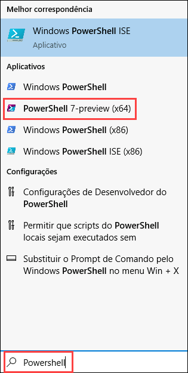
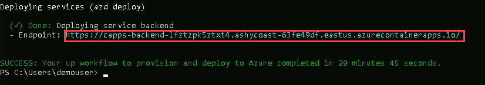

# Desafio 03:  Deploy an AI-Powered Chat App 

### Tempo Estimado: 150 minutos

### Introdução:

Neste desafio, você irá provisionar uma aplicação de chat alimentado por IA, projetado especificamente para a Contoso Electronics. Esta aplicação, desenvolvida com React para o frontend e Python para o backend, apresenta recursos avançados como interfaces de chat e perguntas e respostas, tudo aprimorado por capacidades de IA. É uma excelente oportunidade para você explorar a integração do Azure OpenAI Service com o modelo GPT-3.5 Turbo e o Azure Cognitive Search para indexação e recuperação de dados eficiente.

Esta aplicação de demonstração é mais do que apenas uma interface de chat; ela demonstra o padrão Retrieval-Augmented Generation, oferecendo uma experiência rica, semelhante ao ChatGPT, com base nos próprios dados da Contoso. Os recursos do aplicativo incluem avaliação da confiabilidade das respostas com citações, rastreamento do conteúdo de origem, preparação de dados, construção de prompts e orquestração da interação entre o modelo ChatGPT e o Cognitive Search. Você também encontrará configurações ajustáveis na interface do usuário para experimentação e rastreamento e monitorização de desempenho opcional com o Application Insights.

Neste desafio, a sua tarefa é implementar esta solução abrangente de chat para a Contoso, permitindo que eles avaliem as suas capacidades e a integrem em seu ambiente. O repositório vem com dados de demonstração, representando uma solução pronta para uso, de ponta a ponta. Esta aplicação é uma ferramenta valiosa para os funcionários da Contoso consultarem sobre benefícios da empresa, políticas internas, descrições de cargos e funções.

Você usará Bicep para provisionar a aplicação de chat.

A aplicação de chat se integra perfeitamente com diferentes serviços Azure para fornecer uma experiência inteligente ao usuário. Aqui está uma visão geral simples de cada serviço usado pela aplicação:

- **App Service:** Hospeda o aplicativo de chat, garantindo que ele possa responder aos prompts enviados pelos usuários a partir dos dados relevantes carregados.
- **Application Insights:** Monitoriza proativamente o desempenho da aplicação, cuidando dos problemas antes que se tornem significativos.
- **Document Intelligence:** Utilizando IA, compreende o conteúdo nos documentos carregados, tornando as informações do usuário mais esclarecedoras.
- **Azure OpenAI:** Melhora as capacidades do aplicativo com compreensão de linguagem natural e respostas.
- **Shared Dashboard:** Atua como um hub central para colaboração em equipe e compartilhamento de dados.
- **Smart Detector Alert Rule:** Monitoriza a saúde da aplicação e notifica a equipe caso surjam problemas.
- **Search Service:** Oferece aos usuários uma funcionalidade de busca dinâmica e eficiente dentro da aplicação.
- **Log Analytics Workspace:** Rastrea e analisa a atividade da aplicação, oferecendo insights e logs valiosos.
- **App Service Plan:** Otimiza a alocação de recursos para um desempenho ideal do aplicativo.
- **Storage Account:** Armazena com segurança os dados que serão utilizados pelo serviço Azure AI Search para fornecer as entradas ao aplicativo de chat.

Juntos, estes serviços criam uma aplicação de chat responsivo que combina recursos de IA, capacidades de monitorização e gestão eficiente de dados, proporcionando à Contoso uma experiência de usuário excepcional.

## Diagram da Arquitectura:


## Guia da Solução

## Pré-requisitos
   
1. Inicie o Powershell 7 +.
   
2. Certifique-se de executar `pwsh.exe` a partir de um terminal do PowerShell. Se isso falhar, é provável que você precise atualizar o PowerShell.

## Tarefa 1: Implementar a Applicação de chat com IA.

Nesta tarefa, você aprenderá o processo de provisionamento da Infraestrutura.

1. Usando a **LabVM**, na barra de pesquisa do Windows, digite  **Powershell** e selecione **PowerShell 7-preview (x64)** e depois **Executar como administrador**.

    

    >**Observação**: Se você não conseguir visualizar a prévia do Powershell 7. execute os comandos abaixo linha por linha no Powershell ISE para instalar o **Powershell 7-preview.**

      ```
      $PSVersionTable.PSVersion
      
      # Defina a URL para o instalador MSI mais recente do PowerShell 7 Preview
      $url = "https://github.com/PowerShell/PowerShell/releases/download/v7.4.0-preview.2/PowerShell-7.4.0-preview.2-win-x64.msi"
      
      # Defina o local para salvar o arquivo MSI
      $output = "$env:TEMP\PowerShell-7-Preview.msi"
      
      # Baixe o instalador MSI
      Invoke-WebRequest -Uri $url -OutFile $output
      
      # Instale o PowerShell 7 Preview
      Start-Process msiexec.exe -ArgumentList "/i $output /quiet" -Wait
      ```

1. Execute o seguinte comando em **PowerShell** para instalar o Azure Developer CLI. Após a instalação, reabra o **PowerShell 7-preview (x64)**.

   ```
   powershell -ex AllSigned -c "Invoke-RestMethod 'https://aka.ms/install-azd.ps1' | Invoke-Expression"
   ```
   
1. Execute o seguinte comando para fazer login no Azure:

   ```
   azd auth login
   ```

   - Após executar o comando acima, uma nova tab do navegador será aberta e solicitará que você faça login no Azure. Selecione a conta do Azure na qual você havia feito login anteriormente ou, se solicitado, forneça seu nome de usuário e senha do Azure. Uma vez que a autenticação esteja concluída, você pode retornar ao PowerShell 7.
 
   - Volte para o PowerShell 7, onde você deve ver a mensagem **Logged in to Azure**.

     

1. Uma vez logado com sucesso, execute o comando abaixo para baixar o código do projeto:

   ```
   azd init -t azure-search-openai-demo
   ```
   >**Nota**: O comando acima inicializará um repositório git, eliminando a necessidade de cloná-lo posteriormente.

1. Quando solicitado com **Continue iniatializing an app in `C:\Users\demouser`**, digite **y / yes (1)**.

   

1. Se solicitado **What would you like to do with these files?**, escolha **Overwrite with versions from template**.

   

1. Digite um novo nome de ambiente:  **activategenai**

   >**Nota**: Isso criará uma nova pasta na pasta `.azure` folder, e a definirá como o ambiente ativo para quaisquer chamadas ao azd daqui para frente.

   

1. Verifique se o novo projeto foi inicializado com sucesso.

   
   
1. Execute o comando abaixo para criar os recursos no Azure, incluindo a construção do índice de pesquisa com base nos arquivos encontrados na pasta  `./data`.

   ```
   azd up
   ```
   >**Nota**: Caso receba a seguinte mensagem: **ERROR: not logged in, run azd auth login to login** selecione sua **Azure Account** novamente.

   >**Nota**: Tenha em mente que o processo de criação dos recursos e da aplicação pode levar até 30 minutos.

1. Adicione os seguintes detalhes quando solicitado:

   - Select an Azure Subscription to use: Pressione **Enter** para escolher a **subscription (1)**
   - Select an Azure Location to use: **Select any location you would like to use (2)**
   - Enter a value for the 'documentIntelligenceResourceGroupLocation' infrastructure parameter : **Selecione qualquer localização que você gostaria de usar (3)**
   - Enter a value for the 'openAIResourceGroupLocation' infrastructure parameter: **Selecione qualquer localização que você gostaria de usar(4)**
     
      

      

1. Após a aplicação ter sido criada com sucesso, você verá uma URL no console. Copie e acesse a URL para interagir com a aplicação usando o seu navegador. A aplicação deve ter a seguinte aparência:

    
    
 
    >**Nota**: Pode levar até 30 minutos após você ver 'SUCCESS' para a aplicação estar totalmente criada. Se você vir uma tela de boas-vindas "Python Developer" ou uma página de erro, aguarde um pouco e atualize a página.

## Critério de Sucesso:

- Successful deployment of the Chat App.
- validate if the following services are successfully deployed in the RG (Resource Group).
  - App Service
  - Document Intelligence
  - Azure OpenAI
  - Shared Dashboard
  - Smart Detector Alert Rule
  - Search Service
  - Log Analytics Workspace
  - App Service Plan
  - Storage Account
- Validate if the data is populated into the storage container named `content`.
- The Chat app should be accessible using the Azure App service.

## Recursos Adicionais:

-  Consolte o repositório [Azure Search OpenAI demo](https://github.com/cmendible/azure-search-openai-demo) para informação adicional da arquitectura da aplicação.
-  [Azure copilot](https://learn.microsoft.com/en-us/azure/copilot/overview)

## Prossiga para o próximo Desafio clicando em **Next**>>.
