# Challenge 3.1:  Deploy an AI-Powered Chat App 

### Estimated Time: 90 minutes

### Introduction:

In this challenge, you'll deploy an AI-powered chat application specifically designed for Contoso Electronics. This app, built with React for the frontend and Python for the backend, showcases advanced features like chat and Q&A interfaces, all augmented by AI capabilities. It's an excellent opportunity for you to explore the integration of Azure OpenAI Service with the GPT-3.5 Turbo model and Azure Cognitive Search for efficient data indexing and retrieval.

This sample app is more than just a chat interface; it demonstrates the Retrieval-Augmented Generation pattern, offering a rich, ChatGPT-like experience over Contoso's own data. The app's features include trustworthiness evaluation of responses with citations, tracking of source content, data preparation, prompt construction, and orchestrating interaction between the ChatGPT model and Cognitive Search. You'll also find adjustable settings in the UX for experimentation and optional performance tracing and monitoring with Application Insights.

In this challenge, your task is to deploy this comprehensive chat solution for Contoso, allowing them to evaluate its capabilities and integrate it into their environment. The repository comes with sample data, representing a ready-to-use, end-to-end solution. This app is a valuable tool for Contoso's employees to inquire about company benefits, internal policies, job descriptions, and roles.

You will be using Terraform to deploy the chat app. 

The chat application integrates seamlessly with different Azure services to provide an intelligent user experience. Here's a simple overview of each service used by the app:

- **App Service:** This hosts the chat app, ensuring it can respond to the prompts sent by users from the uploaded relatable data.
- **Application Insights:** It proactively monitors the app's performance, taking care of issues before they become significant.
- **Document Intelligence:** Using AI, it understands the content in uploaded documents, making user information more insightful.
- **Azure OpenAI:** Enhances the app's capabilities with natural language understanding and responses.
- **Shared Dashboard:** Acts as a central hub for team collaboration and data sharing.
- **Smart Detector Alert Rule:** Monitors the app's health and notifies the team if any issues arise.
- **Search Service:** Empowers users with dynamic and efficient search functionality within the app.
- **Log Analytics Workspace:** Tracks and analyzes app activity, offering valuable insights and logs.
- **App Service Plan:** Optimizes resource allocation for optimal app performance.
- **Storage Account:** Securely stores the data that will be used by the Azure AI Search service to provide the inputs to the chat app.

Together, these services create a responsive chat application that combines AI features, monitoring capabilities, and efficient data management, providing Contoso with an exceptional user experience.

## Architecture diagram:

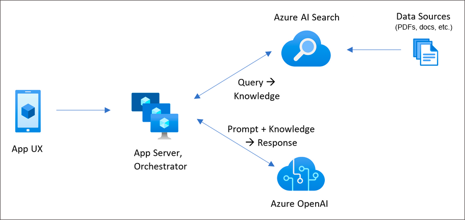

## Solution Guide:

## Prerequisite
   
1. Start Powershell 7 +.
   
2. Ensure you run `pwsh.exe` from a PowerShell terminal. If this fails, you likely need to upgrade PowerShell.

## Task 1: Deploy the  AI-Powered Chat App.

In this task, you'll learn the process of Deploying the Infrastructure.

1. In the **LabVM**, in the Windows Search bar type **Powershell** and select **PowerShell 7-preview (x64)** then **Run as Administrator**.

    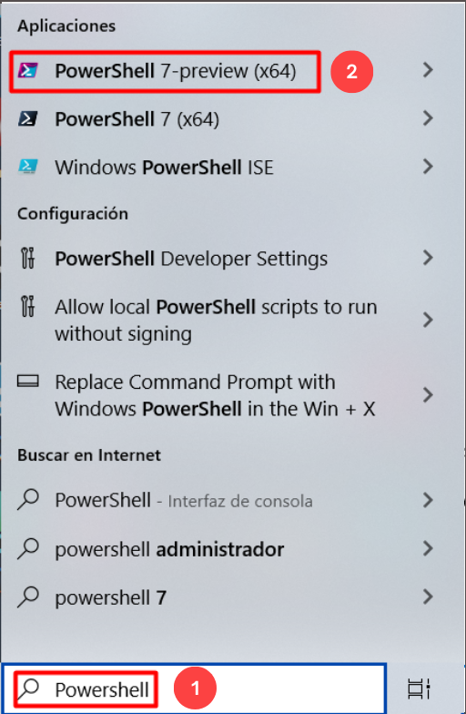

1. Run the following command to navigate to the following path:

   ```
   cd C:\Users\demouser
   ```   
   
1. Run the following command to login to Azure:

   ```
   azd auth login
   ```

   - After running the above command, a web browser tab will open and prompt you to sign into Azure. Select the Azure account you had previously logged into, or if prompted, provide your Azure username and password. Once authentication is complete, you can return to PowerShell 7.

   - Return to PowerShell 7, where you should see the message **Logged in to Azure**.

     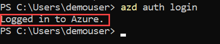

1. Once successfully logged in ,run the below command to download the project code:

   ```
   azd init -t https://github.com/CloudLabsAI-Azure/azure-search-openai-demo-nvidia
   ```
   >**Note**: The above command will initialize a git repository specific to NVIDIA LLM, eliminating the need to clone it afterwards.

1. When prompted with **Continue iniatializing an app in `C:\Users\demouser`**, type **y / yes (1)**.

   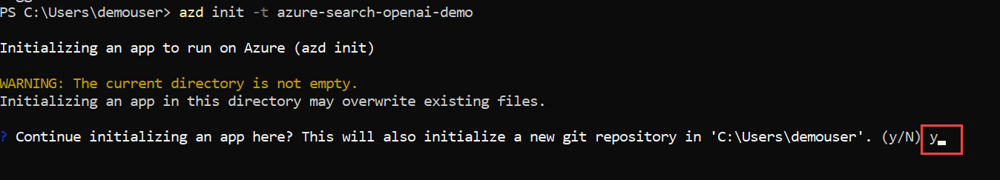

1. If **What would you like to do with these files?** prompted, choose **Overwrite with versions from template**.

   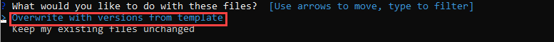

1. Enter a new environment name:  **activategenai**

   >**Note**: This will create a new folder in the `.azure` folder, and set it as the active environment for any calls to azd going forward.

   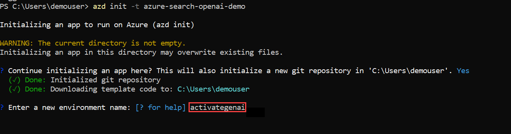

1. Verify the new project initialized is successful.

   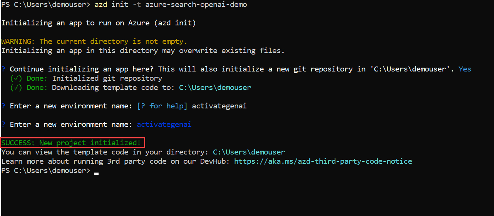

1. In the PowerShell run the following commands to set the environment variables using the azd env set command.

   ``` 
   azd env set NVIDIA_NIM_ENABLED true
   azd env set NVIDIA_NIM_ENDPOINT "<your-azureml-endpoint-token>/v1"  #Make sure to keep /v1
   azd env set NVIDIA_NIM_API_KEY "<your-azureml-key>"
   azd env set NVIDIA_NIM_MODEL_NAME "meta/llama-3.1-8b-instruct"
   azd env set NVIDIA_NIM_DEPLOYMENT_NAME llama31-8b-instruct-aml-1
   ```
   > **Note**: Replace `<your-azureml-endpoint-token>` with Azure ML endpoint and `<your-azureml-key>` with Azure ML key, also if your NIM deployment names is different then the provided one please update that too.
   
1. Run the below command to provision Azure resources and deploy the resources, including building the search index based on the files found in the `./data` folder

   ```
   azd up
   ```
   >**Note**: If prompted with the **ERROR: not logged in, run azd auth login to login** and select your **Azure Account** again.

   >**Note**: Please be aware that deploying the resources and the associated application may take up to 30 minutes.

1. Add the following details when prompted:

   - Select an Azure Subscription to use: Press **Enter** to choose the default **subscription (1)**
   - Select an Azure Location to use: **Select any location you would like to use (2)**
   - Enter a value for the 'documentIntelligenceResourceGroupLocation' infrastructure parameter: **Select any location you would like to use (3)**
   - Enter a value for the 'openAIResourceGroupLocation' infrastructure parameter: **Select any location you would like to use(4)**
     
      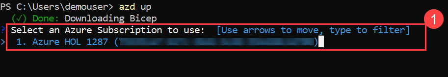

      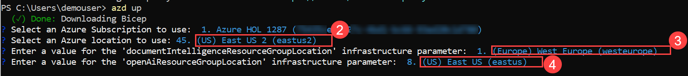

1. After the application has been successfully deployed you will see a URL printed to the console. Copy and browse the URL to interact with the application in your browser. It will look like the following:

    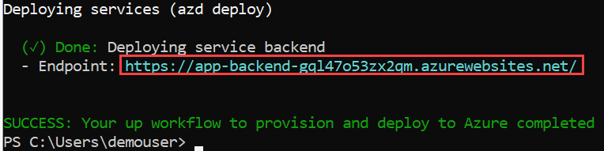
    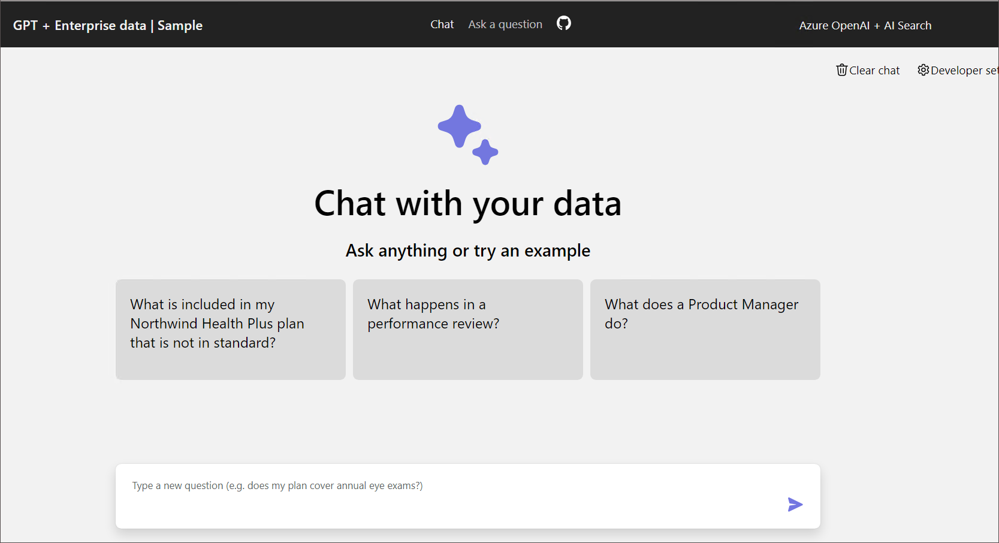
 
    >**Note**: It may take 30 minutes after you see 'SUCCESS' for the application to be fully deployed. If you see a "Python Developer" welcome screen or an error page, then wait a bit and refresh the page.

1. In the chat application, enter the prompt: **What does a Product Manager do?** and then press Enter. Click on the **Show thought process** icon.

   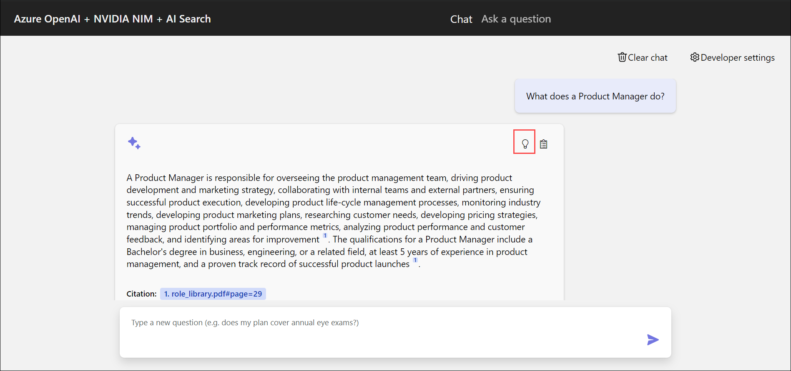

1. Below in the **Thought Process**, you will see that the **Azure OpenAI Chat** model is utilized.

   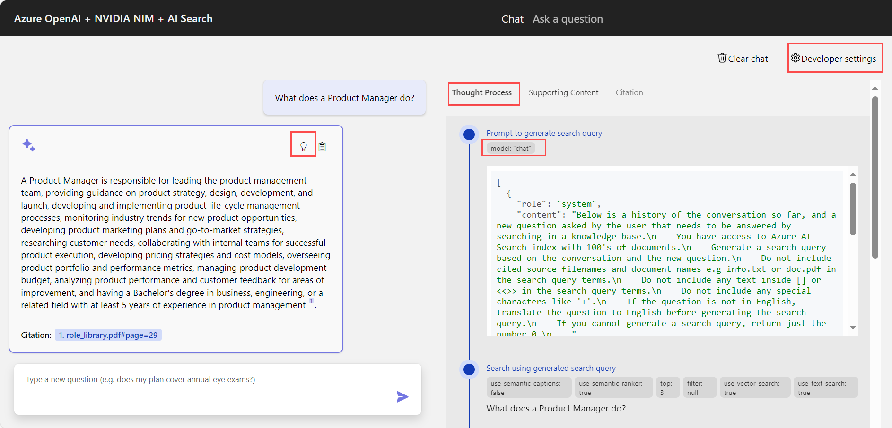

1. Click on **Ask a question** at the top to use he NVIDIA NIM.

   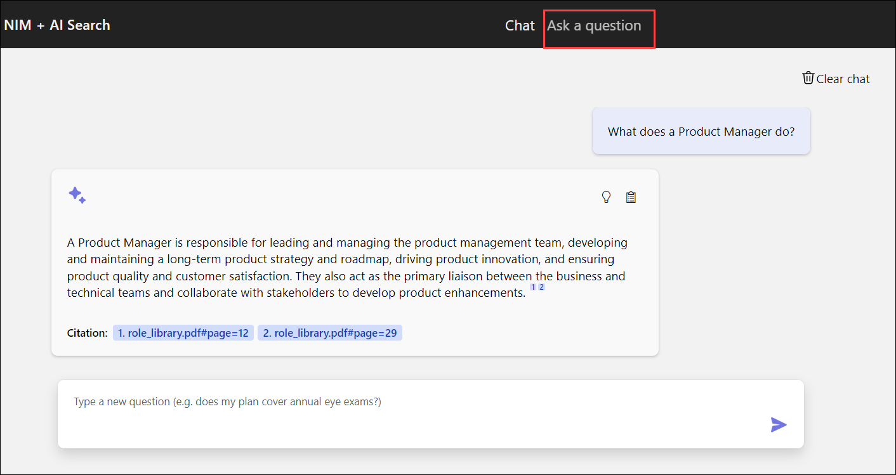

1. In the **Developer settings** pop-up, check the box for **Use NVIDIA NIM LLM** , then click the **Close** button.

   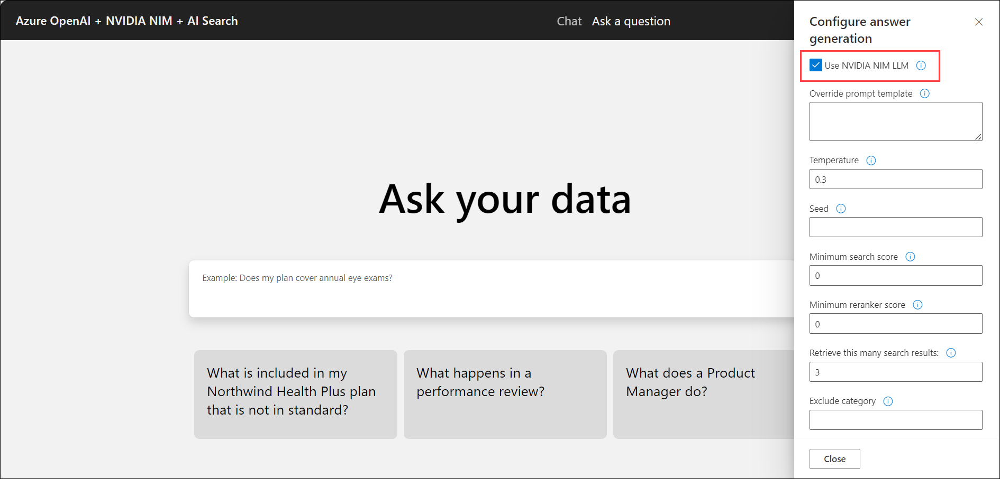

1. Enter the prompt: **What does a Product Manager do?** and then press Enter. You’ll notice that the Chat UI updates in green and is generated from NVIDIA LLM. Next, click on the **Show Thought Process** icon to get more details of the model used.

   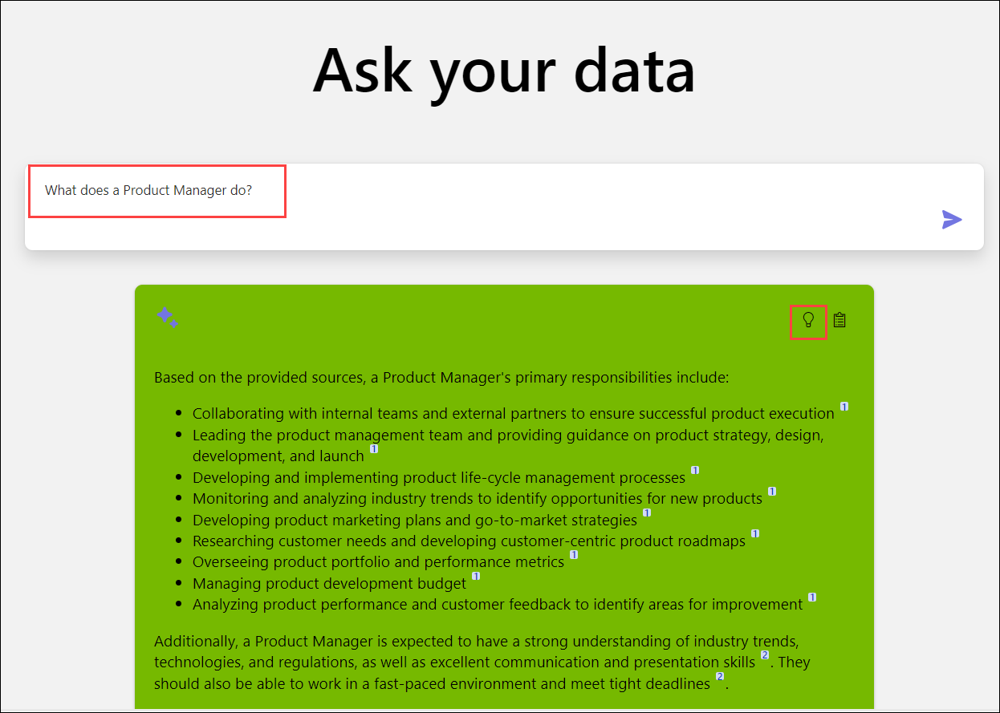

1. Below in the **Thought Process**, you will see that the **llama-3.1-8b-instruct** model is utilized thats coming from AML endpoint that you have deployed in the previous challenge.

   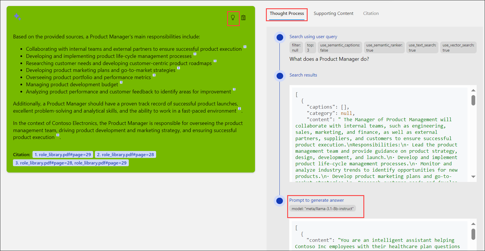

## Success Criteria:

- Successful deployment of the Chat App.
- validate if the following services are successfully deployed in the RG (Resource Group).
  - App Service
  - Document Intelligence
  - Azure OpenAI
  - Shared Dashboard
  - Smart Detector Alert Rule
  - Search Service
  - Log Analytics Workspace
  - App Service Plan
  - Storage Account
- Validate if the data is populated into the storage container named `content`.
- The Chat app should be accessible using the Azure App service.

## Additional Resources:

-  Refer to the  [Azure Search OpenAI demo GitHub repository](https://github.com/cmendible/azure-search-openai-demo) for detailed information on the architecture.
-  [Azure copilot](https://learn.microsoft.com/en-us/azure/copilot/overview)

## Proceed with the next Challenge by clicking on **Next**>>.
