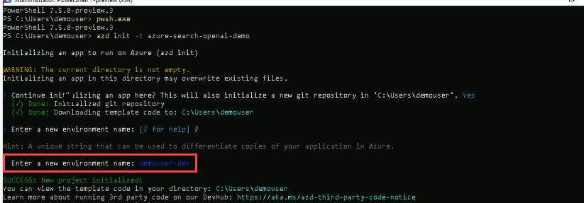
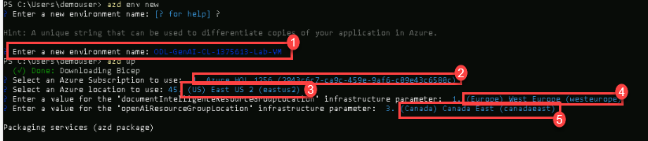

# Challenge 03:  Deploy an AI-Powered Chat App 

### Estimated Time: 150 minutes

### Introduction:

In this challenge, you'll deploy an AI-powered chat application specifically designed for Contoso Electronics. This app, built with React for the frontend and Python for the backend, showcases advanced features like chat and Q&A interfaces, all augmented by AI capabilities. It's an excellent opportunity for you to explore the integration of Azure OpenAI Service with the GPT-3.5 Turbo model and Azure Cognitive Search for efficient data indexing and retrieval.

This sample app is more than just a chat interface; it demonstrates the Retrieval-Augmented Generation pattern, offering a rich, ChatGPT-like experience over Contoso's own data. The app's features include trustworthiness evaluation of responses with citations, tracking of source content, data preparation, prompt construction, and orchestrating interaction between the ChatGPT model and Cognitive Search. You'll also find adjustable settings in the UX for experimentation and optional performance tracing and monitoring with Application Insights.

In this challenge, your task is to deploy this comprehensive chat solution for Contoso, allowing them to evaluate its capabilities and integrate it into their environment. The repository comes with sample data, representing a ready-to-use, end-to-end solution. This app is a valuable tool for Contoso's employees to inquire about company benefits, internal policies, job descriptions, and roles.

You will be using Terraform to deploy the chat app. 

The chat application integrates seamlessly with different Azure services to provide an intelligent user experience. Here's a simple overview of each service used by the app:

- **App Service:** This hosts the chat app, ensuring it can respond to the prompts sent by users from the uploaded relatable data.
- **Application Insights:** It proactively monitors the app's performance, taking care of issues before they become significant.
- **Document Intelligence:** Using AI, it understands the content in uploaded documents, making user information more insightful.
- **Azure OpenAI:** Enhances the app's capabilities with natural language understanding and responses.
- **Shared Dashboard:** Acts as a central hub for team collaboration and data sharing.
- **Smart Detector Alert Rule:** Monitors the app's health and notifies the team if any issues arise.
- **Search Service:** Empowers users with dynamic and efficient search functionality within the app.
- **Log Analytics Workspace:** Tracks and analyzes app activity, offering valuable insights and logs.
- **App Service Plan:** Optimizes resource allocation for optimal app performance.
- **Storage Account:** Securely stores the data that will be used by the Azure AI Search service to provide the inputs to the chat app.

Together, these services create a responsive chat application that combines AI features, monitoring capabilities, and efficient data management, providing Contoso with an exceptional user experience.


## Architecture diagram:


## Solution Guide:

## Prerequisite
   
1. Start Powershell 7 +.
   
2. Ensure you run `pwsh.exe` from a PowerShell terminal. If this fails, you likely need to upgrade PowerShell.

## Task 1: Deploy the  AI-Powered Chat App.

**Deploying the infrastructure**

1. Login to Azure:

   ```
   azd auth login
   ```
2. On the **Sign into Microsoft Azure** tab you will see the login screen, in that enter the following email/username and then click on **Next**. 
   * Email/Username: <inject key="AzureAdUserEmail"></inject>
   
     
     
3. Now enter the following password and click on **Sign in**.
   * Password: <inject key="AzureAdUserPassword"></inject>
   
     
     
   >**Note**: A web browser tab will open and prompt you to sign into Azure. Do so, and then close the browser tab

4. Run this command to download the project code:

   ```
   azd init -t azure-search-openai-demo
   ```
5. When it prompts you to enter an environment name, provide the desired name.

   
   
   >**Note**: the above command will initialize a git repository, so you do not need to clone this repository.

6. Create a new azd environment , Enter a name that will be used for the resource group. This will create a new folder in the `.azure` folder, and set it as the active environment for any calls to azd going forward.
   
   ```
   azd env new
   ```

   - `Choose the Subscription`**(1)**
   - `Select the location to use`**(2)**
   - `Choose the location for Document Intelligent Resource Group`**(3)**
   - `Choose the location for OpenAI Resource Group`**(4)**

   

   
7. Run the Below command to provision Azure resources and deploy the resources, including building the search index based on the files found in the `./data` folder

   ```
   azd up
   ```

8. You will be prompted to select two locations, one for the majority of resources and one for the OpenAI resource, which is currently a short list. That location list is based on the OpenAI model availability table and may become outdated as availability changes.

9. After the application has been successfully deployed you will see a URL printed to the console. Click that URL to interact with the application in your browser. It will look like the following:

   
 
>**Note**: It may take 5-10 minutes after you see 'SUCCESS' for the application to be fully deployed. If you see a "Python Developer" welcome screen or an error page, then wait a bit and refresh the page.


## Additional Resources:

-  Refer to the  [Azure Search OpenAI demo GitHub repository](https://github.com/cmendible/azure-search-openai-demo) for detailed information on the architecture.
-  [Azure copilot](https://learn.microsoft.com/en-us/azure/copilot/overview)

