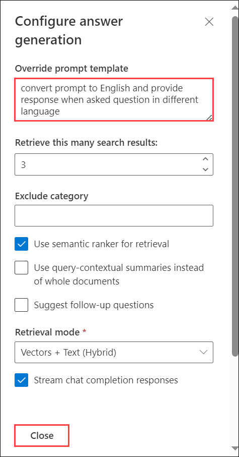
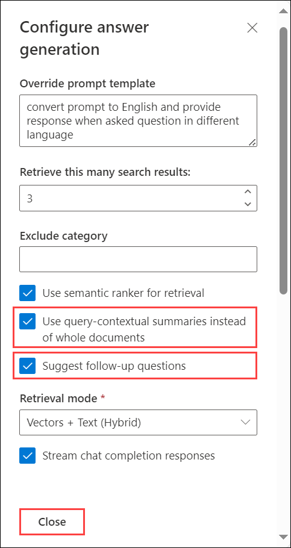

# Challenge 04: Implement a Chat App with Azure OpenAI LLM

## Introduction:
Welcome to Implement a Chat App with Azure OpenAI LLM ! In this challenge, participants will dive into the world of conversational AI by interacting with a chat application infused with the power of the Azure OpenAI Large Language Model (LLM).

## Description:
In previous challenge you have successfully deployed the architecture.In this challenge we will integrate Azure OpenAI LLM into a chat application, allowing it to comprehend user input, generate context-aware responses, and create a more natural and personalized conversational experience.

## Solution guide

### Task 1: Interact with Chatapp with Azure OpenAI LLM

One of the hottest themes at the moment is size models; users are particularly interested in conversation GPT. The most intriguing thing about all those basic models—Chat GPT included—is that while they perform admirably on their own, they perform even better when combined with your own data.

1. In Azure Portal, search and select **App service**. 

   

1. Select **webapp-<inject key="Deployment-id" enableCopy="false"></inject>**

   
      
1. Next, click on **Browse** to open your Web application.

   
1. You will be prompted with the **Northwind Health chat application** as below. 

   

1. In the chat application provide the below prompt and check the how responses are given by the ChatGPT and Azure cognitive search services by interacting to construct search queries, retrieve candidate information from the knowledge base.

   ```
   What does a Product Manager do?
   ```

   

1. The response not only answered the question based on content found in these documents, but it has also included **citations (1)** to that content to validate the accuracy of the information. Click on an annotation, the app jumps right to the page of the **document (2)** that goes into the comparison of the plans, so that we can read more or do additional validation on the accuracy of the answer under the **citation** section. 

   

1. See how when we click on an annotation, the app jumps right to the page of the document that goes into the comparison of the plans, so that we can read more or do additional validation on the accuracy of the answer. 

   ```
   Does the project manager manage the human resources team?
   ```
   
   

1. As per our constructed our app, we can pass context from previous parts of the chat into the prompt behind the scenes, which enables ChatGPT to answer the question if the project manager manage the human resources team. Click on the citation and you'll see the part of the plan that covers the related information.

   
   
   

1. Let us make a slight change to the prompt to ask open AI to take any question that is not asked in English and respond in the language it was asked in. Go to **Developer Settings** and add the below message in the **Override prompt template** section. Click on **Close**.

    ```
   convert prompt to English and provide response when asked question in different language
   ```

    

    

1. In this override, when we ask a question in a different language, behind the scenes, the prompt gets converted to English to perform the search, and then the model will respond in the same language it was asked in. Enter the below prompt in the chat section and observe it's taking the question, detecting that it's in French, converting it to English, executing it as before, and then returning the expected response like before.

   ```
   Quelles sont les responsabilités du responsible marketing ?
   ```

   

1. Go to **Developer Settings**, in the **Exclude category** section enable the check box for **Use query-contextual summaries instead of whole documents** and **Suggest follow-up questions**. Click on **Close** and observe how the responses for prompt will change in the chat by giving the below prompt.

   ```
   What happens in a performance review?
   ```

   

   


## You have successfully completed this challenge.
