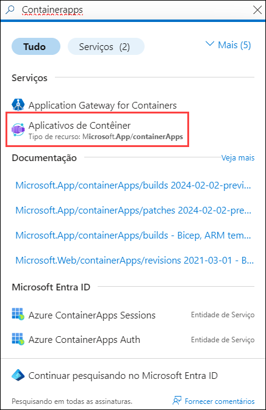
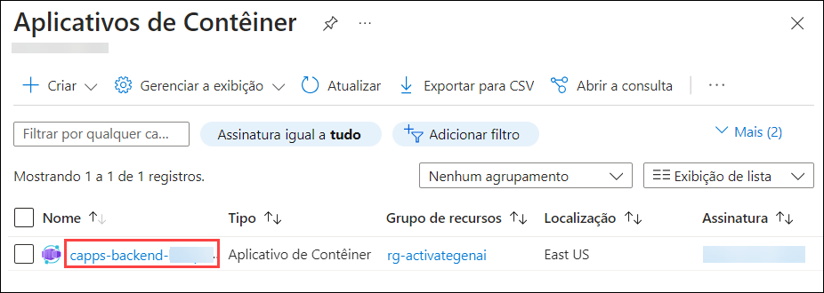
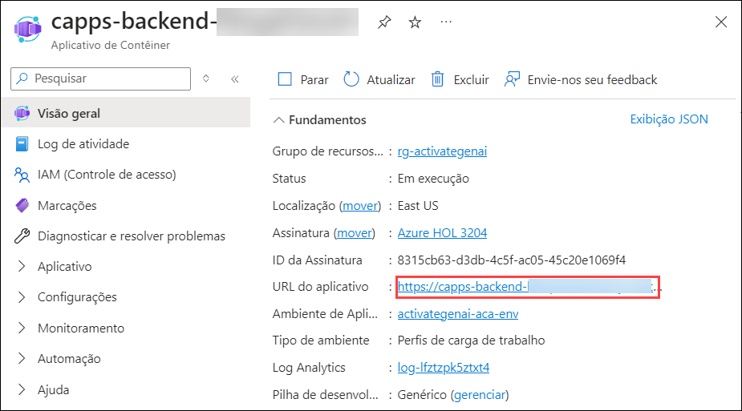

# Desafio 04: Interaja com o aplicativo de bate-papo

### Tempo Estimado: 30 minutos

## Introdução:

Após provisionar com sucesso a aplicação de chat melhorada por IA no desafio anterior, é hora de avaliar as suas capacidades. Este desafio se concentra em interagir com a aplicação para entender seu potencial para aplicações no mundo real na Contoso Ltd. Você explorará a eficiência das respostas a consultas, as capacidades multilíngues e o impacto das configurações avançadas, construindo um caso convincente para a integração dessas tecnologias na Contoso.

## Guia da Solução

### Tarefa 1: Usar a Chatapp com Azure OpenAI LLM

Um dos temas mais interessantes no momento são os tamanhos dos modelos; os usuários estão particularmente interessados no GPT para conversas. O mais intrigante sobre todos esses modelos básicos — incluindo o Chat GPT — é que, enquanto eles se saem bem sozinhos, eles têm um desempenho ainda melhor quando combinados com os dados das organizações.

1. Na página do Portal de Azure, na caixa **Pesquisar recursos, serviços e documentos (G+/)** no topo do portal, digite **Container Apps**, e, em seguida, selecione **Aplicativos de Contêiner**.

   

1. Selecione **Contêiner de aplicativo da Web**.

   
      
1. Em seguida, clique em **URL do aplicativo** para abrir a sua aplicação web.

   
   
1. Você será solicitado a utilizar o **Northwind Health chat application** como mostrado abaixo. 

   

1. No aplicativo de chat, forneça o seguinte prompt e verifique como as respostas são dadas pelos serviços ChatGPT e Azure Cognitive Search, interagindo para construir consultas de busca e recuperar informações de candidatos da base de conhecimento.

   ```
   What does a Product Manager do?
   ```

   

1. A resposta não apenas respondeu à pergunta com base no conteúdo encontrado nesses documentos, mas também incluiu **Citations**. Selecione qualquer uma das **Citations (1)** para validar a precisão das informações. Quando você clica em uma anotação, o aplicativo pula diretamente para a página do **documento (2)** que entra na comparação dos planos, permitindo que você leia mais ou faça uma validação adicional da precisão da resposta na seção de **Citations**.

   

1. Veja como, quando clicamos em uma anotação, a aplicação salta diretamente para a página do documento que contém a comparação dos planos, permitindo que possamos ler mais ou realizar uma validação adicional sobre a precisão da resposta.

   ```
   Does the project manager manage the human resources team?
   ```
   
   

1. Conforme a nossa aplicação foi construída, podemos passar o contexto de partes anteriores do chat para o prompt, o que permite ao ChatGPT responder à pergunta se o gerente de projetos gerencia a equipe de recursos humanos. Clique na citação e você verá a parte do plano que cobre as informações relacionadas.

   
   
   

1. Vamos fazer uma pequena alteração no prompt para pedir que o OpenAI responda em qualquer idioma no qual a pergunta não for feita. No canto superior direito, selecione  **Developer Settings (1)** e adicione a mensagem abaixo na seção **Override prompt template (2)**. Clique em **Close (3)**.

      ```
      convert prompts to English and respond when asked questions in a different language
      ```

      
   
      

1. Quando fazemos uma pergunta em um idioma diferente, o prompt é convertido para inglês para realizar a busca e, em seguida, o modelo responde no mesmo idioma em que a pergunta foi feita. Insira o prompt abaixo na seção de chat e observe que ele está recebendo a pergunta, detectando que ela está em francês, convertendo-a para o inglês, executando-a como antes e depois retornando a resposta esperada como anteriormente.

   ```
   Quelles sont les responsabilités du responsible marketing?
   ```

   

1. Vá para **Developer Settings** e, na seção **Exclude category**, marque a caixa de seleção para **Use semantic captions (1)** e **Suggest follow-up questions (2)**. Clique em **Close (3)**.

   

1. Insira o prompt e observe como as respostas ao prompt mudarão no chat ao fornecer o prompt abaixo.

   ```
   What happens in a performance review?
   ```

   

## Critério de Sucesso:
  - Interação bem-sucedida com a aplicação de chat, explorando uma variedade de casos de uso conversacionais.
  - Compreensão abrangente das capacidades da aplicação em lidar com consultas multilíngues, configurações avançadas e seu potencial geral para o ambiente da Contoso.
     
    > **Importante**: Não há validação específica para este desafio, mas sua exploração e compreensão são cruciais.


## Recursos Adicionais:

- Consulte  [azure-search-openai-demo](https://github.com/Azure-Samples/azure-search-openai-demo) para mais informação.

## Prossiga para o próximo Desafio clicando em **Próximo**>>.
