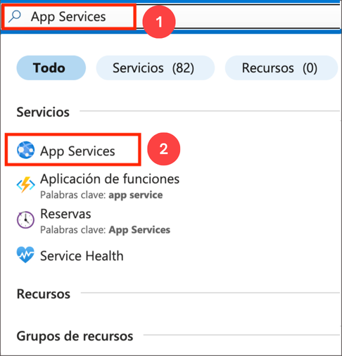
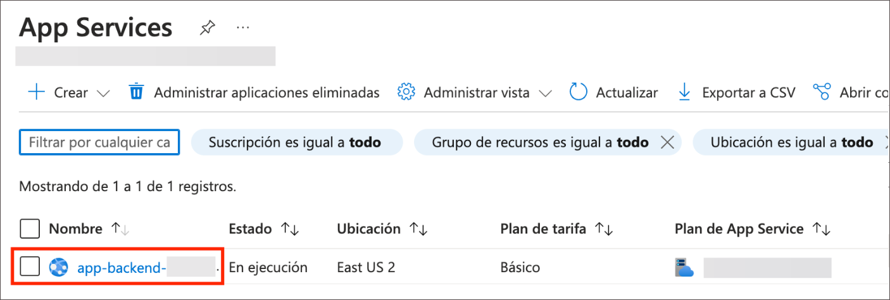
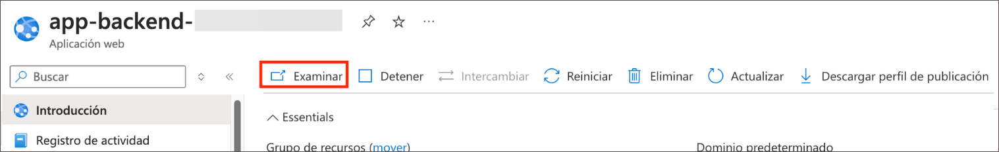
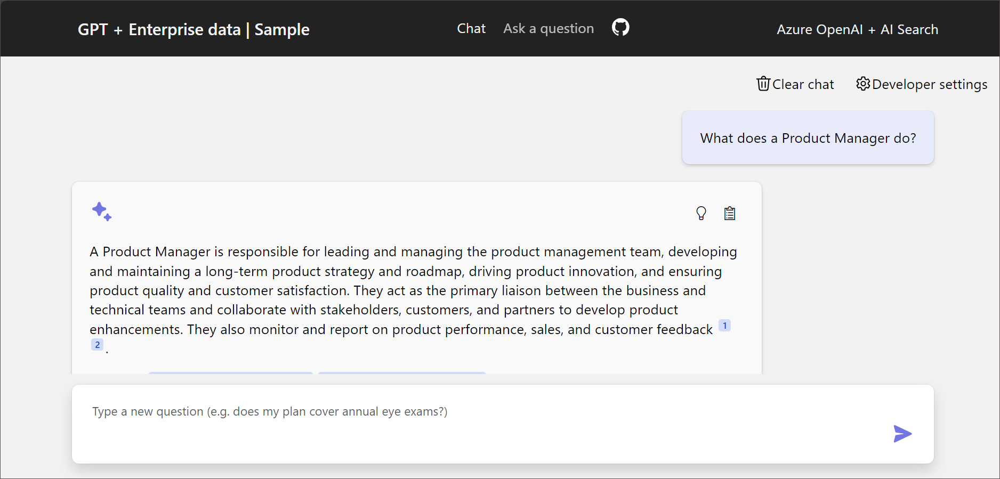
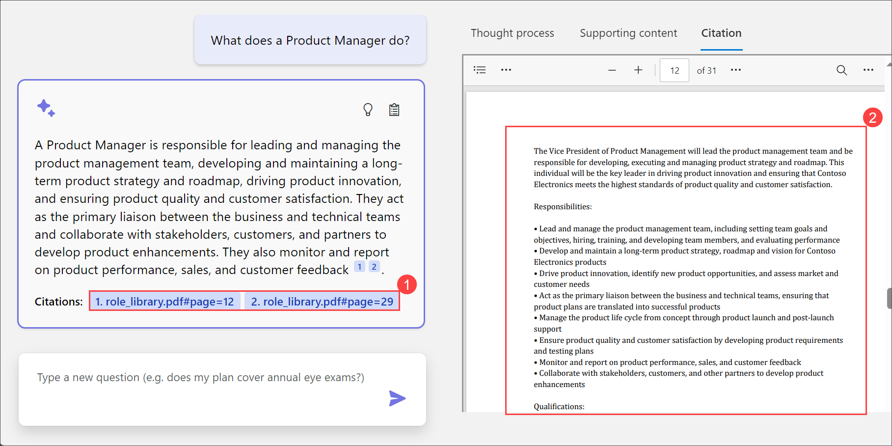
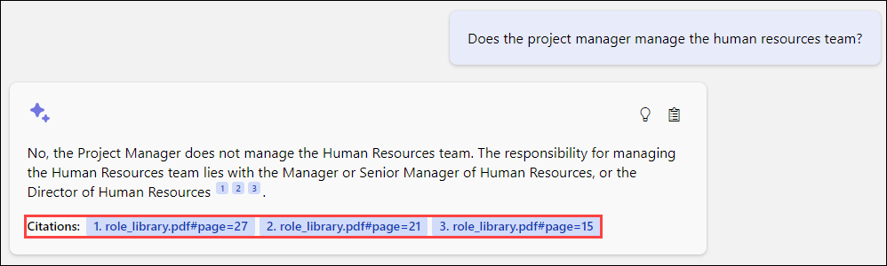
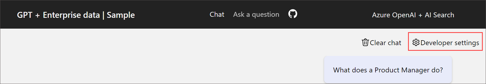
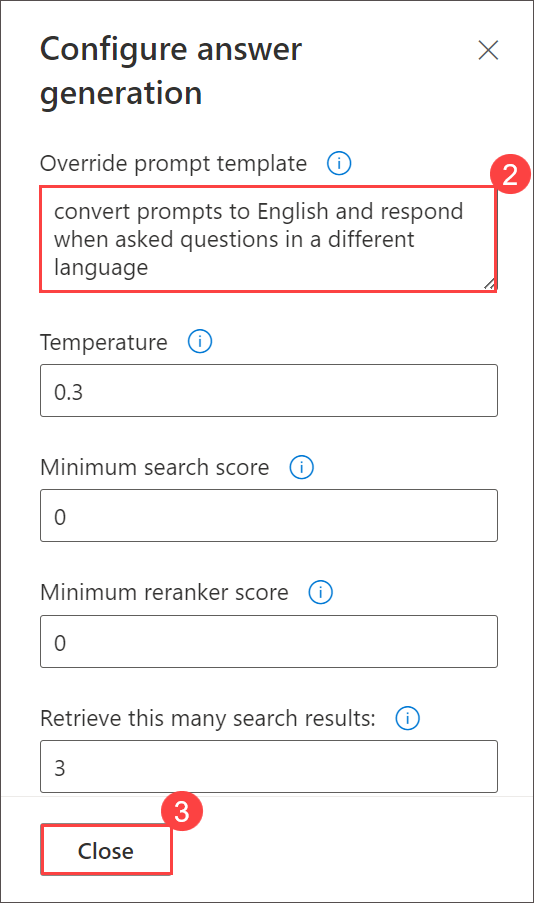
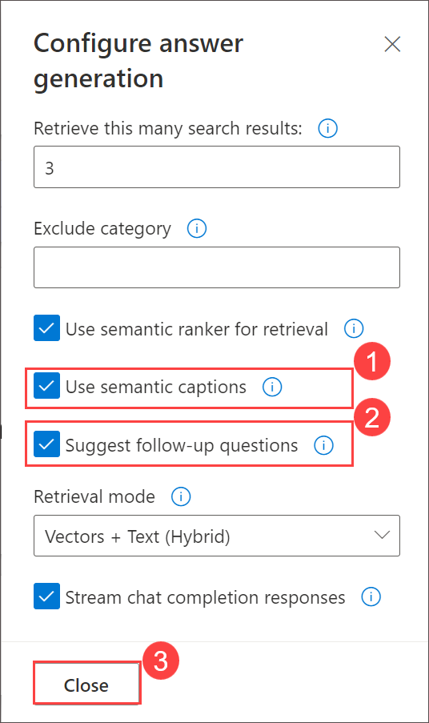

# Challenge 04: Interact with the Chat App

### Estimated Time: 30 minutes

## Introduction:

After successfully deploying the AI-enhanced chat app in the previous challenge, it's time to assess its capabilities. This challenge is centered around interacting with the app to understand its potential for real-world applications at Contoso Ltd. You will explore the efficiency of query responses, multilingual capabilities, and the impact of advanced settings, making a compelling business case for the integration of these technologies at Contoso.

## Solution Guide

### Task 1: Interact with Chatapp with Azure OpenAI LLM

One of the hottest themes at the moment is size models; users are particularly interested in conversation GPT. The most intriguing thing about all those basic models—Chat GPT included—is that while they perform admirably on their own, they perform even better when combined with your own data.

1. On Azure Portal page, in Search resources, services, and docs (G+/) box at the top of the portal, enter **App Services (1)**, and then select **App Services (2)** under services.

   

1. Select **webapp**.

   
      
1. Next, click on **Browse** to open your Web application.

   
   
1. You will be prompted with the **Northwind Health chat application** as below. 

   

1. In the chat application, provide the below prompt and check how responses are given by the ChatGPT and Azure cognitive search services by interacting to construct search queries and retrieve candidate information from the knowledge base.

   ```
   What does a Product Manager do?
   ```

   

1. The response not only answered the question based on the content found in these documents, but it also included **citations** Select any one **citations (1)** to that content to validate the accuracy of the information. When you click on an annotation, the app jumps right to the page of the **document (2)** that goes into the comparison of the plans, so that we can read more or do additional validation on the accuracy of the answer under the **citation** section. 

   

1. See how when we click on an annotation, the app jumps right to the page of the document that goes into the comparison of the plans, so that we can read more or do additional validation on the accuracy of the answer. 

   ```
   Does the project manager manage the human resources team?
   ```
   
   

1. As per our constructed app, we can pass context from previous parts of the chat into the prompt behind the scenes, which enables ChatGPT to answer the question if the project manager manages the human resources team. Click on the citation, and you'll see the part of the plan that covers the related information.

   
   
   

1. Let us make a slight change to the prompt to ask open AI to take any question that is not asked in English and respond in the language it was asked in. From the right top corner select **Developer Settings** and add the below message in the **Override prompt template** section. Click on **Close**.

      ```
      convert prompts to English and respond when asked questions in a different language
      ```

      
   
      

1. In this override, when we ask a question in a different language, behind the scenes, the prompt gets converted to English to perform the search, and then the model will respond in the same language it was asked in. Enter the below prompt in the chat section and observe that it's taking the question, detecting that it's in French, converting it to English, executing it as before, and then returning the expected response like before.

   ```
   Quelles sont les responsabilités du responsible marketing ?
   ```

   

1. Go to **Developer Settings**, and in the **Exclude category** section, enable the check box for **Use semantic options** and **Suggest follow-up questions**. Click on **Close**.

   

1. Enter the prompt and observe how the responses to the prompt will change in the chat by giving the below prompt.

   ```
   What happens in a performance review?
   ```

   

## Success Criteria:
  - Successful interaction with the chat application, exploring a variety of conversational use cases.
  - Comprehensive understanding of the app's capabilities in handling multilingual queries, advanced settings, and its overall potential for Contoso's environment.
     
    > **Important**: There is no specific validation for this challenge, but your exploration and understanding are crucial.


## Additional Resources:

- Refer to the  [azure-search-openai-demo](https://github.com/Azure-Samples/azure-search-openai-demo) for detailed information.

## Congratulations! you have successfully completed the challenge labs.
