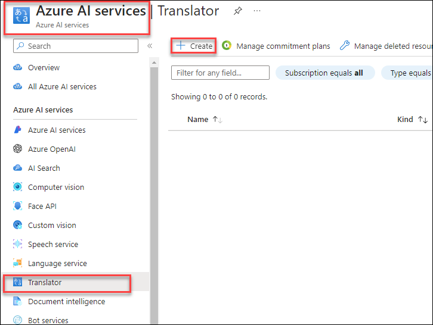
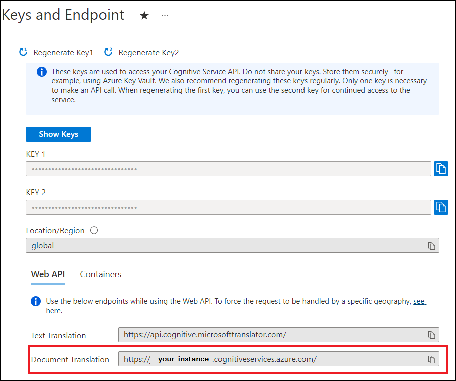
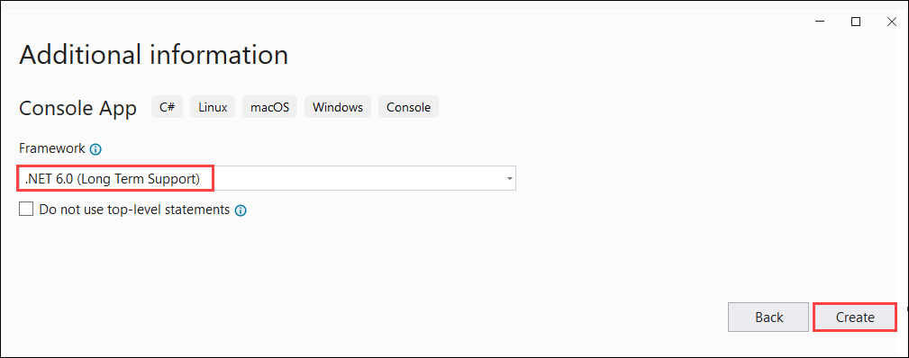
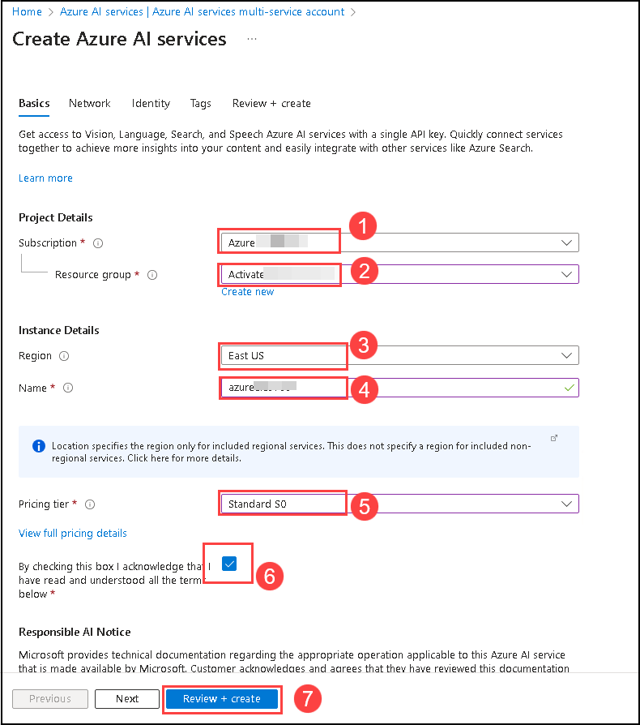
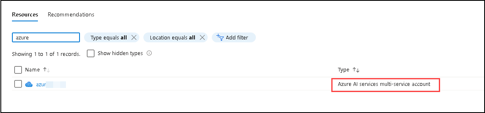
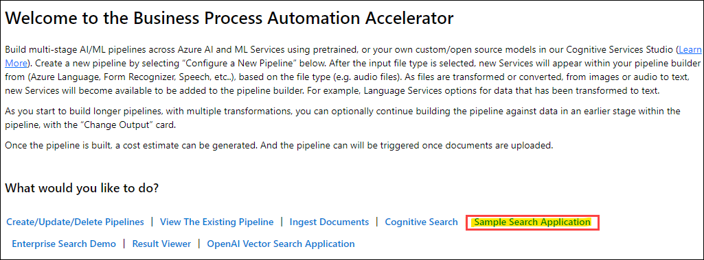
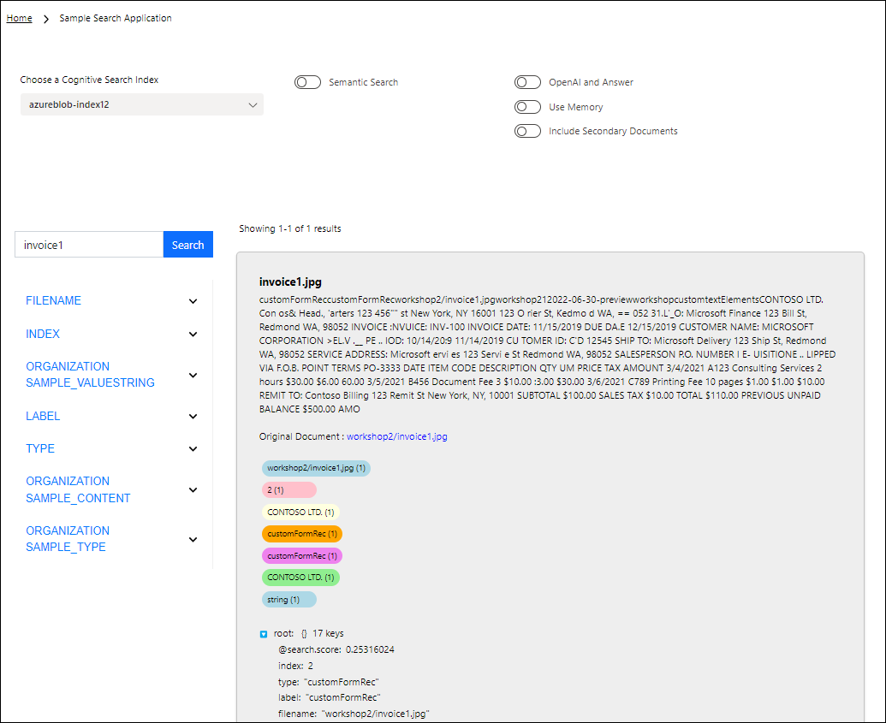

# Challenge 06: Serverless Document Batch Processing 

## Introduction:

Welcome to a pivotal challenge where Contoso Ltd aims to enhance their AI-powered chat app with a robust document processing system. This challenge focuses on creating a serverless solution for processing new documents, translating them as needed, and seamlessly storing them into Azure AI Search. This system will ensure that these documents are continuously available for consumption by Azure OpenAI, enhancing the chat app's knowledge base and response accuracy.

Building on your previous achievements in load balancing Azure OpenAI resources, you will now embark on a journey to streamline document processing. This involves setting up a translation service, creating a serverless architecture for batch processing using Azure services, and leveraging technologies like Form Recognizer and Azure AI Search. Your task is to ensure that newly added documents are promptly processed, analyzed, and indexed, making them readily available for the chat app's AI to utilize.

This challenge unfolds in three main stages: language translation, serverless document batch processing using Azure services, and leveraging advanced features like Form Recognizer and AI search. We kick things off by translating files to meet language requirements. Next, you deploy a serverless architecture, utilizing Azure services, for efficient batch processing of documents. You train and test our model, establish a pipeline to convert documents into a Form Recognizer format, and bring in Azure's AI search service to verify the presence of specific documents in the processed dataset from where they can be used by Azure OpenAI. 

You will utilize the Form Recognizer Service and the Business Process Automation (BPA) Accelerator to build pipelines across various Azure services, creating a seamless document processing solution. This challenge is a step towards realizing an AI solution that can adapt and grow with Contoso's business needs.

# Solution Guide

### Task 1 - Translate the documents using Translate

#### Task 1.1 - Retrieve your key and document translation endpoint
#### Task 1.1 - Create your Azure AI Translator and retrieve the key and document translation endpoint

1. Navigate to Azure AI Services and select Translator from the left side menu and click on the **Create** button.

    

1. Enter the required details and select `S1` pricing tier.

1. Once the Translator resource is created, please get the resource keys by following the next step.
   
1. In the left rail, under Resource Management, select Keys and Endpoint.

    
   
1. Copy and paste your key and document translation endpoint in a convenient location, such as Microsoft Notepad. Only one key is necessary to make an API call.

1. You paste your key and document translation endpoint into the code samples to authenticate your request to the Document Translation Service.

      
   
   
#### Task 1.2 - Create Azure Blob Storage containers

1. You need to create containers in your Azure Blob Storage account for source and target files.

      Source container. This container is where you upload your files for translation (required).  
      Target container. This container is where your translated files are stored (required).

 1. Required authentication
The sourceUrl , targetUrl must include a **Shared Access Signature (SAS) token**, appended as a query string. The token can be assigned to your container or specific blobs.
     - Your source container or blob must have designated **read** and **list** access.
     - Your target container or blob must have designated **write** and **list** access.

 1. Sample document
For this project, you need a source document uploaded to your source container. You can download our [document translation sample document](https://view.officeapps.live.com/op/view.aspx?src=https%3A%2F%2Fraw.githubusercontent.com%2FAzure-Samples%2Fcognitive-services-REST-api-samples%2Fmaster%2Fcurl%2FTranslator%2Fdocument-translation-sample.docx&wdOrigin=BROWSELINK) for this quickstart. The source language is English.

#### Task 1.3 - Set up your C#/.NET environment and Install Newtonsoft.Json
   
1. Start Visual Studio.

1. On the Get Started page, choose Create a new project.

   

1. On the Create a new project page, enter console in the search box. Choose the Console Application template, then choose Next.

   

1. In the Configure your new project dialog window, enter document-translation-qs in the Project name box. Then choose Next.

   

1. In the Additional information dialog window, select .NET 6.0 (Long-term support), and then select Create.

   

1. Right-click on your document-translation-qs project and select Manage NuGet Packages.

   

1. Select the Browse tab and type NewtonsoftJson.

   
   
1. Select the latest stable version from the dropdown menu and install the package in your project.

   

#### Task 1.4 -Translate all documents in a storage container and Run your application

1. Open the Program.cs file.

1. Delete the pre-existing code, including the line Console.WriteLine("Hello World!").

1. Copy and paste the document translation a [code sample](https://learn.microsoft.com/en-us/azure/ai-services/translator/document-translation/quickstarts/document-translation-rest-api?pivots=programming-language-csharp#code-sample) into the Program.cs file.

1. Update **{your-document-translation-endpoint}** and **{your-key}** with values from your Azure portal Translator instance.

1. Update **{your-source-container-SAS-URL}** and **{your-target-container-SAS-URL}** with values from your Azure portal Storage account containers instance

Once you've added code sample to your application, choose the green Start button next to document-translation-qs to build and run your program, or press F5.

### Task 2: Creating a Form Recognizer Resource
1. Navigate to **Azure AI services multi-service account** and click on the **Create** button.

    

1. Enter the required details and select `Standard s0` pricing tier. and **check the box**
   
1. Go to the Resource group, search, and select the **Azure AI services multi-service account** resource which you deployed earlier

  

2. Click on the Document Intelligence tab and select **Go to studio**.

   

3. In Document Intelligence Studio, scroll down to **Custom Extraction Models** and choose **Try it now**.

   

4. Under My Project, click on **+ Create a project**.

   

5. Enter the following details and click on **Continue**  **(3)**.
    
   - Project name: **testproject** **(1)**.
   - Description: **Custom model project** **(2)**.

     

6. Enter the following details **Configure service resource** and click on **Continue** **(5)**.

   - Subscription: Select your **Default Subscription** **(1)**.
   - Resource group: **<inject key="Resource Group Name"/>** **(2)**.
   - Form Recognizer or Cognitive Service Resource: Select the available Cognitive Service Form Recognizer name similar to **cogservicesbpass{suffix}** **(3)**.
   - API version: **2022-08-31 (3.0 General Availability)** **(4)**.

     

7. Enter the following details **Connect training data source** and click on **Continue** **(8)**.

   - Subscription: Select your **Default Subscription** **(1)**.
   - Resource group: **<inject key="Resource Group Name"/>** **(2)**.
   - Check the box to **Create new storage account** **(3)**
   - Storage account name: **formrecognizer<inject key="Deployment ID" enableCopy="false"/>** **(4)**.
   - Location: **East US** **(5)**.
   - Pricing tier: **Standard_LRS Standard** **(6)**.
   - Blob container name: **custommoduletext** **(7)**.
   
        

8. Validate the information and choose **Create project**.

     

### Task 3: Train and Label data

In this step, you will upload 6 training documents to train the model.

1. Click on **Browse for files**.

     

2.  On the file explorer, enter the following `C:\LabFiles\Data\Custom Model Sample` **(1)** path hit **enter**, select all train JPEG files **train1 to train6** **(2)**, and hit **Open** **(3)**.

     

3. Once uploaded, choose **Run now** in the pop-up window under Run Layout.

     

4. Click on **+ Add a field** **(1)**, select **Field** **(2)**, enter the field name as **Organization_sample** **(3)** and hit **enter**.

     

     

5. Label the new field added by selecting **CONTOSO LTD** in the top left of each document uploaded. Do this for all six documents.

     

6. Once all the documents are labeled, click on **Train** in the top right corner.

     

7. Specify the model ID as **customfrs** **(1)**, Model Description as **custom model** **(2)**, from the drop-down select **Template** **(3)** as Build Mode and click on **Train** **(4)**.

     

8. Click on **Go to Models**. 

   

9. Wait till the model status shows **succeeded** **(1)**. Once the status Select the model **customfrs** **(2)** you created and choose **Test** **(3)**.

     

10. On the Test model window, click on **Browse for files**. 

     

11. On the file explorer, enter the following `C:\LabFiles\Data\Custom Model Sample` **(1)** path hit **enter**, select all test JPEG files **test1 and test2** **(2)**, and hit **Open** **(3)**.

     

12. Once uploaded, select one test model, and click on **Run analysis** **(1)**, Now you can see on the right-hand side that the model was able to detect the field **Organization_sample** **(2)** we created in the last step along with its confidence score.

     

### Task 4: Build a new pipeline with the custom model module in BPA

After you are satisfied with the custom model performance, you can retrieve the model ID and use it in a new BPA pipeline with the Custom Model module in the next step.

1. Navigate back to the Resource groups and select the resource group **<inject key="Resource Group Name"/>**.

2. Go to the Resource group, search, and select the **Static Web App** resource type with the name similar to **webappbpa{suffix}**.

   

3. On the **Static Web App** page, click on **View app in browser**.

      

4. Once the **Business Process Automation Accelerator** page loaded successfully, click on the **Create/Update/Delete Pipelines**. 

   

5. On the **Create Or Select A Pipeline** page, enter New Pipeline Name as **workshop** **(1)**, and click on the **Create Custom Pipeline** **(2)**. 

   

6. On the **Select a document type to get started** page, select **PDF Document**

   

7. On the **Select a stage to add it to your pipeline configuration** page, search and select for **Form Recognizer Custom Model (Batch)**.

   

8. On the pop-up, enter the Model ID as **customfrs** **(1)** and click on **Submit** **(2)**. 

   

9. On the **Select a stage to add it to your pipeline configuration** page, scroll down to review the **Pipeline Preview**, and click on **Done**.

   

10. On the **Piplelines workshop** page, click on **Home**. 

      

11. On the **Business Process Automation Accelerator** page, click on **Ingest Documents**.

      

12. On the **Upload a document to Blob Storage** page, from the drop-down select a Pipeline with the name **workshop** **(1)**, and click on **Upload or drop a file right here**.

      

13. For documents, enter the following `C:\LabFiles\Data\Lab 1 Step 3.7` **(1)** path and hit enter. You can upload multiple invoices one by one.

      

### Task 5: Configure Azure Cognitive Search 

1. Navigate back to the resource group window, search, and select **Search Service** with a name similar to **bpa{suffix}**.

   

2. On the **Search service** page, click on **Import data**.

   

3. Enter the following details for **Connect to your data**.

   - Data Source: Select **Azure Blob Storage** **(1)**
   - Data Source Name: Enter **workshop** **(2)**.
   - Parsing mode: Select **JSON** **(3)**.
   - Click on **Choose an existing connection** **(4)** under Connection string.
  
     

4. On the **Storage accounts** page, select the storage account named similar to **bpass{suffix}**. 

     

5. Select **results** **(1)** container from the **Containers** page and click on **Select** **(2)**. It will redirect back to **Connection to your data** page.

     
  
6. On the **Connect to your data** page, enter the **workshop** **(1)** as **Blob folder** and click on **Next : Add cognitive skills (Optional) (2)**.

   

7. On the **Add cognitive skills (Optional)** click on **Skip to : Customize target index**.

8. On the **Customize target index**, enter Index name as **azureblob-index** **(1)**, make all fields **Retrievable** **(2)**, and **Searchable** **(3)**.

      

9. Expand the **aggregatedResults** **(1)** > **customFormRec** **(2)** > **documents** **(3)** > **fields** **(4)** under it, expand **Organization_sample (5)**. Make the three fields Facetable **(type, valueString & content)** **(6)** and click on **Next: Create an indexer** **(7)**.

   

10. On the **Create an indexer** page, enter the name as **azureblob-indexer** **(1)** and click on **Submit** **(2)**.
   
    

### Task 6: Use Sample Search Application

1. Now go back to the BPA webpage and select Sample Search Application

      

2. You can now filter and search on items and other fields configured.

      
