# Challenge 05: Serverless Document Batch Processing 

## Introduction:

Welcome to a pivotal challenge where Contoso Ltd. aims to enhance its AI-powered chat app with a robust document processing system. This challenge focuses on creating a serverless solution for processing new documents, translating them as needed, and seamlessly storing them into Azure AI Search. This system will ensure that these documents are continuously available for consumption by Azure OpenAI, enhancing the chat app's knowledge base and response accuracy.

Building on your previous achievements in load-balancing Azure OpenAI resources, you will now embark on a journey to streamline document processing. This involves setting up a translation service, creating a serverless architecture for batch processing using Azure services, and leveraging technologies like Form Recognizer and Azure AI Search. Your task is to ensure that newly added documents are promptly processed, analyzed, and indexed, making them readily available for the chat app's AI to utilize.

This challenge unfolds in three main stages: language translation, serverless document batch processing using Azure services, and leveraging advanced features like Form Recognizer and AI search. We kick things off by translating files to meet language requirements. Next, you deploy a serverless architecture, utilizing Azure services, for efficient batch processing of documents. You train and test our model, establish a pipeline to convert documents into a Form Recognizer format, and bring in Azure's AI search service to verify the presence of specific documents in the processed dataset from where they can be used by Azure OpenAI. 

You will utilize the Form Recognizer Service and the Business Process Automation (BPA) Accelerator to build pipelines across various Azure services, creating a seamless document processing solution. This challenge is a step towards realizing an AI solution that can adapt and grow with Contoso's business needs.

# Solution Guide

### Task 1: Translate the documents using Translate

1. Search for **subscriptions** and select **subscriptions**.

      

1. Select the **existing subscription (1)** , click on **Resource Providers (2)** at the bottom of the left navigation pane and check if the status is marked as **"Registered" (3)**. If marked as "NotRegistered", select "Register."  

   **Note**: *This process may take several seconds or minutes; be sure to refresh the entire browser periodically.*

      
        
1. Ensure that you have **accepted the terms and conditions for Responsible AI**:  
You must initiate the creation of a "Cognitive Services multi-service account" from the Azure portal to review and acknowledge the terms and conditions. You can do so here: [Quickstart: Create a Cognitive Services resource using the Azure portal](https://docs.microsoft.com/en-us/azure/cognitive-services/cognitive-services-apis-create-account?tabs=multiservice%2Cwindows).  
Once accepted, you can create subsequent resources using any deployment tool (SDK, CLI, or ARM template, etc.) under the same Azure subscription.

1. Search for **Azure AI services multi-servic**e account and select it.

1. Provide the follwing details and click on **Review + Create** :

   - Subscription: **Select the default subscription (1)**.
   - Resource Group: **<inject key="Resource Group Name"/>**(2)
   - Region: **Select the default region (3)**.
   - Name: **Provide any name (4)**.
   - Pricing Tier: **Select Standard SO (5)**
   - Ensure to **check the box** which acknowledges the terms and conditions **(6)**.

       

1. Ensure that you have **accepted the terms and conditions for Responsible AI**:  
You must initiate the creation of a "Cognitive Services multi-service account" from the Azure portal to review and acknowledge the terms and conditions. You can do so here: [Quickstart: Create a Cognitive Services resource using the Azure portal](https://docs.microsoft.com/en-us/azure/cognitive-services/cognitive-services-apis-create-account?tabs=multiservice%2Cwindows).  
Once accepted, you can create subsequent resources using any deployment tool (SDK, CLI, or ARM template, etc.) under the same Azure subscription.

1. [Get a Workflow Level Token (Classic)](https://docs.github.com/en/authentication/keeping-your-account-and-data-secure/creating-a-personal-access-token)

1. Navigate to `https://github.com/CloudLabs-MOC/business-process-automation` and click on **Sign in**.

      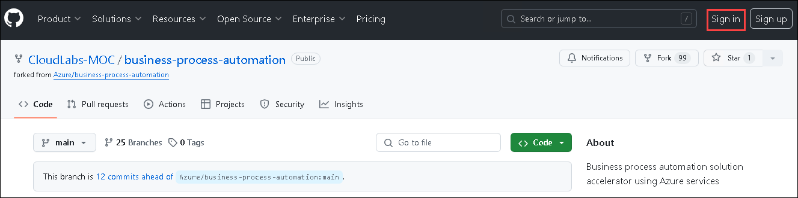
   
1. Once signed in, fork the repository to a git account for which you are the Admin. 

      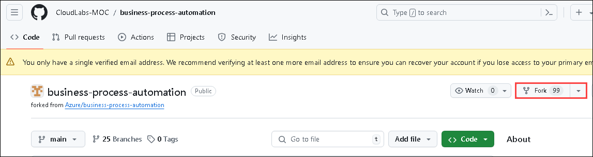

1. Click on your **profile** which is at the top of your right hand, and then select **Settings**.

1. Scroll down to the complete bottom and select **Developer settings**.

      

1. Click on **Tokens (classic)** from the left pane and select **Generate new token (classic)**.

      

1. Provide the following details:

   - Note: **PAT (1)**
   - Expiration: **7 days (2)**
   - Select scopes: Select all the **main scopes (3)**

      

1. Copy the PAT token and paste it in a notepad.

      
   
1. Click on the "Deploy to Azure" button that corresponds to your environment.

   ### With OpenAI

1. Only the Resource Group, Repo Token (from #2), and Forked Git Repo Url are needed.  The remaining parameters are filled in for you.

      

      > **Note:** Ensure the primary region is set to EASTUS2

   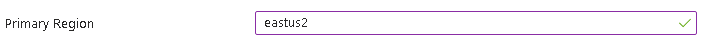

1. Verify that all the resources are deployed without any issues.
   
   
   
#### Task 1.2 - Create Azure Blob Storage containers

1. Select the storage account that is created from the resources that were deployed in the previous task.

1. Click on **Containers (1)** from the left navigation pane, select **+Container (2)** and provide the name as **source (3)**.

      

1. Click on the source container.

1. Select Shared Access Tokens from the left navigation pane, provide the permissions as Read and List and click on Generate SAS Token and URL.

      

1. Repeat the same steps by creating another container with name **target** by giving **Write** and **List** permissions.

1. Copy the URLs in a notepad.

1. Navigate to the source container and click on Upload.

1. Redirect to C:\LabFiles\Documents and upload
   
1. Upload this Sample document
For this project, you need a source document uploaded to your source container. You can download our [document translation sample document](https://view.officeapps.live.com/op/view.aspx?src=https%3A%2F%2Fraw.githubusercontent.com%2FAzure-Samples%2Fcognitive-services-REST-api-samples%2Fmaster%2Fcurl%2FTranslator%2Fdocument-translation-sample.docx&wdOrigin=BROWSELINK) for this quickstart. The source language is English.

#### Task 1.3 - Set up your C#/.NET environment and install Newtonsoft.Json
   
1. Start Visual Studio 2022.

   > **Note**: When prompted to sign in, select **Skip for now** and proceed.

1. On the **Get Started** page, choose to **Create a New Project**.

   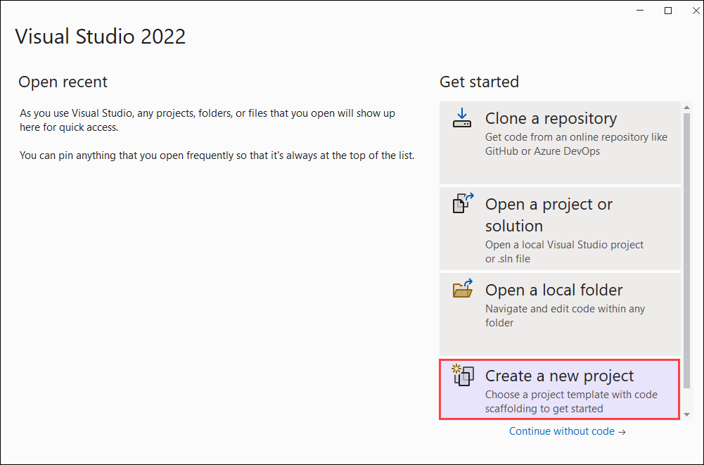

1. On the **Create a new project** page, enter **console** in the search box. Choose the **Console Application** template, then choose **Next**.

   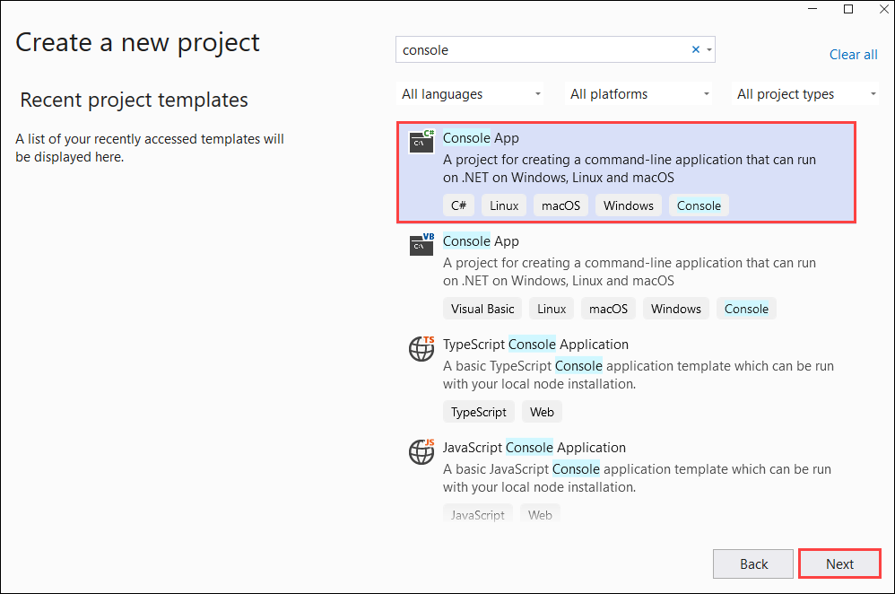

1. In the **Configure your new project** dialog window, enter **document-translation-qs** in the Project name box. Then, choose **Next**.

   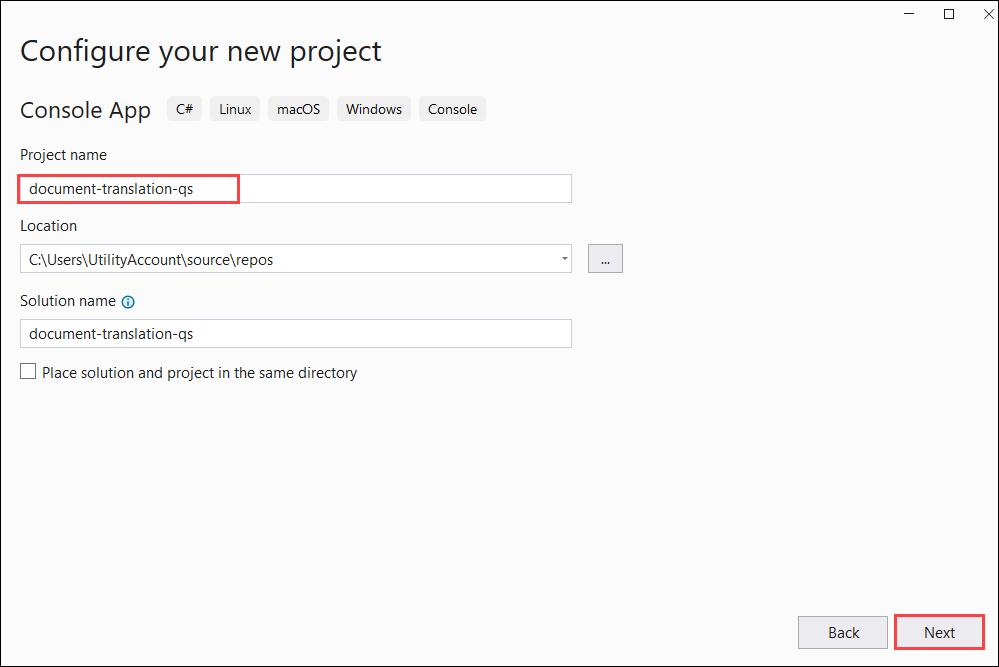

1. In the **Additional information** dialog window, select **.NET 8.0 (Long-term support)**, and then select **Create**.

1. Right-click on your **document-translation-qs** project and select **Manage NuGet Packages**.

   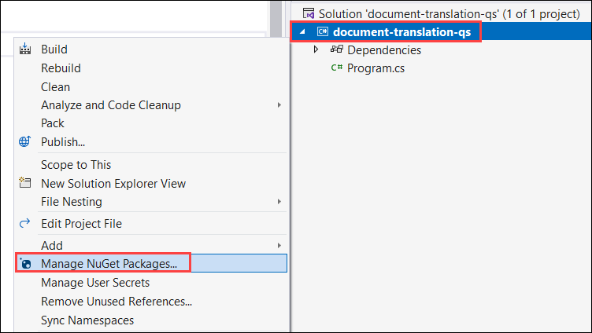

1. Select the **Browse** tab and type **NewtonsoftJson**.

   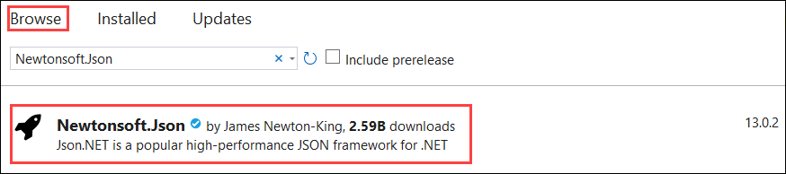
   
1. Select the latest stable version from the drop-down menu and install the package in your project.

   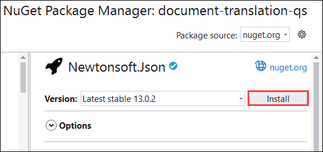

1. Click on **Apply**.

#### Task 1.4 -Translate all documents into a storage container and run your application

1. Go to the Translator resource that is created, please get the resource keys by following the next step.
   
1. On the left rail, under Resource Management, select Keys and Endpoint.

    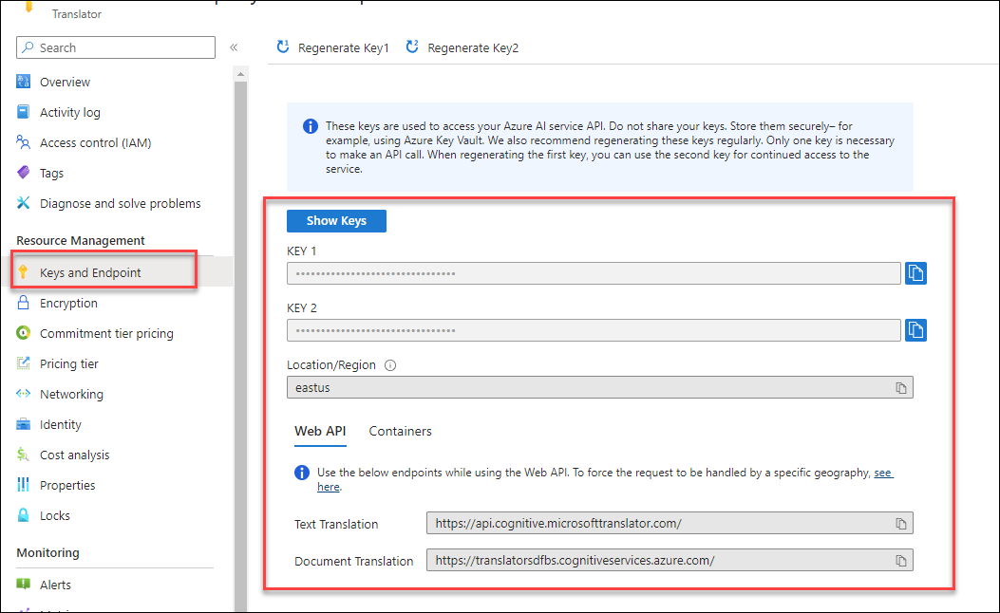
   
1. Copy and paste your key and document translation endpoint in a convenient location, such as Microsoft Notepad. Only one key is necessary to make an API call.

1. Navigate back to Visual Studio 2022 and open the **Program.cs** file.

1. Delete the pre-existing code, including the line Console.WriteLine("Hello World!").

1. Copy and paste the [code sample](https://learn.microsoft.com/en-us/azure/ai-services/translator/document-translation/quickstarts/document-translation-rest-api?pivots=programming-language-csharp#code-sample) for document translation into the Program.cs file.

1. Update **{your-document-translation-endpoint}** and **{your-key}** with values from your Azure portal Translator instance.

1. Update **{your-source-container-SAS-URL}** and **{your-target-container-SAS-URL}** with values from your Azure portal Storage account container instance.

Once you've added the code sample to your application, choose the green Start button next to document-translation-qs to build and run your program, or press F5.

### Task 2: Creating a Form Recognizer Resource

1. Click on the Document Intelligence tab and select **Go to studio**.

   

1. In Document Intelligence Studio, scroll down to **Custom Extraction Models** and choose **Try it now**.

   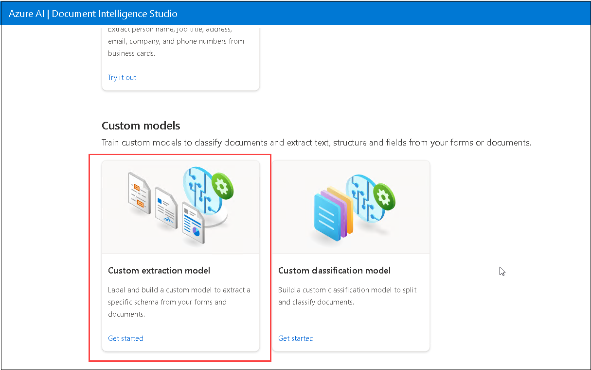

1. Under My Project, click on **+ Create a project**.

   

1. Enter the following details and click on **Continue**  **(3)**.
    
   - Project name: **testproject** **(1)**.
   - Description: **Custom model project** **(2)**.

     

1. Enter the following details under **Configure service resource** and click on **Continue** **(5)**.

   - Subscription: Select your **Default Subscription** **(1)**.
   - Resource group: **<inject key="Resource Group Name"/>** **(2)**.
   - Form Recognizer or Cognitive Service Resource: Select the available Cognitive Service Form Recognizer name similar to **cogservicesbpass{suffix}** **(3)**.
   - API version: **2022-08-31 (3.0 General Availability)** **(4)**.

     

1. Enter the following details under **Connect training data source** and click on **Continue** **(8)**.

   - Subscription: Select your **Default Subscription** **(1)**.
   - Resource group: **<inject key="Resource Group Name"/>** **(2)**.
   - Storage account name: **Select the existing storage account (3)**.
   - Blob container name: **custommoduletext** **(4)**.
   
        

1. Validate the information and choose **Create project**.

     

### Task 3: Train and label data

In this step, you will upload 6 training documents to train the model.

1. Click on **Browse for files**.

     

2.  On the file explorer, enter the following `C:\LabFiles\Documents\Custom Model Sample` **(1)** path, hit **enter**, select all train JPEG files **train1 to train6** **(2)**, and hit **Open** **(3)**.

     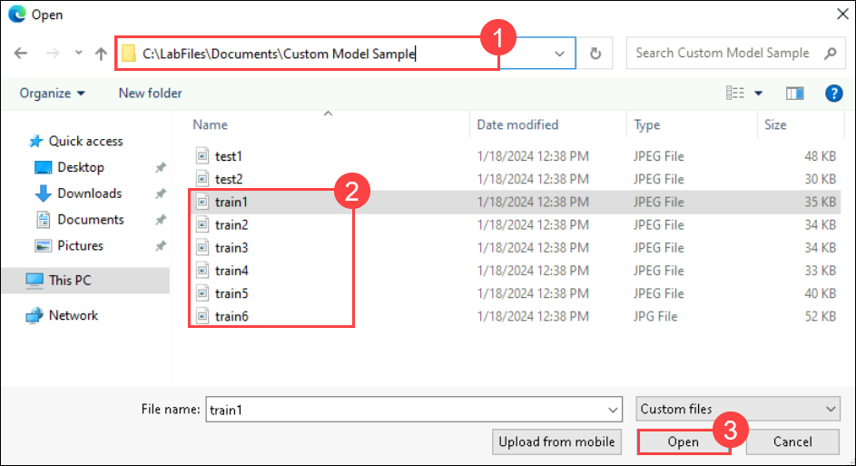

3. Once uploaded, choose **Run now** in the pop-up window under Run Layout.

     

4. Click on **+ Add a field** **(1)**, select **Field** **(2)**, enter the field name as **Organization_sample** **(3)**, and hit **enter**.

     

     

5. Label the new field added by selecting **CONTOSO LTD** in the top left of each document uploaded. Do this for all six documents.

     

6. Once all the documents are labeled, click on **Train** in the top-right corner.

     

7. Specify the model ID as **customfrs** **(1)**, the model description as **custom model** **(2)**, and from the drop-down, select **Template** **(3)** as Build Mode and click on **Train** **(4)**.

     

8. Click on **Go to Models**. 

   

9. Wait until the model status shows **succeeded** **(1)**. Once the status is achieved, select the model **customfrs** **(2)** you created and choose **Test** **(3)**.

     

10. On the **Test model** window, click on **Browse for files**. 

     

11. On the file explorer, enter the following `C:\LabFiles\Data\Custom Model Sample` **(1)** path, hit **enter**, select all test JPEG files **test1 and test2** **(2)**, and hit **Open** **(3)**.

     

12. Once uploaded, select one test model and click on **Run analysis** **(1)**. Now you can see on the right-hand side that the model was able to detect the field **Organization_sample** **(2)** we created in the last step, along with its confidence score.

     
   
**Build a new pipeline with the custom model module in BPA**

After you are satisfied with the custom model performance, you can retrieve the model ID and use it in a new BPA pipeline with the Custom Model module in the next step.

1. Navigate back to the Resource groups and select the resource group<inject key="Resource Group Name"/>.

2. Go to the Resource group, search, and select the **Static Web App** resource type with a name similar to **webappbpa{suffix}**.

   

3. On the **Static Web App** page, click on **View app in browser**.

      

4. Once the **Business Process Automation Accelerator** page is loaded successfully, click on **Create/Update/Delete Pipelines**. 

   

5. On the **Create Or Select A Pipeline** page, enter the New Pipeline Name as **workshop** **(1)**, and click on the **Create Custom Pipeline** **(2)**. 

   

6. On the **Select a document type to get started** page, select **PDF Document**.

   

7. On the **Select a stage to add it to your pipeline configuration** page, search for and select **Form Recognizer Custom Model (Batch)**.

   

8. On the pop-up, enter the model ID as **customfrs** **(1)** and click on **Submit** **(2)**. 

   

9. On the **Select a stage to add it to your pipeline configuration** page, scroll down to review the **Pipeline Preview** and click on **Done**.

   

10. On the **Pipelines workshop** page, click on **Home**. 

      

11. On the **Business Process Automation Accelerator** page, click on **Ingest Documents**.

      

12. On the **Upload a document to Blob Storage** page, from the drop-down, select a pipeline with the name **workshop** **(1)** and click on **Upload or drop a file right here**.

      

13. For documents, enter the following `C:\LabFiles\Data\Lab 1 Step 3.7` **(1)** path and hit enter. You can upload multiple invoices one by one.

      

### Task 5: Configure Azure Cognitive Search 

1. Navigate back to the resource group window, search, and select **Search Service** with a name similar to **bpa{suffix}**.

   

2. On the **Search service** page, click on **Import data**.

   

3. Enter the following details for **Connect to your data**.

   - Data Source: Select **Azure Blob Storage** **(1)**
   - Data Source Name: Enter **workshop** **(2)**.
   - Parsing mode: Select **JSON** **(3)**.
   - Click on **Choose an existing connection** **(4)** under the Connection string.
  
     

4. On the **Storage accounts** page, select the storage account named similar to **bpass{suffix}**. 

     

5. Select **results** **(1)** from the **Containers** page and click on **Select** **(2)**. It will redirect back to **Connect to your data** page.

     
  
6. On the **Connect to your data** page, click on **Next : Add cognitive skills (Optional)**.

   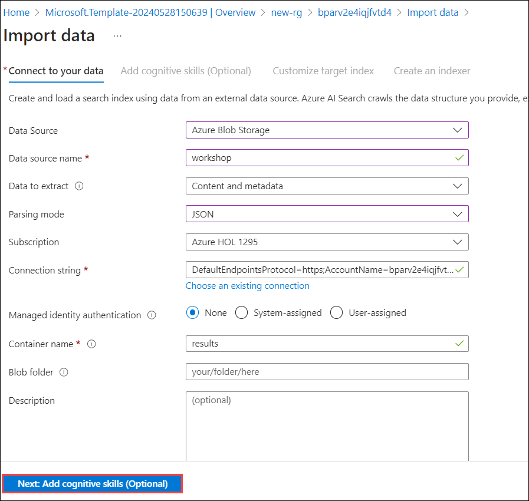

7. On the **Add cognitive skills (Optional)**, click on **Skip to : Customize target index**.

8. On the **Customize target index**, enter the index name as **azureblob-index** **(1)**, make all fields **Retrievable** **(2)**, and **Searchable** **(3)**.

      

9. Expand the **analyzeResults** **(1)** > **documents** **(2)** > **fields** **(3)**. Under it, expand **Organization_sample (4)**. Make the three fields Facetable **(type, valueString, & content)** **(5)** and click on **Next: Create an indexer** **(6)**.

   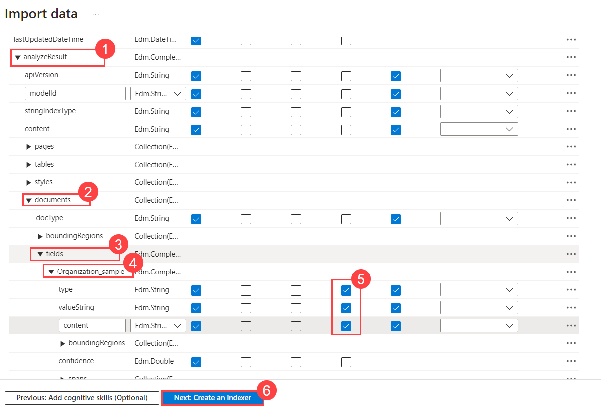

10. On the **Create an indexer** page, enter the name as **azureblob-indexer** **(1)** and click on **Submit** **(2)**.
   
    
