# Challenge 05: Load Balancing Azure OpenAI Resources

## Lab scenario
Have you ever experienced a failure in Azure OpenAI Service (AOAI) because a provisioned AOAI resource is out of service or the API is unavailable due to Rate Limit? Fortunately, Azure allows multiple AOAI resources to be created in multiple regions, which can be used to load balance traffic and automatically remove non-functioning resources from the back end to provide redundancy. But how?
This lab session proposes several approaches for load balancing of AOAI resources and provides step-by-step procedures.

## Prerequisites
1. You have already created the AOAI (Azure OpenAI) resource named **endpoint-us1-<inject key="Deployment-id" enableCopy="false"></inject>** in the eastus region and its endpoint is https://endpoint-us1-<inject key="Deployment-id" enableCopy="false"></inject>.openai.azure.com/.
2. You have already deployed the **gpt-35-turbo** model with the same name `gpt-35-turbo`.
3. You have already deployed the **text-embedding-ada-002** model with the same name `text-embedding-ada-002`.
4. You already have one copy of the valid API key.
5. You have already set up the HTTP client of your choice such as curl command.

## Solution Guide

### Task 1: Setting up the prerequisites

### Task 1.1: Provision an Azure OpenAI resource

1. In the **Azure portal**, search for **OpenAI** and select **Azure OpenAI**.

   

2. On the Azure AI services | Azure OpenAI blade, click on the **+ Create** button.

   

3. Create an **Azure OpenAI** resource with the following settings:
    - **Subscription**: Default - Pre-assigned subscription **(1)**
    - **Resource group**: Default - Select the pre-created resource group **(2)**
    - **Region**: Select **East US (3)**
    - **Name**: endpoint-us1-<inject key="Deployment-id" enableCopy="false"></inject> **(4)**
    - **Pricing tier**: Standard S0 **(5)**

   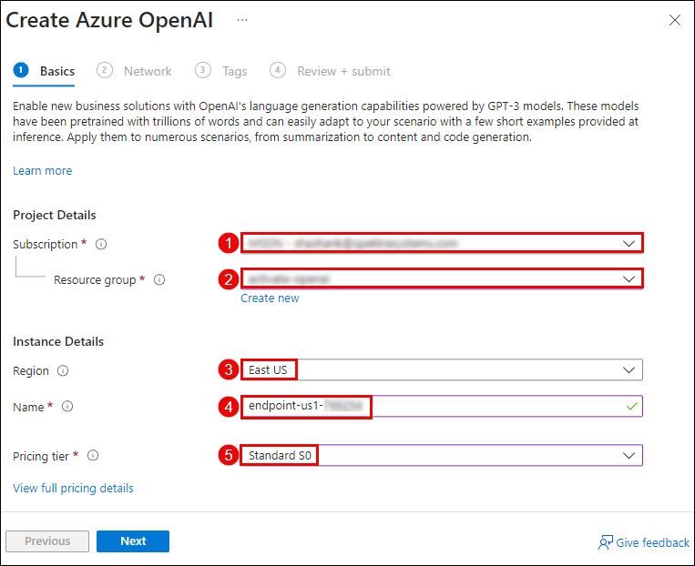

    >**Note:** Leave all the other configurations at default and click on **Create** within **Review + submit** tab.

4. Wait for deployment to complete. Then navigate to the newly deployed Azure OpenAI resource in the Azure portal.

5. To capture the values of the Azure OpenAI's key and endpoint, execute the following steps:
    - Select **Keys and Endpoints (1)** under the **Resource Management** section from the left navigation pane.
    - Click on **Show Keys (2)**.
    - Copy **Key 1 (3)** and ensure to paste it in a text editor such as notepad for future reference.
    - Finally copy the **Endpoint (4)** API URL by clicking on copy to clipboard. Paste it in a text editor such as notepad for later use.

   

### Task 1.2: Deploy OpenAI models
Azure OpenAI provides a web-based portal named **Azure OpenAI Studio**, that you can use to deploy, manage, and explore models. You'll start your exploration of Azure OpenAI by using Azure OpenAI Studio to deploy a model.

1. In the **Azure portal**, search for **OpenAI** and select **Azure OpenAI**.

   

2. On **Azure AI Services | Azure OpenAI** blade, select **endpoint-us1-<inject key="Deployment-id" enableCopy="false"></inject>**.

   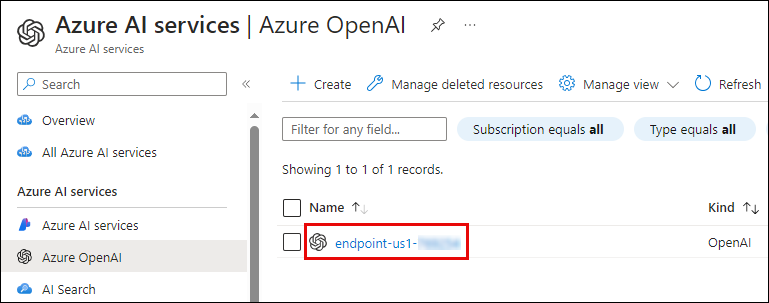

3. In the Azure OpenAI resource pane, click on **Go to Azure OpenAI Studio** it will navaigate to **Azure AI Studio**.

   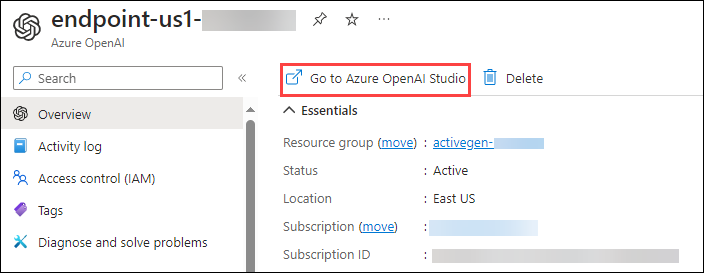

4. In **Welcome to Azure OpenAI Service** page, click on **Create new deployment**.

   

5. In the **Deployments** page, click on **+ Create new deployment**.

   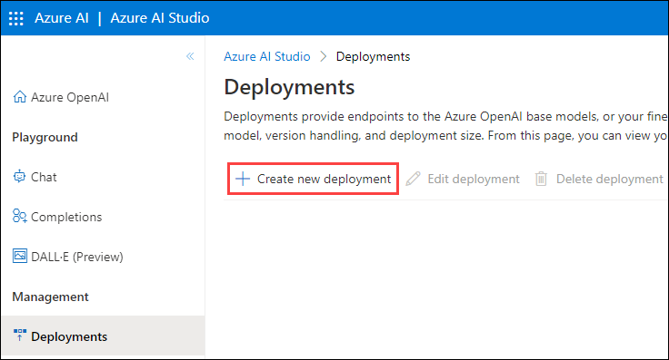

6. Within the **Deploy model** pop-up interface, enter the following details:
    - **Select a Model**: gpt-35-turbo **(1)**
    - **Model version**: Auto-update to default **(2)**
    - **Deployment name**: gpt-35-turbo **(3)**
    - Click on **Advanced Settings** **(4)**
    - **Tokens per Minute Rate Limit (thousands)**: 1K **(5)**
    - **Enable dynamic quota**: Enabled **(6)**
    - Click on **Create** **(7)**
  
   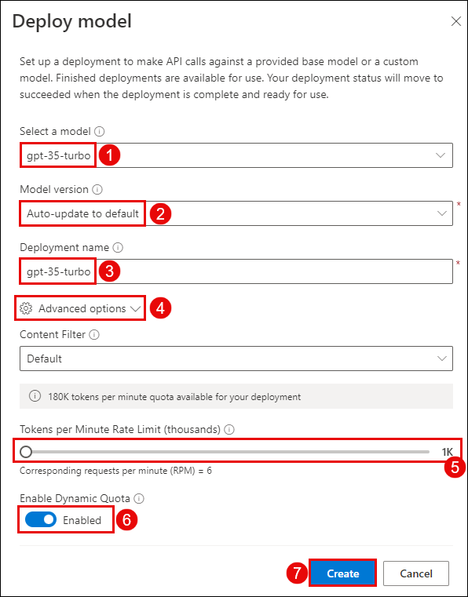

7. Staying on the **Deployments** page, click on **+ Create new deployment** again to create a new model deployment.

8. Within the **Deploy model** pop-up interface, enter the following details:
    - **Select a Model**: text-embedding-ada-002 **(1)**
    - **Model version**: 2 (Default) **(2)**
    - **Deployment name**: text-embedding-ada-002 **(3)**
    - Click on **Advanced Settings** **(4)**
    - **Tokens per Minute Rate Limit (thousands)**: 1K **(5)**
    - **Enable dynamic quota**: Enabled **(6)**
    - Click on **Create** **(7)**

   

> **Note**: You can ignore any error related to assignment of roles to view the quota limits. 

### Task 1.3: Setting up API Management

API Management (APIM) is a managed API management service provided by Azure that combines various backends together to provide a unified interface for APIs. If properly configured, users only need to access the APIM’s endpoint, which can load balance multiple AOAI resources or switch backend in the event of errors.

1. In the **Azure portal**, search for and select **API Management Services**.

   

2. Select **apim-service-<inject key="Deployment-id" enableCopy="false"></inject>**

   

3. To add a new API into the API Management service, follow the steps below:
    - Select **APIs (1)** under the **APIs** section within the left navigation pane of the APIM blade.

         >**Note:** Here you can define the API and configure how it will be forwarded to the backend and finally returned to the user. There is a pre-defined          “Echo API” that is very useful as a reference.
         
    - Click on **+ Add API (2)**.
    - Select the **HTTP-Manually define an HTTP API (3)**.
    - Within the **Create an HTTP API** pop-up, enter the following:
        - **Display Name:** `My Cool OpenAI Test` **(4)**
        - **Name:** my-cool-openai-test (this field is auto-populated)
          
             >**Note:** Leave the other fields at default.
             
        - Click on **Create (5)**.

             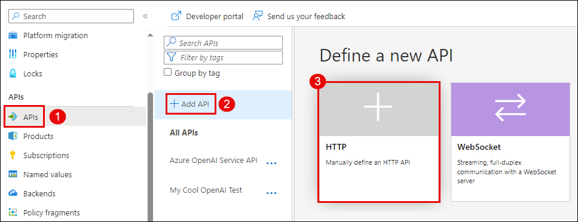
   
             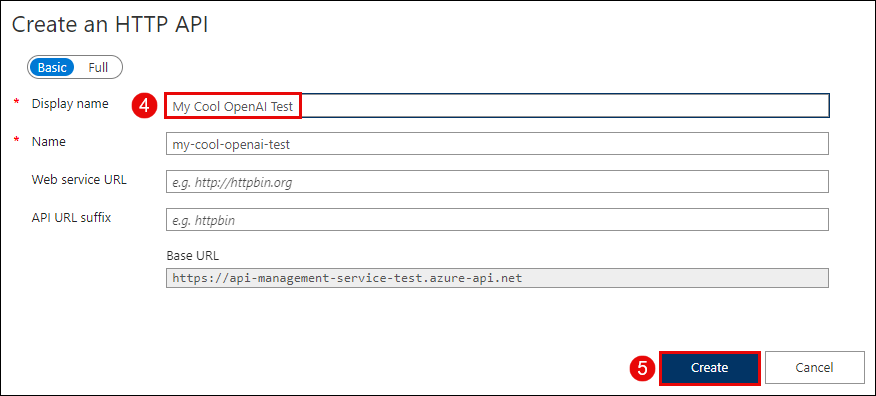 

5. To configure the newly created API with an API URL suffix, perform the following:
    - Select the **My Cool OpenAI Test (1)** API.
    - Switch to the **Settings (2)** tab.
    - **API URL suffix:** openai-test **(3)**
      
         >**Note:** Here, the base URL is shared with other APIs (e.g., Echo API); you can make this API endpoint unique by adding any suffix in the API URL            suffix field.
         
    - Under **Products**, select the pre-defined **Unlimited (4)** product.
    - Ensure to uncheck **Subscription required (5)**.
    - Click on **Save (6)**.

         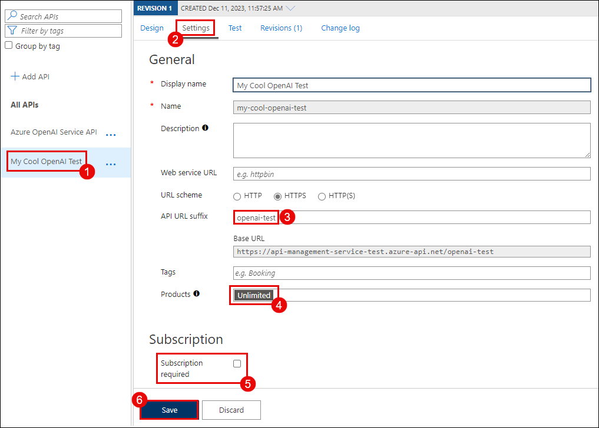

6. Now that the basic setup is complete, let’s briefly explain the basic flow of APIM, which divides the process from API call to response into several stages.

    - Frontend: HTTP Methods and URL paths
    - Inbound processing: Modify the request before it is sent to the backend
    - Backend: Backend’s HTTP(s) endpoint
    - Outbound processing: Modify the response before it is sent to the client

   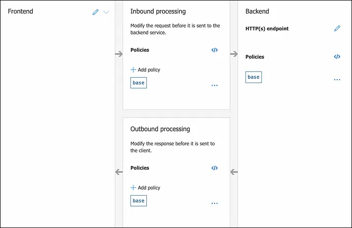

## Task 2: Use API Management as API proxy

### Task 2.1: Add API Frontend settings

1. In the **Azure portal**, search for and select **API Management Services**.

   

2. Select **apim-service-<inject key="Deployment-id" enableCopy="false"></inject>**

   

3. Now we need to be able to access the **Completions API** and **Embeddings API** when we use AOAI resources via APIM. Since each of them has a differenct URL path, they need to be mapped to the backend with different paths as well. Ensuring that the basic flow of APIM is understood, perform the following steps to add the API Frontend settings:
    - Select **APIs (1)** under the **APIs** section within the left navigation pane of the APIM blade.
    - Select **My Cool OpenAI Test (2)** API.
    - Switch to the **Design (3)** tab.
    - Click on **+ Add operation (4)**.
    - Within the **Frontend** page, enter the following:
        - **Display Name:** chat/completions **(5)**
        - **Name:** chat-completions (auto populated)
        - **URL:** 
                - Select **POST (6)** from the dropdown
                - Enter `/openai/deployments/{deployment}/chat/completions` **(7)**
          
             >**Note:** The `{deployment}` part is a variable that the user can change upon request to match the deployed model name.
             
        - Within the Template parameters section, 
            - **TYPE:**  Enter **string** **(8)**
            - **VALUES:** 
                - Click on **+ Add value** and type **gpt-35-turbo (9)**
        - Click on **Save (10)**.

   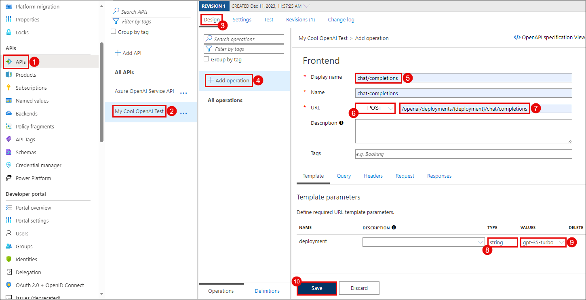

4. Likewise, let's add another operation for Embeddings API:
    - Select **APIs (1)** under the **APIs** section within the left navigation pane of the APIM blade.
    - Select **My Cool OpenAI Test (2)** API.
    - Switch to the **Design (3)** tab.
    - Click on **+ Add operation (4)**.
    - Within the **Frontend** page, enter the following:
        - **Display Name:** embeddings **(5)**
        - **Name:** chat-completions (auto populated)
        - **URL:** 
                - Select **POST (6)** from the dropdown
                - Enter `/openai/deployments/{deployment}/embeddings` **(7)**

          >**Note:** The `{deployment}` part is a variable that the user can change upon request to match the deployed model name.
        - Within the Template parameters section, 
            - **TYPE:** string **(8)**
            - **VALUES:** 
                - Click on **+ Add value** and type **text-embedding-ada-002 (9)**
        - Click on **Save (10)**.

   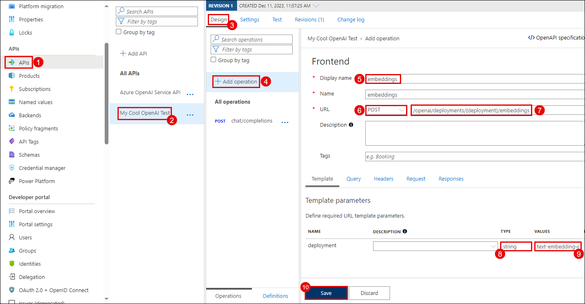

### Task 2.2: Connect an Azure OpenAI resource to APIM

Now, the goal is to achieve load balancing and redundancy with multiple AOAI resources.

1. Within the **APIs** blade of the API Management service,
    - Select the **My Cool OpenAI Test (1)** API.
    - Switch to the **Design (2)** tab.
    - Ensure to select **All operations (3)**.
    - Wihtin the **Backend** tile, click on edit **HTTP(s) endpoint (4)**.
    - Within the **Backend** page, specify the AOAI resource **Service URL (5)** with the AOAI endpoint URL that was copied earier over a notepad.
    - Ensure that the **Override (6)** checkbox is checked.
    - Click on **Save (7)**.

         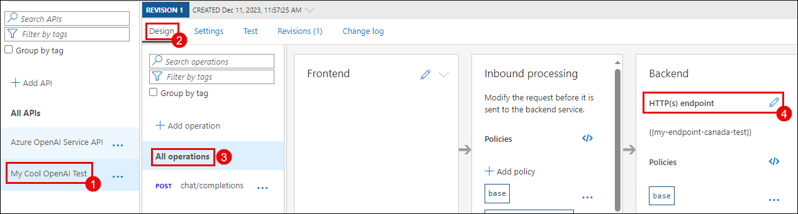
      
         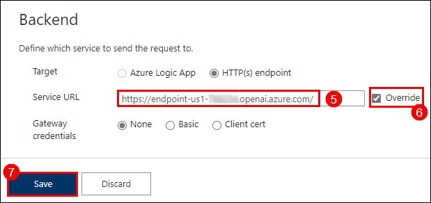

2. Now let's try accessing the API using the APIM endpoint. Your APIM endpoint should look like this: `https://<APIM resource name>.azure-api.net/openai-test/openai/deployments/gpt-35-turbo/chat/completions?api-version=2023–05–15`. Within the **APIs** blade of the API Management service, follow the below steps to know your APIM endpoint:
    - Select the **My Cool OpenAI Test** API.
    - Switch to the **Settings** tab.
    - Under the **General** section, note the **Base URL** which marks the APIM endpoint. Copy this URL over a notepad for future reference.

3. Use the **Cloud Shell** button **[\>_]** to the right of the search bar at the top of the page to create a new Cloud Shell in the Azure portal, selecting a ***Bash*** environment. Please click on **Additional settings** and make the following changes:

   - Use the **existing** resource group (1).
   - **Create new** storage A/c and provide the name as **store<inject key="Deployment-id" enableCopy="false"></inject>** (2).
   - **Create new** file share and provid the name as **fileshare<inject key="Deployment-id" enableCopy="false"></inject>** (3).
   - Click on **Create Storage** (4).

     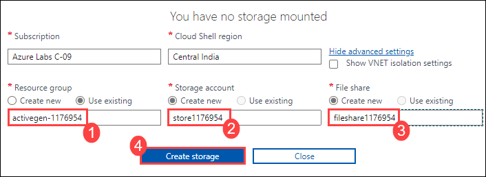
  
4. The cloud shell provides a command line interface in a pane at the bottom of the Azure portal, as shown here:

      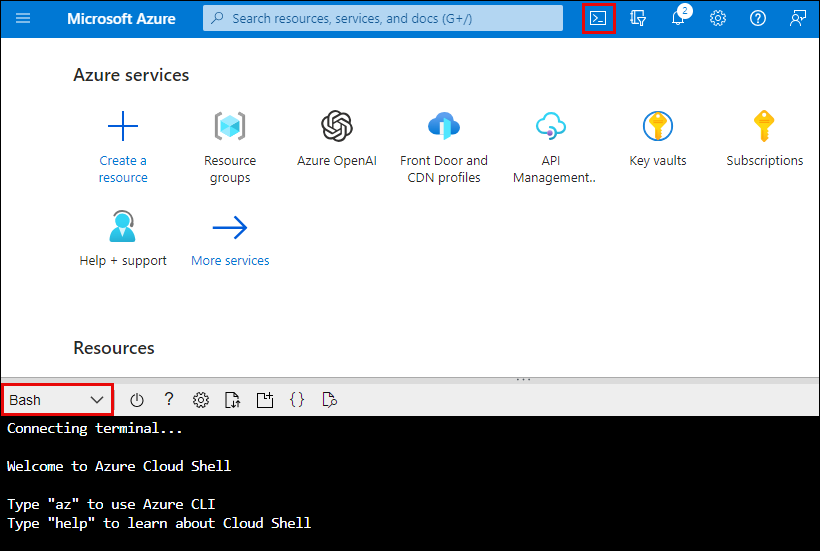

    > **Note**: If you have previously created a cloud shell that uses a *Bash* environment, use the drop-down menu at the top left of the cloud shell pane to change it to ***PowerShell***.

5. Note that you can resize the cloud shell by dragging the separator bar at the top of the pane, or by using the **&#8212;**, **&#9723;**, and **X** icons at the top right of the pane to minimize, maximize, and close the pane. For more information about using the Azure Cloud Shell, see the [Azure Cloud Shell documentation](https://docs.microsoft.com/azure/cloud-shell/overview).

6. In the Bash pane, enter the following commands to access the chat completions API via APIM:

    ```Bash
    # Chat Completions API via APIM
    curl "https://${APIM resource name}.azure-api.net/openai-test/openai/deployments/gpt-35-turbo/chat/completions?api-version=2023-05-15" \
    -H "Content-Type: application/json" \
    -H "api-key: ${API_KEY}" \
    -d '{
    "messages": [{"role": "user", "content": "Tell me about Azure OpenAI Service."}]
    }'
    ```

    >**Note:** Ensure to replace the `${APIM resource name}` with the name of your API Management service.
    
    >**Note:** Replace `${API_KEY}` with the AOAI key that was copied earlier onto a notepad.

7. Upon running the above command to call the chat completions API, you should receive the following appropriate response as shown below if the API key setting is correct:

   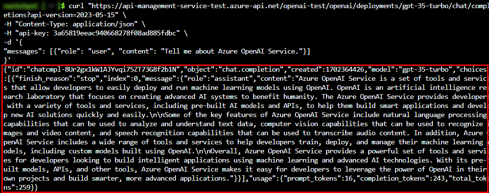

    >**Note:** Similarly even the Embeddings API should work in the same way given that a sample document is uploaded and its appropriate path is provided.

    >**Note:** Below is the sample code for accessing the Embeddings API. Feel free to play around with the code for more clarity.

    ```Bash
    # Embeddings API via APIM
    curl "https://${APIM resource name}.azure-api.net/openai-test/openai/deployments/text-embedding-ada-002/embeddings?api-version=2023-05-15" \
    -H "Content-Type: application/json" \
    -H "api-key: ${API_KEY}" \
    -d '{"input": "Sample Document URL goes here"}'
    ```

### Task 2.3: Automatically load values and secrets

The scenario in the previous tasks included APIM and AOAI to be linked one-to-one and the API key of AOAI ws directly specified in the request header of the bash command to access the needed API. A question arises here. What if down the road we have to handle multiple AOAI resources on the backend? Since the API Key is different for each AOAI resource, we cannot specify it in the header. Let's understand how to handle this issue.

1. Within the global search bar, search for and select the **API Management Services**.

   

2. Select **apim-service-<inject key="Deployment-id" enableCopy="false"></inject>**.

   

3. Select **Named Values (1)** under the **API** section in the left navigation pane of the API Management Service and then click on **+ Add (2)**.

   

4. To add the AOAI endpoint, within the **Add named values** pane enter the following:
    - **Name:** endpoint-us1 **(1)**
    - **Display Name:** endpoint-us1 **(2)**
    - **Type:** Select **Plain (3)**
    - **Value:** Enter the Azure OpenAI endpoint that was copied earlier onto a notepad **(4)**
    - Click on **Save (4)**.

         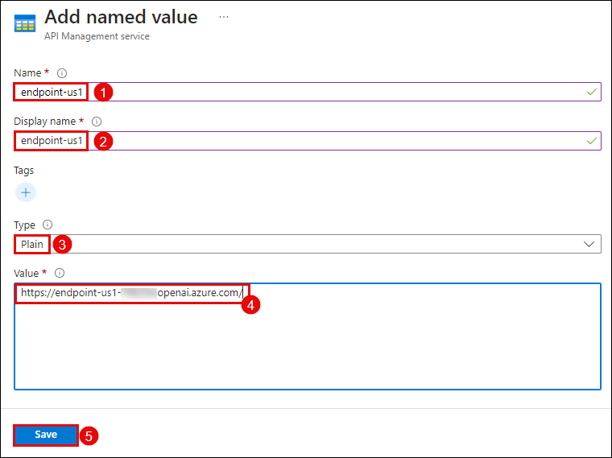

5. Within the **APIs** blade of the API Management service,
   - Select the **My Cool OpenAI Test (1)** API.
   - Switch to the **Design (2)** tab.
   - Ensure to select **All operations (3)**.
   - Click on **Backend** and then edit **HTTP(s) endpoint (4)**.
   - Within the **Backend** page, enter the following:
      - **Service URl:** `{{endpoint-us1}}` **(5)**
   - Ensure that the **Override (6)** checkbox is checked.
   - Click on **Save (7)**.

        
     
        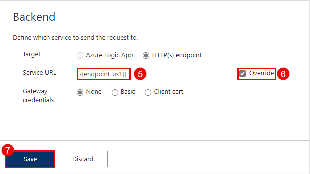

6. Navigate back to the **Named Values (1)** under the **APIs** section in the left navigation pane of the API Management Service and then click on **+ Add (2)**.

   

7. To add the AOAI key, within the **Add named values** pane enter the following:
    - **Name:** endpoint-us1-key **(1)**
    - **Display Name:** endpoint-us1-key **(2)**
    - **Type:** Select **Secret (3)**
    - **Value:** Enter the Azure OpenAI key value that was copied earlier onto a notepad **(4)**
    - Click on **Save (5)**.

   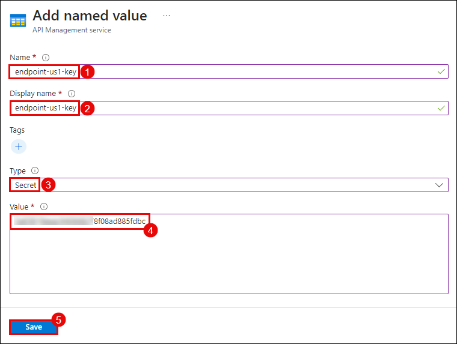

8. Navigate back to **APIs** under the **APIs** section in the left navigation pane of the API Management Service.

9. Now, let's set the above named value pointing to the AOAI key in the header. Inorder to do this,
   - Select the **My Cool OpenAI Test (1)** API.
   - Switch to the **Design (2)** tab.
   - Ensure to select **All operations (3)**.
   - Click on `</>` **(4)** next to **Policies** within the **Inbound processing** tile.
   
   >**Note:** “Policies” is where processing and calculations can be inserted at each stage of the request and response.

   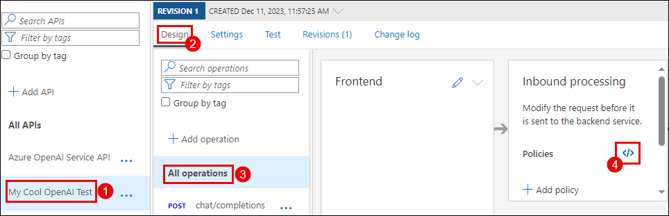

10. The AOAI key is set using `<set-header name=”api-key”>` and the value will be the secret which was added within named values using `{{endpoint-us1-key}}`. Within the policy editor, replace the existing policy with the policy given below and then click on **Save**.

   ```Policy
   <policies>
    <inbound>
        <base />
        <set-backend-service base-url="{{endpoint-us1}}" />
        <set-header name="api-key" exists-action="override">
            <value>{{endpoint-us1-key}}</value>
        </set-header>
    </inbound>
    <backend>
        <base />
    </backend>
    <outbound>
        <base />
    </outbound>
    <on-error>
        <base />
    </on-error>
   </policies>
   ```

   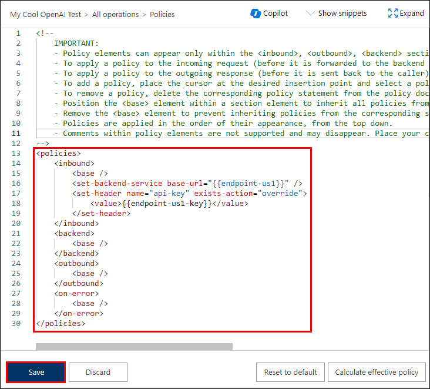

11. Use the **Cloud Shell** button **[\>_]** to the right of the search bar at the top of the page to reopen/create a new Cloud Shell in the Azure portal, selecting a ***Bash*** environment and creating storage if prompted. The cloud shell provides a command line interface in a pane at the bottom of the Azure portal.

12. After having updating the inbound procesing policy, in the Bash pane, enter the following commands to access the chat completions API via APIM but this time without the `api-key` header from the curl request:

    ```Bash
    # Chat Completions API via APIM
    curl "https://${APIM resource name}.azure-api.net/openai-test/openai/deployments/gpt-35-turbo/chat/completions?api-version=2023-05-15" \
    -H "Content-Type: application/json" \
    -d '{"messages": [{"role": "user", "content": "Tell me about Azure OpenAI Service."}]}'
    ```

    >**Note:** Ensure to replace the `${APIM resource name}` with the name of your API Management service.

13. Upon running the above command to call the chat completions API, you should receive the following appropriate response:

   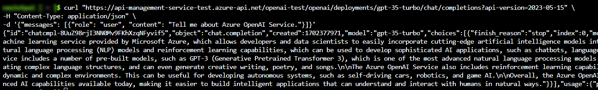

   >**Note:** Similarly even the Embeddings API should work in the same way given that a sample document is uploaded and its appropriate path is provided.

### Task 2.4: Verify communication details

What steps can we take to troubleshoot our API testing with the curl command if it's not functioning properly? Fortunately, APIM offers a robust built-in testing feature.

1. Within the **APIs** blade of the API Management service,
    - Select the **My Cool OpenAI Test (1)** API.
    - Switch to the **Test (2)** tab.
    - Select the **POST chat/completions (3)** operation
    - Within the chat/completions console, enter the following details:
      - **Template parameters** section:
         - **VALUE:** Select `gpt-35-turbo` **(4)**
      - **Query parameters** section:
         - Click on **+ Add parameter (5)**.
         - **NAME:** `api-version` **(6)**
         - **VALUE:** `2023-05-15` **(7)**
      - **Headers** section:
         - Click on **+ Add header (8)**.
         - **NAME:** Select `Content-Type` from the dropdown **(9)**
         - **VALUE:** `application/json` **(10)**
      - **Request body** section:
         - Ensure that the **Raw (11)** radio option is selected.
         - Enter the following JSON of the request body **(12)**:

         ```JSON
         {"messages": [{"role": "user", "content": "Tell me about Azure API Management Service."}]}
         ``` 

         - Click on the **Trace (13)** button.

   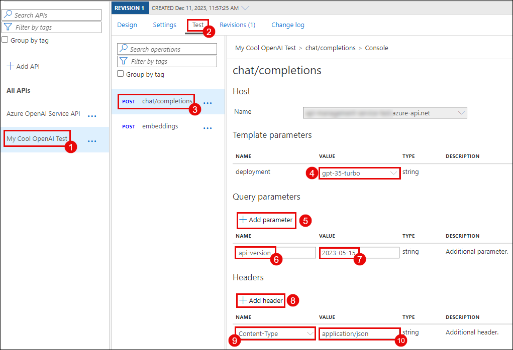
   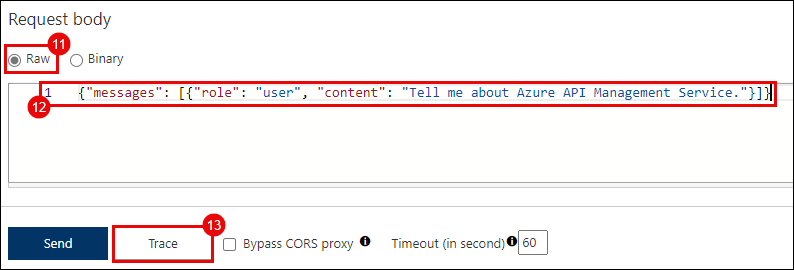

2. If asked, click on **Enable tracing for an hour**.

   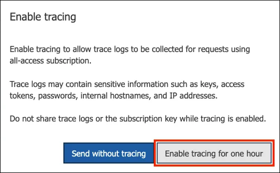

3. Scroll down to the **HTTP response** section and within the **Message tab** notice the HTTP 200 success status which has a response from the assistant in JSON as shown below:

   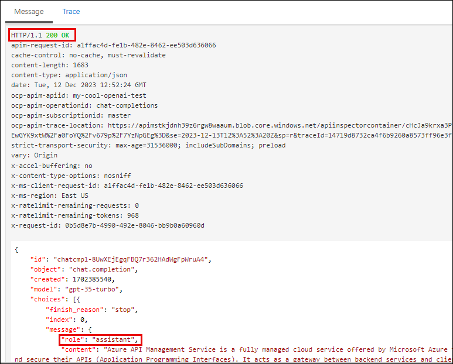

4. Switch to the **Trace** tab within the **HTTP response** section and scroll down to view the named values. 

   >**Note:** In this view, the entire process of the API receiving the request, forwarding it to the backend, and finally returning the response to the user is recorded verbatim. Notice the named values that were set in the previous section are used correctly and set in the header through policy expressions. This trace feature can be used for debugging.

   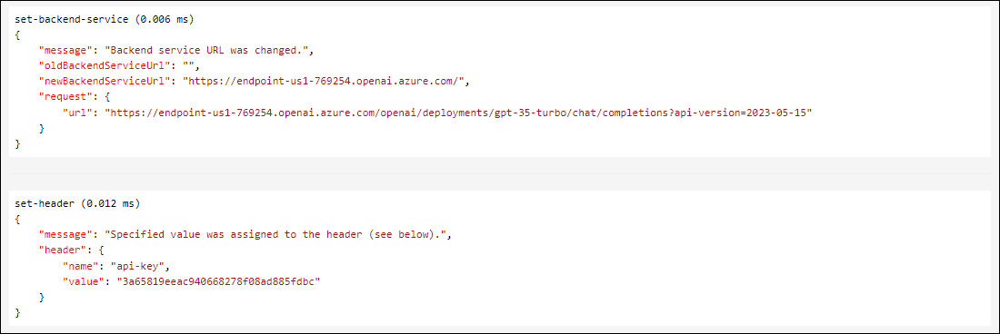

## Task 3: Load Balancing Azure OpenAI resources

In this task, we will try to load-balance AOAI resources using the policies that have been defined earlier in this lab session.

### Task 3.1: Provision an Azure OpenAI resource

This sub-task includes the creation of a new Azure OpenAI instance deployed in the `australiaeast` region in addition to the earlier created AOAI resource dpeloyed in the `eastus` region.

1. In the **Azure portal**, search for **OpenAI** and select **Azure OpenAI**.

   

2. On the Azure AI services | Azure OpenAI blade, click on the **+ Create** button.

   

3. Create an **Azure OpenAI** resource with the following settings:
    - **Subscription**: Default - Pre-assigned subscription
    - **Resource group**: Default - Select the pre-created resource group
    - **Region**: Select **australiaeast (1)**
    - **Name**: endpoint-australia-<inject key="Deployment-id" enableCopy="false"></inject> **(2)**
    - **Pricing tier**: Standard S0 **(3)**

   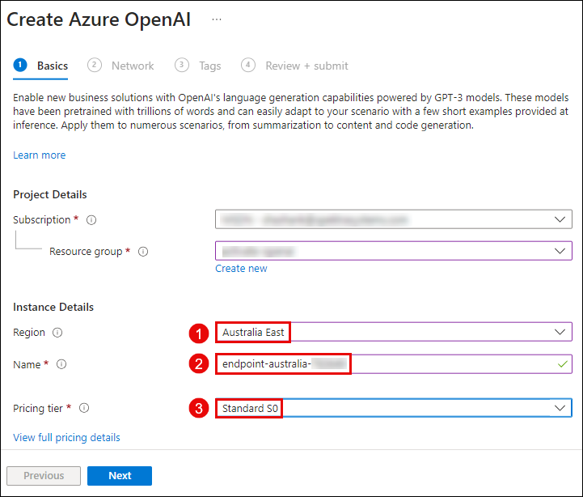

    >**Note:** Leave all the other configurations at default and then click on **Create** within the **Review + submit** tab.

4. Wait for deployment to complete. Then navigate to the newly deployed Azure OpenAI resource in the Azure portal.

5. To capture the values of the Azure OpenAI's key and endpoint, execute the following steps:
    - Select **Keys and Endpoints (1)** under the **Resource Management** section from the left navigation pane.
    - Click on **Show Keys (2)**.
    - Copy **Key 1 (3)** and ensure to paste it in a text editor such as notepad for future reference.
    - Finally copy the **Endpoint (4)** API URL by clicking on copy to clipboard. Paste it in a text editor such as notepad for later use.

   

### Task 3.2: Deploy OpenAI model

1. In the **Azure portal**, search for **OpenAI** and select **Azure OpenAI**.

   

2. On **Azure AI Services | Azure OpenAI** blade, select **endpoint-australia-<inject key="Deployment-id" enableCopy="false"></inject>**.

   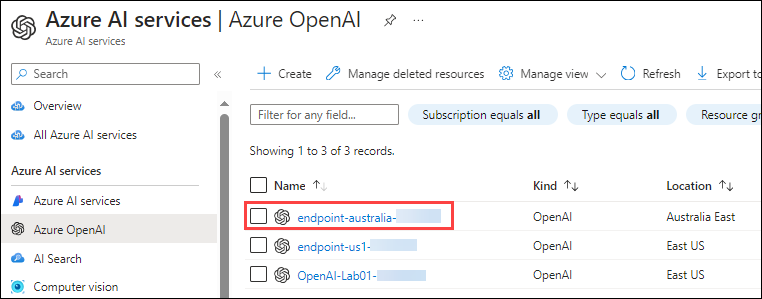

3. In the Azure OpenAI resource pane, click on **Go to Azure OpenAI Studio** it will navaigate to **Azure AI Studio**.

   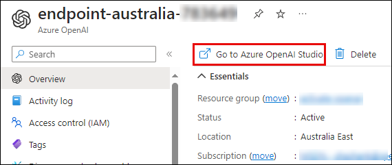

4. In **Welcome to Azure OpenAI Service** page, click on **Create new deployment**.

   

5. In the **Deployments** page, click on **+ Create new deployment**.

   

6. Within the **Deploy model** pop-up interface, enter the following details:
    - **Select a Model**: gpt-35-turbo **(1)**
    - **Model version**: Auto-update to default **(2)**
    - **Deployment name**: gpt-35-turbo **(3)**
    - Click on **Advanced Settings** **(4)**
    - **Tokens per Minute Rate Limit (thousands)**: 1K **(5)**
    - **Enable dynamic quota**: Enabled **(6)**
    - Click on **Create** **(7)**
  
   

   >**Note:** `text-embedding-ada-002` is not available in this region.

   > **Note**: You can ignore any error related to assignment of roles to view the quota limits.

### Task 3.3: Set up Named values for the AOAI key and endpoint

1. Within the global search bar, search for and select the **API Management Services**.

   

2. Select **apim-service-<inject key="Deployment-id" enableCopy="false"></inject>**.

   

3. Select **Named Values (1)** under the **API** section in the left navigation pane of the API Management Service and then click on **+ Add (2)**.

   

4. To add the AOAI endpoint, within the **Add named values** pane enter the following:
    - **Name:** endpoint-australia **(1)**
    - **Display Name:** endpoint-australia **(2)**
    - **Type:** Select **Plain (3)**
    - **Value:** Enter the Azure OpenAI endpoint of the instance deployed in the australia region. **(4)**
    - Click on **Save (4)**.
    
   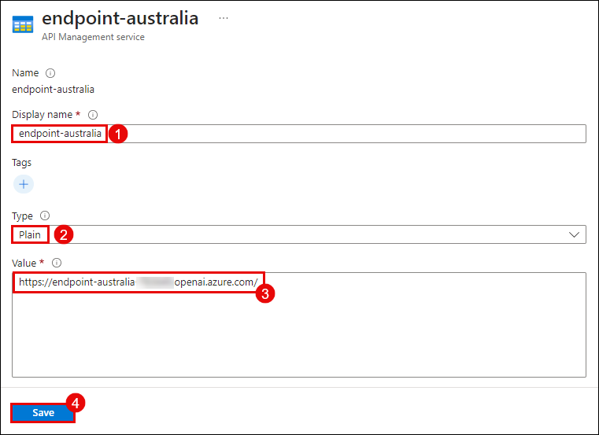

5. To add the AOAI key, within the **Add named values** pane enter the following:
    - **Name:** endpoint-australia-key **(1)**
    - **Display Name:** endpoint-australia-key **(2)**
    - **Type:** Select **Secret (3)**
    - **Value:** Enter the Azure OpenAI key value of the instance that's deployed in the australia region. **(4)**
    - Click on **Save (5)**.

   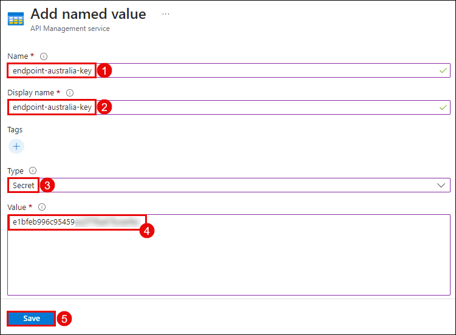

6. Navigate back to **APIs** under the **APIs** section in the left navigation pane of the API Management Service.

7. Now, let's set the above named value pointing to the AOAI key in the header. Inorder to do this,
   - Select the **My Cool OpenAI Test (1)** API.
   - Switch to the **Design (2)** tab.
   - Ensure to select **All operations (3)**.
   - Click on `</>` **(4)** next to **Policies** within the **Inbound processing** tile.

   >**Note:** “Policies” is where processing and calculations can be inserted at each stage of the request and response.

   

8. Update the policy as follows and then click on **Save**.

   ```C#
   <policies>
    <inbound>
        <base />
        <set-variable name="rand" value="@(new Random().Next(0, 2))" />
        <choose>
            <when condition="@(context.Variables.GetValueOrDefault<int>("rand") == 0)">
                <set-backend-service base-url="{{endpoint-us1}}" />
                <set-header name="api-key" exists-action="override">
                    <value>{{endpoint-us1-key}}</value>
                </set-header>
            </when>
            <when condition="@(context.Variables.GetValueOrDefault<int>("rand") == 1)">
                <set-backend-service base-url="{{endpoint-australia}}" />
                <set-header name="api-key" exists-action="override">
                    <value>{{endpoint-australia-key}}</value>
                </set-header>
            </when>
            <otherwise />
        </choose>
    </inbound>
   <backend>
        <base />
   </backend>
   <outbound>
        <base />
   </outbound>
   <on-error>
        <base />
   </on-error>
   </policies>
   ```

The above policy, First, `@(new Random().Next(0, 2))` generates a random number and assigns it to the rand variable. Next, `<choose>` and `<when>` are combined to branch the case according to the value of the variable. This is similar to a switch in a general programming language. Depending on the value, the backend and its key is changed dynamically.

### Task 3.4: Test and trace the API

1. Within the **APIs** blade of the API Management service,
    - Select the **My Cool OpenAI Test (1)** API.
    - Switch to the **Test (2)** tab.
    - Select the **POST embeddings (3)** operation
    - Within the embeddings console, enter the following details:
      - **Template parameters** section:
         - **VALUE:** Select `text-embedding-ada-002` **(4)**
      - **Query parameters** section:
         - Click on **+ Add parameter (5)**.
         - **NAME:** `api-version` **(6)**
         - **VALUE:** `2023-05-15` **(7)**
      - **Headers** section:
         - Click on **+ Add header (8)**.
         - **NAME:** Select `Content-Type` from the dropdown **(9)**
         - **VALUE:** `application/json` **(10)**
      - **Request body** section:
         - Ensure that the **Raw (11)** radio option is selected.
         - Enter the following JSON of the request body **(12)**:

         ```JSON
         {"input": "Sample Document goes here"}
         ``` 
      >**Note:** Ensure to replace the input with a sample document. However, you can use this sample document url: `https://www.africau.edu/images/default/sample.pdf`.

      - Click on the **Send (13)** button.
      - Once the response shows a status code of 200, click on **Trace (14)**.

2. If asked, click on **Enable tracing for an hour**.

   

3. Switch to the **Trace** tab within the **HTTP response** section and scroll down to view the named values. 

   >**Note:** In this view, the entire process of the API receiving the request, forwarding it to the backend, and finally returning the response to the user is recorded verbatim. Notice the named values that were set in the previous section are used correctly and set in the header through policy expressions. This trace feature can be used for debugging.

   

4. The **Trace** feature provides a detailed look at the evaluation of expressions and the subsequent processing branches. Here a random number `1` is selected and since the `text-embedding-ada-002` model is voide in the eastus region, the corresponding AOAI resource in Australia is selected for the backend.

   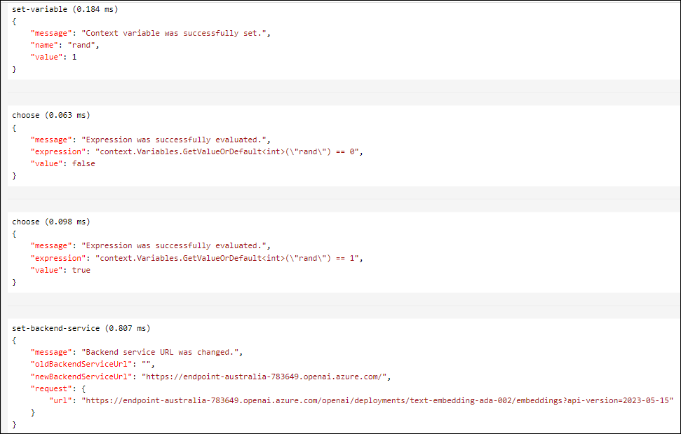

5. Repeat the tests many times to make sure that the backend switches correctly according to a random number and that the API returns a right response no matter where it is connected. This marks the final achievment of loadbalancing Azure OpenAI instances using the Azure API Management service.
