# Desafio 05: Processamento em lote de documentos sem servidor

## Introdução:

Bem-vindo a um desafio crucial em que a Contoso Ltd. visa aprimorar seu aplicativo de bate-papo com tecnologia de IA com um sistema de processamento de documentos robusto. Este desafio se concentra na criação de uma solução sem servidor para processar novos documentos, traduzi-los conforme necessário e armazená-los perfeitamente no Azure AI Search. Este sistema garantirá que esses documentos estejam continuamente disponíveis para consumo pelo Azure OpenAI, aprimorando a base de conhecimento e a precisão de resposta do aplicativo de bate-papo.

Com base em suas conquistas anteriores no balanceamento de carga de recursos do Azure OpenAI, você agora embarcará em uma jornada para otimizar o processamento de documentos. Isso envolve configurar um serviço de tradução, criar uma arquitetura sem servidor para processamento em lote usando serviços do Azure e aproveitar tecnologias como Form Recognizer e Azure AI Search. Sua tarefa é garantir que os documentos recém-adicionados sejam prontamente processados, analisados ​​e indexados, tornando-os prontamente disponíveis para a IA do aplicativo de bate-papo utilizar.

Este desafio se desdobra em três estágios principais: tradução de idioma, processamento em lote de documentos sem servidor usando serviços do Azure e aproveitamento de recursos avançados como Form Recognizer e pesquisa de IA. Começamos traduzindo arquivos para atender aos requisitos de idioma. Em seguida, você implanta uma arquitetura sem servidor, utilizando serviços do Azure, para processamento eficiente de documentos em lote. Você treina e testa nosso modelo, estabelece um pipeline para converter documentos em um formato Form Recognizer e traz o serviço de pesquisa de IA do Azure para verificar a presença de documentos específicos no conjunto de dados processados ​​de onde eles podem ser usados ​​pelo Azure OpenAI.

Você utilizará o Form Recognizer Service e o Business Process Automation (BPA) Accelerator para construir pipelines em vários serviços do Azure, criando uma solução de processamento de documentos perfeita. Este desafio é um passo em direção à concretização de uma solução de IA que pode se adaptar e crescer com as necessidades de negócios da Contoso.

# Guia de soluções

### Tarefa 1: traduzir os documentos usando o Translate

Nesta tarefa, você configurará os recursos do Azure para o Azure AI Services. Isso inclui registrar provedores, criar um novo serviço do Azure AI, aceitar os termos do Responsible AI, bifurcar um repositório do GitHub, gerar um Personal Access Token (PAT) e implantar recursos no Azure por meio do repositório do GitHub usando parâmetros e configurações especificados.

1. Na página do Portal do Azure, na caixa Pesquisar recursos, serviços e documentos (G+/) na parte superior do portal, insira **Assinaturas (1)** e selecione **Assinaturas (2)** em serviços.

    

1. Selecione a **Assinatura** existente.

    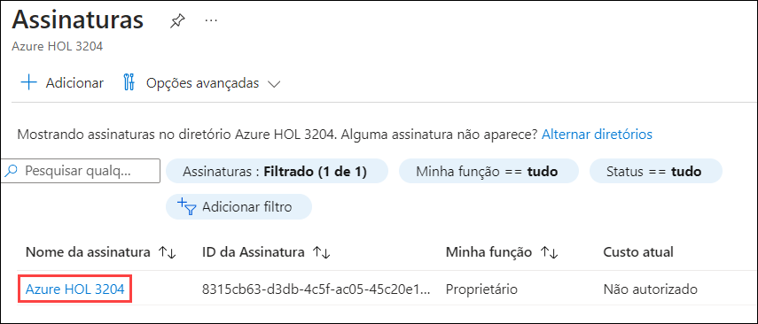

1. No painel de navegação esquerdo, expanda **Configurações (1)** e selecione **Provedores de Recursos (2)**, marque **O status do Microsoft DocumentDB** está marcado como **"Registered" (3)**.Se marcado como **NãoRegistrado**, selecione **Microsoft DocumentDB** e clique em **Registrar** no menu superior.

    **Observação**: *Este processo pode levar vários segundos ou minutos; certifique-se de atualizar todo o navegador periodicamente.*

    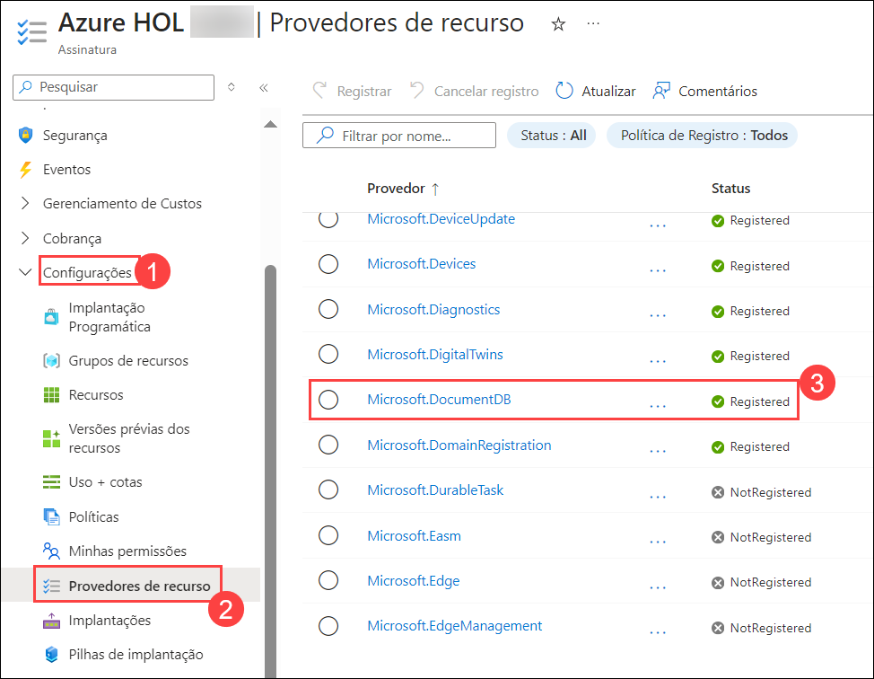

1. Na página do Portal do Azure, na caixa Pesquisar recursos, serviços e documentos (G+/) na parte superior do portal, insira **Conta multisserviço de serviços do Azure AI (1)** e selecione **Conta multisserviço de serviços do Azure AI (2)** em serviços.

    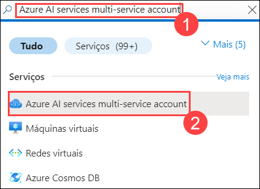

1. Na lâmina **Azure Al services | Azure Al services multi-service account**, clique em **+ Criar**.

    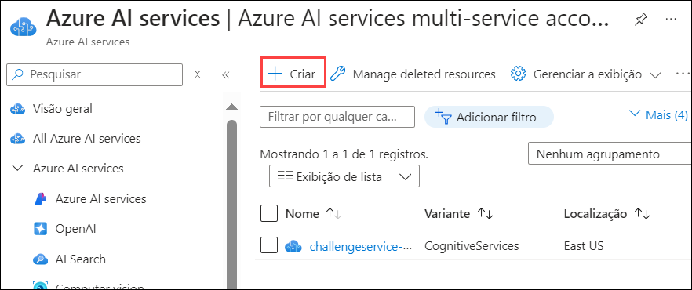

1. Especifique os seguintes detalhes para criar um **Serviços Cognitives** e clique na aba **Examiner + criar (7)**.

    | **Option** | **Value** |
    | ------------------ | ----------------------------------------------------- |
    | Assinatura | Deixe o padrão **(1)** |
    | Grupo de Recursos | **ODL-GenAI-CL-xxxxxx-Activate-GenAI** **(2)** |
      | Região | Use o mesmo local que o grupo de recursos **(3)** |
    | Nome | *Digite um nome exclusivo* para seu serviço de pesquisa ou use o formato **AI-Service-xxxxxx** (substitua **xxxxxx** por ID de implantação **(4)** |
    | Tipo de preço | Standard S0 **(5)** |
    | Ao marcar essa caixa, confirmo que li e compreendi todos os termos abaixo | Selecione a **Caixa de seleção** **(6)**|
    
    >**Observação**: aqui, xxxxxx se refere à ID de implantação

    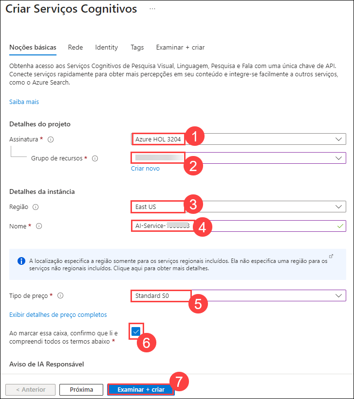

1. Assim que a validação for bem-sucedida na guia **Examinar + criar**, clique em **Criar** e aguarde a conclusão da implantação.

1. Para garantir que **Aceitamos os termos e condições para a IA responsável**: devemos iniciar a criação de uma **conta multisserviço do Azure AI Services** no portal do Azure para revisar e reconhecer os termos e condições.

    >**Observação**: Documento de referência: [Início rápido: criar um recurso de serviços cognitivos usando o portal do Azure](https://docs.microsoft.com/en-us/azure/cognitive-services/cognitive-services-apis-create-account?tabs=multiservice%2Cwindows). Depois de aceito, você pode criar recursos subsequentes usando qualquer ferramenta de implantação (SDK, CLI ou modelo ARM, etc.) na mesma assinatura do Azure.

1. Navegue até `https://github.com/CloudLabs-MOC/business-process-automation` e clique em **Sign in**, depois forneça seu **Nome de usuário do GitHub (1)** e **Senha (2)** pessoais e clique em **Sign in (3)**.

    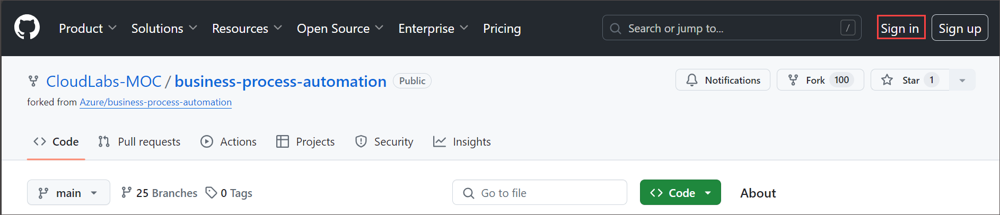
    
    

1. Depois de entrar, selecione **fork (1)** para bifurcar o repositório e, em **Criar um novo fork**, clique em **Create fork (2)**.

    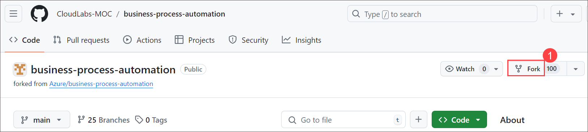
    
    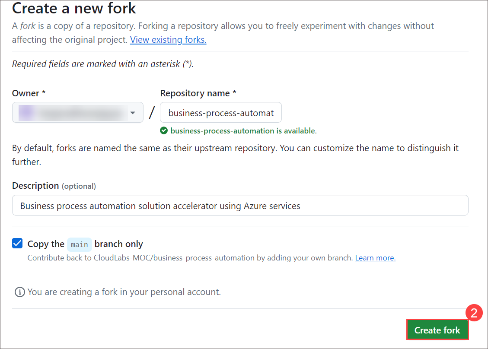

1. Clique no seu **perfil**, que está no topo da sua mão direita, e selecione **Settings**.

    

1. Role para baixo até o final e selecione **Developer settings**.

    

1. No painel de navegação esquerdo, expanda **Personal access tokens (1)** e selecione **Tokens (classic) (2)**. Na página **Personal access tokens**, clique em **Generate new token (3)** e escolha **Generate new token (classic) (4)**.

    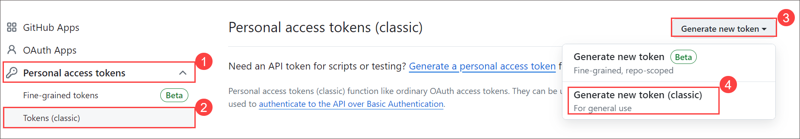

1. Forneça os seguintes detalhes:

    - Note: **PAT (1)**
    - Expiration: **7 days (2)**
    
       

    - Selecione os escopos: Selecione todos os escopos **repo, workflow, write:packages, delete:packages, admin:org, admin:public_key, admin:repo_hook, admin:org_hook, gist,notifications, user, delete_repo, write:discussion, admin:enterprise, audit_log, codespace, copilot, project, admin:gpg_key, admin:ssh_signing_key** e clique em **Generate token**.

       
    
       
    
       

       >**Link de referência**: [Obtenha um token de nível de fluxo de trabalho (clássico)](https://docs.github.com/en/authentication/keeping-your-account-and-data-secure/creating-a-personal-access-token)

1. Copie o **PAT token** e cole-o em um bloco de notas.

    

1. Clique no botão "Implantar no Azure" que corresponde ao seu ambiente.

    ### Com OpenAI
      

1. Lâmina de implantação personalizada, especifique o seguinte e outros parâmetros podem manter os valores padrão.

    - Grupo de recursos: **ODL-GenAI-CL-xxxxxx-Activate-GenAI**
    - Repository Token : cole o token PAT que você criou e registrou na etapa anterior.
    - Repository Url : cole a URL da **conta bifurcada do Github**
    
    

    >**Observação**: certifique-se de que a região primária esteja definida como EASTUS2
    
    

    >**Observação**: (você pode obter a URL clicando no perfil no canto direito e, em seguida, selecionar **Seus repositórios**, clicar em **business-process-automation** e, na barra superior, copiar a URL da **conta do Github**)
    
    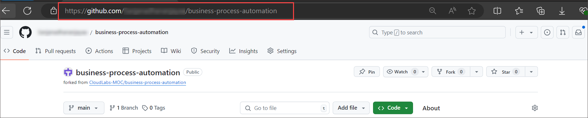

1. Clique em **Revisar + criar** e **Criar**.

1. Aguarde a conclusão da implantação e clique em **Ir para o grupo de recursos**.

1. Verifique se todos os recursos foram implantados sem problemas.

    
   
#### Tarefa 1.2 - Criar contêineres do Azure Blob Storage

Nesta tarefa, você aprenderá a criar um contêiner em uma conta de armazenamento existente onde os documentos que precisam ser pesquisados ​​são armazenados.

1. Na página do Portal do Azure, na caixa **Pesquisar recursos, serviços e documentos (G+/)** na parte superior do portal, insira **Conta de armazenamento** e selecione **Conta de armazenamento** em serviços.

1. Selecione a conta de armazenamento criada a partir dos recursos que foram implantados na tarefa anterior.

1. Na lâmina de visão geral da conta de armazenamento, expanda **Configurações (1)** selecione **Configuração (2)**, **Habilitado** o **Permitir acesso anônimo ao blob (3)** e clique em **Salvar (4)**.

    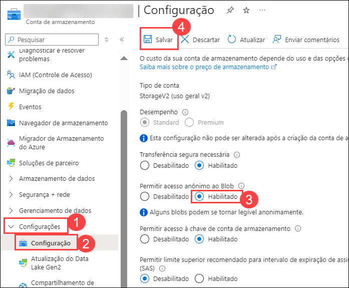

1. Expanda **Armazenamento de dados (1)** selecione **Contêineres (2)** no painel de navegação esquerdo, selecione **+ Contêiner (3)**.

    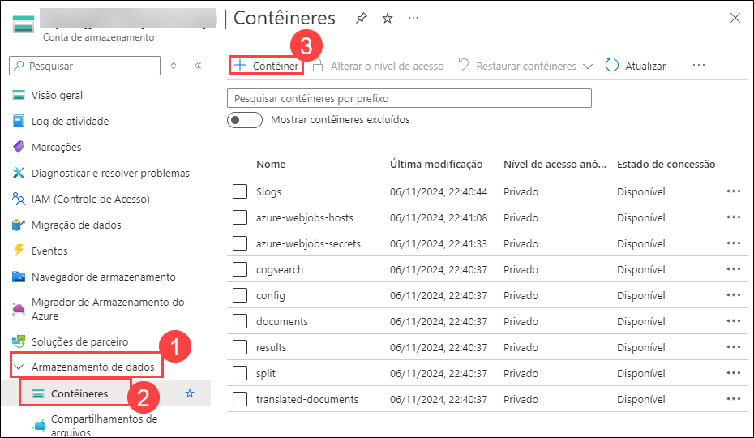

1. Na lâmina **Novo contêiner**, forneça o nome como **Source (1)** e, em **Nível de acesso anônimo**, selecione **Blob (acesso de leitura anônimo somente para blobs) (2)** e clique em **Criar (3)**.

    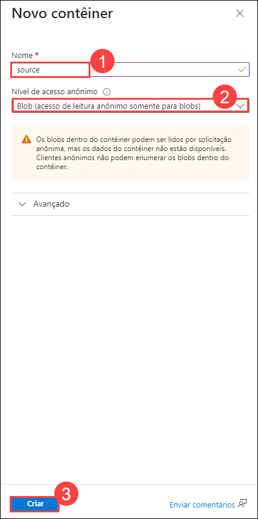

1. Clique no contêiner **Source**.

    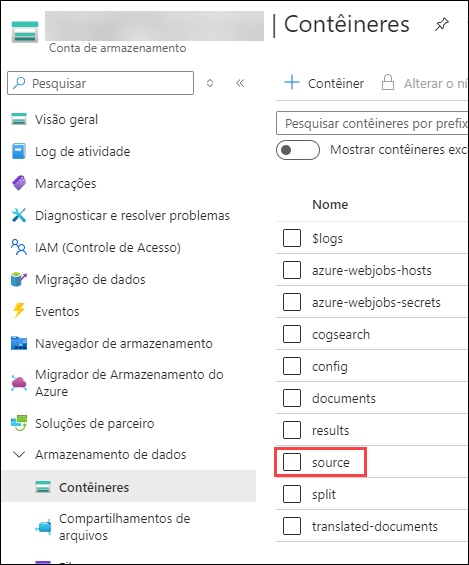

1. No painel de navegação esquerdo, expanda **Configurações (1)** e selecione **Tokens de acesso compartilhado (2)**. No menu suspenso **Permissão**, selecione **Ler (3)** e **Lista (4)** e clique em **Gerar token SAS e URL (5)**.

    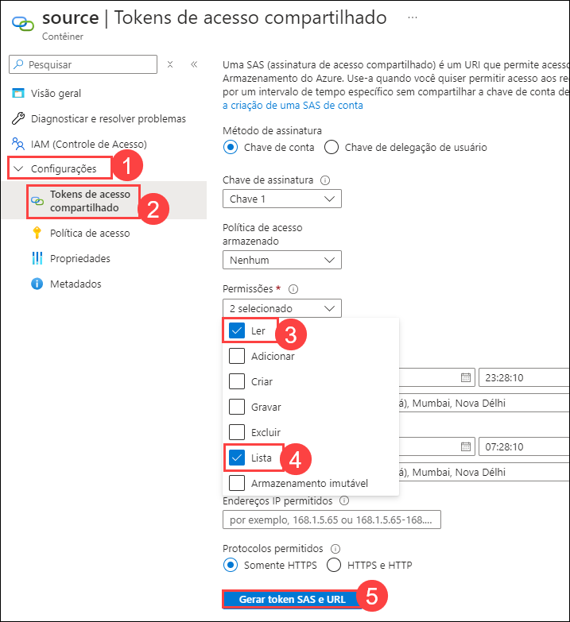

1. Após clicar em **Gerar token SAS e URL** role para baixo e copie o **URL de SAS do blob**.

    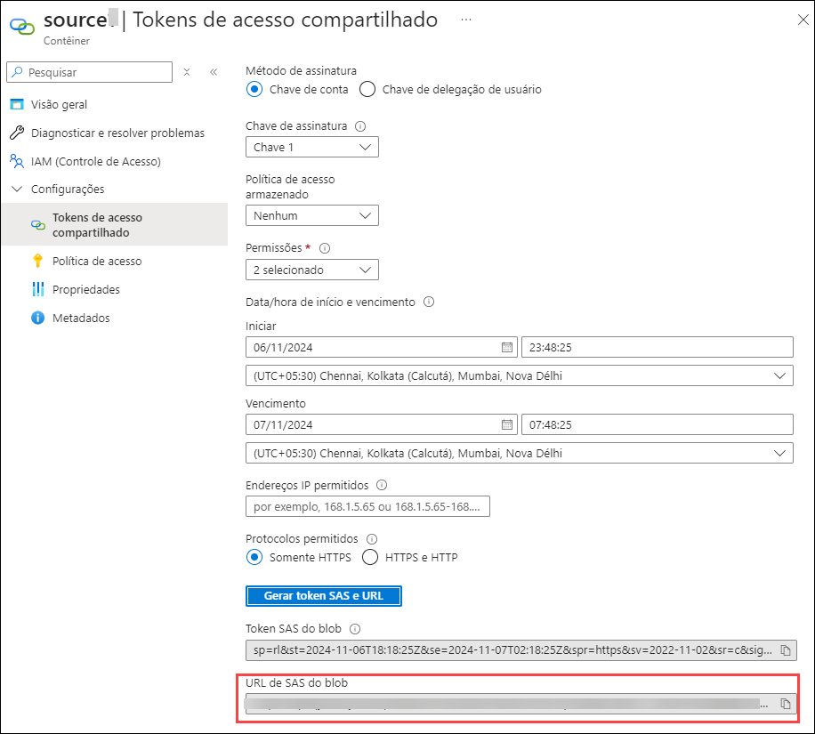

1. Repita os mesmos passos de 1 a 8 criando outro contêiner com o nome **target** dando permissões **Gravar** e **Lista**.

1. Navegue até o contêiner de source e clique em **Carregar**.

   

1. Clique em **Procurar arquivos**.

    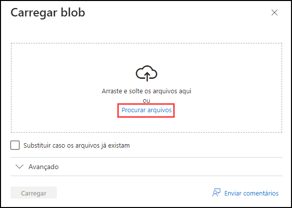

1. No **Explorador de Arquivos** navegue até `C:\LabFiles\Documents` e selecione o arquivo **document-translation-sample** clique em **Abrir** para carregar o arquivo.

   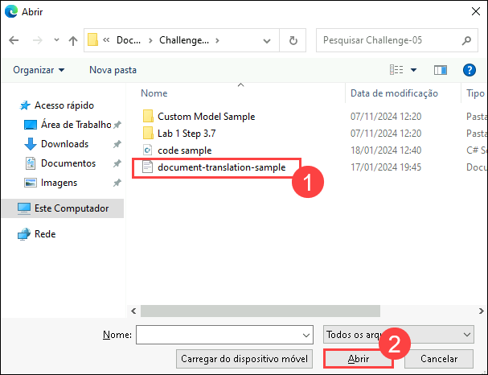

1. De volta à lâmina **Carregar blob**, certifique-se de que o arquivo **document-translation-sample (1)** esteja selecionado e clique em **Carregar (2)**.

    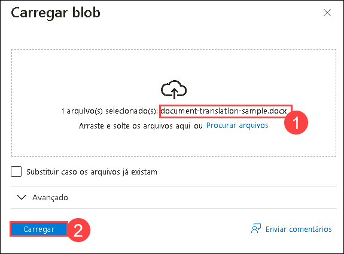

#### Tarefa 1.3 - Configure seu ambiente C#/.NET e instale Newtonsoft.Json

Nesta tarefa, configuraremos um ambiente C#/.NET no Visual Studio 2022. Criaremos um novo aplicativo de console chamado "document-translation-qs" usando o .NET 7.0 e instalaremos o pacote Newtonsoft.Json via NuGet para gerenciar operações JSON em nosso projeto.
   
1. No **LabVM**, na barra de pesquisa do Windows, digite Visual e selecione **Visual Studio 2022**.

   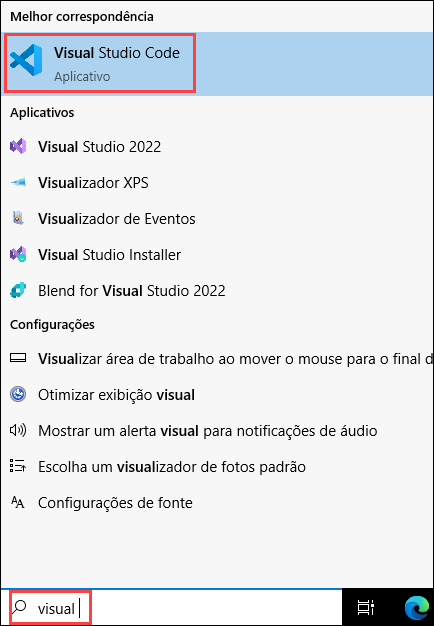

   > **Observação**: quando solicitado a entrar, selecione **Ignorar por enquanto** e, em **Configurações de desenvolvimento**, clique em **Iniciar o Visual Studio**.

1. Clique em **Conta de trabalho ou escola** para fazer login.

    > **Observação**: navegue até a aba Detalhes do ambiente para obter as credenciais.
      
1. Na página **Introdução** do Visual Studio, selecione **Criar um projeto**.

   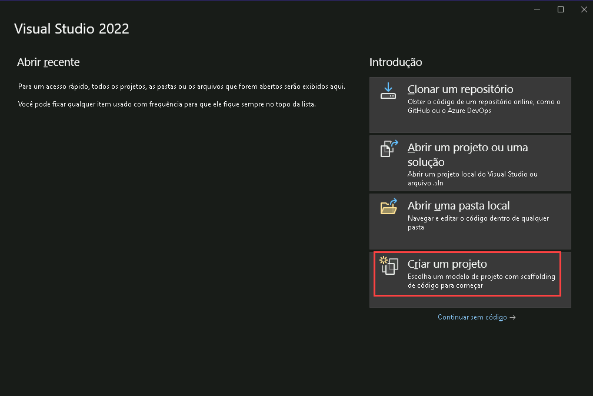

1. Na página **Criar um novo projeto**, insira **console (1)** na caixa de pesquisa. Escolha o modelo **Aplicativo do console (2)** e, em seguida, escolha **Próximo (3)**.

    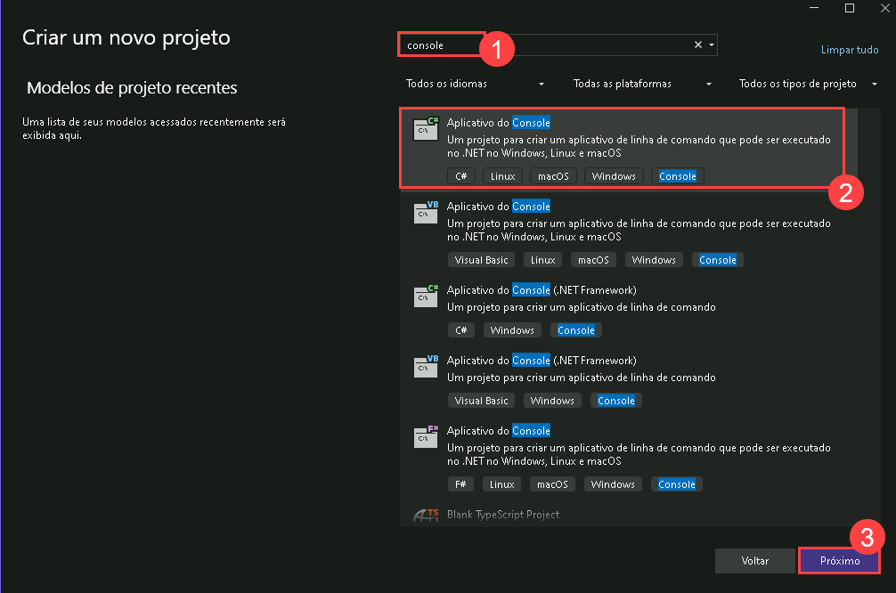

1. Na janela de diálogo **Configurar seu novo projecto**, insira **document-translation-qs (1)** na caixa Project name. Em seguida, escolha **Próximo (2)**.

   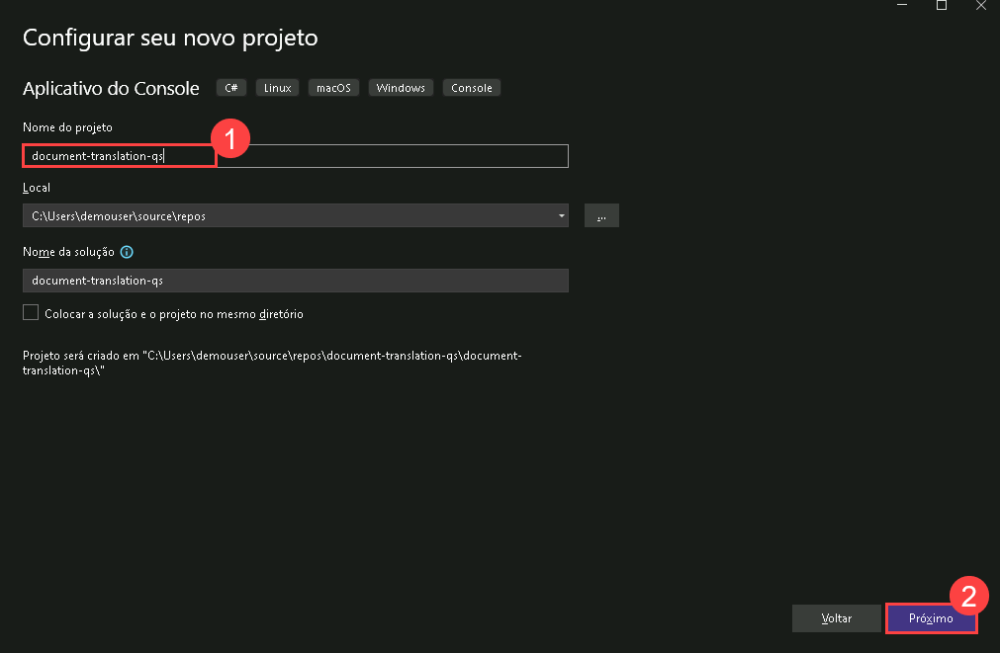

1. Na janela de diálogo **Informações adicionais**, selecione **.NET 7.0 (1)** e, em seguida, selecione **Criar (2)**.

     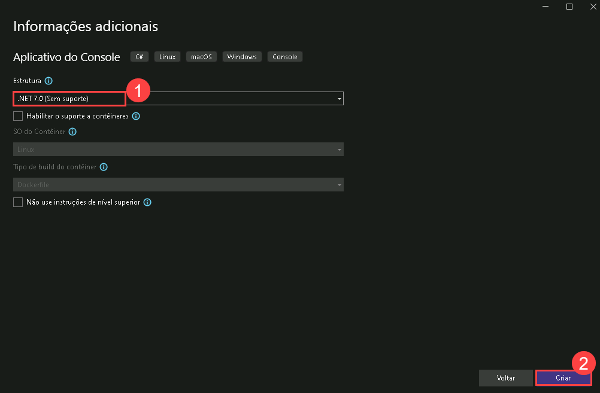
    
1. Clique com o botão direito do mouse no seu projeto **document-translation-qs (1)** e selecione **Gerenciar pacotes do NuGet... (2)**.

    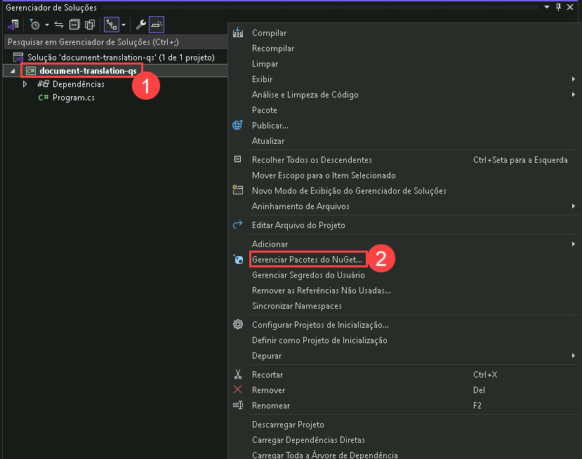

1. Selecione a aba **Procurar (1)** e digite **Newtonsoft Json (2)**. Selecione a versão estável mais recente no menu suspenso

    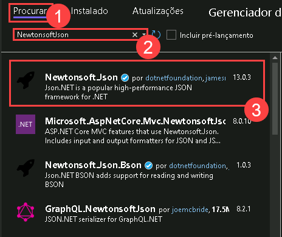
   
1. Clique em **Instalar** para instalar o pacote no seu projeto.

    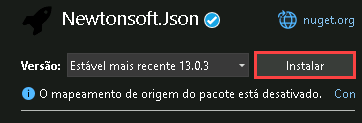

1. Clique em **Aplicar**.

    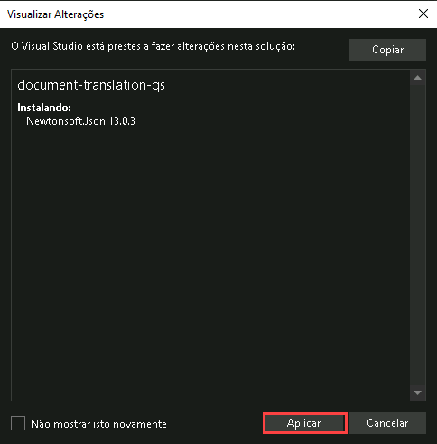
   
#### Tarefa 1.4 - Traduza todos os documentos para um contêiner de armazenamento e execute seu aplicativo

Nesta tarefa, você configurará um recurso do Translator no Portal do Azure, obterá suas chaves e ponto de extremidade e os integrará a um aplicativo de console C# no Visual Studio 2022. Este aplicativo será configurado para traduzir em lote documentos armazenados em um contêiner do Azure Storage usando APIs do serviço Translator.

1. Na página do Portal do Azure, na caixa **Pesquisar recursos, serviços e documentos (G+/)** na parte superior do portal, insira **Translator** e selecione **Translators** em serviços.

   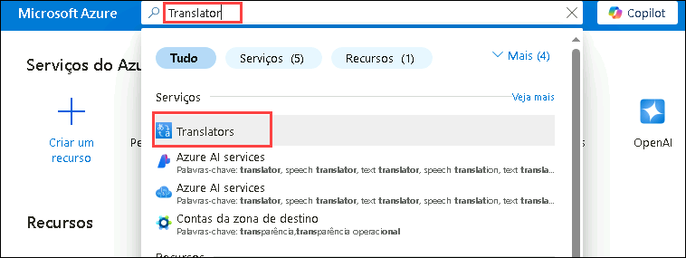

1. Vá para o recurso Translator que foi criado e obtenha as chaves do recurso seguindo o próximo passo.
   
      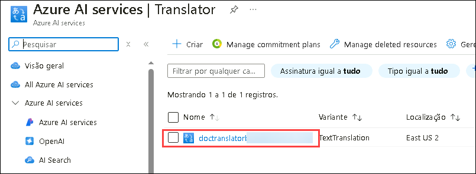
   
1. No painel de navegação esquerdo, na seção **Gerenciamento de Recursos (1)**, selecione **Chaves e Ponto de extremidade (2)**. Copie e cole seu endpoint **Chave (3)** e **Document Translation (4)** em um local conveniente, como o Microsoft Notepad. Apenas uma chave é necessária para fazer uma chamada de API.

     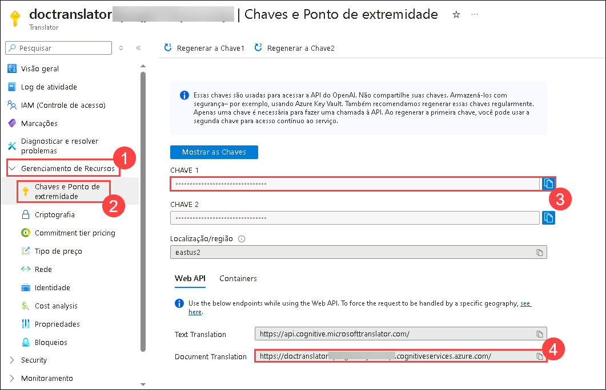
   
1. Navegue de volta para o Visual Studio 2022 e abra o arquivo **Program.cs (1)**. Exclua o código pré-existente, incluindo a linha **Console.WriteLine("Hello World!") (2)**.

   

1. Abra outra aba no Edge Browse para [exemplo de código](https://learn.microsoft.com/en-us/azure/ai-services/translator/document-translation/quickstarts/document-translation-rest-api?pivots=programming-language-csharp#code-sample) e navegue até a seção **Iniciar tradução assíncrona em lote** e copie o código.

    

1. Cole o código copiado no arquivo Program.cs.
    

1. No arquivo Program.cs, faça a seguinte atualização

    - Atualize **?api-version={date}** com **?api-version=2024-05-01**.
    - Atualize **{your-document-translation-endpoint}** e **{your-api-key}** com valores da instância do Translator que você registrou no bloco de notas.
    - Além disso, atualize **"https://YOUR-SOURCE-URL-WITH-READ-LIST-ACCESS-SAS\"** e **"https://YOUR-TARGET-URL-WITH-WRITE-LIST-ACCESS-SAS\"** com valores da instância do contêiner da sua conta de armazenamento que você registrou no bloco de notas.
      
      
      
1. Depois de adicionar o exemplo de código ao seu aplicativo, escolha o botão verde Iniciar ao lado de document-translation-qs para criar e executar seu programa ou pressione F5.
   
    
   
### Tarefa 2: Criando um Recurso de Reconhecimento de Formulário

Nesta tarefa, você criará um recurso do Form Recognizer no Portal do Azure configurando um novo projeto no Document Intelligence Studio. Isso envolve configurar detalhes do projeto, conectar-se a uma fonte de dados de treinamento armazenada em uma conta do Azure Storage e validar suas configurações antes de criar o projeto.

1. Na página do Portal do Azure, na caixa Pesquisar recursos, serviços e documentos (G+/) na parte superior do portal, insira **Azure AI services multi-service account (1)** e selecione **Azure AI services multi-service account (2)** em serviços.

   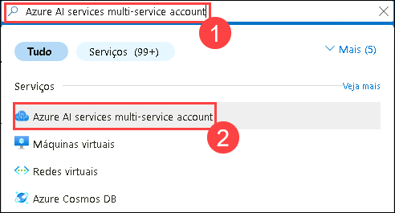

1. Na lâmina **Azure AI services multi-service account**, selecione o serviço que foi implantado usando o modelo personalizado.

     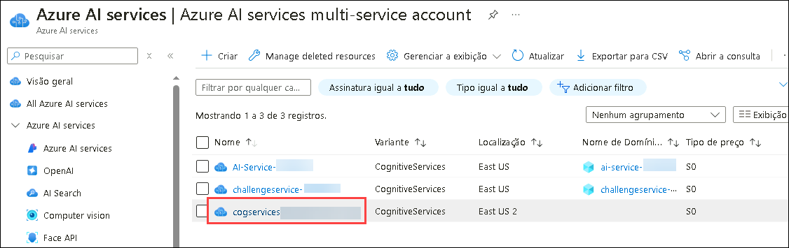
   
1. Na lâmina **Azure AI services multi-service account**, clique na guia **Document Intelligence (1)** e selecione **Go to studio (2)**.

    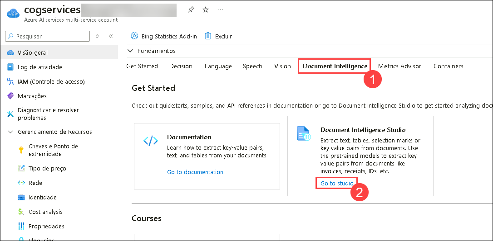

1. No Document Intelligence Studio, role para baixo até **Custom extraction models** e selecione **Get started**.

   

1. Em Meu Projeto, clique em **+ Create a project**.

    

      > **Observação**: faça login se solicitado.

1. Insira os seguintes detalhes e clique em **Continue**  **(3)**.
    
   - Project name: **testproject** **(1)**.
   - Description: **Custom model project** **(2)**.

      

1. Insira os seguintes detalhes em**Configure service resource** e clique em **Continue** **(5)**.

   - Subscription: Selecione sua **Assinatura Padrão** **(1)**.
   - Resource group: **ODL-GenAI-CL-xxxxxx-Activate-GenAI**.
   - Document Intelligence or Cognitive Service Resource: Selecione os disponíveis Cognitive Service nome semelhante a **cogservicesbpass{suffix}** **(3)**.
   - API version: **2022-08-31 (3.0 General Availability)** **(4)**.

     

1. Insira os seguintes detalhes em **Connect training data source**. e clique em **Continue** **(8)**.

   - Subscription: Selecione o seu **Assinatura Padrão** **(1)**.
   - Resource group: **ODL-GenAI-CL-xxxxxx-Activate-GenAI** **(2)**.
   - Storage account nome: **Selecione a conta de armazenamento existente (3)**.
   - Blob container nome: Clique em **Create new (4)** e forneça o nome como **custommoduletext** **(5)** e clique em **OK** **(6)**.
   - Revise as configurações e clique em **Continue** **(7)**.
   
       
       
       

1. Valide as informações e escolha **Create project**.

      

### Tarefa 3: Treinar e rotular dados

Nesta tarefa, você treinará um modelo do Form Recognizer carregando, rotulando, treinando e testando com dados de amostra compreendendo 6 documentos de treinamento.

1. Clique em **Browse for files**.

      

1.  No explorador de arquivos, navegue até o caminho `C:\LabFiles\Documents\Custom Model Sample` **(1)**, selecione todos os arquivos JPEG de trem **train1 a train6 (2)** e clique em **Abrir** **(3)**.

      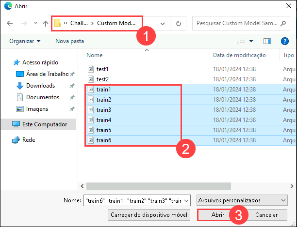

1. Após o upload, escolha **Run now** na janela pop-up em Run Layout.

     

1. Clique em **+ Add a field** **(1)**, selecionar **Field** **(2)**, digite o nome field como **Organization_sample** **(3)**, e aperte **enter**.

      

      

1. Rotule o novo campo adicionado selecionando **CONTOSO LTD** no canto superior esquerdo de cada documento carregado. Faça isso para todos os seis documentos.

    
   
1. Depois que todos os documentos estiverem etiquetados, clique em **Train** no canto superior direito.

     

1. Especifique o model ID como **customfrs** **(1)**, model description como **custom model** **(2)**, e no menu suspenso, selecione **Template** **(3)** como Build Mode e clique em **Train** **(4)**.

    

1. Clique em **Go to Models**. 

   

1. Aguarde até que o status do modelo seja exibido **succeeded**.

     

1. Selecione o modelo **customfrs** **(1)** que você criou e escolha **Test** **(2)**.

      
   
1. Na janela **Test model**, clique em **Browse for files**.

      

1. No explorador de arquivos, navegue até `C:\LabFiles\Document\Custom Model Sample` **(1)** caminho, selecione todos os arquivos JPEG de teste **test1 and test2** **(2)**, e bateu **Open** **(3)**.

     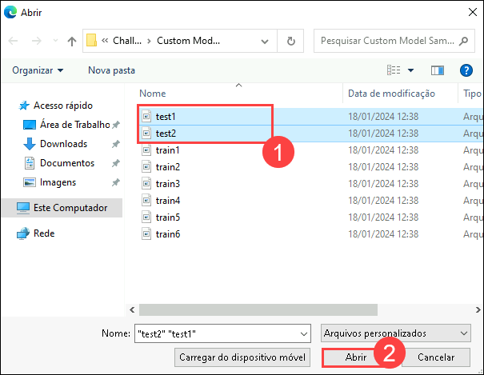

1. Após o upload, selecione **one test model (1)** e clique em **Run analysis** **(2)**.

     

1. Agora você pode ver no lado direito que o modelo foi capaz de detectar o campo **Organization_sample** que criamos na última etapa, junto com sua pontuação de confiança.

    

### Tarefa 4: Construir um novo pipeline com o módulo de modelo personalizado no BPA

Nesta tarefa, você configurará um novo pipeline no Business Process Automation Accelerator (BPA) para utilizar um modelo personalizado do Form Recognizer. Isso envolve configurar o ID do modelo dentro dos estágios do pipeline e configurar a ingestão de documentos de caminhos de arquivo especificados.

Depois de ficar satisfeito com o desempenho do modelo personalizado, você pode recuperar o ID do modelo e usá-lo em um novo pipeline BPA com o módulo Modelo Personalizado na próxima etapa.

1. Navegue de volta para os grupos de recursos e selecione o grupo de recursos**ODL-GenAI-CL-xxxxxx-Activate-GenAI**.    

1. Vá para o grupo Recursos, pesquise e selecione o tipo de recurso **Aplicativo Web Estático** com um nome semelhante a **webappbpa{sufixo}**.

    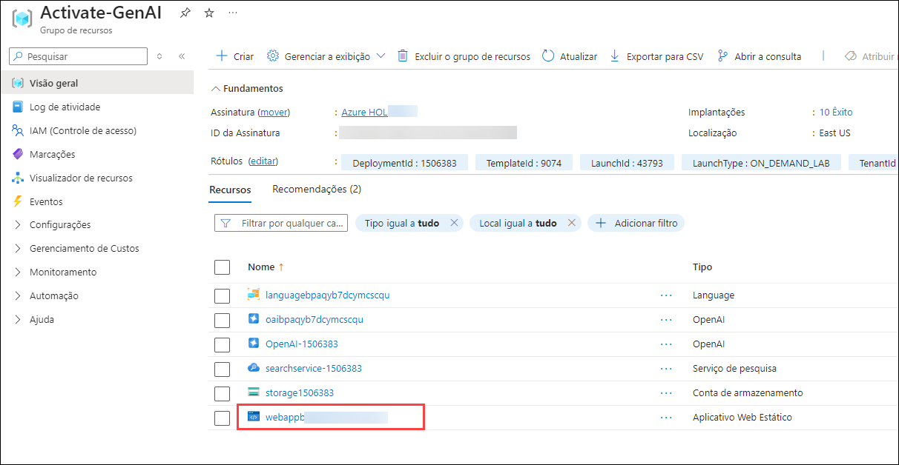

1. Na página **Aplicativo Web Estático**, clique em **Exibir aplicativo no navegador**.

     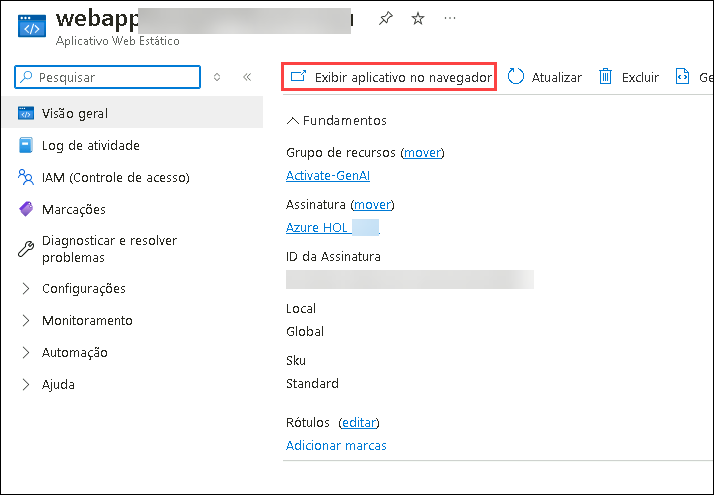

1. Depois que a página **Business Process Automation Accelerator** for carregada com sucesso, clique em **Create/Update/Delete Pipelines**.

   

1. Na página **Create Or Select A Pipeline**, insira o nome do novo pipeline como **workshop** **(1)** e clique em **Create Custom Pipeline** **(2)**.

    

1. Na página **Select a document type to get started**, selecione **PDF Document**.

    

1. Na página **Select a stage to add it to your pipeline configuration**, pesquise e selecione **Form Recognizer Custom Model (Batch)**.

    
   
1. No pop-up, insira o ID do modelo como **customfrs** **(1)** e clique em **Submit** **(2)**. 

    

1. Na página **Select a stage to add it to your pipeline configuration**, role para baixo para revisar a **Pipeline Preview** e clique em **Done**.

    

1. Na página **Workshop Pipelines**, clique em **Home**. 

      

1. Na página **Business Process Automation Accelerator**, clique em **Ingest Documents**.

     

1. Na página **Upload a document to Blob Storage**, no menu suspenso, selecione um pipeline com o nome **workshop** **(1)** e clique em **Upload or drop a file right here**.

      

1. Para documentos, insira o seguinte caminho `C:\LabFiles\Document\Lab 1 Step 3.7`  e pressione enter. Você pode carregar várias faturas, uma por uma.

      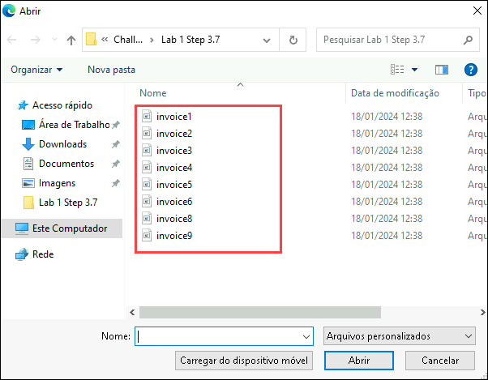

### Tarefa 5: Configurar a Pesquisa Cognitiva do Azure

Nesta tarefa, você configurará o Azure Cognitive Search para se conectar ao Azure Blob Storage. Isso inclui configurar uma fonte de dados, definir opções de análise para arquivos JSON, personalizar um índice de pesquisa para campos de dados e criar um indexador para automatizar processos de ingestão e indexação de dados.

1. Volte para a janela do grupo de recursos, pesquise e selecione **Serviço de pesquisa** com um nome semelhante a **bpa{sufixo}**.

   

1. Na página **Serviço de pesquisa**, clique em **Importar dados**.

   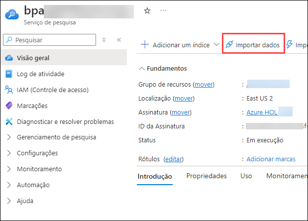

1. Insira os seguintes detalhes para **Conectar a seus dados**.

    - Fonte de Dados: Selecione **Azure Blob Storage** **(1)**
    - Nome da fonte de dados: Insira **workshop** **(2)**.
    - Modo de análise: Selecione **JSON** **(3)**.
    - Assinatura: Selecione a **existente (4)**
    - Clique em **Escolher uma conexão existente** **(5)** na sequência de conexão.
  
      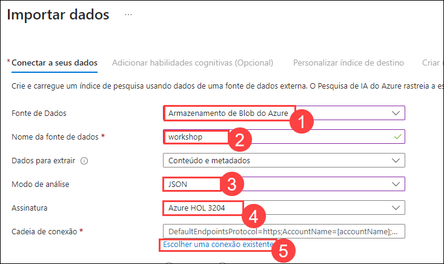

1. Na página **Contas de armazenamento**, selecione a conta de armazenamento com nome semelhante a **bpa{sufixo} (6)**. 

    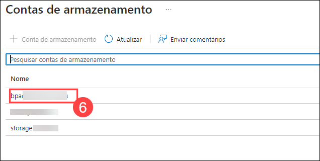

1. Selecione **results** **(7)** na página **Contêineres** e clique em **Selecio...** **(8)**. Ele redirecionará de volta para a página **Conectar a seus dados**.

     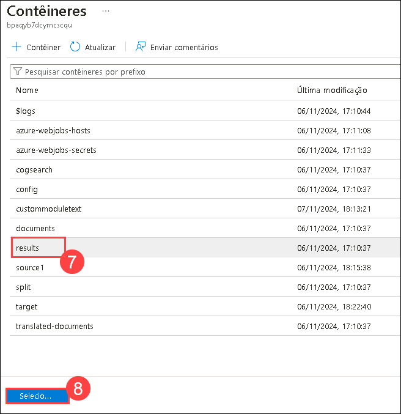
  
1. Na página **Conectar a seus dados**, para **Pasta Blob** digite **workshop** **(9)** clique em **Próximo: Adicionar habilidades cognitivas (Opcional) (10)**.

    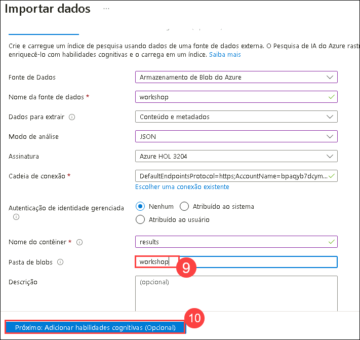

1. Em **Adicionar habilidades cognitivas (Opcional)**, clique em **Ir para: Personalizar índice de destino**.

1. Em **Personalizar índice de destino**, insira o nome do índice como **azureblob-index** **(1)**, torne todos os campos **Recuperáveis** **(2)** e **Pesquisáveis** **(3)**.

      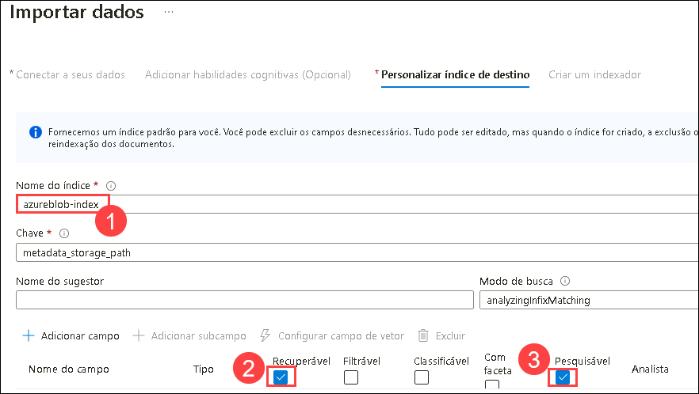

1. Expanda **aggregatedResults** **(1)** > **customFormRec (2)** > **documents** **(3)** > **fields** **(4)**. Abaixo dele, expanda **Organization_sample (5)**. Torne os três camp Faceta **(type, valueString, & content)** **(6)**.

   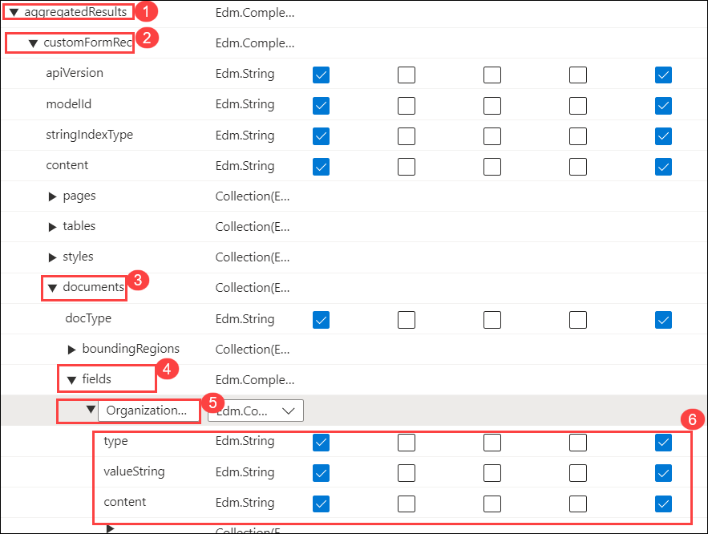

1.  clique em **Próximo: Criar um indexador**.

1. Na página **Criar um indexador**, insira o nome como **azureblob-indexer** **(1)** e clique em **Enviar** **(2)**.
   
    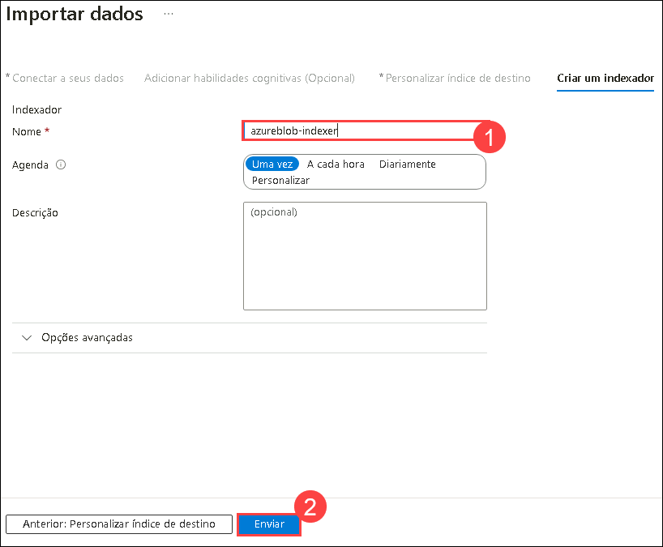

## Critérios de sucesso:

- Tradução bem-sucedida de documentos e armazenamento no contêiner de destino do Azure Blob Storage.
- Configuração e utilização eficazes do recurso Form Recognizer e do pipeline BPA.
- Configuração adequada do Azure Cognitive Search para documentos processados.
- Validação do processamento de documentos e da funcionalidade de pesquisa usando o Sample Search Application no BPA.

## Recursos adicionais:

- Consulte [tradução de documentos](https://learn.microsoft.com/en-us/azure/ai-services/translator/document-translation/quickstarts/document-translation-rest-api?pivots=programming-language-csharp#code-sample) para obter o código de exemplo que será usado para tradução de documentos usando C#.
- Consulte [Operações de tradução de documentos](https://learn.microsoft.com/en-us/azure/ai-services/translator/document-translation/reference/rest-api-guide) para entender as APIs REST que utilizamos para tradução de documentos.

## Prossiga para o próximo Desafio clicando em **próximo**>>.
