# Desafio 06: Implementar monitoramento e registro do Azure OpenAI usando o API Management Service

## Introdução

Explore a coleta de dados de monitoramento, incluindo logs de atividade e métricas de plataforma. Configure o Azure Monitor para geração de log, personalize o roteamento de dados com configurações de diagnóstico e inicie a coleta de log de recursos. Descubra as limitações do Log Analytics Workspace no registro de solicitações de usuários e respostas de modelos. Mitigue isso integrando o Azure API Management Service para registro abrangente no ambiente Azure OpenAI.

# Guia de soluções

## Tarefa 1: Explorar filtros de conteúdo

Nesta tarefa, você explorará o efeito dos filtros de conteúdo padrão no Azure OpenAI. Os filtros de conteúdo são aplicados a prompts e conclusões para evitar que linguagem potencialmente prejudicial ou ofensiva seja gerada.

1. Na página do Portal do Azure, na caixa Pesquisar recursos, serviços e documentos (G+/) na parte superior do portal, insira **OpenAI (1)** e selecione **OpenAI (2)** em serviços.

    

1. Na lâmina **Azure AI Services | OpenAI**, selecione **OpenAI Service** criado nos desafios anteriores.

      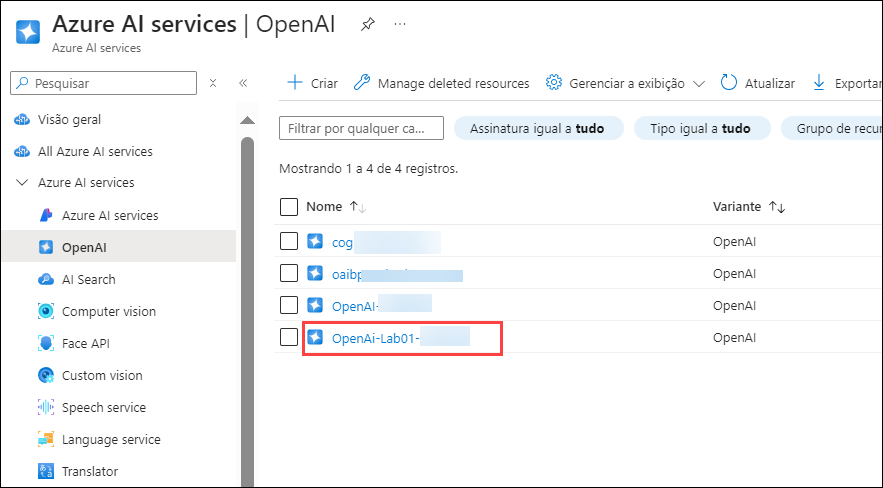

1. No painel de recursos do Azure OpenAI, clique em **Go to Azure OpenAI Studio**; ele navegará para o **Azure AI Studio**.

      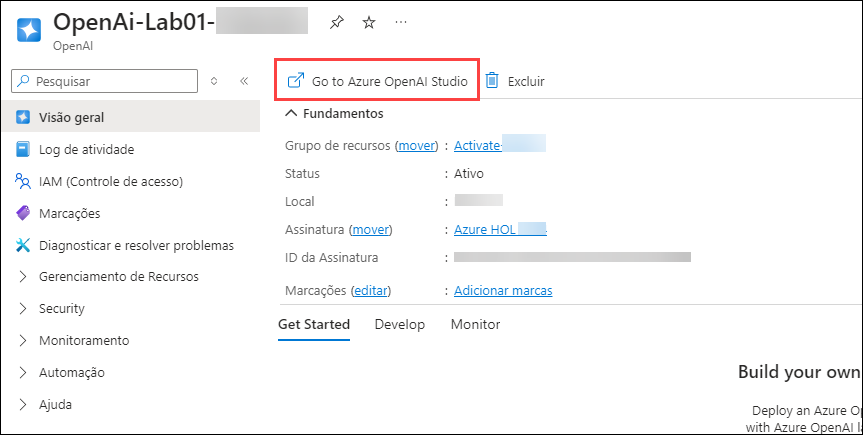

1. No Azure OpenAI Studio, visualize a página **Filtros de conteúdo (1)** no menu de navegação esquerdo e selecione **+ Criar filtro de conteúdo (2)**.

    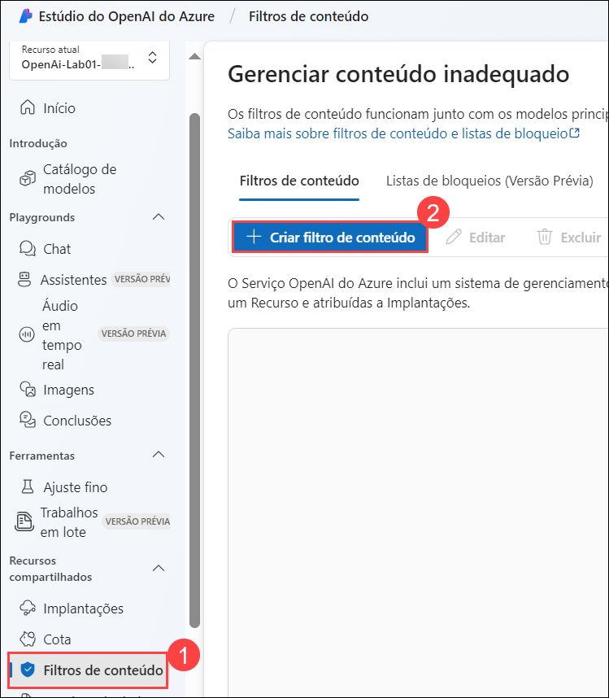

1. Na seção Informações básicas use **o nome padrão (1)** e clique em **Avançar (2)**

    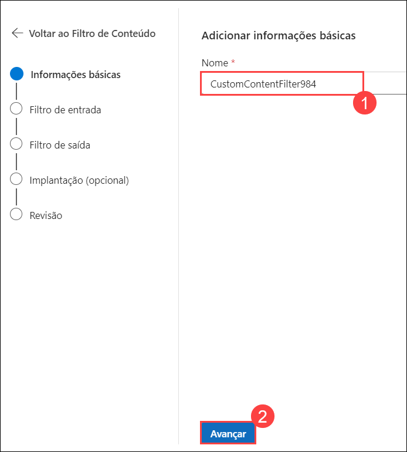
   
1. Revise as configurações padrão para um filtro de conteúdo.

    Os filtros de conteúdo são baseados em restrições em quatro categorias de conteúdo potencialmente prejudicial:

    - **Hate**: Linguagem que expressa discriminação ou declarações pejorativas.
    - **Sexual**: Linguagem sexualmente explícita ou abusiva.
    - **Violence**: Linguagem que descreve, defende ou glorifica a violência.
    - **Self-harm**: Linguagem que descreve ou incentiva a automutilação.

      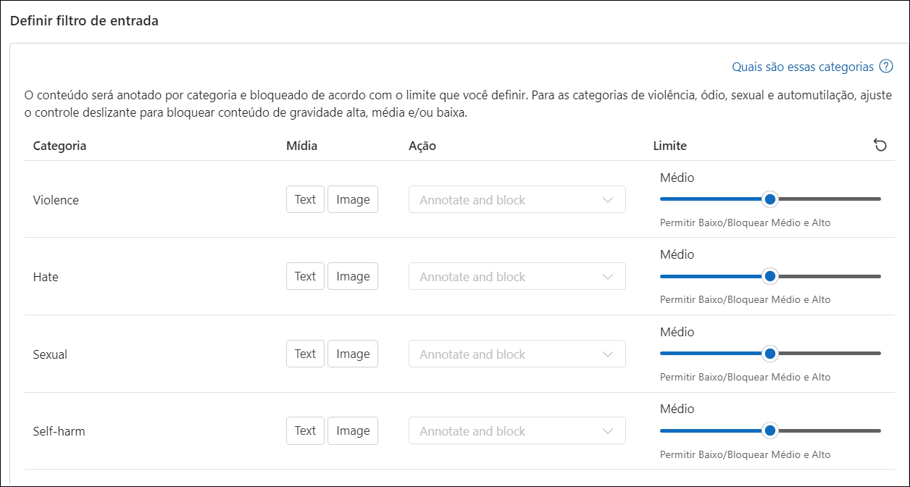
      
    Filtros são aplicados para cada uma dessas categorias a prompts e conclusões, com uma configuração de gravidade de **seguro**, **baixo**, **médio** e **alto** usada para determinar quais tipos específicos de linguagem são interceptados e impedidos pelo filtro.
   
1. Observe que as configurações padrão (que são aplicadas quando nenhum filtro de conteúdo personalizado está presente) permitem linguagem de gravidade **baixa** para cada categoria. Você pode criar um filtro personalizado mais restritivo aplicando filtros a um ou mais níveis de gravidade **baixo**. No entanto, você não pode tornar os filtros menos restritivos (permitindo linguagem de gravidade **média** ou **alta**), a menos que tenha solicitado e recebido permissão para fazê-lo em sua assinatura. A permissão para fazer isso é baseada nos requisitos do seu cenário de IA generativa específico.

    > **Dica**: para obter mais detalhes sobre as categorias e níveis de gravidade usados ​​em filtros de conteúdo, consulte [Filtragem de conteúdo](https://learn.microsoft.com/azure/cognitive-services/openai/concepts/content-filter) na documentação do serviço Azure OpenAI.

## Tarefa 2: Monitorando o Serviço Azure OpenAI

Quando seus aplicativos e processos de negócios cruciais dependem de recursos do Azure, é essencial monitorar sua disponibilidade, desempenho e operação. O Azure OpenAI fornece painéis prontos para uso para cada um dos seus recursos do Azure OpenAI. Para acessar os painéis de monitoramento, navegue até a pesquisa do portal do Azure e selecione o OpenAI e selecione um dos recursos do OpenAI. Na visão geral dos recursos do Azure OpenAI, você obtém painéis de monitoramento clicando na guia **Monitor**.

   

Os painéis são agrupados em quatro categorias: Solicitações HTTP, Uso baseado em tokens, Utilização de PTU e Ajuste fino.
- **HTTP Requests:** Painéis que monitoram serviços com tecnologia OpenAI no Azure, exibindo volume de solicitações, tempos de resposta, erros, distribuição geográfica e outras métricas. Eles ajudam a entender as interações do usuário, identificando problemas de desempenho e garantindo a confiabilidade do serviço.
- **Tokens-Based Usage:** Esta categoria provavelmente inclui painéis monitorando o uso de tokens no Azure OpenAI. Tokens são vitais para autenticação, autorização e controle de acesso. Eles oferecem insights sobre taxas de criação, padrões de uso e tempos de vida, e detectam atividades suspeitas. Monitorar tokens é essencial para a segurança de recursos de IA.
- **PTU Utilization:** PTU refere-se a Performance Tuning Units no Azure OpenAI. Esses painéis monitoram e otimizam o uso de PTU, mostrando alocação, tendências e métricas de eficiência, e oferecendo sugestões de otimização. É crucial para impulsionar o desempenho e a alocação de recursos.
- **Fine-tuning:** Esta categoria envolve painéis que oferecem ferramentas e insights para ajustar os serviços do Azure OpenAI. Eles incluem métricas de desempenho, configurações, resultados de experimentos e otimização de modelos de IA no Azure. Eles capacitam decisões informadas para melhor desempenho e precisão de IA.

### Tarefa 2.1: Configurar definições de diagnóstico

O Azure OpenAI coleta os mesmos tipos de dados de monitoramento que outros recursos do Azure. Você pode configurar o Azure Monitor para gerar dados em logs de atividade, logs de recursos, logs de máquina virtual e métricas de plataforma. As métricas de plataforma e o log de atividade do Azure Monitor são coletados e armazenados automaticamente, o que pode ser roteados para outros locais usando uma configuração de diagnóstico. Os logs de recursos do Azure Monitor não são coletados e armazenados até que você crie uma configuração de diagnóstico e um espaço de trabalho do Log Analytics.

1. Na página do Portal do Azure, na caixa Pesquisar recursos, serviços e documentos (G+/) na parte superior do portal, insira **OpenAI (1)** e selecione **OpenAI (2)** em serviços.

    

1. Na lâmina **Azure AI Services | OpenAI**, selecione **OpenAI Service** implantado anteriormente.

   

1. Na página de recursos do Azure OpenAI, em **Monitoramento**, selecione **Configurações de diagnóstico (1)** no painel esquerdo. Na página Configurações de diagnóstico, selecione **+ Adicionar configuração de diagnóstico (2)**.

   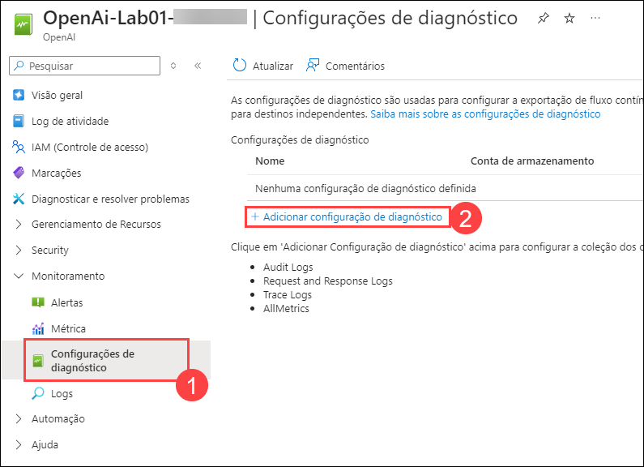

1. Para criar uma nova Diagnostic Settings, na página **Configurações de diagnóstico**, configure os seguintes campos:
    - **Nome da configuração de diagnóstico:** **OpenAI Diagnostic Setting (1)**
    - Selecione **Enviar para o workspace do Log Analytics (2)** - A ser verificado.
    - **Assinatura**: Padrão - Assinatura pré-atribuída **(3)**
    - **Workspace do Log Analytics:** Selecione o único log analytics workspace pré-criado disponível na assinatura **(4)**.
    - Em **Logs** - Selecione **allLogs (5)**.
    - Em **Metrics**, selecione **AllMetrics (6)**.
    - Para salvar a configuração, clique em **Salvar (7)**.

      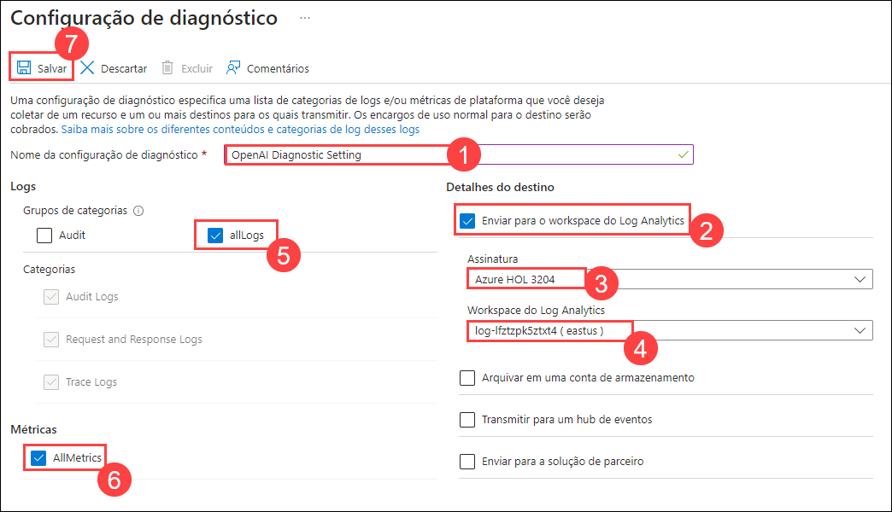

      > Após a configuração bem-sucedida das configurações de diagnóstico, você pode trabalhar com métricas e dados de log para seu recurso do Azure OpenAI no seu espaço de trabalho do Log Analytics.

### Tarefa 2.2: Use o Chat Playground para ingerir logs adicionais

O playground *Chat* fornece uma interface de chatbot para modelos GPT 3.5 e superiores. Ele usa a API *ChatCompletions* em vez da antiga API *Completions*.

1. Navegue de volta para o serviço Azure OpenAI que foi criado anteriormente.

1. No painel de recursos do Azure OpenAI, clique em **Go to Azure OpenAI Studio**; ele navegará para o **Azure AI Studio**.

1. Clique em **Chat** na aba **Playgrounds** no painel esquerdo.

    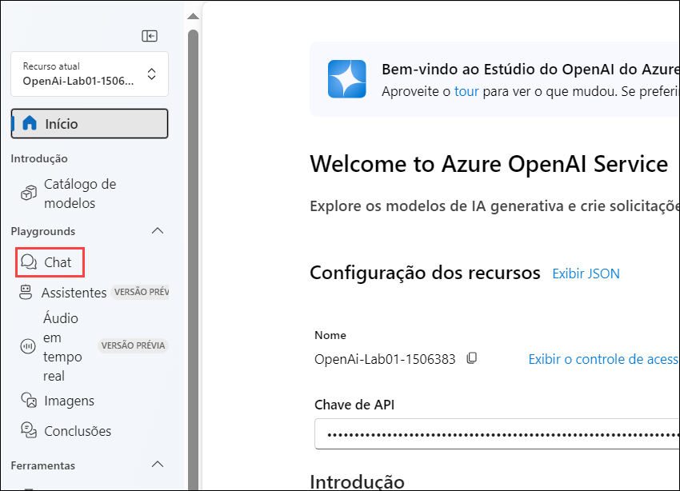
   
1. Na seção **Playground**, selecione a página **chat** e certifique-se de que a implantação **text-turbo** esteja selecionada no painel de configuração.

   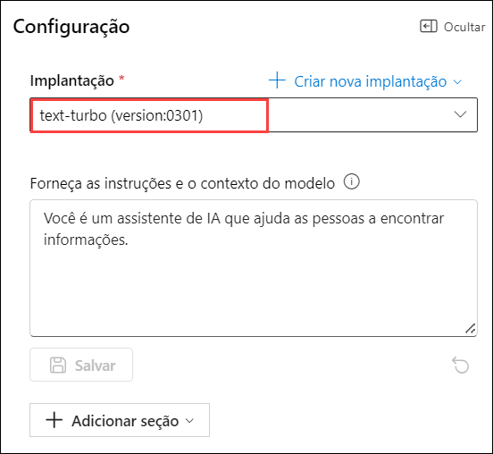

1. Na seção **Configuração**, na caixa **Forneça as instruções e o contexto do modelo**, substitua o texto atual pela seguinte declaração: `O sistema é um professor de IA que ajuda as pessoas a aprender sobre IA`.

   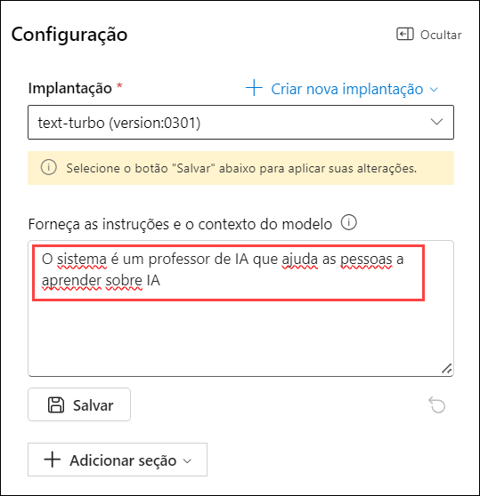

1. Role para baixo para adicionar um novo exemplo:
    - Clique em **+ Adicionar Seção** e selecione **Exemplos** no painel **configuração**.
    - Digite a seguinte mensagem e resposta nas caixas designadas:
        - **Usuário**: `Quais são os diferentes tipos de inteligência artificial?` 
          
        - **Assistente**: `Existem três tipos principais de inteligência artificial: IA estreita ou fraca (como assistentes virtuais como Siri ou Alexa, software de reconhecimento de imagem e filtros de spam), IA geral ou forte (IA projetada para ser tão inteligente quanto um ser humano. Esse tipo de IA não existe atualmente e é puramente teórico) e superinteligência artificial (IA que é mais inteligente do que qualquer ser humano e pode executar tarefas que estão além da compreensão humana. Esse tipo de IA também é puramente teórico e ainda não foi desenvolvido).`
          
        - Clique em **Salvar** para iniciar uma nova sessão e definir o contexto comportamental do sistema de bate-papo.

             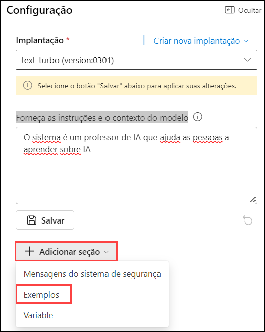
   
             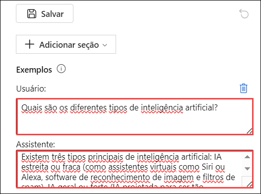
     
             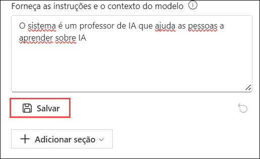

             > **Observação**: Exemplos de poucas tomadas são usados ​​para fornecer ao modelo exemplos dos tipos de respostas que são esperados. O modelo tentará refletir o tom e o estilo dos exemplos em suas próprias respostas.

            > **Observação**: Clique em **Continuar** quando solicitado com **Atualizar mensagem do sistema?**.

             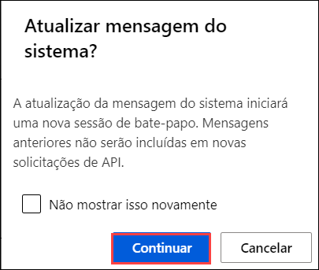
          
1. Na caixa de consulta do painel de sessão de bate-papo, insira o texto `O que é inteligência artificial?`

1. Use o botão **Enviar** para enviar a mensagem e visualizar a resposta.

      > **Observação**: você pode receber uma resposta de que a implantação da API ainda não está pronta. Se estiver, aguarde alguns minutos e tente novamente.

      > Qualquer texto que você inserir no **Playground de conclusões** ou no **Playground de conclusões de bate-papo** gera métricas e dados de log para seu recurso do Azure OpenAI. No espaço de trabalho do Log Analytics para seu recurso, você pode consultar os dados de monitoramento usando a linguagem de consulta Kusto.

### Tarefa 2.3: Analisar logs usando consultas do Kusto

Os dados nos logs do Azure Monitor são armazenados em tabelas, onde cada tabela tem seu próprio conjunto de propriedades exclusivas. O log de atividades é um tipo de log de plataforma no Azure que fornece insights sobre eventos de nível de assinatura. Você pode visualizar esse log de forma independente ou encaminhá-lo para os logs do Azure Monitor. No portal do Azure, você pode usar o log de atividades nos logs do Azure Monitor para executar consultas complexas com o Log Analytics.

1. Na página do Portal do Azure, na caixa Pesquisar recursos, serviços e documentos (G+/) na parte superior do portal, insira **OpenAI (1)** e selecione **OpenAI (2)** em serviços.

    

1. Na lâmina **Azure AI Services | OpenAI**, selecione **OpenAI Service** implantado anteriormente.
   
1. Na página de recursos do Azure OpenAI, em **Monitoramento** no painel esquerdo, selecione **Logs (1)** e clique no espaço de trabalho Log Analytics pré-criado **(2)** que foi usado para configurar o diagnóstico do seu recurso do Azure OpenAI.

   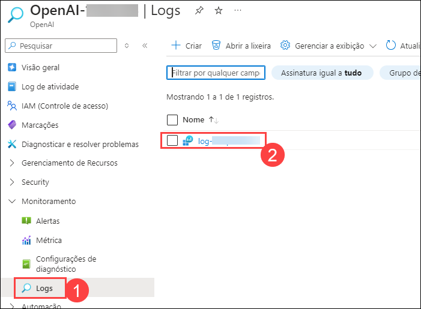

1. Na página **Workspace do Log Analytics**, em Visão geral no painel esquerdo, selecione **Logs**.

   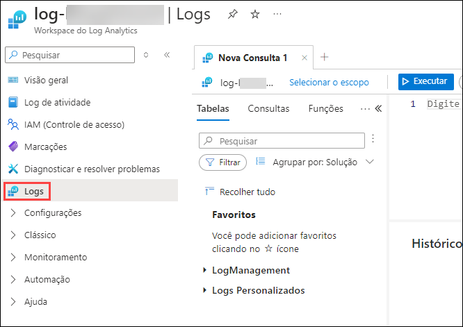

   > O portal do Azure exibe uma janela Queries com consultas de exemplo e sugestões por padrão. Você pode fechar esta janela.

1. Para os exemplos a seguir, insira a **consulta Kusto (1)** na região de edição na parte superior da janela Consulta e, em seguida, selecione **Executar (2)**. Os resultados da consulta **(3)** são exibidos abaixo do texto da consulta.

    - Esta consulta Kusto é útil para uma análise inicial dos dados do Azure Diagnostics (AzureDiagnostics) sobre seu recurso:

    - Esta consulta retorna uma amostra de 100 entradas e exibe um subconjunto das colunas de dados disponíveis nos logs.   
      
        ```kusto
       AzureDiagnostics
       | take 100
       | project TimeGenerated, _ResourceId, Category, OperationName
        ```

1. Nos resultados da consulta, você pode selecionar a seta ao lado do nome da tabela para visualizar todas as colunas disponíveis e os tipos de dados associados.

   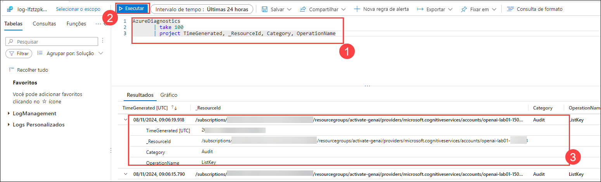

1. Para ver todas as colunas de dados disponíveis, você pode remover a linha de parâmetros de escopo `| project ...` da consulta:

   ```kusto
   AzureDiagnostics
   | take 100
   ```
   > **Observação:** se os logs não forem refletidos imediatamente, aguarde de 10 a 15 minutos para que eles sejam exibidos.

1. Você também pode expandir os resultados e verificar os detalhes fornecidos em cada um para obter mais informações.

   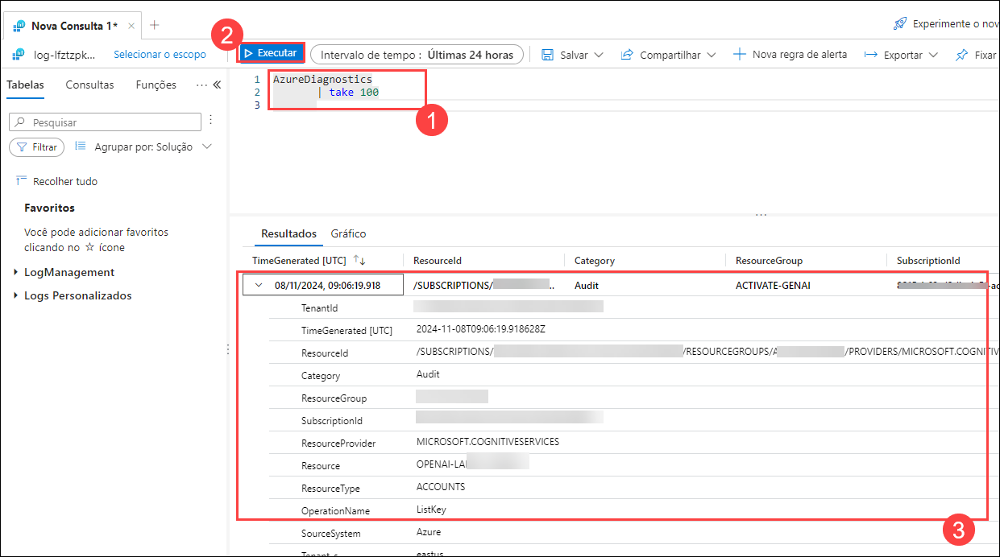

## Tarefa 3: Monitorando prompts do OpenAI usando o Azure API Management

### Tarefa 3.1: Configurando o Azure API Management

Criar uma configuração de diagnóstico e vincular o Azure OpenAI a um espaço de trabalho de análise de log ajuda a capturar logs nativos; no entanto, o espaço de trabalho do Log Analytics é incapaz de registrar a solicitação do usuário e os prompts de resposta do modelo OpenAI. Em tais cenários, o Azure API Management Service é útil.

1. Na barra de pesquisa global, pesquise e selecione **API Management** e selecione-o 

    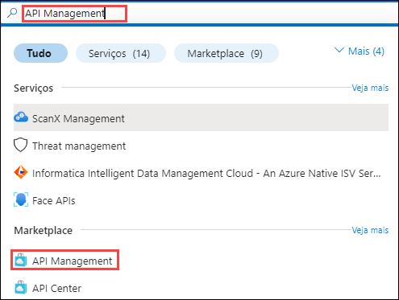 

1. Adicione os seguintes detalhes na página **Criar serviço de gerenciamento de API** e clique em **Examinar + Criar**:

      - Assinatura: **Selecione a assinatura padrão (1)**
      - Grupo de recursos: Selecione **rg-activategenai (2)**
      - Região: **(US) East US (3)**
      - Nome do recurso: **apim-<inject key="Deployment ID" enableCopy="false"/> (4)**
      - Nome da organização: **Windows (5)**
      - Email do administrador: **Email/Username**: <inject key="AzureAdUserEmail"></inject> **(6)**
      - Tipo de preço: Selecione **Standard (99.95% de SLA) (7)**
      - Unidades(s): **1 (8)**
    
          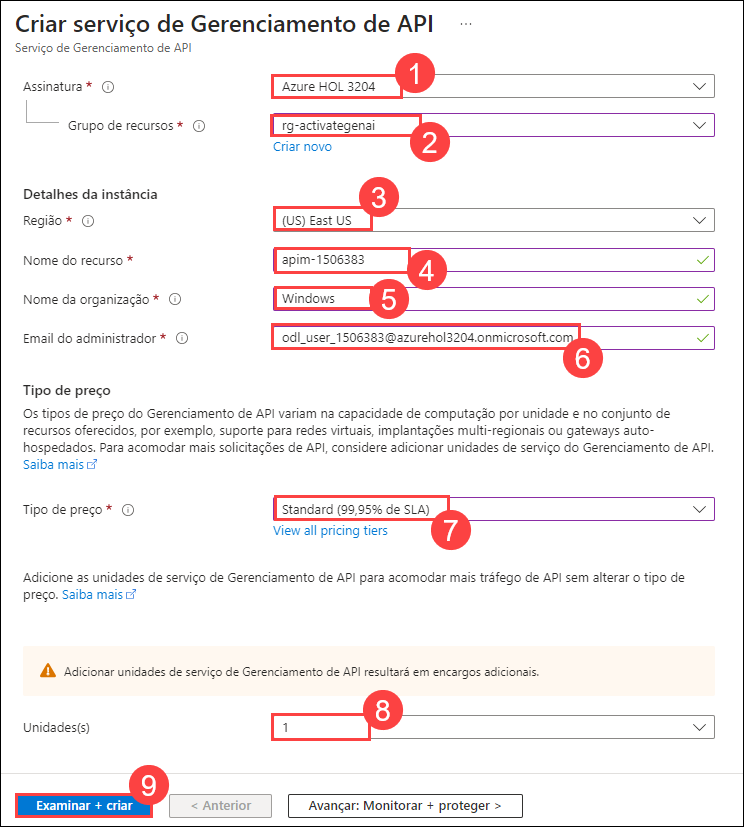

1. Na aba **Examinar + Criar**, após a validação ser aprovada, clique em **Criar**.

      > **Observação**: antes de prosseguir para a próxima etapa, certifique-se de que o **API Management Service** foi implantado com sucesso.

      > **Observação**: a implantação do recurso de serviço de gerenciamento de API pode levar aproximadamente 20 minutos. 

1. Depois que o **API Management Service** for implantado com sucesso, clique em **Ir para o recurso**.

1. Na lâmina **Serviço de gerenciamento de API**, no painel de navegação esquerdo, em **Segurança**, selecione **Identidades gerenciadas (1)** e, na guia **Sistema atribuído**, defina o status como **Ligar (2)** e clique em **Salvar (3)**.

    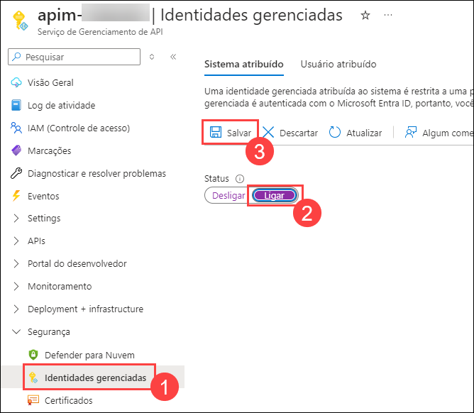

1. Clique em **Sim** quando **Habilitar a identidade gerenciada atribuída sistema** for solicitado.

   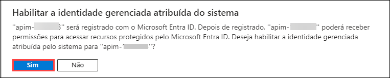
   
1. Saia e entre novamente no portal do Azure antes de prosseguir com as próximas etapas.
        
1. Na página do Portal do Azure, na caixa Pesquisar recursos, serviços e documentos (G+/) na parte superior do portal, insira **OpenAI (1)** e selecione **OpenAI (2)** em serviços.

    

1. Selecione o **Serviço OpenAI** implantado no desafio anterior.

1. Para capturar os valores da chave e do ponto de extremidade do Azure OpenAI, execute as seguintes etapas:
    - Selecione **Chaves e pontos de extremidade (1)** na seção **Gerenciamento de recursos** no painel de navegação esquerdo.
    - Clique em **Mostrar as Chaves (2)**.
    - Copie **Chave 1 (3)** e certifique-se de colá-la em um editor de texto, como o Bloco de notas, para referência futura.
    - Por fim, copie a URL da API do **Ponto de extremidade (4)** clicando em **Copiar para a área de transferência**. Cole-a em um editor de texto, como o Bloco de notas, para uso posterior.

         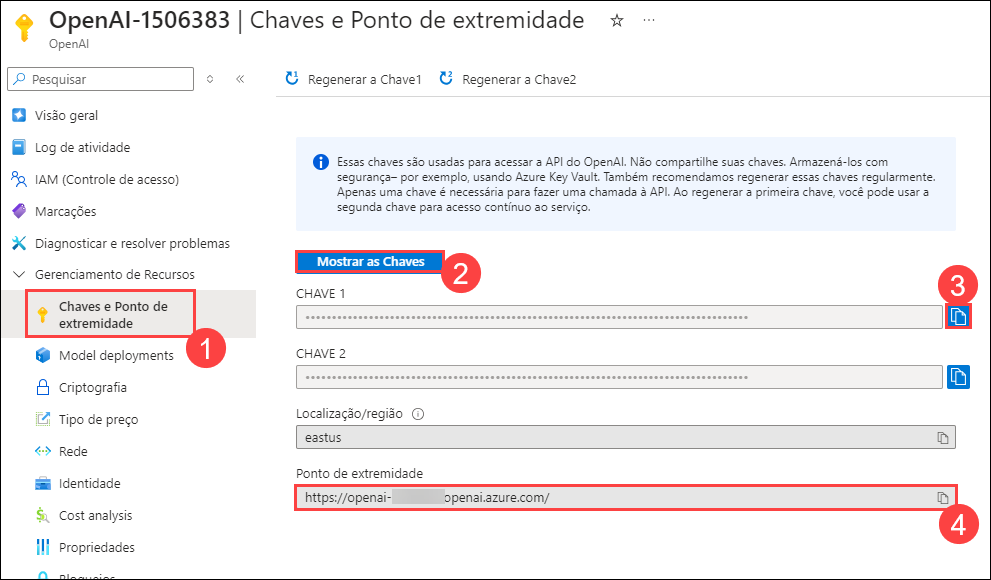
   
1. No **OpenAI**, selecione **Controle de acesso (IAM)** **(1)**, clique em **+ Adicionar** **(2)** e selecione **Adicionar atribuição de função** **(3)**.

   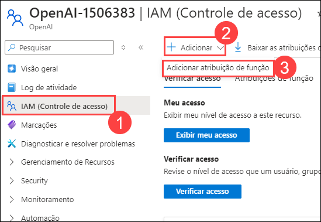   

1. Na guia **Adicionar atribuição de função (1)** na barra de pesquisa, pesquise e selecione **Usuário dos serviços cognitivos (2)** e clique em **Próximo (3)**.

   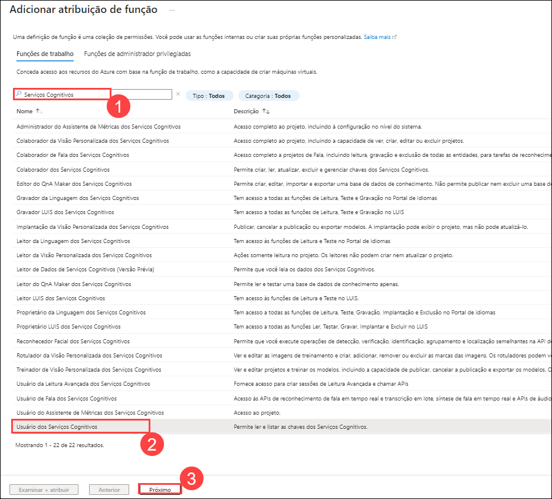

1. Na aba **Membros**, selecione **Identidade gerenciada** **(1)**, clique em **+ Selecionar membros** **(2)** no pop-up de seleção de identidade gerenciada em Identidade gerenciada no menu suspenso, selecione **Serviço de gerenciamento de API** **(3)**, selecione **apim-<inject key="ID de implantação" enableCopy="false"/>** **(4)**, clique em **Selecionar** **(5)** e clique em **Próximo** **(6)**.

   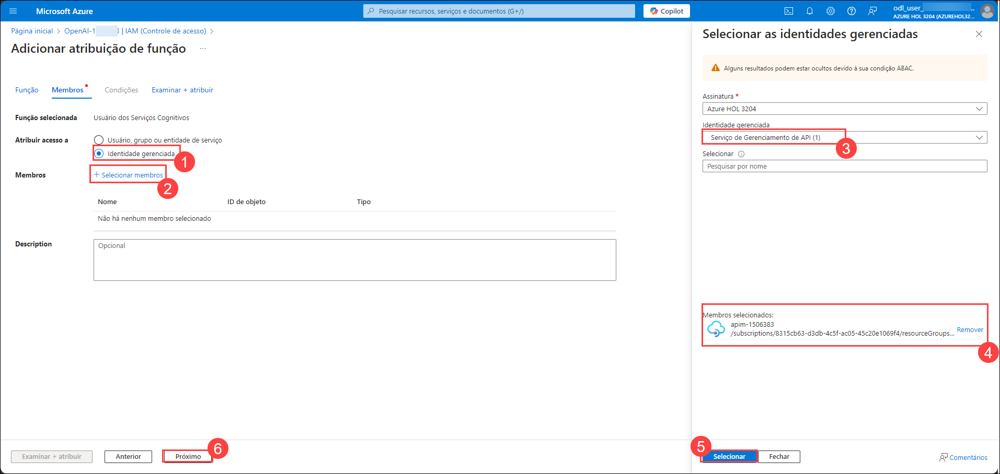

1. Na aba **Examinar + atribuir**, clique em **Examinar + atribuir**.

1. No serviço de gerenciamento de API, clique em **APIs** **(1)** em APIs no menu à esquerda e selecione **HTTP** **(2)** em Define a new API para criar uma API HTTP.

    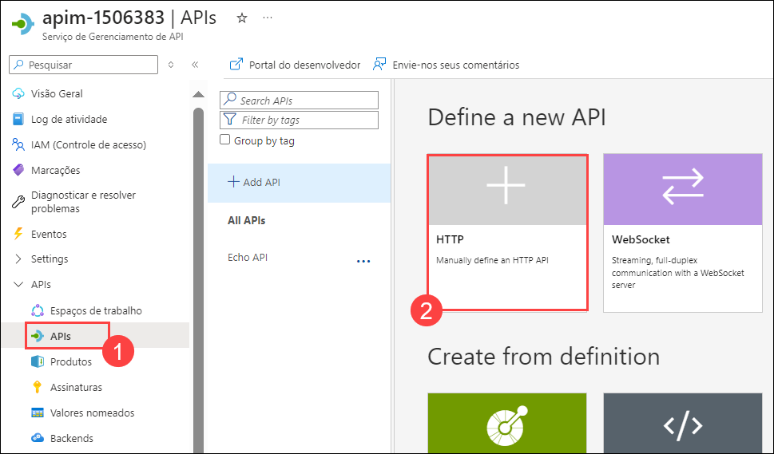

1. Insira os seguintes valores no painel Criar uma API HTTP:
   
      | **Parameter**           | **Values**           | 
      | ----------------------- | -------------------- | 
      | API Type **(1)**        | **Basic**            | 
      | Display name **(2)**    | **miyagi-api**       |
      | Name **(3)**            | **miyagi-api**       |
      | Web service URL **(4)** | Insira o ponto de extremidade do Azure OpenAI Endpoint |
      | API URL suffix **(5)**  | **openai** |
      | Clique em  **(6)**       | **Create** |

    

1. No serviço de gerenciamento de API, clique em **APIs** **(1)**, clique nos **three dots** **(2)** ao lado de miyagi-api, selecione **Import** **(3)** e clique em **OpenAPI** **(4)**.

    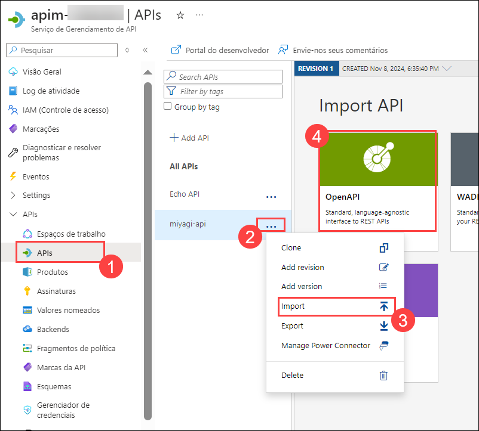

1. Dentro do **Import from OpenAPI specification** pop-up window, enter and configure the following details:
    - **OpenAPI specification:** `https://raw.githubusercontent.com/Azure/azure-rest-api-specs/main/specification/cognitiveservices/data-plane/AzureOpenAI/inference/stable/2023-05-15/inference.json` **(1)**
    - **Import method:** Selecione **Update (2)**
    - Clique em **Import (3)** para atualizar a API existente com a especificação OpenAPI acima.

      

         > **Observação:** A especificação OpenAPI é um arquivo JSON que contém as especificações de API do Azure OpenAI. Você pode ter uma visão detalhada das especificações acessando o link fornecido acima para uma compreensão e clareza mais profundas.

1. Clique na API recém-adicionada e observe a presença de várias operações POST com base na especificação OpenAPI fornecida anteriormente.

    

1. Na API **Azure OpenAI Service API**, navegue até a guia **Settings** **(1)** e atualize a chave de assinatura **Header name** para **api-key** **(2)** e clique em **Save** **(3)**.

    

1. No serviço de gerenciamento de API, clique em **Produtos** **(1)** em APIs no menu à esquerda e clique em **+ Adicionar** **(2)**.

    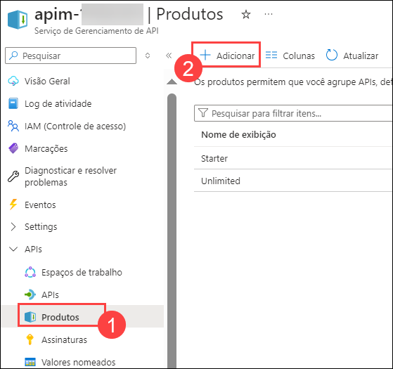 

1. No **Adicionar produto** nome de exibição como **OpenAi** **(1)**, descrição como **OpenAI** **(2)**. No menu APIs, clique no **sinal de mais** **(3)** selecione a **API de serviço OpenAI do Azure** **(4)** pressione Enter e clique em **Criar** **(5)**.

     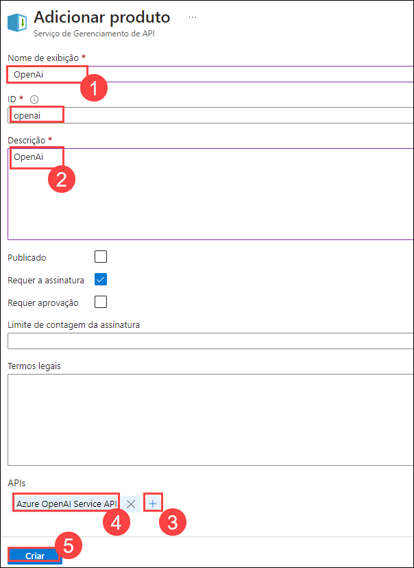

1. No serviço de gerenciamento de API, clique em **Assinaturas** **(1)** em APIs no menu à esquerda e clique em **+ Adicionar assinatura** **(2)**.

    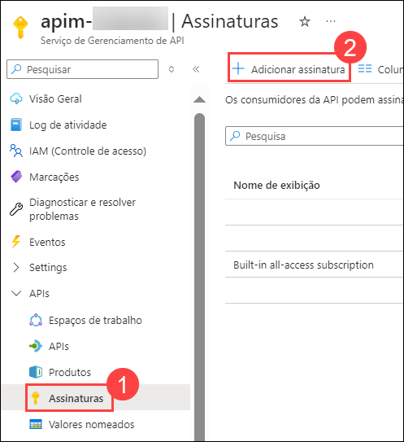

1. Em **Adicionar assinatura**, insira o Nome como **aoai-test** **(1)**, insira o Nome de exibição como **AOAI Test** **(2)** e clique em **Criar** **(3)**.

    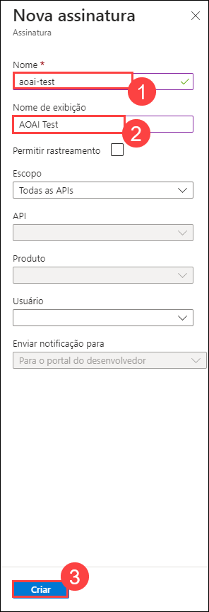

1. Para criar uma nova política com parâmetros específicos, siga as instruções abaixo:

    - Selecione **All Operations (1)**.
    - No bloco Processamento de entrada, clique nas reticências **(2)** adjacentes à política **base**.
    - Clique em **Code editor (3)**.
   
      

1. No editor de código, copie a política abaixo para substituir apenas as tags **inbound** **(1)**, substitua **&lt;&lt;Azure_OpenAI_Endpoint&gt;&gt;** **(2)** do gerenciador de API que você copiou na Tarefa 1 Etapa 4 e clique em **Save** **(3)**.

      ```
      <inbound>
         <base />
         <set-header name="api-key" exists-action="delete" />
         <authentication-managed-identity resource="https://cognitiveservices.azure.com" output-token-variable-name="msi-access-token" ignore-error="false" />
         <set-header name="Authorization" exists-action="override">
            <value>@("Bearer " + (string)context.Variables["msi-access-token"])</value>
         </set-header>
         <set-backend-service base-url="https://<<Azure_OpenAI_Endpoint>>/openai" />
      </inbound>
      ```

      

      

      > **Observação**: certifique-se de colar os valores do **OpenAI Endpoint** e eliminar qualquer duplicata de **https://**.
    
1. Clique em **Save**. Observe que uma nova política chamada **set-backend-service** foi adicionada dentro do bloco de processamento de entrada.
    
1. Navegue até **Configurações de diagnóstico** no painel esquerdo do serviço de gerenciamento de API. Clique em **+ Adicionar configuração de diagnóstico**.

    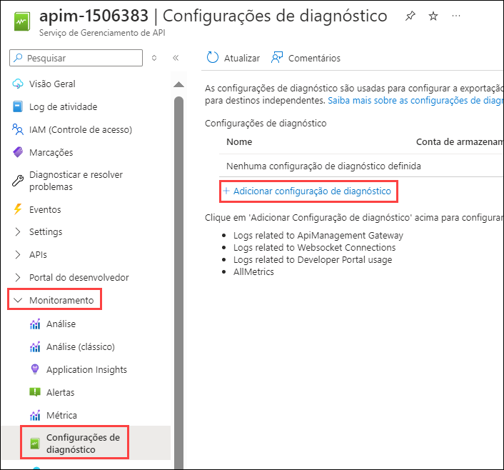

    - **Nome da configuração de diagnóstico**: forneça qualquer nome Unquie **(1)**
    - **Grupos de categorias**: marque a caixa de seleção para **audit** e **allLogs** **(2)**.
    - **Métricas**: marque a caixa de seleção para **AllMetrics** **(3)**
    - **Detalhes do destino**: marque a caixa de seleção **Enviar para o workspace do Log Analytics** **(4)**
    - **Assinatura**: selecione a **Assinatura** existente **(5)** certifique-se de selecionar o espaço de trabalho do Log Analytics
    - **Workspace do Log Analytics**: certifique-se de selecionar o **espaço de trabalho do Log Analytics** **(6)**
    - Clique em **Salvar (7)**.

      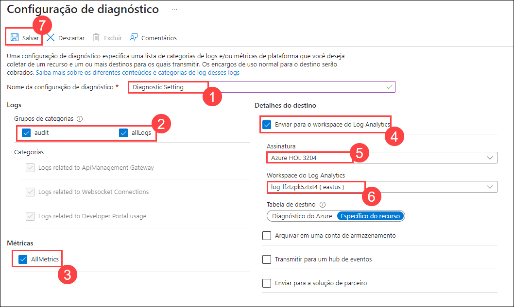
    
1. Agora que a API foi adicionada com sucesso, é necessária configuração para chamar a API OpenAI por meio do Serviço de Gerenciamento de API, o que pode ser feito seguindo as etapas abaixo:

    - Selecione a API recém-adicionada **(1)**.
    - Clique na aba **Settings (2)**.
    - Clique na aba **Azure Monitor (3)** na seção **Diagnostics Logs**. Marque a caixa para **Override-global**.
    - Defina o **Number of payload bytes to log (up to 8192)** como **8192 (4)**.
    - Clique em **Save (5)**.

        >**Observação:** pode levar de 15 a 20 minutos para que a opção **Override global** apareça no **Azure Monitor**.
      
         
      
### Tarefa 3.2: Testar a API para criar conclusões para mensagens de bate-papo

1. Para executar uma operação POST para testar a funcionalidade da API adicionada:

    - Selecione a API do serviço Azure OpenAI **(1)**.
    - Clique na aba **Test (2)**.
    - Clique na operação POST que **Creates a conclusion for the chat message (3)**.
    - Na seção **Template parameters**, insira os seguintes detalhes:
        - **deployment-id:** Forneça o nome que você forneceu anteriormente para **gpt-35-turbo** modelo **(4)**
        
        - **api-version:** 2023-03-15-preview **(5)**
    - Na seção **Request body**, edite o conteúdo **(6)** da amostra com o seguinte prompt:

        ```
        {"model":"gpt-35-turbo","messages":[{"role":"user","content":"Hello! What does an API Management Service in Azure do?"}]}
        ```
    - Clique em **Send (7)**.

      
      

2. Observe a **HTTP response** que é gerada com a resposta na aba **message**:

   

### Tarefa 3.3: Analisar logs OpenAI usando Kusto Queries dentro do API Management Service

> **AVISO LEGAL:** Observe que pode levar uma ou duas horas para o Log Analytics Workspace exibir resultados após uma consulta. Para garantir uma execução tranquila e economizar tempo, incluímos capturas de tela dos resultados para melhor clareza e compreensão.

1. Depois que as solicitações do OpenAI começarem a ser registradas no serviço do Azure Monitor, você poderá começar a analisar o uso do serviço usando consultas do Log Analytics.

2. Volte para o Serviço de Gerenciamento de API e clique em **Logs** na seção **Monitoramento**.

   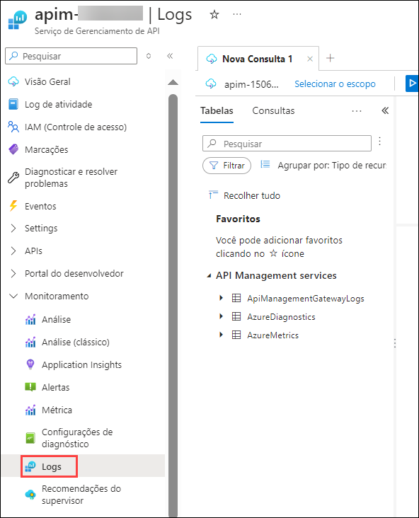

3. Na aba **New Query 1**, rascunhe uma nova consulta de modo que:
    - A tabela deve ser nomeada **ApiManagementGatewayLogs**.
    - O campo **BackendResponseBody** contém a resposta JSON do serviço OpenAI, que inclui a conclusão de texto, bem como as informações de token e modelo.
    - Cole a consulta abaixo no editor de consultas para identificar o uso de token por modelo de IP:
        ```
        ApiManagementGatewayLogs
        | where tolower(OperationId) in ('completions_create','chatcompletions_create')
        | where ResponseCode  == '200'
        | extend modelkey = substring(parse_json(BackendResponseBody)['model'], 0, indexof(parse_json(BackendResponseBody)['model'], 
        '-', 0, -1, 2))
        | extend model = tostring(parse_json(BackendResponseBody)['model'])
        | extend prompttokens = parse_json(parse_json(BackendResponseBody)['usage'])['prompt_tokens']
        | extend completiontokens = parse_json(parse_json(BackendResponseBody)['usage'])['completion_tokens']
        | extend totaltokens = parse_json(parse_json(BackendResponseBody)['usage'])['total_tokens']
        | extend ip = CallerIpAddress
        | where model !=  ''
        | summarize
            sum(todecimal(prompttokens)),
            sum(todecimal(completiontokens)),
            sum(todecimal(totaltokens)),
            avg(todecimal(totaltokens))
            by ip, model
        ```

        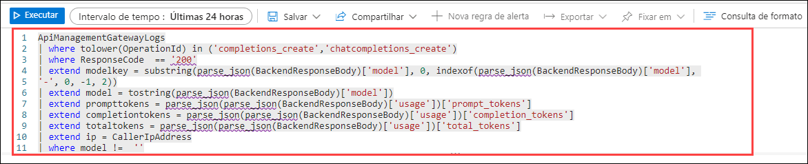

4. Clique em Executar e observe o resultado, que define o uso do token com base no prompt e na resposta fornecidos.

   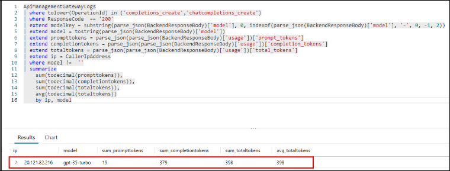

5. Vamos executar outra consulta para monitorar as conclusões de prompt.
    - Substitua o conteúdo do editor de consulta pelo seguinte KQL para registrar os prompts **(1)**.
        ```
        ApiManagementGatewayLogs
        | where tolower(OperationId) in ('completions_create','chatcompletions_create')
        | where ResponseCode  == '200'
        | extend model = tostring(parse_json(BackendResponseBody)['model'])
        | extend prompttokens = parse_json(parse_json(BackendResponseBody)['usage'])['prompt_tokens']
        | extend prompttext = substring(parse_json(parse_json(BackendResponseBody)['choices'])[0], 0, 100)
        ```
        - Clique em **Executar**.
        - Observe as complexidades do resultado gerado na aba **Resultados**.

6. Para visualizar os prompts registrados, <br>

    - Na aba **Results**, clique na seta adjacente ao resultado que foi gerado usando a consulta acima para registrar prompts.<br>
    - Role para baixo e observe os pares de Chave-Valor de **RequestBody** e **ResponseBody**.

      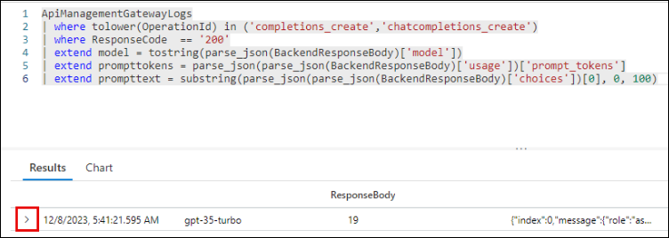
   
      

      >**Observação:** se você receber o seguinte erro, levará algum tempo para refletir.
      

## Critérios de sucesso:

Os participantes serão avaliados com base nos seguintes critérios:

1. Configurar com sucesso o serviço Azure OpenAI com as configurações de diagnóstico apropriadas e analisar seus logs usando Kusto Queries.
2. Criar e configurar efetivamente o Azure API Management, garantindo visibilidade clara dos logs e prompts OpenAI por meio de análise detalhada do Kusto Query.

## Recursos adicionais:

- Consulte [Como configurar o Azure API Management Service](https://github.com/Azure-Samples/openai-python-enterprise-logging/blob/main/README.md) para obter informações detalhadas.
- Consulte este vídeo sobre [Registrar e monitorar tudo no Azure OpenAI com o API Management Service](https://github.com/Azure-Samples/openai-python-enterprise-logging/blob/main/README.md).
- Consulte o [Tutorial de consultas do Kusto](https://learn.microsoft.com/en-us/azure/azure-monitor/logs/log-analytics-tutorial) para obter informações detalhadas.
