# Challenge-7

## Lab scenario

Explore monitoring data collection, including activity logs and platform metrics. Configure Azure Monitor for log generation, customize data routing with diagnostic settings, and initiate resource logs collection. Discover Log Analytics Workspace limitations in logging user requests and model responses. Mitigate this by integrating Azure API Management Service for comprehensive logging in the Azure OpenAI environment.

# Solution Guide

## Task 1: Explore content filters

Content filters are applied to prompts and completions to prevent potentially harmful or offensive language being generated.

1. In the Azure Portal, search for **Azure OpenAI** and select it.

      

1. On **Azure AI Services | Azure OpenAI** blade, select **OpenAI-Lab01-<inject key="Deployment-id" enableCopy="false"></inject>**

      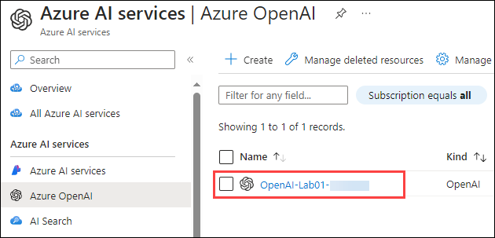

1. In the Azure OpenAI resource pane, click on **Go to Azure OpenAI Studio** it will navaigate to **Azure AI Studio**.

      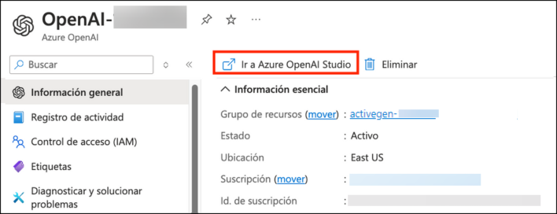

1. In Azure OpenAI Studio, view the **Content filters (1)** page from the left navigation menu and select **Create customized content filter (2)**

      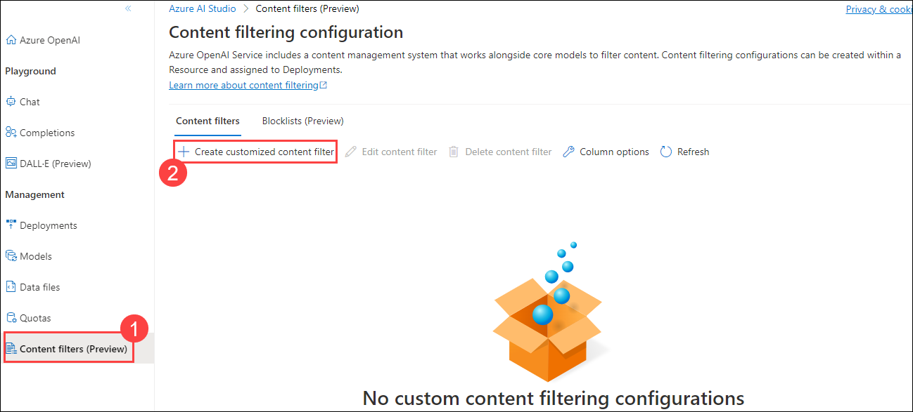
   
1. Review the default settings for a content filter.

    Content filters are based on restrictions for four categories of potentially harmful content:

    - **Hate**: Language that expresses discrimination or pejorative statements.
    - **Sexual**: Sexually explicit or abusive language.
    - **Violence**: Language that describes, advocates, or glorifies violence.
    - **Self-harm**: Language that describes or encourages self-harm.

    Filters are applied for each of these categories to prompts and completions, with a severity setting of **safe**, **low**, **medium**, and **high** used to determine what specific kinds of language are intercepted and prevented by the filter.

1. Observe that the default settings (which are applied when no custom content filter is present) allow **low** severity language for each category. You can create a more restrictive custom filter by applying filters to one or more **low** severity levels. You cannot however make the filters less restrictive (by allowing **medium** or **high** severity language) unless you have applied for and received permission to do so in your subscription. Permission to do so is based on the requirements of your specific generative AI scenario.

    > **Tip**: For more details about the categories and severity levels used in content filters, see [Content filtering](https://learn.microsoft.com/azure/cognitive-services/openai/concepts/content-filter) in the Azure OpenAI service documentation.

## Task 2: Monitoring Azure OpenAI Service

When your crucial applications and business processes depend on Azure resources, it's essential to monitor their availability, performance, and operation. Azure OpenAI provides out-of-box dashboards for each of your Azure OpenAI resources. To access the monitoring dashboards, select the overview pane for one of your Azure OpenAI resources.

   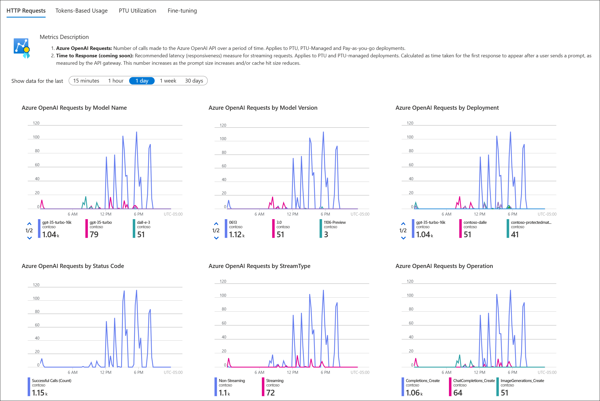

The dashboards are grouped into four categories: HTTP Requests, Tokens-Based Usage, PTU Utilization, and Fine-tuning.
- **HTTP Requests:** Dashboards that monitor OpenAI-powered services in Azure, displaying request volume, response times, errors, geographical distribution, and other metrics. They aid in understanding user interactions, pinpointing performance issues, and ensuring service reliability.
- **Tokens-Based Usage:** This category likely includes dashboards monitoring token usage in Azure OpenAI. Tokens are vital for authentication, authorization, and access control. They offer insights into creation rates, usage patterns, lifetimes, and detect suspicious activities. Monitoring tokens is critical for AI resource security.
- **PTU Utilization:** PTU refers to Performance Tuning Units in Azure OpenAI. These dashboards monitor and optimize PTU use, showing allocation, trends, efficiency metrics, and offering optimization suggestions. It's crucial for boosting performance and resource allocation.
- **Fine-tuning:** This category involves dashboards offering tools and insights for fine-tuning Azure OpenAI services. They include performance metrics, configurations, experiment results, aiding AI model optimization on Azure. They empower informed decisions for better AI performance and accuracy.

### Task 2.1: Configure Diagnostic Settings

Azure OpenAI collects the same kinds of monitoring data as other Azure resources. You can configure Azure Monitor to generate data in activity logs, resource logs, virtual machine logs, and platform metrics. Platform metrics and the Azure Monitor activity log are collected and stored automatically which can be routed to other locations by using a diagnostic setting. Azure Monitor resource logs aren't collected and stored until you create a diagnostic setting and a Log Analytics Workspace.

1. In the Azure Portal, search for **Azure OpenAI** and select it.

   

2. On **Azure AI Services | Azure OpenAI** blade, select **OpenAI-Lab01-<inject key="Deployment-id" enableCopy="false"></inject>**

   

4. From the Azure OpenAI resource page, under **Monitoring**, select **Diagnostic settings (1)** on the left pane. On the Diagnostic settings page, select **Add diagnostic setting (2)**.

   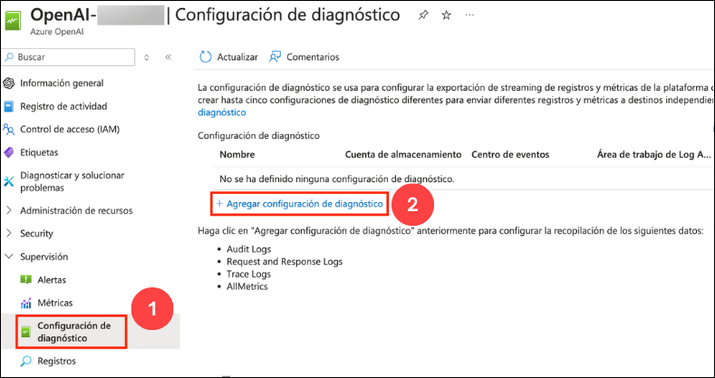

5. To create a new Diagnostic Settings, on the **Diagnostic Settings** page, configure the following fields:
   - **Diagnostic settings name:** **OpenAI Diagnostic Setting (1)**
   - Select **Send to Log Analytics workspace (2)** - To be checked.
   - **Subscription**: Default - Pre-assigned subscription **(3)**
   - **Log Analytics Workspace:** Select the only pre-created log analytics workspace available in the subscription. **(4)**
   - Under **Logs** - Select **allLogs (5)**
   - Under **Metrics** - Select **allMetrics (6)**
   - To save the configuration, click on **Save (7)**.

   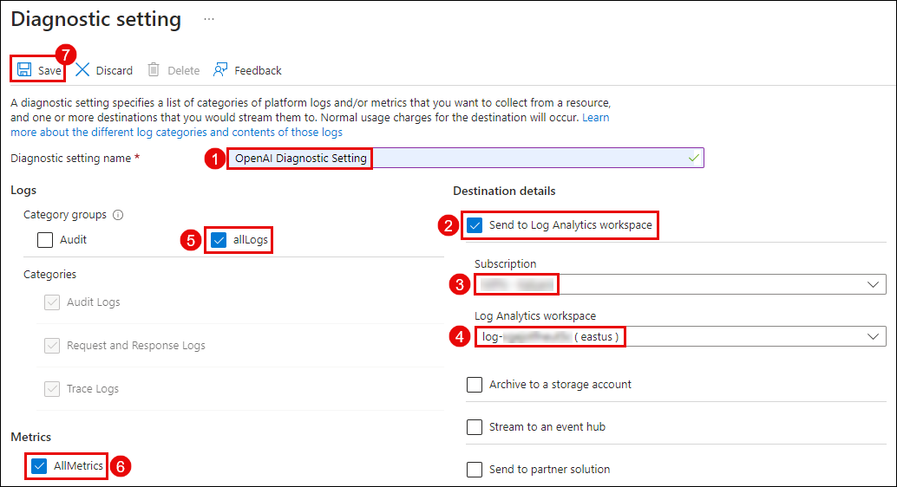

> After the successful configuration of the diagnostic settings, you can work with metrics and log data for your Azure OpenAI resource in your Log Analytics workspace.

### Task 2.2: Use the Chat Playground to ingest additional logs

The *Chat* playground provides a chatbot interface for GPT 3.5 and higher models. It uses the *ChatCompletions* API rather than the older *Completions* API.

1. In the **Playground** section, select the **chat** page, and ensure that the **text turbo** deployment is selected in the configuration pane.

   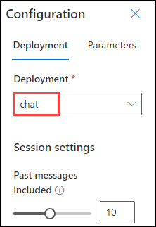

2. In the **Assistant setup** section, in the **System message** box, replace the current text with the following statement: `The system is an AI teacher that helps people learn about AI`.

   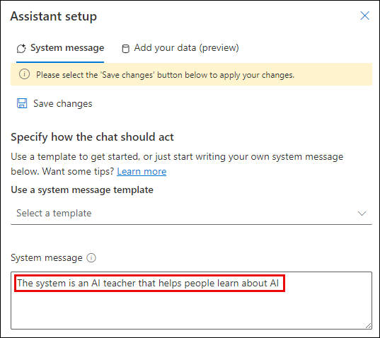

3. To add a new example:
    - Click on **Add an example** under the **Examples** section of the **Assistant setup** pane.
    - Enter the following message and response in the designated boxes:
        - **User**: `What are different types of artificial intelligence?` **(2)**
          
        - **Assistant**: `There are three main types of artificial intelligence: Narrow or Weak AI (such as virtual assistants like Siri or Alexa, image recognition software, and spam filters), General or Strong AI (AI designed to be as intelligent as a human being. This type of AI does not currently exist and is purely theoretical), and Artificial Superintelligence (AI that is more intelligent than any human being and can perform tasks that are beyond human comprehension. This type of AI is also purely theoretical and has not yet been developed).` **(3)**
          
        - Click on **Save changes (4)** to start a new session and set the behavioral context of the chat system.

             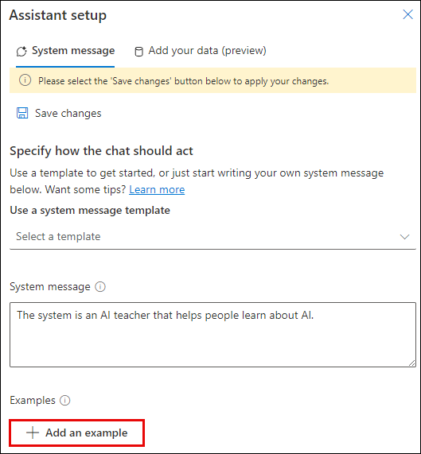
   
             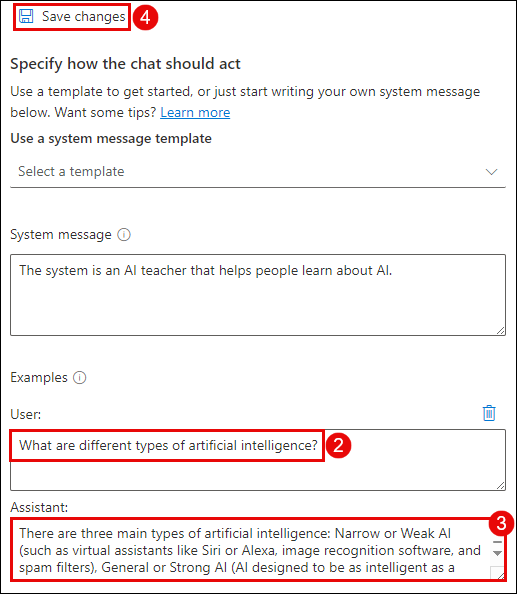

             > **Note**: Few-shot examples are used to provide the model with examples of the types of responses that are expected. The model will attempt to                reflect the tone and style of the examples in its own responses.

5. Within the query box of the chat session pane, enter the text `What is artificial intelligence?`
   
7. Use the **Send** button to submit the message and view the response.

      > **Note**: You may receive a response that the API deployment is not yet ready. If so, wait for a few minutes and try again.

      > Any text that you enter in the **Completions playground** or the **Chat completions playground** generates metrics and log data for your Azure OpenAI         resource. In the Log Analytics workspace for your resource, you can query the monitoring data by using the Kusto query language.

### Task 2.3: Analyze logs using Kusto Queries

Data in Azure Monitor Logs is stored in tables where each table has its own set of unique properties. The activity log is a type of platform log in Azure that provides insight into subscription-level events. You can view this log independently or route it to Azure Monitor Logs. In the Azure portal, you can use the activity log in Azure Monitor Logs to run complex queries with Log Analytics.

1. In the **Azure portal**, search for **OpenAI** and select **Azure OpenAI**.

   

2. On **Azure AI Services | Azure OpenAI** blade, select **OpenAI-Lab01-<inject key="Deployment-id" enableCopy="false"></inject>**
   
4. From your Azure OpenAI resource page, under **Monitoring** on the left pane, select **Logs (1)** and then click on the pre-created Log Analytics workspace **(2)** that was used to configure with diagnostics for your Azure OpenAI resource.

   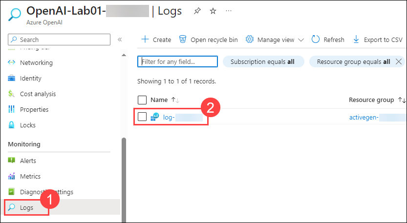

5. Within the **Log Analytics workspace** page, under Overview on the left pane, select **Logs**.

   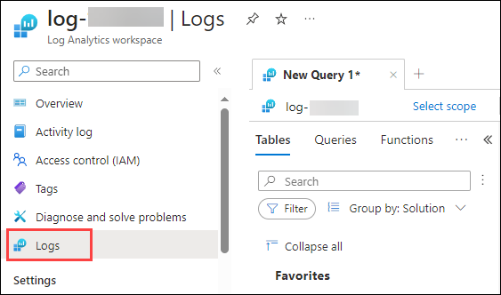

> The Azure portal displays a Queries window with sample queries and suggestions by default. You can close this window.

5. For the following examples, enter the Kusto query into the edit region at the top of the Query window, and then select Run. The query results display below the query text.

    - This Kusto query is useful for an initial analysis of Azure Diagnostics (AzureDiagnostics) data about your resource:
      
         - This query returns a sample of 100 entries and displays a subset of the available columns of data in the logs.
      
        ```kusto
       AzureDiagnostics
       | take 100
       | project TimeGenerated, _ResourceId, Category, OperationName
        ```

6. In the query results, you can select the arrow next to the table name to view all available columns and associated data types.

   

7. To see all available columns of data, you can remove the scoping parameters line `| project ...` from the query:

   ```kusto
   AzureDiagnostics
   | take 100
   ```
   > **Note:** If the logs don't reflect immediately, please wait for 10-15 mins for it to come up.

8. You can also expand the results and check for the details provided under each for more information.

   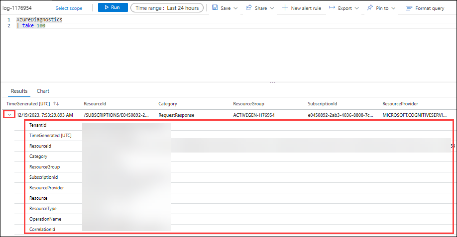

## Task 3: Monitoring OpenAI prompts using Azure API Management

### Task 3.1: Configuring Azure API Management

Creating a Diagnostic setting and linking Azure OpenAI to a log analytics workspace does help in caturing native logs, however Log analytics workspace is incapable to log the user request and OpenAI model response prompts. In such scenarios the Azure API Management Service comes in handy.

1. In the **Azure portal**, search for **OpenAI** and select **Azure OpenAI**.

   

2. Select **OpenAI-Lab01-<inject key="Deployment-id" enableCopy="false"></inject>**.

3. To capture the values of the Azure OpenAI's key and endpoint, execute the following steps:
    - Select **Keys and Endpoints (1)** under the **Resource Management** section from the left navigation pane.
    - Click on **Show Keys (2)**.
    - Copy **Key 1 (3)** and ensure to paste it in a text editor such as notepad for future reference.
    - Finally copy the **Endpoint (4)** API URL by clicking on copy to clipboard. Paste it in a text editor such as notepad for later use.

         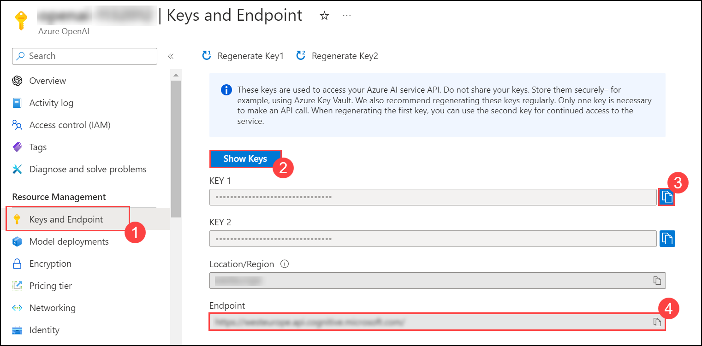

4. Within the global search bar, search for and select the **API Management Services**. and create one APIM service

   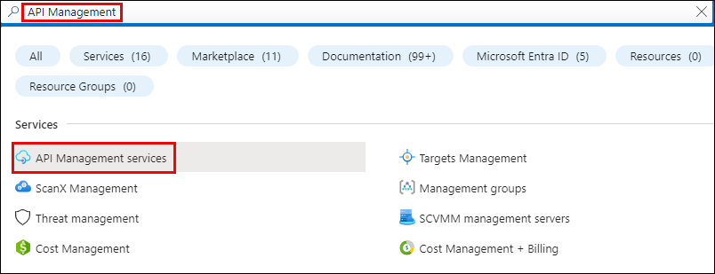

5. Select the deployed APIM service

   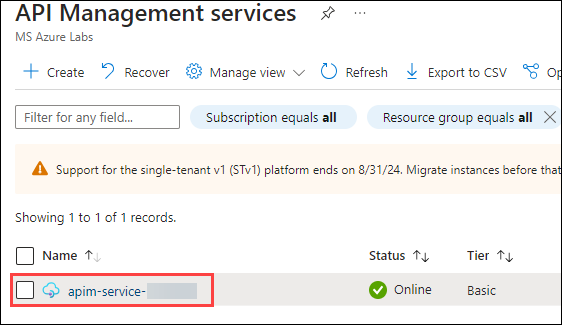

6. Select **Named Values (1)** under the **API** section in the left navigation pane of the API Management Service and then click on **+ Add (2)**.

   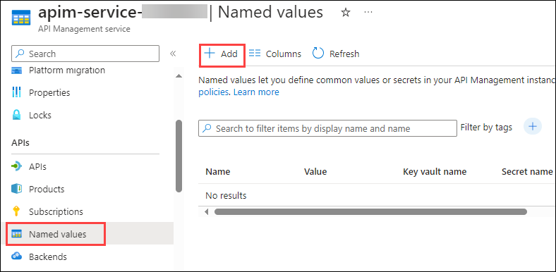

7. Within the **Add named values** pane,
    - **Name:** AOAI-key **(1)**
    - **Display Name:** AOAI-key **(2)**
    - **Type:** Select **Secret (3)**
    - **Value:** Enter the Azure OpenAI key that you had earlier copied onto a notepad **(4)**
    - Click on **Save (4)**.

   

8. Select **Backends (1)** under the **API** section in the left navigation pane of the API Management Service and then click on **+ Add (2)**.

   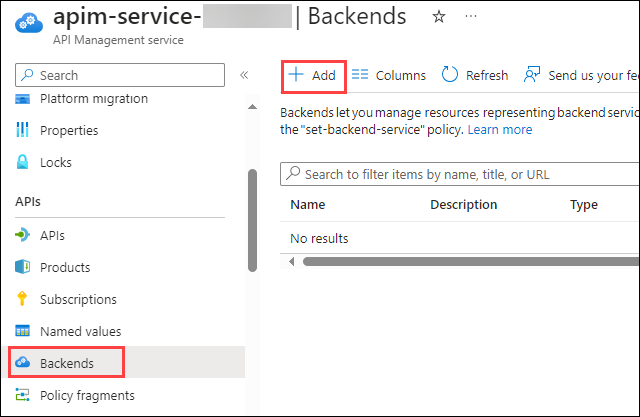

9. Within the **Backend** configuration pane, enter the following details:
    -  **Name:** AOAI-endpoint **(1)**
    -  **Type:** Ensure to select **Custom URL (2)**
    -  **Runtime URL:** Enter the Azure OpenAI endpoint that you had earlier copied onto a notepad **(3)**

          > **Note**: Please ensure to add '/openai' towards the end of the URL.
       
    -  Under the **Headers** tab,
        - **Name:** api-key **(4)**
        - **Value:** Click on **Select named value (5)**
            - Within the **Specify value** pane that shows up, enter the following details:
                - **Input type:** Select **Named value (6)**
                - **Name:** Select **AOAI-key (7)** named value that you created earlier in this task. Notice that the **Value** field is automatically                        populated.
                - Click on **OK (8)**
    - Click on **Create (9)**

      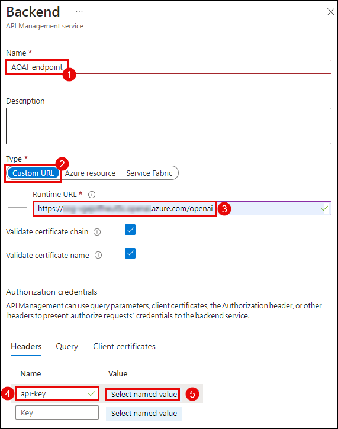

      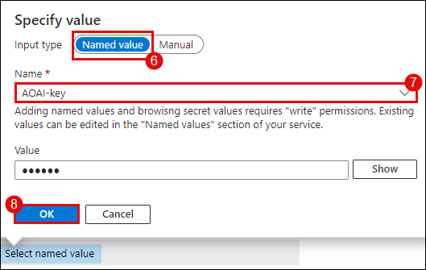

10. To add a new API into the API Management service, follow the steps below:
    -  Select **APIs (1)** under the **APIs** section within the left navigation pane of the APIM blade.
    -  Select the **Import (2)** option from one of the exisiting APIs.
    -  Within the **Import API** pane, select **OpenAPI (3)**.

      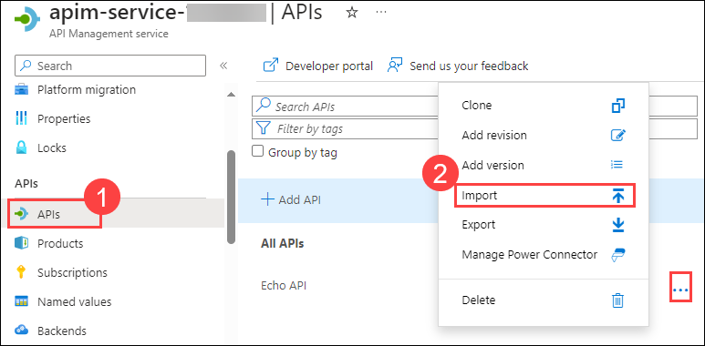

      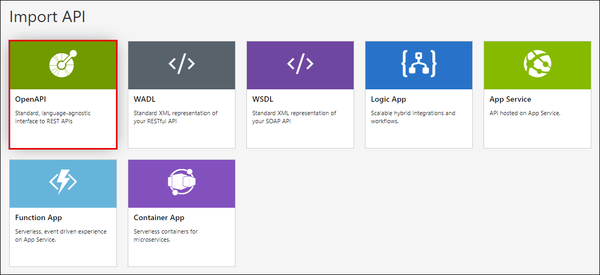

11. Within the **Import from OpenAPI specification** pop-up window, enter and configure the following details:
    - **OpenAPI specification:** `https://raw.githubusercontent.com/Azure/azure-rest-api-specs/main/specification/cognitiveservices/data-plane/AzureOpenAI/inference/stable/2023-05-15/inference.json` **(1)**
    - **Import method:** Select **Update (2)**
    - Click on **Import (3)** to update the existing API with the above OpenAPI specification.

    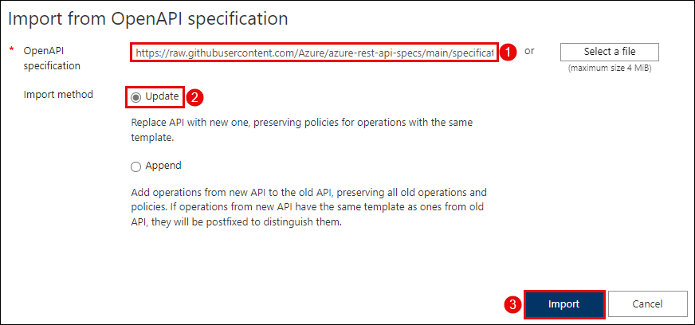

>**Note:**  The OpenAPI specification is a JSON file which contains the API specifications of Azure OpenAI. You can have a detailed look on the specifications by accessing the above provided link for a deeper understanding and clarity.

12. Notice that a new API named **Azure OpenAI Service API** is added under the **All APIs** section.

13. Click on the newly added API and observe the presence of multiple POST operations based on the OpenAPI specification that was provided earlier.

       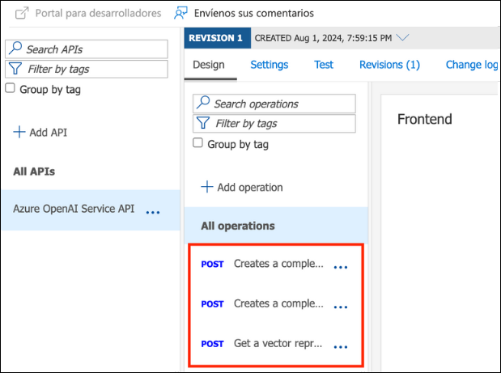

14. To create a new policy with specific parameters, follow the below instructions:
    - Select **All Opeartions (1)**.
    - Within the Inbound processing tile, click on the ellipses **(2)** adjacent to **base** policy.
    - Click on **Code editor (3)**.
   
      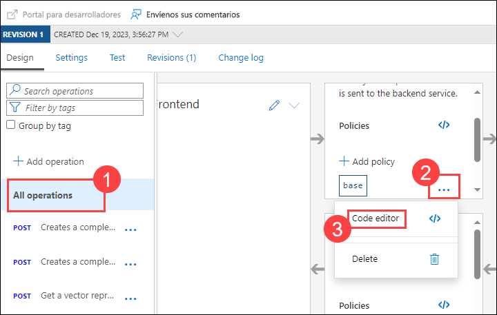

15. Within the code editor, create a new inbound policy by adding the following code at line 16:

    ```html
    <set-backend-service backend-id="AOAI-endpoint" />
    ```

    The final policy code should should now be similar to the below screenshot:

       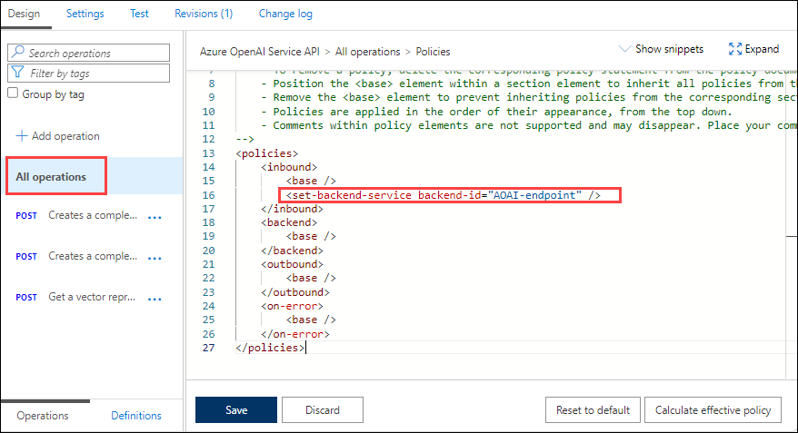
    
   >**Note:** Here the value **AOAI-endpoint** refers to the newly created backend, pointing to the runtime URL - the Azure OpenAI endpoint.

16. Click on **Save**. Notice that a new policy named **set-backend-service** has been added within the Inbound processing tile.
    
17. Navigate to **Diagnostic settings** in the left pane of the API management service.

    

18. - Keep the category groups checked(1) <br>
    - Keep the **All metrics** checked(2) <br>
    - Keep the **Destination details** checked(3) <br>
    - Make sure the log analytics workspace is selected(4) <br>
    - Click on **Save (5)**

      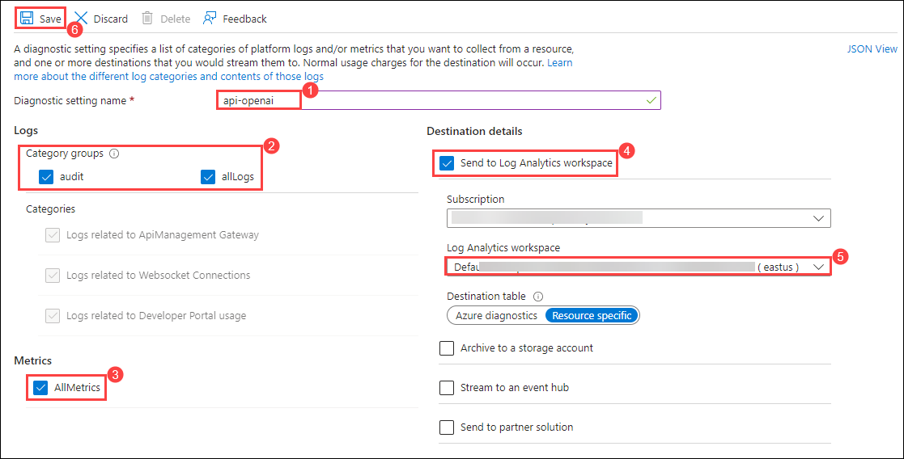
    
19. Now, since the API has been added successfully, it requires the configuration to call the OpenAI API through the API Management Service which can be done by following the below steps:

    - Select the newly added API **(1)**.
    - Click on the **Settings (2)** tab.
    - Click on the **Azure Monitor (3)** tab under the **Diagnostics Logs** section. Check the box for **Override-global**.
    - Set the **Number of payload bytes to log (up to 8192)** to **8192 (4)**.
    - Click on **Save (5)**.

         >**Note:** It might take 15-20 minutes for the **Override global** option to appear under **Azure Monitor**.
      
         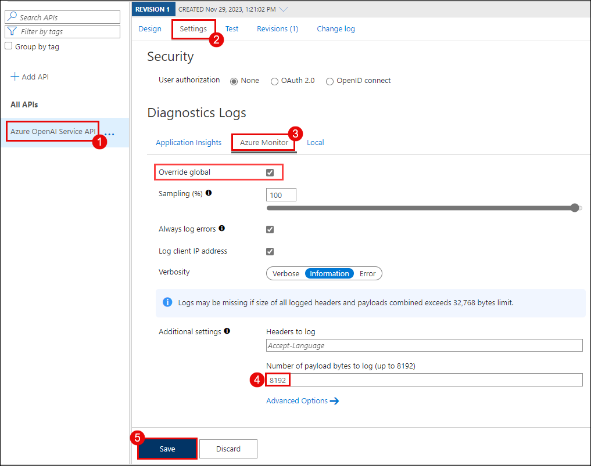
      
      >**Note:** Here the value **AOAI-endpoint** refers to the newly created backend, pointing to the runtime URL - the Azure OpenAI endpoint.

20. Also, ensure to keep the **Subscription required** unchecked.

      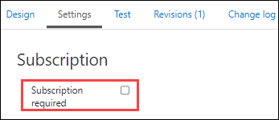   

### Task 3.2: Test the API to create completions for chat message

1. To run a POST operation to test the functionality of the added API:

    - Select Azure OpenAI Service API **(1)**.
    - Click on the **Test (2)** tab.
    - Click on the the POST operation that **Creates a completion for the chat message (3)**.
    - Under the **Template parameters** section enter the following details:
        - **deployment-id:** gpt-35-turbo **(4)**
        - **api-version:** 2023-03-15-preview **(5)**
    - Within the **Request body** section, edit the content **(6)** of the sample with the following prompt:
        ```
        {"model":"gpt-35-turbo","messages":[{"role":"user","content":"Hello! What does an API Management Service in Azure do?"}]}
        ```
    - Click on **Send (7)**.

    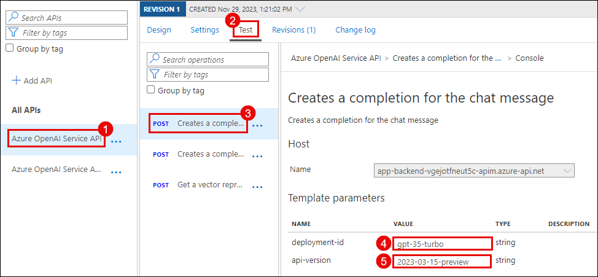
    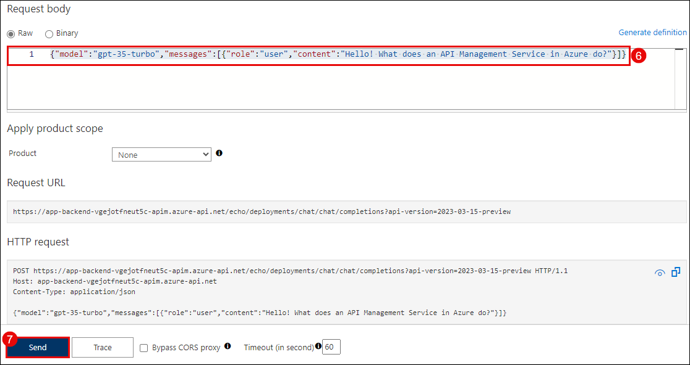

2. Notice the **HTTP response** that is generated with the reply under the **message** tab:

   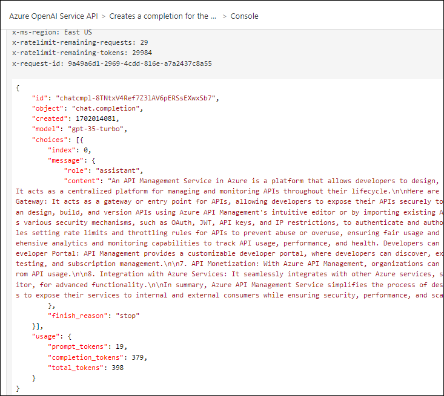

### Task 3.3: Analyze OpenAI logs using Kusto Queries within API Management Service

> **DISCLAIMER:** Please note that it might take an hour or two for the Log Analytics Workspace to display results after a query. To ensure smooth execution and to save time, we've included screenshots of the results for better clarity and understanding. 

1. Once OpenAI requests begin to log to the Azure Monitor service, you can begin to analyze the service usage using Log Analytics queries.

2. Naviagate back to the API Management Service and click on **Logs** under the **Monitoring** section.

   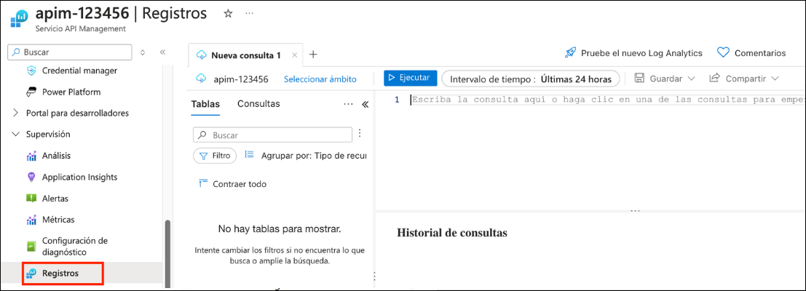

3. Within the **New Query 1** tab, draft a new query such that:
    - The table should be named **ApiManagementGatewayLogs**.
    - The **BackendResponseBody** field contains the json response from the OpenAI service which includes the text completion as well as the token and model information.
    - Past the below query within the query editor to identify token usage by ip model:
    ```
    ApiManagementGatewayLogs
    | where tolower(OperationId) in ('completions_create','chatcompletions_create')
    | where ResponseCode  == '200'
    | extend modelkey = substring(parse_json(BackendResponseBody)['model'], 0, indexof(parse_json(BackendResponseBody)['model'], 
    '-', 0, -1, 2))
    | extend model = tostring(parse_json(BackendResponseBody)['model'])
    | extend prompttokens = parse_json(parse_json(BackendResponseBody)['usage'])['prompt_tokens']
    | extend completiontokens = parse_json(parse_json(BackendResponseBody)['usage'])['completion_tokens']
    | extend totaltokens = parse_json(parse_json(BackendResponseBody)['usage'])['total_tokens']
    | extend ip = CallerIpAddress
    | where model !=  ''
    | summarize
        sum(todecimal(prompttokens)),
        sum(todecimal(completiontokens)),
        sum(todecimal(totaltokens)),
        avg(todecimal(totaltokens))
        by ip, model
    ```

   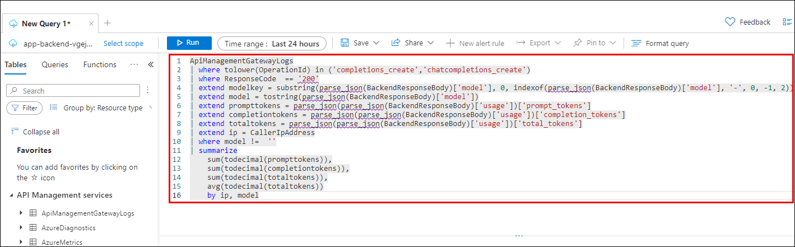

4. Click on **Run** and notice the result which defines the token usage based on the given prompt and response.

   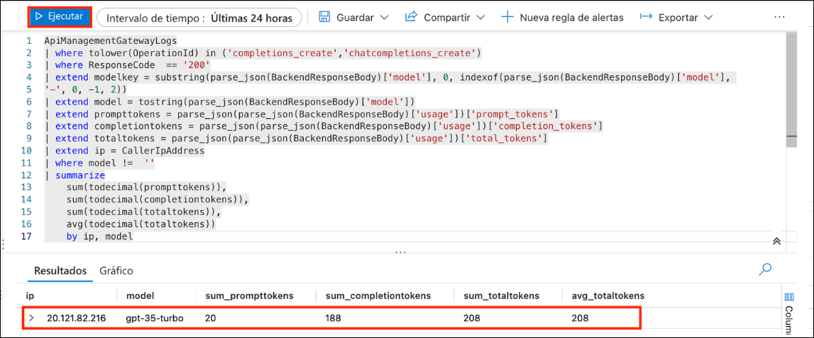

5. Let's run an other query to monitor prompt completions.
    - Replace the contents of the query editor with the following KQL to log the prompts **(1)**.
    ```
    ApiManagementGatewayLogs
    | where tolower(OperationId) in ('completions_create','chatcompletions_create')
    | where ResponseCode  == '200'
    | extend model = tostring(parse_json(BackendResponseBody)['model'])
    | extend prompttokens = parse_json(parse_json(BackendResponseBody)['usage'])['prompt_tokens']
    | extend prompttext = substring(parse_json(parse_json(BackendResponseBody)['choices'])[0], 0, 100)
    ```
    - Click on **Run (2)**.
    - Observe the intricacies of the generated result under the **Results** tab **(3)**.
  
   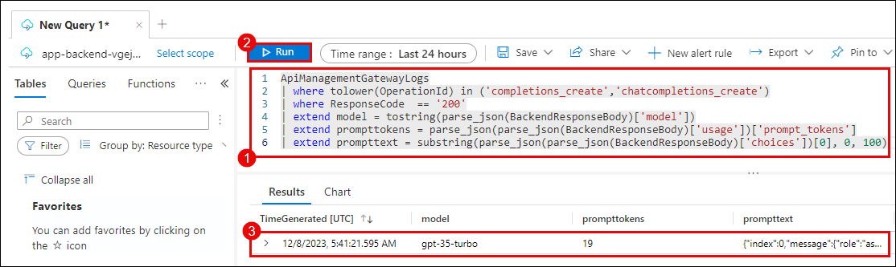

6. To view the logged prompts,
       - Under the **Results** tab, click on the arrow adjacent to the result that was generated using the above query to log prompts.
       - Scroll down and observe the Key-Value pairs of **RequestBody** and **ResponseBody**.

   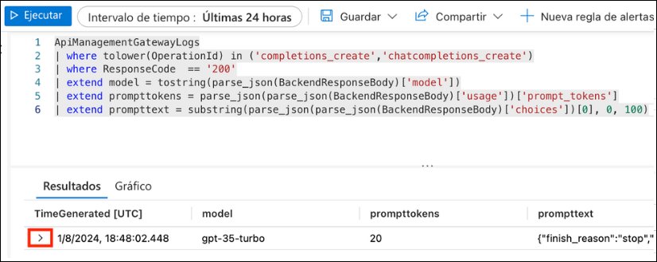
   
   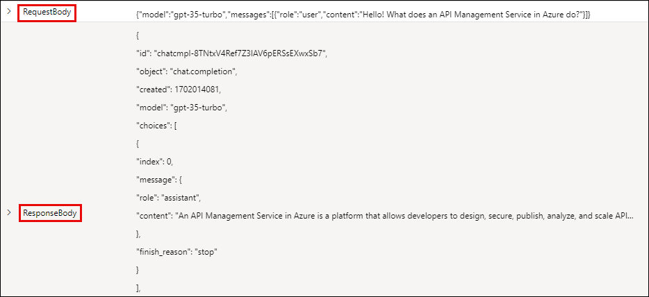

>**Note:** If you get the following error, please proceed to the next lab and ensure to come back and check if the logs have come up.

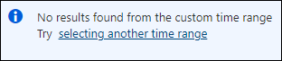
