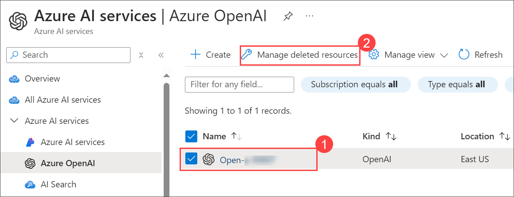

# Known Issues

## Challenge- 03 

1. While deploying Azure resources, if you encounter the following error, it can be ignored. Wait for the deployment to complete.

   
   
## Challenge- 05

1. If you encounter validation issue in **Translator** due to **Region Constrain** kindly change the primary region to **EastUS2** and procced with next step.

1. If you encounter an validation issue in Azure OpenAI model due to Token Per mintue (TPM) quota issue please follow any one the below mentioned steps and try to re-deploy the ARM template.

    1.  Decrease Azure OpenAI resource - model token Per mintue(TPM)  

         - On Azure Portal page, in Search resources, services and docs (G+/) box at the top of the portal, enter **Azure OpenAI (1)**, and then select **Azure OpenAI (2)** under services.
      
         - On **Azure AI Services | Azure OpenAI** blade, select **OpenAI-<inject key="Deployment-id" enableCopy="false"></inject>**.
      
         - In the Azure OpenAI resource pane, click on **Go to Azure OpenAI Studio**. It will navigate to **Azure AI Studio**.
      
         - Under **Management** select **Deployements** select **text-turbo** and scale down the **Tokens per Minute Rate Limit (thousands)**: **10K** then click on **Save**.
         - On the **Deployements** page, select  **text-ada-002** and scale down the **Tokens per Minute Rate Limit (thousands)**: **10K** then click on **Save**.

         - Back to Azure portal where Custom deployemnt page is open click on **Previous** and select **Create**.

    2.  Delete the existing OpenAI resource make sure to purge the OpenAI resource  

        - Open another tab in edge browser and sign in to **Azure portal** and search for **OpenAI**.
        - Select the existing **OpenAI** recourse and click on **Manage deleted resources**.

          

        - On **Manage deleted resources** blade, select **Subscription** > **OpenAi resources** click on **Purge**.

        - Back to Azure portal where Custom deployemnt page is open click on **Previous** and select **Create**.
