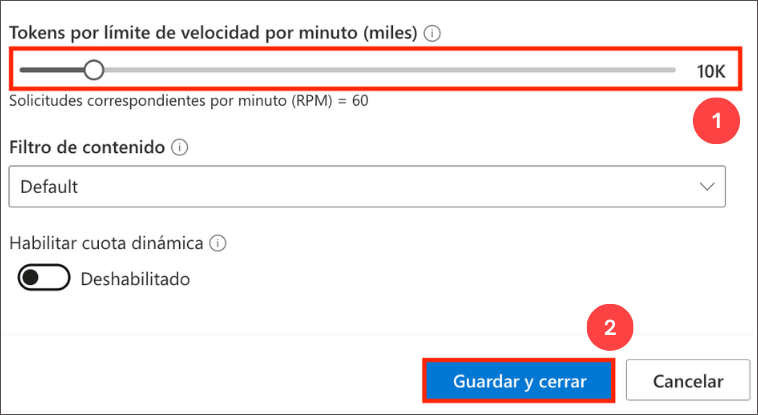
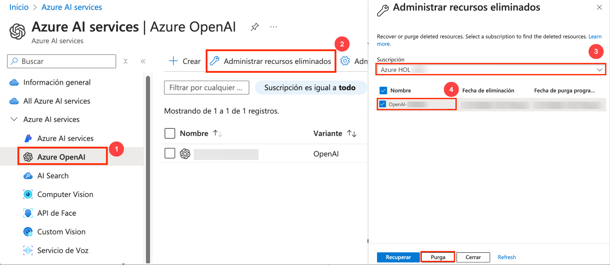

# Known Issues

## Challenge 03: Deploy an AI-Powered Chat App

 **Issue**:  While deploying Azure resources, if you encounter the following error.

   

  **Resolution** : The error can be ignored as it is a temporary issue and wait for the deployment to complete.
   
## Challenge 05: Serverless Document Batch Processing

1. **Issue**: If you encounter validation issue in **Translator** due to **Region Constrain**.

     
     
    **Resolution**: Kindly change the primary region to **EastUS2** and procced with next step. 

2. **Issue**: If you encounter an validation issue in Azure OpenAI model due to Token Per mintue (TPM) quota issue please follow any one the below mentioned steps and try to re-deploy the ARM template.

   **Resolution 1**  
      
      - Decrease **Azure OpenAI resource** - model token Per mintue(TPM).  
      
      - On Azure Portal page, in Search resources, services and docs (G+/) box at the top of the portal, enter **Azure OpenAI (1)**, and then select **Azure OpenAI (2)** under services.
            
      - On **Azure AI Services | Azure OpenAI** blade, select **OpenAI** resources which you deployed.
            
      - In the Azure OpenAI resource pane, click on **Go to Azure OpenAI Studio**. It will navigate to **Azure AI Studio**.
            
      - Under **Management** select **Deployements** select **text-turbo** and scale down the **Tokens per Minute Rate Limit (thousands)**: **10K** then click on **Save and close**.
      
         
      
      - On the **Deployements** page, select  **text-ada-002** and scale down the **Tokens per Minute Rate Limit (thousands)**: **10K** then click on **Save and close**.
      
           - Back to Azure portal where Custom deployemnt page is open click on **Previous** and select **Create**.
            - Wait for the deployemnt to complete.
  

   **Resolution 2**
   
   - Delete the existing **OpenAI** resource make sure to purge the OpenAI resource.  
   
   - Open another tab in edge browser and sign in to **Azure portal** and search and select for **OpenAI**.
   
   - On the **Azure AI services | Azure OpenAI** blade, click on **Manage deleted resources**. Then on **Manage deleted resources** pop up window select the existing **Subscription** > **OpenAI** resources and 
      click on **Purge**.
   
       
   
       - Back to Azure portal where Custom deployemnt page is open click on **Previous** and select **Create**.
       - Wait for the deployemnt to complete.
