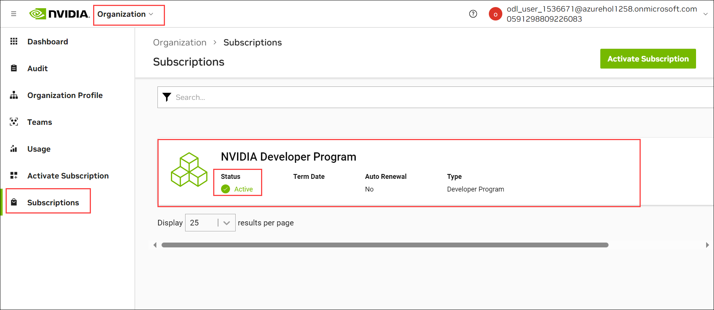

# Challenge 01: Deploy NVIDIA NIM on Azure

### Estimated Time: 90 minutes

## Introduction

In the previous challenge, you successfully deployed models within the Azure OpenAI service. In this challenge, you will focus on deploying NVIDIA NIM to Azure for Challenge 3. 

NVIDIA NIM is a suite of highly optimized microservices designed to simplify and accelerate the deployment of generative AI models across cloud, data centers, and workstations. Each NIM is packaged as a container image on a per model or model family basis, such as `meta/llama3-8b-instruct`, and can run on any NVIDIA GPU with sufficient memory. NIMs leverage a runtime that intelligently selects the best model version for the available hardware, ensuring optimal performance.

NIMs are distributed as Docker containers via the NVIDIA NGC Catalog, with each container including built-in security features, such as CVE monitoring and security scanning reports. NIMs offers flexible, scalable deployment options and is compatible with a wide range of NVIDIA GPUs, making it the fastest solution for AI inference.

You need to deploy NVIDIA NIM on one of the following services for Challenge 3:

- **Azure ML** - Deploy as a managed online endpoint
  

## Scenario

**Contoso Ltd.**, a leading technology firm, is seeking to enhance its product support operations. They receive a large volume of queries daily, resulting in longer waiting times and decreased customer satisfaction. To address this, Contoso plans to use fully optimized NVIDIA models to improve performance.

They have decided to deploy NIM to Azure alongside its Large Language Models (LLMs), such as `llama-3.1-8b-instruct`. These models excel at processing and generating human-like text, making them ideal for improving customer support.

Your task in this challenge is to create an NIM endpoint on Azure by deploying **llama-3.1-8b-instruct** NIM in the Azure environment of your choice.

### Accessing the Azure Portal

1. To access the Azure portal, open a private/incognito window in your browser and navigate to the Azure Portal.

1. On the **Sign in to Microsoft Azure** tab, you will see a login screen. Enter the following email/username and click **Next**.

   - **Email/Username:** <inject key="AzureAdUserEmail"></inject>

1. Enter the following password and click **Sign in**.

   - **Password:** <inject key="AzureAdUserPassword"></inject>

1. If you see the **Stay Signed in?** pop-up, click **No**.

1. Close any pop-ups like **You have free Azure Advisor recommendations!** or **Action Required** by clicking **Ask Later** or **Cancel** to skip the tour.

## Prerequisites

Ensure you have the following from the CloudLabs-provided integrated environment:

> **Note:** Prerequisites are pre-configured in the CloudLabs environment. If you're using your personal computer or laptop, ensure all essential prerequisites are installed.

- [Azure Subscription](https://azure.microsoft.com/en-us/free/)
- [NVAIE license](./Getting-NVAIE-License.md)

## Challenge Objectives:

Deploy **llama-3.1-8b-instruct** NIM in one of the following places:

1. **Generate NGC API KEY**
    
   -  Navigate to [nvidia](https://ngc.nvidia.com/signin) portal and login using your credentials.
      
      >**Note:** If you don't have an account, simply enter your work/personal email account and submit, and you'll be redirected to the account creation page to provide the necessary details and set up your account.
   
   - Search for and select **Llama-3.1-8b-instruct**, then click **Get Container**.

     

   - **Join** for the **NVIDIA Developer Program** to proceed to the NVIDIA Developer Portal.

   - Provide the required details on the **Integrate NIM into your application** section and click **Join**.

   - Navigate to your **NVIDIA Account**, go to **Organization > Subscriptions**, and ensure the **Active** status for the NVIDIA Developer Program.

     

   - Click on your **Nvidia Account**, **Generate API Key** under `Setup`.

   - Copy the `Generated API key` in a notebook

2. **Deploy Container registries**

   - Deploy a Container registry with the following details.

     | Setting | Action |
     | --- | --- |
     | **Subscription** | Default |
     | **Resource Group** | Select the **Activate-GenAI** resource group |
     | **Registry name** | Enter **unique name** |
     | **Location** | Choose the same location where the resource group  |
     | **Pricing plan** | **Standard** |

   - Copy the `Subscription ID` and `Container registries` names in the notepad.

       <validation step="bf43c618-75d9-465a-85f0-80d3e024f687" />

3. **Setup Git Bash Environment**

   - Run the configuration in Git Bash.
   
   - Downloads the latest version of **jq**  file, a lightweight and flexible command-line JSON processor, and save it as an executable file named `jq-win64.exe` in the `/usr/bin/jq.exe` directory

     > Note: You can use https://github.com/jqlang/jq/releases url 
   
   - Install the `az ml` stable extension.

   - Clone the following repo.

      ```
      https://github.com/CloudLabsAI-Azure/nim-deploy.git
      ```

4. **Configure the config.sh**

   - Open the folder where you have cloned the repo from VS Code.
   - Update the `config.sh` file with the necessary details located in the `nim-deploy\cloud-service-providers\azure\azureml\cli` directory.
   - Update resource group as `Activate-GenAI` and image name as `nim-meta-llama-3.1-8b-instruct:latest`.

      - Detailed instructions can be found [here](https://github.com/NVIDIA/nim-deploy/tree/main/cloud-service-providers/azure/azureml/cli).

5. **Create AzureML Deployment of the NIM Container**

   - **Configuration and Login to Azure**

      - From the Git Bash change directory `nim-deploy\cloud-service-providers\azure\azureml\cli`.
      - Configuration settings defined in `config.sh`.
      - Provide a unique name for **workspace** and **acr_registry_name**, utilizing **<inject key="Deployment ID" />** as a suffix.
      -  Provide a **endpoint_name** as **llama-3-1-8b-nim-endpoint<inject key="Deployment ID" />** 
      - Provide a **deployment_name** as **llama3-1-8b-nim-dep<inject key="Deployment ID" />** 
      - This step is crucial for loading environment variables, paths, or any other configuration before running dependent commands.
      - Login to the Azure portal using the CLI command.

   - **Setup AzureML Workspace**

      - Execute the `1_set_credentials.sh` file to create a new `AzureML workspace` with the "Azure ML Secrets Reader" role assignment.
      - Verify the AzureML workspace is created in the azure-ml resource group.

          <validation step="1993b774-7dfb-4aeb-a792-112946b90e86" />

   - **Store NGC API Key for Use in the AzureML Deployment**

      - Run the `2_provide_ngc_connection.sh` script to configure this and verify the connection.
   
   - **Save NIM Container in Your Container Registry**

       - Run the `./3_save_nim_container.sh` script to push the NIM container in your container registry.
         
         > **Note**: This step will take approximately 30-40 minutes to pull the image from the NVIDIA registry and push it to the Azure Container Registry (ACR). In the meantime, please skip the subsequent steps for now, proceed to complete Challenge 2, and return to continue from the next step once Challenge 2 is finished. 
         
       - Verify that the NIM container has been published in the container registry by checking the `Repositories`.
       - Copy the `Repositories` endpoint.

    - **Create Managed Online Endpoint**

        - Run the `./4_create_endpoint.sh` script to create a managed online endpoint.
   
   - **Role Assignment**
       
       - Provide `AcrPull` role assignment to the Machine Learning Online endpoint managed identity.

   - **Create AzureML Deployment of the NIM Container**

        - Run the `./5_create_deployment.sh` to create AzureML deployment of the NIM container.
   
   - **Verify the Connection**

     - Navigate to `Machine learning Endpoint` in `Azure Machine Learning workspace` and select the deployed **Endpoint**.
     
     - Copy the `endpoint` and `Primary Key` under Consume.
     
     - Update the `test_chat_completions.sh` file with the necessary details located in the `nim-deploy\cloud-service-providers\azure\azureml\cli` directory.
       
       > **Hint**: Use the values from the `config.sh` file.
  
       > **Note**: Ensure to append `/v1/chat/completions` to the end of the endpoint.
      
      - Run `test_chat_completions.sh` file to Verify the Connection


## Success Criteria:

- Verify that the endpoint is accessible from outside:
  
## Additional Resources:

- Refer to the [NVIDIA NIM documentation](https://docs.nvidia.com/nim/large-language-models/latest/introduction.html) for guidance on deploying the service.

### Conclusion

In this challenge, you successfully validated the Azure OpenAI service and deployed LLM models. In the next challenge, you will learn about Semantic Kernel, which is used for building intelligent apps while leveraging Azure OpenAI models.
