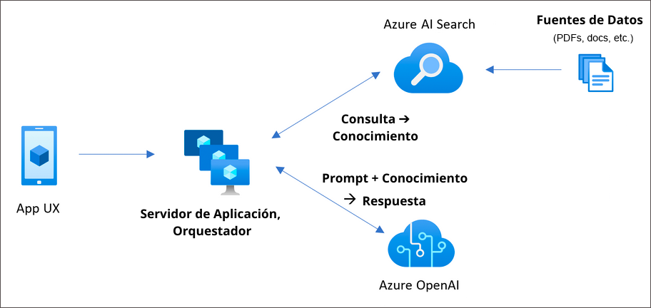

# Challenge 04:  Deploy an AI-Powered Chat App

### Estimated Time: 150 minutes

## Introduction:

In this challenge, you'll deploy an AI-powered chat application specifically designed for Contoso Electronics. This app, built with React for the frontend and Python for the backend, showcases advanced features like chat and Q&A interfaces, all augmented by AI capabilities. It's an excellent opportunity for you to explore the integration of Azure OpenAI Service with the GPT-3.5 Turbo model and Azure Cognitive Search for efficient data indexing and retrieval.

This sample app is more than just a chat interface; it demonstrates the Retrieval-Augmented Generation pattern, offering a rich, ChatGPT-like experience over Contoso's own data. The app's features include trustworthiness evaluation of responses with citations, tracking of source content, data preparation, prompt construction, and orchestrating interaction between the ChatGPT model and Cognitive Search. You'll also find adjustable settings in the UX for experimentation and optional performance tracing and monitoring with Application Insights.

In this challenge, your task is to deploy this comprehensive chat solution for Contoso, allowing them to evaluate its capabilities and integrate it into their environment. The repository comes with sample data, representing a ready-to-use, end-to-end solution. This app is a valuable tool for Contoso's employees to inquire about company benefits, internal policies, job descriptions, and roles.

You will be using bicep to deploy the chat app. 

The chat application integrates seamlessly with different Azure services to provide an intelligent user experience. Here's a simple overview of each service used by the app:

- **App Service:** This hosts the chat app, ensuring it can respond to the prompts sent by users from the uploaded relatable data.
- **Application Insights:** It proactively monitors the app's performance, taking care of issues before they become significant.
- **Document Intelligence:** Using AI, it understands the content in uploaded documents, making user information more insightful.
- **Azure OpenAI:** Enhances the app's capabilities with natural language understanding and responses.
- **Shared Dashboard:** Acts as a central hub for team collaboration and data sharing.
- **Smart Detector Alert Rule:** Monitors the app's health and notifies the team if any issues arise.
- **Search Service:** Empowers users with dynamic and efficient search functionality within the app.
- **Log Analytics Workspace:** Tracks and analyzes app activity, offering valuable insights and logs.
- **App Service Plan:** Optimizes resource allocation for optimal app performance.
- **Storage Account:** Securely stores the data that will be used by the Azure AI Search service to provide the inputs to the chat app.

Together, these services create a responsive chat application that combines AI features, monitoring capabilities, and efficient data management, providing Contoso with an exceptional user experience.

## Architecture diagram:

## Prerequisites

Make sure you have the following from the CloudLabs-provided integrated environment:

> Note: Prerequisites are already set up in the CloudLabs-provided environment. If you're using your personal computer or laptop, please make sure that all necessary prerequisites are installed to complete this hackathon.

  - [Azure Subscription](https://azure.microsoft.com/en-us/free/)
  - [Azure OpenAI](https://aka.ms/oai/access) access is available with the following models:
    - gpt-35-turbo
    - text-embedding-ada-002
   - Bicep 
   - Azd 
   - Poweshell 7 

## Challenge Objectives:

> **Note**: When deploying services in this challenge, please make sure to use the resource group named rg-activategenai.

> **Important** : Start Powershell 7 +.

1. **Clone the Repository:**
   - Clone the Active Gen AI repository: `https://github.com/Azure-Samples/azure-search-openai-demo`.
   - Verify if Bicep is installed on your machine. If not, follow the [Bicep installation guide](https://learn.microsoft.com/en-us/azure/azure-resource-manager/bicep/install)).

1. **Deploy the AI-Powered Chat App:**

    - Deploy an AI-powered chat application on Azure, integrating Azure AI services and Azure Search, and ensuring it's accessible and functional post-deployment.

   - Provide the name of the environment as **activategenai** when prompted.
    
      > Hint : Begin by ensuring you have the proper credentials. This command will guide you through logging into your Azure account using the Azure Developer CLI. Once authenticated, you'll have access to your Azure resources.
    
      > Hint : Initialize your project with a specific template. This command will help you set up your project environment

      > Hint : Launch your project into action. This command will deploy your application to Azure, setting up all necessary resources and configurations automatically.

      > Note : Ensure to re-run in case of any deployment failure with Storage Account.

        <validation step="d170a2ad-32d3-4149-ba77-caf4264a4373" />

1. **Deploying with NVIDIA NIM**

    - Along with OpenAI Large Language Models (LLMs), NVIDIA NIM along with Meta Llama 3.1 8B can be used for ChatCompletion requests.This document outlines the steps to configure the app to use NVIDIA NIM.
    - Follow the given instructions here: `https://github.com/CloudLabsAI-Azure/azure-search-openai-demo-nvidia/blob/main/docs/deploy_nvidia_nim.md`

## Success Criteria:

- Successful deployment of the Chat App.
- validate if the following services are successfully deployed in the RG (Resource Group).
  - App Service
  - Document Intelligence
  - Azure OpenAI
  - Shared Dashboard
  - Smart Detector Alert Rule
  - Search Service
  - Log Analytics Workspace
  - App Service Plan
  - Storage Account
- Validate if the data is populated into the storage container named `content`.
- The Chat app should be accessible using the Azure App service.

## Additional Resources:

-  Refer to the  [Azure Search OpenAI demo GitHub repository](https://github.com/cmendible/azure-search-openai-demo) for detailed information on the architecture.
-  [Azure copilot](https://learn.microsoft.com/en-us/azure/copilot/overview)
