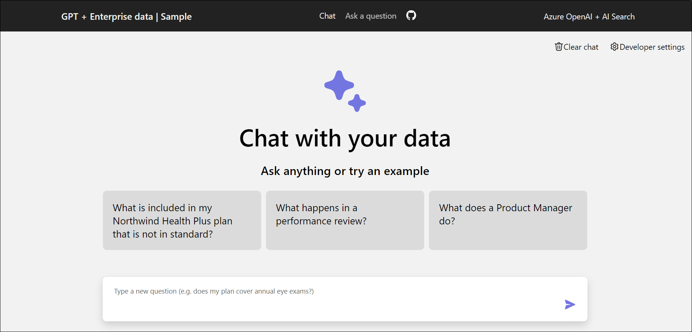

# Desafio 04: Interact with the Chat App

### Tempo Estimado: 30 minutes

## Introdução:

Após provisionar com sucesso a aplicação de chat melhorada por IA no desafio anterior, é hora de avaliar as suas capacidades. Este desafio se concentra em interagir com a aplicação para entender seu potencial para aplicações no mundo real na Contoso Ltd. Você explorará a eficiência das respostas a consultas, as capacidades multilíngues e o impacto das configurações avançadas, construindo um caso convincente para a integração dessas tecnologias na Contoso.

## Objetivos do Desafio

**1. Acesso a Aplicação Web e Construção e Resposta de Consultas:**
   
   - No Portal de Azure, pesquise por **`App Services`** e selecione o aplicativo web que você provisionou no desafio anterior.
   - Clique em **"Browse"** para abrir seu aplicação web.
 Será direcionado ao **Northwind Health chat application**,  conforme abaixo. 

     

- Na aplicação de chat, forneça o seguinte prompt e verifique como as respostas são fornecidas pelos serviços ChatGPT e Azure Cognitive Search, interagindo para construir consultas de pesquisa e recuperar informações candidatas da base de conhecimento.

   ```
   What does a Product Manager do?
   ```

- A resposta não apenas respondeu à pergunta com base no conteúdo encontrado nesses documentos, mas também incluiu **citações (1)** para validar a precisão das informações. Ao clicar em uma anotação, o aplicativo vai diretamente para a página do **documento (2)** que compara os planos, permitindo que você leia mais ou faça uma validação adicional sobre a precisão da resposta na seção de **citação**. 


- Veja como, ao clicar em uma anotação, a aplicação vai diretamente para a página do documento que compara os planos, permitindo que você leia mais ou faça uma validação adicional sobre a precisão da resposta. 

   ```
   Does the project manager manage the human resources team?
   ```

- De acordo com a aplicação construída, podemos passar o contexto das partes anteriores do chat para o prompt nos bastidores, o que permite ao ChatGPT responder à pergunta se o gerente de projeto gerencia a equipe de recursos humanos. Clique na citação e você verá a parte do plano que cobre a informação relacionada.


**2. Capacidade de Consulta Multilíngue:**
   
- Vamos fazer uma pequena alteração no prompt para pedir ao OpenAI que responda a qualquer pergunta que não seja feita em inglês no idioma em que foi perguntada. Vá para **Developer Settings** e adicione a mensagem abaixo na seção **Override prompt template**. Clique em **Close**.

  ```
   convert prompts to English and respond when asked questions in different language
   ```

- Quando fazemos uma pergunta em um idioma diferente, nos bastidores, o prompt é convertido para inglês para realizar a busca, e então o modelo responde no mesmo idioma em que a pergunta foi feita. Insira o prompt abaixo na seção de chat e observe que a pergunta é recebida, detectada como sendo em francês, convertida para o inglês, executada como antes, e em seguida retorna a resposta esperada, assim como anteriormente.

   ```
   Quelles sont les responsabilités du responsible marketing ?
   ```

**3. Impacto das Configurações Avançadas:** 
- Em **Developer Settings**, e, na seção **Exclude category**, marque a caixa para **Use query-contextual summaries instead of whole documents** e **Suggest follow-up questions**. Clique em **Close** e observe como as respostas ao prompt mudarão no chat ao fornecer o prompt abaixo.

   ```
   What happens in a performance review?
   ```
4. Exploração das Capacidades do OpenAI e AI Search:
  - Realize seus próprios testes utilizando diversos prompts para avaliar a gama e a profundidade das capacidades de conversa e busca do aplicativo.
  - Concentre-se em entender como a aplicação integra o modelo do OpenAI e o AI Search para proporcionar interações contínuas com o usuário.

## Critério de Sucesso:
  - Interação bem-sucedida com o aplicativo de chat, explorando uma variedade de casos de uso conversacional.
  - Compreensão abrangente das capacidades do aplicativo em lidar com consultas multilíngues, configurações avançadas e seu potencial geral para o ambiente da Contoso.
     
> **Importante**:  Não há uma validação específica para este desafio, mas sua exploração e compreensão são cruciais.


## Recursos Adicionais:

- Consulte  [azure-search-openai-demo](https://github.com/Azure-Samples/azure-search-openai-demo) para mais informação.
  
