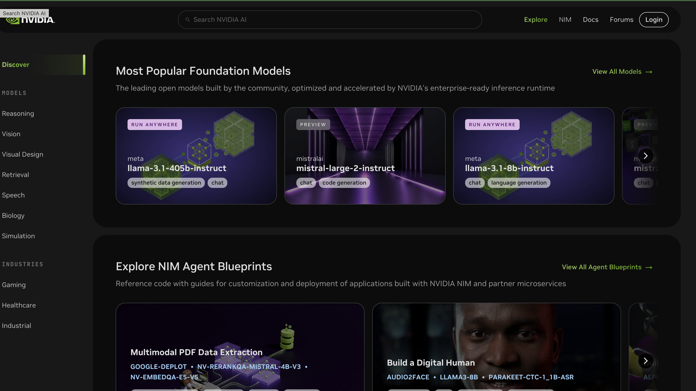
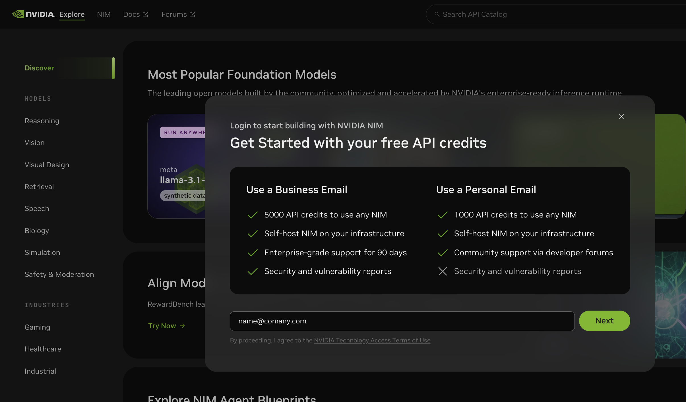
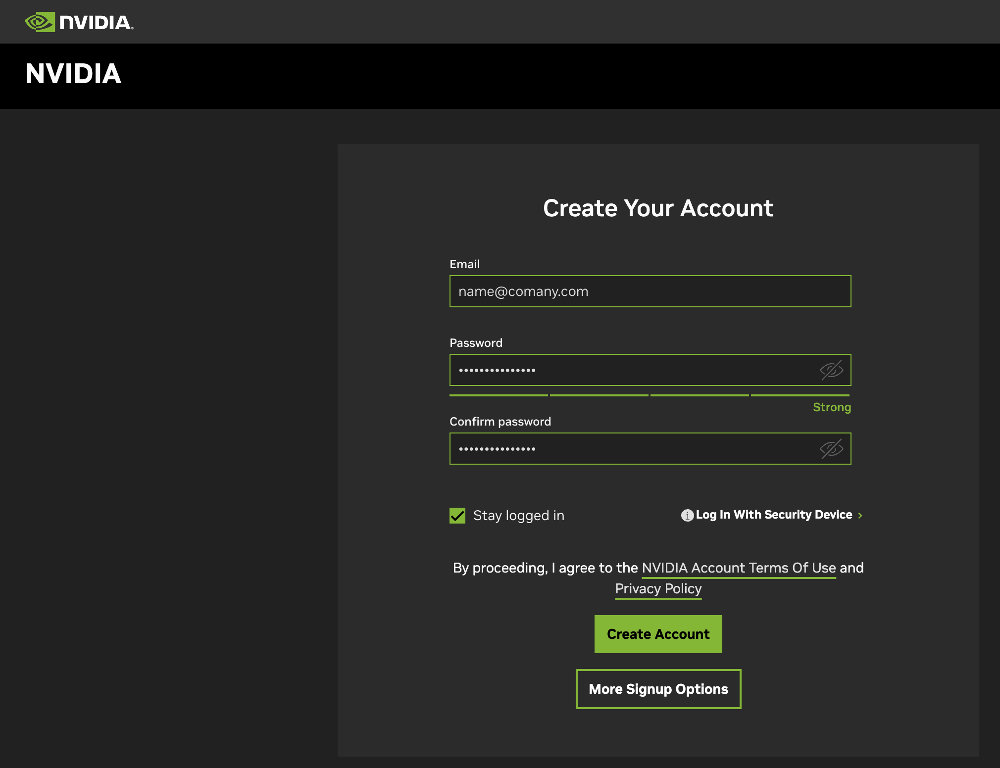
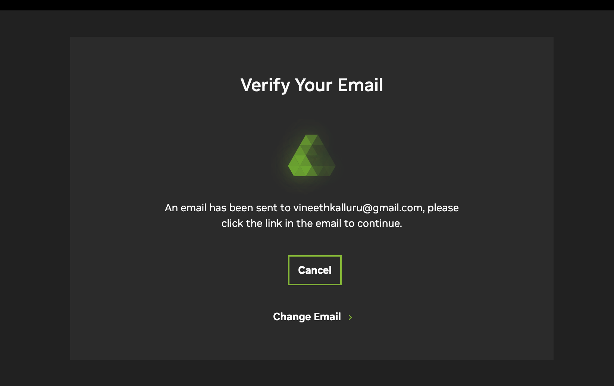
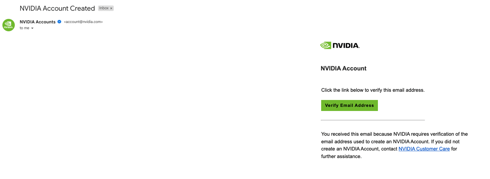
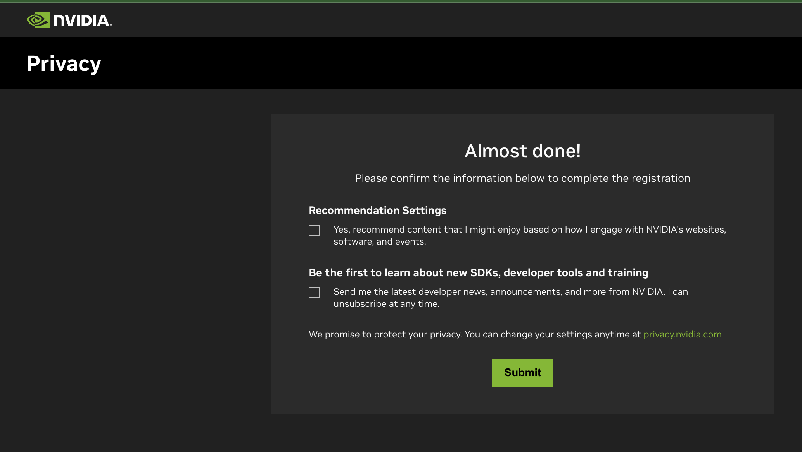
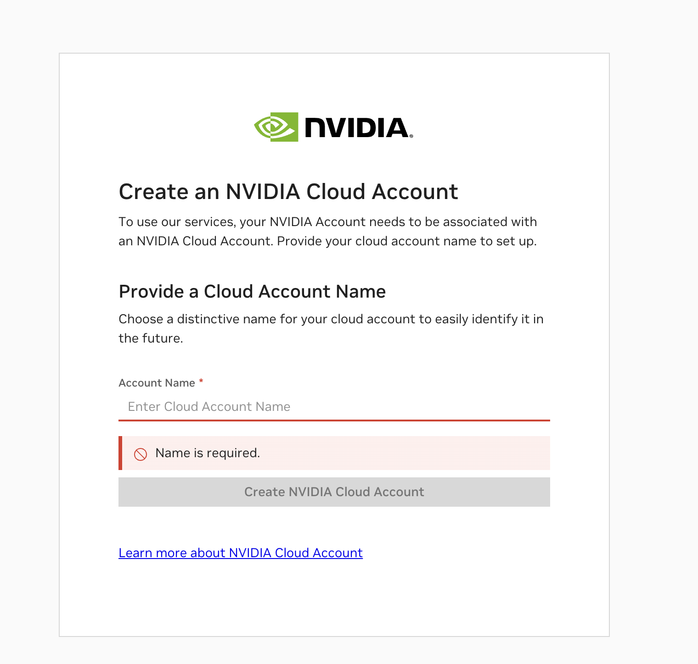
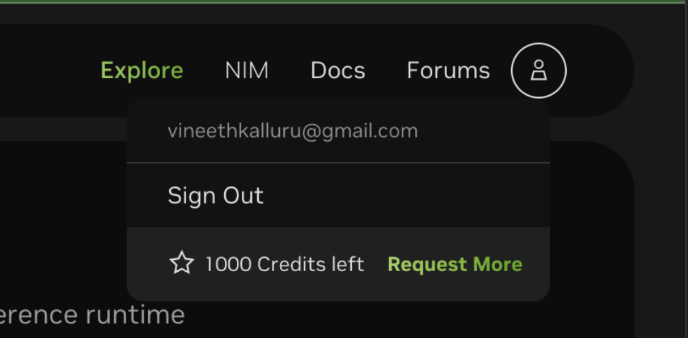
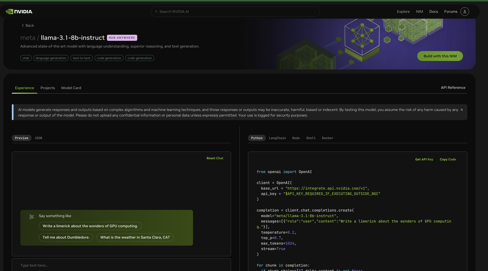

## Instructions to get NVAIE Developer License

### Steps:

1. **Go to [build.nvidia.com](https://build.nvidia.com)**

2. **Login or Create an Account**:
Click on the **“Login”** button in the top-right corner to create a new account. Enter your organization email to receive free credits to use NVIDIA NIM and click **Next**.

3. **Create Your NVIDIA Account**:
You will be redirected to a page where you can create your NVIDIA account. This account is required to download NIMs and start using them in your Azure platform.

4. **Verify Your Email Address**:
Log into your email and verify your address by following the provided instructions.

5. **Privacy Settings**:
Once verification is complete, you'll be redirected to a page with privacy-related questions. Choose your privacy settings and click **Submit**.

6. **Create Your NGC (NVIDIA GPU Cloud) Account**:
In the next step, create your NGC account by providing your NVIDIA cloud account name.

### Success!
You have successfully created your NVIDIA NVAIE and NVIDIA Cloud accounts. Verify that you are providied with free 1000 credits to try out NIMs.

### Explore NIMs:
- Now you can explore all available NIMs! Use the search bar at the top to search for any model or LLM task (e.g., search for "Llama" or "Retrieval").
- Explore the search results, open the NIM of interest, and experiment with it.
- You are provided with **1000 free credits**, each translating into one API call. Therefore, you have **1000 API calls** to try out the NIMs.

  
You can also call these NIMs in your Python application using the OpenAI library (refer to the Python code on the right) or using [NVIDIA LangChain endpoints](https://python.langchain.com/docs/integrations/chat/nvidia_ai_endpoints/).

