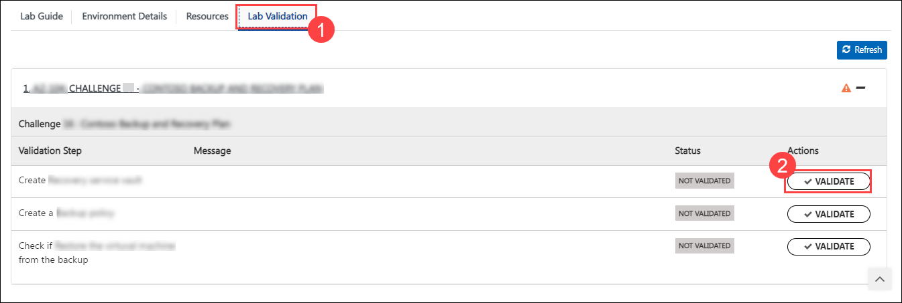
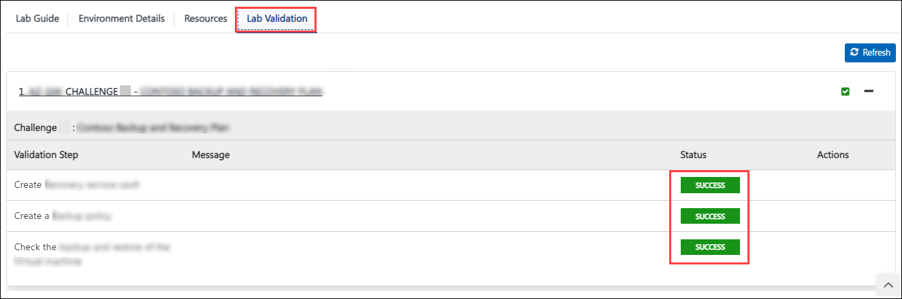
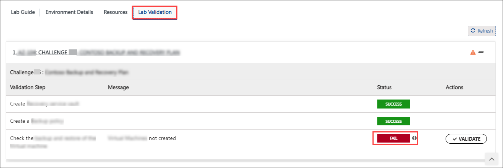
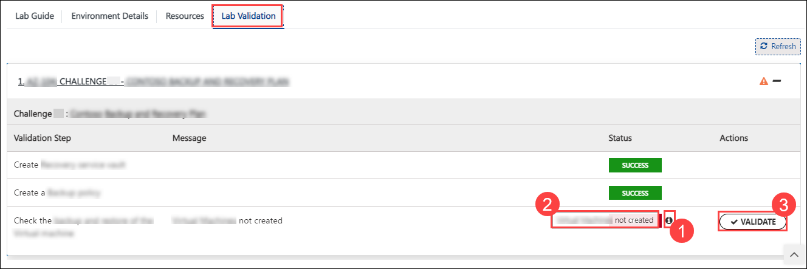

# Challenge-06: Implement Monitoring and Logging of Azure OpenAI using API Management Service

## Introduction:

Building on the success of enhancing Contoso's AI-powered chat app with serverless document processing, your next objective is to operationalize these Azure OpenAI solutions with robust monitoring and logging mechanisms. In this challenge, you will delve into the intricacies of setting up and analyzing advanced monitoring systems using the Azure API Management Service and Log Analytics workspace. This is a crucial step in ensuring the smooth operation and maintenance of the AI solutions you've developed, providing valuable insights into system performance and user interactions.

Your task is to implement comprehensive monitoring for the Azure OpenAI service, leveraging diagnostic settings and Kusto queries for in-depth log analysis. Additionally, you'll be integrating the API Management Service to oversee the chat message completions and further analyze the prompts and outputs. This level of monitoring is essential for Contoso to maintain a high-quality, efficient, and user-friendly AI chat application.

## Challenge Objectives:

1. **Monitoring the Azure OpenAI Service:**
   - Set up diagnostic settings for the existing Azure OpenAI services.
   - Conduct log analysis utilizing Kusto Queries to monitor the service's performance and usage.
     
2. **Monitoring OpenAI prompts using Azure API Management:**
   - Utilize Kusto queries within API Management for comprehensive log analysis, focusing on chat message completions and prompt interactions.
  
## Success Criteria:

Participants will be evaluated based on the following criteria:

1. Successfully configure the Azure OpenAI service with appropriate diagnostic settings and analyze its logs using Kusto Queries.
2. Effectively create and configure Azure API Management, ensuring clear visibility of logs and OpenAI prompts through detailed Kusto Query analysis.

## Additional Resources:

- Refer to [How to Configure Azure API Management Service](https://github.com/Azure-Samples/openai-python-enterprise-logging/blob/main/README.md) for detailed information.
- Refer to this video about [Logging & Monitoring Everything in Azure OpenAI with API Management Service](https://github.com/Azure-Samples/openai-python-enterprise-logging/blob/main/README.md).
- Refer to the [Kusto Queries Tutorial](https://learn.microsoft.com/en-us/azure/azure-monitor/logs/log-analytics-tutorial) for detailed information.

## Challenge Validation
 
1. After completing the challenge, you need to visit the **Lab Validation (1)** tab and click on the **VALIDATE (2)** button under Actions to perform the validation steps. Verify that you have met the success criteria of the challenge. 
 
    
 
1. If the validation status displays **Success** for all the validation steps, **congratulations!** This means that you have completed the challenge and have unlocked the next challenge.
 
     

1. If the validation status displays **Fail**, **don't worry!** This could mean that you did not perform the challenge correctly.
 
     
 
1. Hover your mouse over the `i` **(1)** icon to see the error message and determine the root cause of the failure. Based on the error message, revisit the challenge as necessary, and redo the validation by clicking on the **VALIDATE (3)** button again.

   
 
1. If you are still having trouble, you can reach out to the support team via `labs-support@spektrasystems.com` for further assistance. The support team is available to help you troubleshoot and resolve any technical issues or validation issues that may arise while the lab environment is live.
